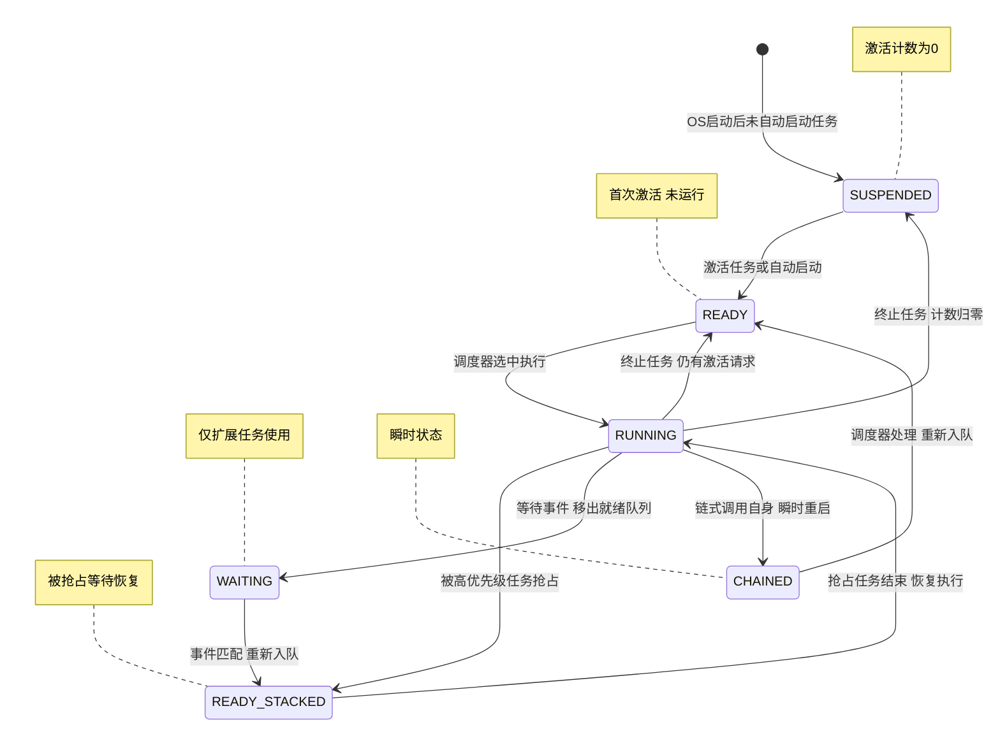

# 基于 ERIKA v3 与 TC38x 深入理解 AUTOSAR OS（二）：任务管理深度解析

任务（Task）是 AUTOSAR OS 调度的基本单位，也是整个 OS 内核最核心的对象。本章将从 OSEK/AUTOSAR 规范出发，结合 ERIKA v3 源码，逐层拆解 Task 的类型体系、状态机、调度策略、OIL 配置到 C 数据结构的完整代码生成链路。

---

## 2.1 Basic Task 与 Extended Task：状态机的本质区别

### 2.1.1 两种任务类型

OSEK/VDX 规范定义了两类任务：

| 特性 | Basic Task | Extended Task |
|---|---|---|
| 可调用 WaitEvent | 否 | 是 |
| 状态集合 | SUSPENDED → READY → RUNNING → SUSPENDED/READY | SUSPENDED → READY → RUNNING → WAITING → READY → … |
| 阻塞能力 | 否（run-to-completion） | 是（WaitEvent 阻塞等待事件） |
| 栈需求 | 可共享（若不抢占或与同优先级任务共享栈） | 必须私有栈（因阻塞时需保存上下文） |
| OIL 声明 | `SCHEDULE = FULL/NON;`（无 EVENT） | `EXTENDED = TRUE;` 或声明了 EVENT |
| 多次激活 | 支持（ACTIVATION > 1，限于 BCC2/ECC1/ECC2） | 支持（同样受限于符合类） |
| 符合类限制 | BCC1/BCC2/ECC1/ECC2 | 仅 ECC1/ECC2 |

**关键区别只有一个**：Extended Task 可以调用 `WaitEvent()` 进入 WAITING 状态，等待一个或多个事件到来后才被唤醒；Basic Task 不具备此能力，一旦进入 RUNNING 状态就必须执行到 `TerminateTask()` 或 `ChainTask()`——这是"run-to-completion"语义的根本保证。

### 2.1.2 ERIKA v3 中的内部状态扩展

OSEK 规范定义了 4 个标准状态：`SUSPENDED`、`READY`、`RUNNING`、`WAITING`。ERIKA v3 在内核层面扩展为 **6 个内部状态**（`pkg/kernel/oo/ee_api_types.h`）：

```c
typedef enum {
  OSEE_TASK_SUSPENDED,      // 未激活，current_num_of_act == 0
  OSEE_TASK_READY,          // 已激活，尚未执行过本次激活
  OSEE_TASK_READY_STACKED,  // 曾进入 RUNNING，被抢占后等待恢复
  OSEE_TASK_WAITING,        // Extended Task 在 WaitEvent 中阻塞
  OSEE_TASK_RUNNING,        // 正在执行
  OSEE_TASK_CHAINED          // ChainTask(self) 的瞬态，映射为 RUNNING
} OsEE_task_status;
```

多出的两个内部状态有精确语义：

- **`OSEE_TASK_READY_STACKED`**：区分了"从未运行过的就绪"（`READY`）与"运行过但被抢占的就绪"（`READY_STACKED`）。对 `GetTaskState()` API 而言，两者均映射为 `READY`，但内核在内部分辨它们——这是调度节点栈（SN Stack）管理的关键依据。当一个高优先级任务抢占低优先级任务时，低优先级任务的 SN 被压入 CCB 的 `p_stk_sn` 栈，其状态变为 `READY_STACKED`。

- **`OSEE_TASK_CHAINED`**：`ChainTask(TaskX)` 在 `TaskX == 当前任务` 时的瞬态。内核不执行"终止再激活"的两次调度，而是将状态标记为 `CHAINNED`，在调度终止回调中直接重置为 `READY` 并重新入队，开销降至最低。

`GetTaskState()` 的映射逻辑位于 `pkg/kernel/oo/ee_oo_api_osek.c`：

```c
switch (local_state) {
  case OSEE_TASK_SUSPENDED:   (*State) = SUSPENDED; break;
  case OSEE_TASK_READY:
  case OSEE_TASK_READY_STACKED: (*State) = READY;     break;
  case OSEE_TASK_WAITING:     (*State) = WAITING;    break;
  case OSEE_TASK_RUNNING:
  case OSEE_TASK_CHAINED:     (*State) = RUNNING;    break;
}
```

### 2.1.3 Extended Task 状态转换图



上图标注了每个状态转换的触发条件与关键数据结构操作。特别注意：

1. **`ActivateTask()` 的倍增效果**：每次调用使 `current_num_of_act++`，若任务已经在 RUNNING 或 READY 状态，并不立即创建新的调度实例，而是记住"还有一次激活需要执行"。当 `TerminateTask()` 将 `current_num_of_act--` 后若仍大于 0，任务回到 `READY` 而非 `SUSPENDED`。

2. **抢占不改变激活计数**：从 RUNNING → READY_STACKED 只是被挂起而非终止，`current_num_of_act` 不变。这是 OSEK 调度模型中抢占与终止的根本区别。

3. **WaitEvent 的阻塞与唤醒**：`WaitEvent()` 将 `wait_mask` 设为期望事件掩码，并将任务从就绪队列移除（释放 SN 到 CCB 的空闲链表，但将 `p_own_sn` 保存在 TCB 中以防 SetEvent 时的竞态）。`SetEvent()` 将 `event_mask |= Mask`，检查 `(wait_mask & Mask) != 0`，若条件成立则将保存的 `p_own_sn` 重新插入就绪队列，状态变为 `READY_STACKED`。若 Extended Task 的最后一次激活被唤醒，还会调用 `osEE_task_event_reset_mask()` 重置事件掩码。

4. **CHAINNED 是内核优化**：对外部观察者（通过 `GetTaskState()`），CHAINNED 状态映射为 `RUNNING`；内核内部将其视为"即将重启的 RUNNING"，跳过了出队/入队的开销。

---

## 2.2 调度策略：Full / Non / Mixed Preemption

OSEK/AUTOSAR OS 定义了三种抢占策略，通过 OIL 中的 `SCHEDULE` 属性配置。ERIKA v3 使用 **内部资源（Internal Resource）** 机制统一实现这三种策略——这是一个精妙的设计。

### 2.2.1 三种策略规范语义

| 策略 | OIL 配置 | 行为 |
|---|---|---|
| Full Preemptive | `SCHEDULE = FULL` | 高优先级任务就绪时，立即抢占正在运行的低优先级任务 |
| Non-Preemptive | `SCHEDULE = NON` | 任务一旦开始执行，不会被任何其他任务抢占，除非主动调用 `Schedule()`、`WaitEvent()`、`TerminateTask()` 或 `ChainTask()` |
| Mixed Preemptive | 不同任务设置不同 SCHEDULE | 系统中同时存在 Full 和 Non 任务，利用优先级天花板（ ceilings ）实现 |

### 2.2.2 ERIKA v3 的实现：dispatch_prio 机制

在 ERIKA v3 中，每个任务的 TDB 包含两个优先级字段：

```c
typedef struct OsEE_TDB_tag {
  // ...
  VAR(TaskPrio, TYPEDEF)  ready_prio;      // OIL PRIORITY 值，就绪队列排序依据
  VAR(TaskPrio, TYPEDEF)  dispatch_prio;   // 调度优先级，实现抢占阈值
  // ...
} OSEE_CONST OsEE_TDB;
```

RT-Druid 根据 OIL 的 `SCHEDULE` 属性计算 `dispatch_prio`：

| OIL 配置 | `ready_prio` | `dispatch_prio` | 内部资源等效 |
|---|---|---|---|
| `SCHEDULE = FULL` | PRIORITY 值 | = ready_prio | 无内部资源，可被任何更高优先级任务抢占 |
| `SCHEDULE = NON` | PRIORITY 值 | = OSEE_ISR_ALL_PRIO（最高 ISR2 优先级） | 等效于绑定了一个天花板为最高优先级的内部资源 |
| `SCHEDULE = MIXED` | PRIORITY 值 | = 指定的抢占阈值 | 等效于绑定了天花板为 dispatch_prio 的内部资源 |

**运行时行为**：

- 任务获得处理器进入 RUNNING 时，`current_prio` 被提升到 `dispatch_prio`：

```c
// ee_oo_scheduler.c — osEE_scheduler_stk_next()
CONST(TaskPrio, AUTOMATIC) dispatch_prio = p_tdb->dispatch_prio;
if (p_tcb->current_prio < dispatch_prio) {
  p_tcb->current_prio = dispatch_prio;
}
```

- 任务终止或阻塞时，`current_prio` 恢复为 `ready_prio`：

```c
// ee_oo_api_osek.c — osEE_task_end()
p_tcb->current_prio = p_tdb->ready_prio;
```

- 就绪队列按 `current_prio` 排序（非 `ready_prio`），因此非抢占任务在就绪队列中以 `dispatch_prio`（最高优先级）排序，天然不会被其他任务抢占。

### 2.2.3 Schedule() API：非抢占任务的自愿重调度点

非抢占任务无法被抢占，但可通过调用 `Schedule()` 主动让出处理器。ERIKA v3 的实现如下（`pkg/kernel/oo/ee_oo_api_osek.c`）：

```c
FUNC(StatusType, OS_CODE) Schedule(void)
{
  // ... 服务保护检查 ...
  if (p_tcb->current_prio == p_curr->dispatch_prio)
  {
    // 仅当 current_prio 等于 dispatch_prio 时才有效
    // 即任务没有持有显式 Resource
    CONST(OsEE_reg, AUTOMATIC) flags = osEE_begin_primitive();
    p_tcb->current_prio = p_curr->ready_prio;    // 释放内部资源
    (void)osEE_scheduler_task_preemption_point(osEE_get_kernel());
    p_tcb->current_prio = p_curr->dispatch_prio;  // 重新获取内部资源
    osEE_end_primitive(flags);
    ev = E_OK;
  } else {
    ev = E_OK;  // 持有显式 Resource 时 Schedule() 为空操作
  }
  // ... ErrorHook ...
  return ev;
}
```

代码揭示了 `Schedule()` 的微妙之处：
1. **释放内部资源**：临时将 `current_prio` 从 `dispatch_prio` 降到 `ready_prio`，使得就绪队列中优先级高于 `ready_prio` 的任务可以抢占。
2. **重调度**：调用 `osEE_scheduler_task_preemption_point()` 执行一次调度器扫描。
3. **重新获取内部资源**：恢复 `current_prio` 为 `dispatch_prio`，继续执行。
4. **持有显式 Resource 时无效**：若任务已通过 `GetResource()` 锁定了一个优先级高于 `dispatch_prio` 的资源，`current_prio > dispatch_prio`，此时 `Schedule()` 判断条件不满足，直接返回 `E_OK` 但不做任何调度——这正是 OSEK 规范所要求的行为。

---

## 2.3 OIL 配置到 C 数据结构：RT-Druid 代码生成链路

### 2.3.1 OIL 配置示例

以下是一段典型的多核 OIL 配置（基于 `pkg/arch/tricore/examples/tricore_2G_mc/conf.oil`，有所扩充）：

```oil
CPU test_application {
  OS EE {
    EE_OPT = "OSEE_DEBUG";
    EE_OPT = "OSEE_ASSERT";

    CPU_DATA = TRICORE {
      ID = 0x0;
      CPU_CLOCK = 200.0;
      COMPILER = GCC;
      IDLEHOOK = TRUE { HOOKNAME = "idle_hook_core0"; };
    };
    CPU_DATA = TRICORE {
      ID = 0x1;
      MULTI_STACK = TRUE;
      IDLEHOOK = TRUE { HOOKNAME = "idle_hook_core1"; };
    };
    CPU_DATA = TRICORE {
      ID = 0x2;
      IDLEHOOK = TRUE { HOOKNAME = "idle_hook_core2"; };
    };

    MCU_DATA = TC39X { DERIVATIVE = "tc397xe"; };
    STATUS = EXTENDED;
    ERRORHOOK = TRUE;
    USEORTI = TRUE;
    KERNEL_TYPE = OSEK { CLASS = ECC1; };
  };

  /* ---- Basic Task: 被报警器周期激活 ---- */
  TASK TaskMaster {
    CPU_ID      = 0x0;
    PRIORITY    = 1;
    SCHEDULE    = FULL;
    ACTIVATION  = 1;
  };

  /* ---- Extended Task: 跨核等待事件 ---- */
  TASK TaskSlave1 {
    CPU_ID      = 0x1;
    PRIORITY    = 1;
    SCHEDULE    = FULL;
    ACTIVATION  = 1;
    AUTOSTART   = TRUE;
    STACK       = PRIVATE { SIZE = 256; };
    EVENT        = RemoteEvent;
  };

  /* ---- Non-Preemptive Task ---- */
  TASK TaskLowPrio {
    CPU_ID      = 0x2;
    PRIORITY    = 2;
    SCHEDULE    = NON;
    ACTIVATION  = 3;
  };

  EVENT RemoteEvent { MASK = AUTO; };

  COUNTER system_timer_master {
    CPU_ID = 0x0;
    MINCYCLE = 1;
    MAXALLOWEDVALUE = 2147483647;
    TICKSPERBASE = 1;
    TYPE = HARDWARE { DEVICE = "STM_SR0"; SYSTEM_TIMER = TRUE; PRIORITY = 2; };
  };

  ALARM AlarmMaster_1s {
    COUNTER = system_timer_master;
    ACTION = ACTIVATETASK { TASK = TaskMaster; };
    AUTOSTART = TRUE { ALARMTIME = 100; CYCLETIME = 100; };
  };
};
```

### 2.3.2 RT-Druid 代码生成：从 OIL 到 C

RT-Druid（ERIKA 的 Eclipse 插件式代码生成器）读入上述 OIL 文件，生成 `ee_oscfg.h` 和 `ee_oscfg.c` 两个文件。以下逐项解析 OIL 属性到 C 数据结构的映射。

#### Task ID 与类型宏

```c
/* ee_oscfg.h — 自动生成的 Task ID 枚举 */
typedef enum {
  TaskMaster_ID      = 0,
  TaskSlave1_ID      = 1,
  TaskLowPrio_ID     = 2,
  OSEE_TASK_ARRAY_SIZE = 3   /* 不含 Idle Task */
} OsEE_task_id_type;

/* 用户代码中的宏别名 */
#define TaskMaster    TaskMaster_ID
#define TaskSlave1    TaskSlave1_ID
#define TaskLowPrio   TaskLowPrio_ID
```

#### TCB（RAM）— 运行时可变状态

```c
/* ee_oscfg.c — Task Control Block (RAM) */
OsEE_TCB osEE_tcb_TaskMaster;
OsEE_TCB osEE_tcb_TaskSlave1;
OsEE_TCB osEE_tcb_TaskLowPrio;
```

TCB 在 `StartOS()` 前由 `memset(&osEE_tcb_TaskMaster, 0, sizeof(OsEE_TCB))` 清零。运行时字段含义：

| 字段 | 类型 | 初始值 | 运行时语义 |
|---|---|---|---|
| `current_num_of_act` | `uint8_t` | 0 (SUSPENDED) / 1 (AUTOSTART) | 当前挂起激活计数 |
| `current_prio` | `TaskPrio` | `ready_prio` | 运行时动态优先级（Resource/Spinlock 会提升） |
| `status` | `OsEE_task_status` | `OSEE_TASK_SUSPENDED` | 6 态任务状态 |
| `p_last_m` | `OsEE_MDB*` | NULL_PTR | 持有的最后一个 Resource/Spinlock（LIFO 栈顶） |
| `wait_mask` | `EventMaskType` | 0 | WaitEvent 期望事件掩码（仅 Extended Task） |
| `event_mask` | `EventMaskType` | 0 | 已设置事件掩码（仅 Extended Task） |
| `p_own_sn` | `OsEE_SN*` | NULL | WaitEvent 时保存的调度节点（防 SetEvent 竞态） |

#### 栈分配

```c
/* Extended Task 的私有栈 */
VAR(OsEE_stack, OS_STACK) osEE_stack_TaskSlave1[OSEE_STACK_WORD_SIZE(256)];

/* SDB (Stack Descriptor Block, Flash) */
OSEE_CONST OsEE_SDB osEE_sdb_TaskSlave1 = {
  .p_bos       = OSEE_GET_STACK_POINTER(osEE_stack_TaskSlave1),
  .stack_size  = 256
};

/* SCB (Stack Control Block, RAM) */
OsEE_SCB osEE_scb_TaskSlave1;
```

Basic Task（如 `TaskMaster`、`TaskLowPrio`）如果没有声明 `STACK = PRIVATE`，则共享所属 Core 的系统栈（Interrupt Stack），其 `hdb.p_sdb` 指向 Core 的 Idle Task 栈。

#### TDB（Flash）— 静态配置描述符

```c
/* Basic Task: TaskMaster (PRIORITY=1, FULL, ACTIVATION=1, CPU_ID=0) */
OSEE_CONST OsEE_TDB osEE_tdb_TaskMaster = {
  .hdb = {
    .p_sdb    = &osEE_sdb_idle_core0,   /* 共享 Core0 中断栈 */
    .p_scb    = &osEE_scb_idle_core0,
    .isr2_src = OSEE_TC_SRC_INVALID     /* 非 ISR2 */
  },
  .p_tcb           = &osEE_tcb_TaskMaster,
  .tid             = TaskMaster_ID,       /* = 0 */
  .task_type       = OSEE_TASK_TYPE_BASIC,
  .task_func       = FuncTaskMaster,      /* 用户定义的 Task 函数 */
  .ready_prio      = 1U,                  /* OIL PRIORITY */
  .dispatch_prio   = 1U,                  /* FULL → dispatch_prio == ready_prio */
  .max_num_of_act  = 1U,                  /* OIL ACTIVATION */
  .orig_core_id    = OS_CORE_ID_0         /* OIL CPU_ID */
};

/* Extended Task: TaskSlave1 (PRIORITY=1, FULL, ACTIVATION=1, CPU_ID=1, EVENT=RemoteEvent) */
OSEE_CONST OsEE_TDB osEE_tdb_TaskSlave1 = {
  .hdb = {
    .p_sdb    = &osEE_sdb_TaskSlave1,     /* 私有栈 */
    .p_scb    = &osEE_scb_TaskSlave1,
    .isr2_src = OSEE_TC_SRC_INVALID
  },
  .p_tcb           = &osEE_tcb_TaskSlave1,
  .tid             = TaskSlave1_ID,        /* = 1 */
  .task_type       = OSEE_TASK_TYPE_EXTENDED,
  .task_func       = FuncTaskSlave1,
  .ready_prio      = 1U,
  .dispatch_prio   = 1U,                  /* FULL → dispatch_prio == ready_prio */
  .max_num_of_act  = 1U,
  .orig_core_id    = OS_CORE_ID_1
};

/* Non-Preemptive Task: TaskLowPrio (PRIORITY=2, NON, ACTIVATION=3, CPU_ID=2) */
OSEE_CONST OsEE_TDB osEE_tdb_TaskLowPrio = {
  .hdb = {
    .p_sdb    = &osEE_sdb_idle_core2,
    .p_scb    = &osEE_scb_idle_core2,
    .isr2_src = OSEE_TC_SRC_INVALID
  },
  .p_tcb           = &osEE_tcb_TaskLowPrio,
  .tid             = TaskLowPrio_ID,       /* = 2 */
  .task_type       = OSEE_TASK_TYPE_BASIC,
  .task_func       = FuncTaskLowPrio,
  .ready_prio      = 2U,
  .dispatch_prio   = OSEE_ISR_ALL_PRIO,    /* NON → 最高优先级，等效内部资源 */
  .max_num_of_act  = 3U,                  /* 允许 3 次排队激活 */
  .orig_core_id    = OS_CORE_ID_2
};
```

这里要注意 `dispatch_prio` 的三档取值：
- `TaskMaster`（FULL）：`dispatch_prio = 1U = ready_prio`，可被任何优先级 > 1 的任务抢占。
- `TaskSlave1`（FULL）：`dispatch_prio = 1U = ready_prio`，同上。
- `TaskLowPrio`（NON）：`dispatch_prio = OSEE_ISR_ALL_PRIO`（TriCore 上为 ISR2 最高优先级编号），等效于绑定了一个天花板为最高优先级的内部资源——任何任务都无法抢占它。

#### TDB 指针数组与 KDB

```c
/* ee_oscfg.c — 全局 Task 查找表 */
P2VAR(OsEE_TDB, OS_APPL_CONST) osEE_tdb_array[] = {
  &osEE_tdb_TaskMaster,
  &osEE_tdb_TaskSlave1,
  &osEE_tdb_TaskLowPrio,
  &osEE_tdb_idle_core0,
  &osEE_tdb_idle_core1,
  &osEE_tdb_idle_core2
};

/* KDB 引用 TDB 数组 */
OSEE_CONST OsEE_KDB osEE_kdb = {
  .p_kcb              = &osEE_kcb_var,
  .p_tdb_ptr_array    = osEE_tdb_array,
  .tdb_array_size     = OSEE_TASK_ARRAY_SIZE + OsNumberOfCores,
  /* ... counters, alarms, resources, spinlocks ... */
};
```

`ActivateTask(TaskID)` 的第一步就是通过 `(*p_kdb->p_tdb_ptr_array)[TaskID]` 查找 TDB，然后操作其 `p_tcb` 指向的 TCB。

#### AUTOSTART 的生成

```c
/* Core1 的自动启动任务数组（TaskSlave1 AUTOSTART=TRUE 在 Core1 上） */
P2VAR(OsEE_TDB, OS_APPL_CONST) osEE_autostart_tdb_array_core1[] = {
  &osEE_tdb_TaskSlave1
};

OSEE_CONST OsEE_autostart_tdb osEE_autostart_tdb_core1 = {
  .p_tdb_ptr_array  = osEE_autostart_tdb_array_core1,
  .tdb_array_size   = 1
};

/* CDB 引用自动启动数组 */
OSEE_CONST OsEE_CDB osEE_cdb_core1 = {
  .p_ccb                   = &osEE_ccb_core1,
  .p_idle_task             = &osEE_tdb_idle_core1,
  .p_autostart_tdb_array   = &osEE_autostart_tdb_core1,
  .autostart_tdb_array_size = 1,
  .core_id                 = OS_CORE_ID_1,
  /* ... */
};
```

`StartOS()` 在 Core1 上执行时，会遍历 `osEE_autostart_tdb_core1` 数组，对每个 AUTOSTART 任务执行：

```c
/* ee_oo_kernel.c — StartOS() 中的自动激活逻辑（简化） */
for (i = 0U; i < p_auto_tdb->tdb_array_size; ++i) {
  CONSTP2VAR(OsEE_TDB, AUTOMATIC, OS_APPL_DATA) p_tdb = 
    (*p_auto_tdb->p_tdb_ptr_array)[i];
  CONSTP2VAR(OsEE_TCB, AUTOMATIC, OS_APPL_DATA) p_tcb = p_tdb->p_tcb;

  ++p_tcb->current_num_of_act;           // 激活计数 +1
  p_tcb->status = OSEE_TASK_READY;       // 状态转为 READY
  (void)osEE_scheduler_rq_insert(         // 插入就绪队列
    p_rq, osEE_sn_alloc(pp_free_sn), p_tdb
  );
}
```

### 2.3.3 完整的 OIL → C 映射表

| OIL 属性 | 生成目标 | TDB/TCB 字段 | 说明 |
|---|---|---|---|
| `TASK TaskName` | `OsEE_TCB osEE_tcb_TaskName;` + `OsEE_TDB osEE_tdb_TaskName` | — | RAM + Flash 双数据结构 |
| `PRIORITY = N` | `.ready_prio = N` + `.dispatch_prio = N 或计算值` | TDB | FULL 时两者相等 |
| `SCHEDULE = FULL` | `.dispatch_prio = .ready_prio` | TDB | 无内部资源 |
| `SCHEDULE = NON` | `.dispatch_prio = OSEE_ISR_ALL_PRIO` | TDB | 内部资源 = 最高优先级 |
| `ACTIVATION = N` | `.max_num_of_act = N` | TDB | 超出返回 E_OS_LIMIT |
| `AUTOSTART = TRUE` | `osEE_autostart_tdb_array_coreN[]` 条目 | CDB | StartOS() 时自动激活 |
| `STACK = PRIVATE { SIZE = S }` | `osEE_stack_TaskName[S]` + SDB/SCB | HDB | Extended Task 必须声明 |
| `EVENT = EvtName` | `.wait_mask` / `.event_mask` 在 TCB 中 | TCB | 仅 Extended Task |
| `CPU_ID = N` | `.orig_core_id = OS_CORE_ID_N` | TDB | 多核绑定 |
| `EXTENDED = TRUE` 或含 EVENT | `.task_type = OSEE_TASK_TYPE_EXTENDED` | TDB | 允许调用 WaitEvent |

---

## 2.4 激活机制与多次激活队列

### 2.4.1 激活计数器 model

ERIKA v3 使用 **计数器模型** 而非 **队列模型** 来管理多次激活：

```c
/* ee_oo_api_osek.c — osEE_task_activated() */
FUNC(StatusType, OS_CODE) osEE_task_activated(
  P2VAR(OsEE_TDB, AUTOMATIC, OS_APPL_DATA) p_tdb_act
)
{
  CONSTP2VAR(OsEE_TCB, AUTOMATIC, OS_APPL_DATA) p_tcb_act = p_tdb_act->p_tcb;
  if (p_tcb_act->current_num_of_act < p_tdb_act->max_num_of_act) {
    ++p_tcb_act->current_num_of_act;    // 仅递增计数器
    ev = E_OK;
  } else {
    ev = E_OS_LIMIT;                    // 超出最大激活数
  }
  return ev;
}
```

**不维护激活队列**：当 `current_num_of_act > 0` 时再收到 `ActivateTask()`，仅递增计数器，不会重复创建调度节点（SN）。任务终止时才递减：

```c
/* ee_oo_api_osek.c — osEE_task_end() */
FUNC(void, OS_CODE) osEE_task_end(
  CONSTP2VAR(OsEE_TDB, AUTOMATIC, OS_APPL_DATA) p_tdb
)
{
  CONSTP2VAR(OsEE_TCB, AUTOMATIC, OS_APPL_DATA) p_tcb = p_tdb->p_tcb;
  p_tcb->current_prio = p_tdb->ready_prio;
  --p_tcb->current_num_of_act;

  if (p_tcb->current_num_of_act == 0U) {
    p_tcb->status = OSEE_TASK_SUSPENDED;
  } else {
    p_tcb->status = OSEE_TASK_READY;    // 还有挂起激活，不挂起
  }
}
```

### 2.4.2 调度节点（Scheduler Node）

就绪队列中的每个条目是一个 **调度节点** `OsEE_SN`：

```c
typedef struct OsEE_SN_tag {
  P2VAR(struct OsEE_SN_tag, TYPEDEF, OS_APPL_DATA)  p_next;
  P2VAR(OsEE_TDB OSEE_CONST, TYPEDEF, OS_APPL_DATA)  p_tdb;
} OsEE_SN;
```

SN 从 CCB 的空闲链表（`p_free_sn`）分配。当任务被激活时：
1. `osEE_sn_alloc(&p_ccb->p_free_sn)` 从空闲链表摘下一个 SN；
2. `SN->p_tdb = &osEE_tdb_TaskName`；
3. `osEE_scheduler_rq_insert(&p_ccb->rq, sn, p_tdb)` 按优先级插入就绪队列。

就绪队列有两种实现：
- **Multiqueue**（`OSEE_RQ_MULTIQUEUE`）：按优先级分桶的数组 + 位掩码，O(1) 查找最高优先级；
- **Linked List**（`OSEE_RQ_LL`）：按优先级排序的单链表，O(n) 插入但内存开销更小。

当任务终止时，SN 归还到空闲链表。当任务等待事件时，SN 归还空闲链表但将 `p_own_sn` 保存在 TCB 中，SetEvent 时从 TCB 取回（详见 2.1.3 节）。

### 2.4.3 CCB 中的运行时调度上下文

```c
typedef struct {
  P2VAR(OsEE_TDB, TYPEDEF, OS_APPL_CONST)  p_curr;     // 当前运行的 TDB
  P2VAR(OsEE_SN, TYPEDEF, OS_APPL_DATA)    p_stk_sn;   // 被抢占任务的 SN 栈
  VAR(OsEE_RQ, TYPEDEF)                     rq;          // 就绪队列
  P2VAR(OsEE_SN, TYPEDEF, OS_APPL_DATA)    p_free_sn;   // 空闲 SN 链表
  VAR(OsEE_kernel_status volatile, TYPEDEF) os_status;  // 内核状态
  /* ... */
} OsEE_CCB;
```

`p_curr` 始终指向当前 Core 上正在运行的任务的 TDB。`p_stk_sn` 形成了一个栈：当高优先级任务抢占低优先级任务时，低优先级任务的 SN 被压入此栈，恢复时弹出。这就是 `READY_STACKED` 状态名字中 "stacked" 的来源。

---

## 2.5 从源码看 API 实现：ActivateTask / TerminateTask / ChainTask / Schedule

### 2.5.1 ActivateTask — 激活任务

```c
FUNC(StatusType, OS_CODE) ActivateTask(VAR(TaskType, AUTOMATIC) TaskID)
{
  // 1. 参数校验
  if (!osEE_is_valid_tid(p_kdb, TaskID)) {
    ev = E_OS_ID;
  } else {
    CONSTP2VAR(OsEE_TDB, AUTOMATIC, OS_APPL_DATA) p_tdb_act = 
      (*p_kdb->p_tdb_ptr_array)[TaskID];

    // 2. 类型校验：不能激活 ISR2
    if (p_tdb_act->task_type <= OSEE_TASK_TYPE_EXTENDED) {
      CONST(OsEE_reg, AUTOMATIC) flags = osEE_begin_primitive();
      ev = osEE_task_activated(p_tdb_act);       // 递增 current_num_of_act
      if (ev == E_OK) {
        (void)osEE_scheduler_task_activated(p_kdb, p_tdb_act);  // 插入就绪队列
      }
      osEE_end_primitive(flags);
    } else {
      ev = E_OS_ID;
    }
  }
  return ev;
}
```

跨核激活时，`osEE_scheduler_task_activated()` 检查 `p_tdb_act->orig_core_id != osEE_get_curr_core_id()`，若不在本核，则发送核间中断（ISR2 优先级 1）通知目标核完成激活。

### 2.5.2 TerminateTask — 终止当前任务

```c
FUNC(StatusType, OS_CODE) TerminateTask(void)
{
  // 校验：必须从 Task 上下文调用、不能持有 Resource
  VAR(OsEE_reg, AUTOMATIC) flags = osEE_begin_primitive();
  osEE_terminate_activation(p_curr, OSEE_KERNEL_TERMINATE_ACTIVATION_CB);
  // 终止回调中调用 osEE_task_end() → current_num_of_act--  → 状态转换
  // 之后执行 osEE_scheduler_task_preemption_point() 切换到下一任务
  // 此函数不会返回！
  osEE_end_primitive(flags);
}
```

`TerminateTask()` **不会返回**——它通过内部机制触发上下文切换，在调度器中完成原任务出队和新任务入队。

### 2.5.3 ChainTask — 终止当前任务并激活另一任务

```c
FUNC(StatusType, OS_CODE) ChainTask(VAR(TaskType, AUTOMATIC) TaskID)
{
  // 参数与类型校验 ...
  
  if (p_tdb_act == p_curr) {
    // ChainTask(self): 特殊优化路径
    p_tcb_act->status = OSEE_TASK_CHAINED;   // 瞬态
    ev = E_OK;
  } else {
    // ChainTask(other): 先激活目标，再终止自己
    ev = osEE_task_activated(p_tdb_act);
    if (ev == E_OK) {
      (void)osEE_scheduler_task_insert(p_kdb, p_tdb_act);
    }
  }

  if (ev == E_OK) {
    osEE_terminate_activation(osEE_get_curr_task(),
      OSEE_KERNEL_TERMINATE_ACTIVATION_CB);
    // 不返回
  }
  return ev;
}
```

`ChainTask(self)` 是 OSEK 规范允许的"重启自己"语义。ERIKA v3 将其优化为 `OSEE_TASK_CHAINED` 瞬态，避免了先出队再入队的开销。在调度终止回调中：

```c
// 对 CHAINED 状态的处理（简化）
if (p_tcb_term->status == OSEE_TASK_CHAINED) {
  p_tcb_term->current_prio = p_tdb_term->ready_prio;
  p_tcb_term->status = OSEE_TASK_READY;
  if (p_tcb_term->current_num_of_act == 1U) {
    osEE_task_event_reset_mask(p_tcb_term);  // Extended Task 重置事件
  }
  // 重用同一 SN，不释放/分配
  (void)osEE_scheduler_rq_insert(&p_ccb->rq, p_sn_term, p_tdb_term);
}
```

### 2.5.4 GetTaskState — 查询任务状态

```c
FUNC(StatusType, OS_CODE) GetTaskState(
  VAR(TaskType, AUTOMATIC) TaskID,
  VAR(TaskStateRefType, AUTOMATIC) State
)
{
  CONSTP2VAR(OsEE_TDB, AUTOMATIC, OS_APPL_DATA) p_tdb =
    (*p_kdb->p_tdb_ptr_array)[TaskID];
  CONST(OsEE_task_status, AUTOMATIC) local_state = p_tdb->p_tcb->status;

  switch (local_state) {
    case OSEE_TASK_SUSPENDED:    (*State) = SUSPENDED;  break;
    case OSEE_TASK_READY:
    case OSEE_TASK_READY_STACKED: (*State) = READY;     break;
    case OSEE_TASK_WAITING:       (*State) = WAITING;   break;
    case OSEE_TASK_RUNNING:
    case OSEE_TASK_CHAINED:       (*State) = RUNNING;   break;
    default: OSEE_RUN_ASSERT(OSEE_FALSE);               break;
  }
  return E_OK;
}
```

6 个内部状态被压缩映射为 OSEK 规范定义的 4 个标准状态，确保了 API 兼容性。

---

## 2.6 小结

本章从状态机本质出发，揭示了 Basic Task 与 Extended Task 在运行时行为上的唯一分界——`WaitEvent()` 阻塞能力。ERIKA v3 在此基础上引入了 `READY_STACKED` 和 `CHAINNED` 两个内部状态，前者区分首次就绪与被抢占后的恢复，后者优化 `ChainTask(self)` 的执行路径。

调度策略的实现统一了 Full/Non/Mixed 三种模式到 `dispatch_prio` 机制——通过将非抢占任务的调度优先级提升到最高值，等效于为其绑定了一个天花板为最高优先级的内部资源，`Schedule()` API 则通过临时释放/重新获取这个内部资源实现自愿重调度。

从 OIL 到 C 的代码生成链路，RT-Druid 将每个 `TASK` 声明转化为 TDB（Flash 中的静态描述符）+ TCB（RAM 中的运行时状态）双数据结构，`PRIORITY`、`SCHEDULE`、`ACTIVATION`、`CPU_ID` 分别映射到 `ready_prio`/`dispatch_prio`、`max_num_of_act`、`orig_core_id` 等字段。激活计数器模型（而非队列模型）和调度节点（SN）的分配/回收，构成了就绪队列管理的底层机制。

---

> **下期预告：** 第三章将深入 Event 机制——WaitEvent/SetEvent 的阻塞与唤醒原理、事件掩码的位运算语义、跨核 SetEvent 的核间中断路径，以及 Resource/Spinlock 的优先级天花板协议与死锁预防。