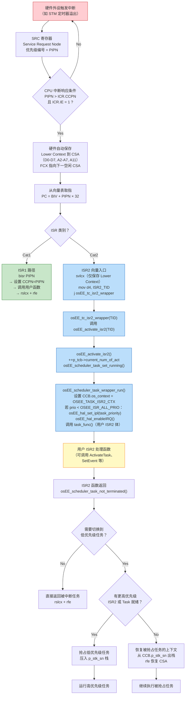

# 基于 ERIKA v3 与 TC38x 深入理解 AUTOSAR OS（三）：中断处理与资源同步

中断是嵌入式实时系统的时基脉搏，资源互斥是共享数据的秩序基石。本章以英飞凌 TriCore 架构的硬件中断机制为起点，逐层解析 ERIKA v3 如何接管中断向量、实现 ISR Category 1/2 的差异化处理，再过渡到优先级天花板协议的底层逻辑与 Spinlock 的多核同步机制。

---

## 3.1 一类中断与二类中断：速度与能力的权衡

### 3.1.1 规范定义

AUTOSAR OS（继承 OSEK/VDX）将中断服务例程分为两类：

| 特性 | Category 1 ISR | Category 2 ISR |
|---|---|---|
| OS 管控 | 不受 OS 管理 | 由 OS 完全管理 |
| 可否调用 OS 服务 | 不可（无任何 OS API） | 可（ActivateTask、SetEvent、GetResource 等） |
| 中断嵌套 | 由硬件优先级自动嵌套 | 由 OS 调度器管理嵌套 |
| 上下文切换 | 硬件 CSA 自动保存/恢复 | OS 调度器参与，可触发任务重调度 |
| 响应延迟 | 最低（无 OS 开销） | 略高（经过 OS wrapper 分发） |
| 栈使用 | 使用被中断任务的栈（或共享中断栈） | 使用内核中断栈或 ISR2 私有栈 |
| 典型应用 | 曲轴位置传感器的零延迟捕获 | 通信收发中断、定时器中断 |

**核心区别**：Cat1 ISR 追求极致速度，代价是丧失一切 OS 服务能力；Cat2 ISR 获得完整的 OS 服务调用权限，代价是经过一层 OS wrapper 的分发开销。这个权衡在汽车 ECUs 中是分层的——安全关键的时间约束（如曲轴信号边缘捕获）用 Cat1，功能逻辑中断（如 CAN 帧到达）用 Cat2。

### 3.1.2 ERIKA v3 的实现差异

在 ERIKA v3 的内核类型系统中，ISR2 与 Task 共享同一套数据结构——`OsEE_TDB` 的 `task_type` 字段区分了两者：

```c
typedef enum {
  OSEE_TASK_TYPE_BASIC,      // Basic Task
  OSEE_TASK_TYPE_EXTENDED,   // Extended Task
  OSEE_TASK_TYPE_ISR2,       // ISR Category 2 —— 作为"特殊任务"纳入调度
  OSEE_TASK_TYPE_IDLE        // Idle Task
} OsEE_task_type;
```

**ISR1 的实现**：完全绕过 OS。ERIKA v3 在中断向量表中为 Cat1 ISR 生成最小入口代码：

```c
// GCC 汇编，ISR1 向量入口（优先级 p）
osEE_tc_core0isr1_entry_XX:
  bisr  XX                // Begin ISR: 保存 Lower Context 到 CSA + 设置 CCPN=XX
  movh.a %a15,hi:handler  // 加载用户函数地址高半字
  lea   %a15,[%a15]lo:handler  // 加载低半字
  calli %a15              // 调用用户处理函数
  rslcx                   // 恢复 Lower Context
  rfe                     // Return From Exception
```

关键指令 `bisr`（Begin Interrupt Service Routine）做了三件事：
1. 将 Lower Context（D0~D7、A2~A7、A11）保存到 CSA；
2. 将 ICR.CCPN 设为中断优先级，自动屏蔽同级和低级中断；
3. 不调用任何 OS 服务，处理函数返回后 `rfe` 直接恢复上下文。

**ISR2 的实现**：经过 OS wrapper 分发。向量入口代码截然不同：

```c
// GCC 汇编，ISR2 向量入口（优先级 p）
osEE_tc_core0isr2_entry_XX:
  svlcx                   // 仅保存 Lower Context 到 CSA（不设 CCPN）
  mov   %d4, ISR2_TID     // 将 ISR2 的 Task ID 加载到 d4
  j     osEE_tc_isr2_wrapper  // 跳转到 OS ISR2 wrapper
```

**为什么 ISR2 不用 `bisr`？** 因为 `bisr` 会设置 `ICR.CCPN`，而 OS 需要用自己的虚拟优先级机制管理抢占。ISR2 的优先级由 OIL 配置的 `PRIORITY` 字段经过 `OSEE_ISR2_VIRT_TO_HW_PRIO()` 映射后写入 TriCore 的 SRC（Service Request Control）寄存器，而向量入口处的 `CCPN` 管理权交给 OS 的 `osEE_scheduler_task_wrapper_run()` 函数，由它在 ISR2 开始执行前调用 `osEE_hal_set_ipl(task_priority)` 来设置。

### 3.1.3 优先级空间的分割

ERIKA v3 在 8 位 `TaskPrio` 空间中做了精巧的分割：

```
  Bit 7    Bits 6-0
  ┌─────┬───────────────────────┐
  │  0  │  0x01 .. 0x7F         │  Task 优先级（1~127）
  ├─────┼───────────────────────┤
  │  1  │  0x00 .. 0x7E         │  ISR2 虚拟优先级（128~254）
  ├─────┼───────────────────────┤
  │  1  │  0x7F                 │  OSEE_ISR_ALL_PRIO = 0xFF（特殊最高值）
  └─────┴───────────────────────┘
```

```c
#define OSEE_ISR2_PRIO_BIT  ((TaskPrio)1U << ((sizeof(TaskPrio)*CHAR_BIT) - 1U))
// = 0x80 = 128
#define OSEE_ISR_ALL_PRIO   ((TaskPrio)-1)
// = 0xFF = 255
```

- **Task 优先级**（0x01~0x7F）：由 `GetResource()` 提升到天花板优先级时，不会超过 0x7F，因此 Task 之间不会影响 ISR2 的执行。
- **ISR2 虚拟优先级**（0x80~0xFE）：经过 `OSEE_ISR2_VIRT_TO_HW_PRIO()` 转换为 TriCore 硬件优先级后写入 SRC 寄存器。硬件中断的 `CCPN` 值由此映射而来。
- **0xFF（OSEE_ISR_ALL_PRIO）**：仅用于 `SCHEDULE = NON` 任务的 `dispatch_prio`，表示"不可被任何任务抢占"（等效于内部 Resource 天花板为最高值）。

---

## 3.2 TriCore BIV 向量表与中断接管

### 3.2.1 硬件向量寻址机制

TriCore 处理器在中断触发时，通过以下公式计算中断服务例程的入口地址：

```
Vector_Address = BIV + (PIPN × 32)
```

其中 `BIV`（Base Interrupt Vector Table Pointer）是 CSFR 寄存器 `0xFE20` 中的值，`PIPN`（Pending Interrupt Priority Number）是中断源优先级编号。每个向量条目占 32 字节（0x20），这意味着 TriCore 最多支持 256 个中断优先级（0~255），中断向量表最大为 8KB。

ERIKA v3 在 `osEE_tc_core0_start()` 中设置 BIV：

```c
osEE_tc_set_csfr(OSEE_CSFR_BIV, (osEE_addr)__INTTAB0);
```

`__INTTAB0` 是链接脚本中定义的 `.inttab_cpu0` section 的起始地址，所有 Core 的中断向量表分别放置在独立的 section 中（`.inttab_cpu0`、`.inttab_cpu1` 等）。

### 3.2.2 向量表的结构化生成

RT-Druid 根据 OIL 配置生成一系列宏定义，指示每个优先级级别对应的中断类型：

```c
/* ee_oscfg.h — RT-Druid 生成的向量表配置宏 */
#define OSEE_TC_CORE0_1_ISR_CAT    2       // 优先级 1：Cat2 ISR
#define OSEE_TC_CORE0_1_ISR_TID    TimerISR_ID

#define OSEE_TC_CORE0_2_ISR_CAT    2       // 优先级 2：Cat2 ISR（System Timer）
#define OSEE_TC_CORE0_2_ISR_TID    osEE_system_timer_ID

#define OSEE_TC_CORE0_100_ISR_CAT  1       // 优先级 100：Cat1 ISR
#define OSEE_TC_CORE0_100_ISR_HND  can_rx_handler

/* 未配置的优先级级别生成空条目（跳转指令 "j ." 即无线循环） */
```

`ee_tc_intvec.c` 中的模板代码据此生成完整的向量表：

```c
/* Core 0 中断向量表（简化） */
__asm__(".section .inttab_cpu0, \"ax\", @progbits");
__asm__(".globl __INTTAB0");
__asm__("__INTTAB0:");

/* Priority 0: Reserved (skip) */
__asm__(".skip 0x20");

/* Priority 1: ISR2 — System Timer */
__asm__("osEE_tc_core0isr2_entry_1:");
__asm__("  svlcx");                              // 保存 Lower Context
__asm__("  mov %d4, TimerISR_ID");               // 加载 ISR2 Task ID
__asm__("  j osEE_tc_isr2_wrapper");             // 跳转 OS wrapper
__asm__(".align 5");

/* Priority 2: ISR2 — CAN RX */
__asm__("osEE_tc_core0isr2_entry_2:");
__asm__("  svlcx");
__asm__("  mov %d4, CAN_RX_ISR_ID");
__asm__("  j osEE_tc_isr2_wrapper");
__asm__(".align 5");

/* Priority 100: ISR1 — Critical Capture */
__asm__("osEE_tc_core0isr1_entry_100:");
__asm__("  bisr 100");                            // Begin ISR，设 CCPN=100
__asm__("  movh.a %a15,hi:critical_handler");
__asm__("  lea %a15,[%a15]lo:critical_handler");
__asm__("  calli %a15");
__asm__("  rslcx");                               // 恢复 Lower Context
__asm__("  rfe");                                 // Return From Exception
__asm__(".align 5");
```

每个向量条目恰好 32 字节（5 条指令 × 4 字节 + `svlcx`/`bisr` × 4 字节 + 对齐），与 TriCore 硬件的 `BIV + PIPN × 32` 寻址机制完美匹配。

### 3.2.3 ISR2 完整调用链

当硬件外设触发中断时，TriCore CPU 按以下流程处理：



### 3.2.4 中断使能/禁原语体系

AUTOSAR OS 定义了三对中断控制 API，ERIKA v3 在 TriCore 上的映射如下：

| API | 语义 | TriCore 实现 | 可嵌套 |
|---|---|---|---|
| `DisableAllInterrupts()` | 全局禁中断 | `osEE_hal_disableIRQ()` — 清 PSW.I 位 | 否 |
| `EnableAllInterrupts()` | 全局使能中断 | `osEE_hal_enableIRQ()` — 置 PSW.I 位 | 否 |
| `SuspendAllInterrupts()` | 挂起所有中断 | `osEE_hal_suspendIRQ()` — 保存并清 PSW.I | 是（计数器 `s_isr_all_cnt`） |
| `ResumeAllInterrupts()` | 恢复所有中断 | `osEE_hal_resumeIRQ()` — 恢复 PSW.I | 是 |
| `SuspendOSInterrupts()` | 仅挂起 ISR2 | 保存 ICR，提升 CCPN 至最高 Task 优先级 | 是（计数器 `s_isr_os_cnt`） |
| `ResumeOSInterrupts()` | 恢复 ISR2 | 恢复 ICR 至先前值 | 是 |

**关键区别**：`SuspendOSInterrupts()` 不影响 Cat1 ISR——因为 Cat1 ISR 的优先级高于任何 Task，其执行不经过 OS 调度器，仅受 ICR.CCPN 硬件屏蔽。`SuspendAllInterrupts()` 则通过清 PSW.I 位全局禁用所有中断（包括 Cat1）。

---

## 3.3 优先级天花板协议：从原理到实现

### 3.3.1 为什么要天花板协议

考虑经典优先级翻转问题：

```
时间轴 →
  Low(P=1)    : ──GetResource(R)───────长时间持有─────ReleaseResource(R)──
  Mid(P=2)    :           ────就绪──────抢占Low───────────────执行完─────────
  High(P=3)   :                                    ────GetResource(R)阻塞等待──...
```

Low 持有 Resource R 时被 Mid 抢占，High 等待 R 释放但 Mid 持续运行——High 的等待时间被 Mid 无限延长。这就是无界优先级翻转（Unbounded Priority Inversion）。

**优先级天花板协议（Priority Ceiling Protocol, PCP）** 的解决方案：每个 Resource 在 OIL 配置中指定一个天花板优先级（Ceiling Priority），天花板优先级等于所有可能访问该 Resource 的任务中最高优先级。`GetResource()` 时任务优先级被临时提升到天花板：

```
时间轴 →
  Low(P=1)    : ──GetResource(R,ceil=3)──优先级提至P=3───执行────ReleaseResource(R)───优先级恢复P=1──
  Mid(P=2)    :                                ────就绪但无法抢占（P=2 < 3）────
  High(P=3)   :                                ──GetResource(R)──阻塞（R 已被占用）
                                             （Low 继续以 P=3 运行，Mid 无法插入）
  结果：High 等待最多 = Low 的临界区时长，无界翻转 → 有界等待
```

### 3.3.2 ERIKA v3 的 GetResource() 实现

```c
FUNC(StatusType, OS_CODE) GetResource(VAR(ResourceType, AUTOMATIC) ResID)
{
  // 1. 服务保护校验
  // 2. 参数校验

  CONSTP2VAR(OsEE_ResourceDB, AUTOMATIC, OS_APPL_CONST)
    p_reso_db   = (*p_kdb->p_res_ptr_array)[ResID];
  CONSTP2VAR(OsEE_ResourceCB, AUTOMATIC, OS_APPL_DATA)
    p_reso_cb   = p_reso_db->p_cb;
  CONST(TaskPrio, AUTOMATIC)
    reso_prio   = p_reso_db->prio;             // 天花板优先级（OIL 配置）
  CONST(TaskPrio, AUTOMATIC)
    current_prio = p_curr_tcb->current_prio;   // 任务当前优先级

  VAR(OsEE_reg, AUTOMATIC) flags = osEE_begin_primitive();

  // 3. 优先级提升：当前优先级 < 天花板优先级才提升
  if (current_prio < reso_prio) {
    p_curr_tcb->current_prio = reso_prio;           // 软件优先级提升
    flags = osEE_hal_prepare_ipl(flags, reso_prio); // 硬件 IPL 提升
  }

  // 4. 标记所有权
  p_reso_cb->p_owner = p_curr;

  // 5. 压入 Resource LIFO 栈
  p_reso_cb->p_next     = p_curr_tcb->p_last_m;  // 指向前一个栈顶
  p_reso_cb->prev_prio  = current_prio;           // 保存提升前的优先级
  p_curr_tcb->p_last_m  = p_reso_db;             // 更新栈顶

  osEE_end_primitive(flags);
  return E_OK;
}
```

三个关键操作：
1. **软件优先级提升**：`p_curr_tcb->current_prio = reso_prio`——将任务的 `current_prio` 提升到 Resource 的天花板优先级。此后就绪队列排序使用 `current_prio`，使得任何优先级低于 `reso_prio` 的任务/ISR2 都无法抢占当前任务。
2. **硬件 IPL 提升**：`osEE_hal_prepare_ipl(flags, reso_prio)`——在 TriCore 上，这会将 `ICR.CCPN` 设为与 `reso_prio` 对应的中断优先级级别，从硬件层面屏蔽低优先级中断。
3. **LIFO 栈推入**：`p_last_m` 指针链形成 Resource/Spinlock 的 LIFO 栈。`prev_prio` 保存提升前的优先级，确保 `ReleaseResource()` 时能精确恢复。

### 3.3.3 ERIKA v3 的 ReleaseResource() 实现

```c
FUNC(StatusType, OS_CODE) ReleaseResource(VAR(ResourceType, AUTOMATIC) ResID)
{
  // 1. 校验：LIFO 顺序（p_last_m 必须指向当前 Resource）
  // 2. 校验：所有权（p_owner == p_curr）

  VAR(OsEE_reg, AUTOMATIC) flags = osEE_begin_primitive();

  // 3. 弹出 Resource 栈
  p_curr_tcb->p_last_m = p_curr_tcb->p_last_m->p_cb->p_next;

  // 4. 恢复优先级（两个分支）
  if (p_curr_tcb->p_last_m != NULL) {
    // 仍持有其他 Resource/Spinlock
    CONST(TaskPrio, AUTOMATIC) prev_prio = p_reso_cb->prev_prio;
    p_curr_tcb->current_prio = prev_prio;              // 恢复到上一层保存的优先级
    flags = osEE_hal_prepare_ipl(flags, prev_prio);    // 硬件 IPL 恢复
  } else {
    // 不再持有任何 Resource/Spinlock
    p_curr_tcb->current_prio = p_curr->dispatch_prio;  // 恢复到 dispatch_prio
    flags = osEE_hal_prepare_ipl(flags, p_curr->dispatch_prio);
  }

  // 5. 清除所有权
  p_reso_cb->p_owner = NULL;

  // 6. 抢占点 —— 可能触发任务重调度
  (void)osEE_scheduler_task_preemption_point(p_kdb);

  osEE_end_primitive(flags);
  return E_OK;
}
```

注意恢复优先级的两个分支：
- **仍持有其他 Resource**：恢复到 `prev_prio`（即 `GetResource()` 时保存的值），而非 `ready_prio`——因为外层 Resource 可能已经提升了优先级，必须恢复到嵌套前的准确值。
- **不再持有任何 Resource**：恢复到 `dispatch_prio`（而非 `ready_prio`）——因为如果是非抢占任务，其 `dispatch_prio` 可能不等于 `ready_prio`。

**`osEE_scheduler_task_preemption_point()`** 是关键的抢占调度点。释放 Resource 后，任务优先级下降，如果此时就绪队列中有优先级高于新 `current_prio` 的任务，调度器将执行上下文切换。

### 3.3.4 Resource 栈的嵌套示例

假设一个优先级为 2 的 Task 先后 `GetResource(R1, ceil=5)` 和 `GetResource(R2, ceil=8)`：

```
GetResource(R1, ceil=5):
  current_prio: 2 → 5          (提升到 R1 天花板)
  p_last_m: NULL → R1
  R1.prev_prio = 2             (保存原始优先级)

GetResource(R2, ceil=8):
  current_prio: 5 → 8          (提升到 R2 天花板)
  p_last_m: R1 → R2
  R2.prev_prio = 5             (保存 R1 提升后的优先级)

ReleaseResource(R2):
  p_last_m: R2 → R1            (弹出 R2)
  current_prio: 8 → 5          (恢复到 R2.prev_prio = 5)
  抢占点调度...

ReleaseResource(R1):
  p_last_m: R1 → NULL          (弹出 R1)
  current_prio: 5 → dispatch_prio (恢复到 dispatch_prio)
  抢占点调度...
```

LIFO 栈确保了嵌套 Resource 的精确优先级恢复——这是 OSEK/AUTOSAR OS 规范要求 `GetResource`/`ReleaseResource` 必须严格 LIFO 配对的根本原因。

### 3.3.5 Resource 与 Spinlock 的统一栈

ERIKA v3 中 Resource 和 Spinlock 共享同一个 LIFO 栈（`p_last_m`），通过 `OsEE_MDB.m_type` 字段区分：

```c
typedef struct OsEE_MDB_tag {
  P2VAR(OsEE_MCB, TYPEDEF, OS_APPL_DATA)  p_cb;          // 控制块指针
#if (defined(OSEE_HAS_SPINLOCKS))
  P2VAR(OsEE_spin_lock, TYPEDEF, OS_APPL_DATA) p_spinlock_arch; // 硬件自旋锁
#endif
  VAR(TaskPrio, TYPEDEF)                    prio;          // 天花板优先级
#if (!defined(OSEE_SINGLECORE))
  VAR(CoreMaskType, TYPEDEF)                allowed_core_mask; // 允许访问的核心掩码
#endif
#if (defined(OSEE_HAS_RESOURCES)) && (defined(OSEE_HAS_SPINLOCKS))
  VAR(OsEE_m_type, TYPEDEF)                 m_type;       // OSEE_M_RESOURCE 或 OSEE_M_SPINLOCK
#endif
} OSEE_CONST OsEE_MDB;
```

`TerminateTask()` 和 `ChainTask()` 会检查 `p_last_m != NULL`，若发现仍有未释放的 Resource 或 Spinlock，返回 `E_OS_RESOURCE` 或 `E_OS_SPINLOCK` 错误——这是规范要求的运行时保护。

### 3.3.6 Spinlock：多核互斥原语

Spinlock 用于多核场景下保护共享数据结构。ERIKA v3 在 TriCore 上使用 `cmpswap.w`（Compare-and-Swap Word）指令实现自旋锁：

```c
// 伪代码 — TriCore 硬件自旋锁
static inline void osEE_hal_spin_lock(OsEE_spin_lock *p_lock) {
  while (__builtin_tricore_cmpswapw((unsigned int *)&p_lock->lock, 1U, 0U) != 0U) {
    // 自旋等待：	lock 值为 0 时原子地设为 1 并返回旧值 0（成功）
    //			否则继续自旋
  }
}

static inline void osEE_hal_spin_unlock(OsEE_spin_lock *p_lock) {
  __sync_synchronize();  // 内存屏障
  p_lock->lock = 0U;     // 释放锁
}
```

OIL 配置 Spinlock 时指定天花板优先级和获取顺序（`NEXT_SPINLOCK`）：

```oil
SPINLOCK spinlock_1 { NEXT_SPINLOCK = spinlock_2; };
SPINLOCK spinlock_2 {};
```

`GetSpinlock()` 的实现与 `GetResource()` 高度相似——提升 `current_prio` 到天花板优先级、压入 `p_last_m` 栈、保存 `prev_prio`。区别在于：
1. 获得 Spinlock 前需要自旋等待（核间互斥）；
2. `allowed_core_mask` 限制哪些 Core 可以访问该 Spinlock（AUTOSAR OS 规范要求 Spinlock 只能在指定 Core 组上使用）；
3. `ReleaseSpinlock()` 的 `osEE_scheduler_task_preemption_point()` 在多核场景下不会触发核间迁移——仅在当前核上做调度检查。

---

## 3.4 优先级天花板的硬件联动：ICR.CCPN 与 PSW

在 TriCore 上，`GetResource()` 提升的软件优先级必须同步映射到硬件中断屏蔽级别，否则高优先级中断仍能抢占——天花板协议只在软件层面生效是不够的。

ERIKA v3 通过 `osEE_hal_prepare_ipl(flags, prio)` 实现了软硬同步：

```c
// 简化的 TriCore IPL 设置逻辑
static inline OsEE_reg osEE_hal_prepare_ipl(OsEE_reg flags, TaskPrio prio) {
  OsEE_reg new_icr;
  OsEE_icr icr;

  icr.reg = osEE_tc_get_csfr(OSEE_CSFR_ICR);  // 读当前 ICR
  icr.bits.ccpn = prio;                          // 设置 CCPN 为天花板优先级
  // （ISR2 的 prio >= 128 会直接映射到硬件优先级）
  osEE_tc_set_csfr(OSEE_CSFR_ICR, icr.reg);    // 写回 ICR

  return flags;  // 保存旧 ICR 值用于恢复
}
```

这样，当 Task 以天花板优先级 P 持有 Resource 时：
- **软件层面**：就绪队列中优先级 ≤ P 的任务不会被调度（因为 `current_prio == P`）；
- **硬件层面**：ICR.CCPN = P，优先级 ≤ P 的 ISR2 中断不会被 CPU 响应；
- **双重保证**：只有优先级 > P 的 ISR2 才能抢占，且这些 ISR2 不应访问同一 Resource（AUTOSAR OS 规范的静态约束）。

---

## 3.5 中断服务例程的 OIL 配置到 C 代码生成

### 3.5.1 OIL 声明示例

```oil
ISR SystemTimerISR {
  CATEGORY = 2;          /* Category 2 ISR */
  SOURCE = "STM_SR0";    /* TriCore 中断源：System Timer Service Request 0 */
  HANDLER = "clock_handler";  /* 用户处理函数名 */
  PRIORITY = 2;          /* OS 虚拟优先级 */
};

ISR CriticalCaptureISR {
  CATEGORY = 1;          /* Category 1 ISR */
  SOURCE = "SRC_GPSG0";  /* TriCore 中断源 */
  PRIORITY = 100;        /* 硬件优先级（Cat1 直接映射） */
};
```

### 3.5.2 RT-Druid 生成的代码

```c
/* ee_oscfg.h — ISR2 TDB 生成 */
OSEE_CONST OsEE_TDB osEE_tdb_SystemTimerISR = {
  .hdb = {
    .p_sdb    = &osEE_sdb_isr2_stack,
    .p_scb    = &osEE_scb_isr2_stack,
    .isr2_src = OSEE_TC_SRC_STM_SR0   /* TriCore 中断源编号 */
  },
  .p_tcb           = &osEE_tcb_SystemTimerISR,
  .tid             = SystemTimerISR_ID,
  .task_type       = OSEE_TASK_TYPE_ISR2,
  .task_func       = clock_handler,
  .ready_prio      = (TaskPrio)(OSEE_ISR2_PRIO_BIT + 2U),  /* 128 + 2 = 130 */
  .dispatch_prio   = (TaskPrio)(OSEE_ISR2_PRIO_BIT + 2U),
  .max_num_of_act  = 1U,
  .orig_core_id    = OS_CORE_ID_0
};

/* ee_oscfg.h — 向量表配置宏 */
#define OSEE_TC_CORE0_2_ISR_CAT    2
#define OSEE_TC_CORE0_2_ISR_TID    SystemTimerISR_ID

#define OSEE_TC_CORE0_100_ISR_CAT  1
#define OSEE_TC_CORE0_100_ISR_HND  CriticalCaptureISR
```

`StartOS()` 执行时，会遍历所有 TDB，对 ISR2 类型的条目调用 `osEE_tc_conf_src()` 配置对应 SRC 寄存器：

```c
/* ee_tc_hal.c — osEE_cpu_startos() 中的 ISR2 SRC 配置 */
for (i = 0U; i < tdb_size; ++i) {
  OsEE_TDB * const p_tdb = (*p_kdb->p_tdb_ptr_array)[i];
  if (p_tdb->orig_core_id == curr_core_id) {
    if (p_tdb->task_type == OSEE_TASK_TYPE_ISR2) {
      if (p_tdb->hdb.isr2_src != OSEE_TC_SRC_INVALID) {
        OsEE_prio const srn_priority_tmp =
          (OsEE_prio)OSEE_TC_SRN_PRIORITY(
            OSEE_ISR2_VIRT_TO_HW_PRIO(p_tdb->ready_prio)
          );
        osEE_tc_conf_src(curr_core_id, p_tdb->hdb.isr2_src, srn_priority_tmp);
      }
    }
  }
}
```

`osEE_tc_conf_src()` 将 SRC 寄存器的优先级字段设为计算后的硬件优先级值，使能中断请求，完成硬件中断源的注册。

---

## 3.6 小结

本章从中断分类出发，解析了 Cat1 ISR 的 `bisr` 直通路径与 Cat2 ISR 的 OS wrapper 分发路径的根本差异——前者追求零延迟但不允许调用任何 OS 服务，后者经过 `svlcx` → `osEE_tc_isr2_wrapper` → `osEE_activate_isr2` → `task_func` 的完整调用链，获得 OS 调度能力。TriCore 的 `BIV + PIPN × 32` 向量寻址机制与 `ICR.CCPN` 优先级屏蔽机制，是这两条路径得以实现的硬件基础。

优先级天花板协议通过 `GetResource()` 中 `current_prio` 的提升和 `ICR.CCPN` 的联动设置，实现了软硬件双重屏蔽——这是防止无界优先级翻转的核心机制。`ReleaseResource()` 通过 `p_last_m` LIFO 栈精确恢复嵌套优先级，并在抢占点触发任务重调度。

Resource 与 Spinlock 统一在 `OsEE_MDB`/`OsEE_MCB` 数据结构中，共享 LIFO 栈和 `prev_prio` 保存机制，形成了 Task/ISR2 在单核（Resource）和多核（Spinlock）场景下的完整互斥原语体系。

---

> **下期预告：** 第四章将深入 Event 机制与 Alarm/Counter 定时子系统——WaitEvent/SetEvent 的阻塞与唤醒路径、跨核 SetEvent 的核间中断传递、硬件定时器到软件 Counter 的驱动链路，以及 Schedule Table 的绝对/相对/同步模式。