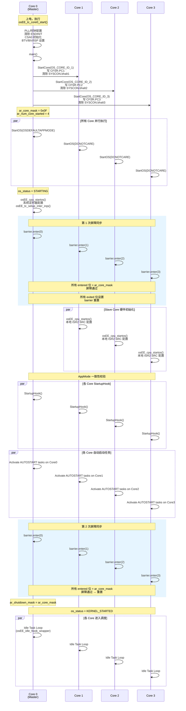

# 基于 ERIKA v3 与 TC38x 深入理解 AUTOSAR OS（四）：多核启动与核间通信

多核是 AUTOSAR OS 相对于 OSEK OS 最具标志性的架构扩展。AURIX TC387 的 6 个 TriCore 核心 + 1 个 HSM 核心如何被有序唤醒、如何通过同步屏障协调初始化、如何以核间中断实现跨核任务激活——这些问题的答案藏在硬件寄存器与 C 代码的交汇处。本章从上电第一条指令出发，逐层拆解多核启动、同步屏障、核间中断、自旋锁的完整实现。

---

## 4.1 Master Core 引导与 Slave Core 唤醒

### 4.1.1 TC38x 上电行为

TC387 上电后，仅 **Core0（Boot Core）** 开始执行。Core1~Core4 和 Core6 处于 Halt 状态，其程序计数器（PC）指向的地址不确定。Core5（HSM）独立运行，AUTOSAR OS 不可见。

Core0 从 Flash 中 Boot Header（BMHD）指定的地址开始执行，进入 `osEE_tc_core0_start()`，完成 PLL 配置、CSA 初始化、CSFR 寄存器编程后跳转到 `main()`。

### 4.1.2 用户代码：StartCore() 顺序启动

多核应用的 `main()` 函数遵循一个固定模式——只有 Master Core 调用 `StartCore()` 唤醒 Slave Core，然后所有 Core 调用 `StartOS()`：

```c
/* master.c — Core0 的 main() */
int main(void) {
  StatusType       status;
  AppModeType      mode;
  CoreIdType const core_id = GetCoreID();

  if (core_id == OS_CORE_ID_MASTER) {
    /* 仅 Master Core 唤醒 Slave Core */
    StartCore(OS_CORE_ID_1, &status);
    StartCore(OS_CORE_ID_2, &status);
    mode = OSDEFAULTAPPMODE;
  } else {
    mode = DONOTCARE;  /* Slave Core 的 AppMode 在 StartOS 中对齐 */
  }

  StartOS(mode);        /* 所有 Core 进入 OS */
  return 0;             /* 不应到达此处 */
}
```

`StartCore()` 在 `ee_oo_api_extension.c` 中实现了核心唤醒逻辑：

```c
FUNC(void, OS_CODE) StartCore(
  VAR(CoreIdType, AUTOMATIC) CoreID,
  P2VAR(StatusType, AUTOMATIC, OS_APPL_DATA) Status
) {
  CONST(OsEE_reg, AUTOMATIC) flags = osEE_begin_primitive();
  CONSTP2VAR(OsEE_KDB, AUTOMATIC, OS_APPL_DATA) p_kdb = osEE_lock_and_get_kernel();
  CONSTP2VAR(OsEE_KCB, AUTOMATIC, OS_APPL_DATA) p_kcb = p_kdb->p_kcb;
  CONST(CoreMaskType, AUTOMATIC) core_id_mask = ((CoreMaskType)1U << CoreID);

  if ((core_id_mask & OSEE_CORE_ID_VALID_MASK) == 0U) {
    ev = E_OS_ID;
  } else if (p_ccb->os_status != OSEE_KERNEL_INITIALIZED) {
    ev = E_OS_ACCESS;
  } else if ((p_kcb->ar_core_mask & core_id_mask) != 0U) {
    ev = E_OS_STATE;                           /* Core 已启动 */
  } else {
    if (CoreID != OS_CORE_ID_MASTER) {
      p_kcb->ar_core_mask |= core_id_mask;    /* 标记 Core 已启动 */
      ++p_kcb->ar_num_core_started;            /* 递增已启动核计数 */
      osEE_hal_start_core(CoreID);             /* 写 PC 寄存器 + 释放 Halt */
    }
    ev = E_OK;
  }
  osEE_unlock_kernel();
  osEE_end_primitive(flags);
  if (Status != NULL) { *Status = ev; }
}
```

三个关键操作：
1. **`ar_core_mask` 位掩码更新**：将目标 Core 的位加入已启动核掩码；
2. **`ar_num_core_started` 计数递增**；
3. **`osEE_hal_start_core(CoreID)`**：写 PC 寄存器并释放 Halt。

### 4.1.3 osEE_hal_start_core()：写 PC 寄存器与释放 Halt

```c
void osEE_hal_start_core(CoreIdType core_id) {
  switch (core_id) {
    case OS_CORE_ID_1:
      OSEE_TC_CORE_PC(OS_CORE_ID_1).reg = (uint32_t)OSEE_CORE1_START_ADDR;
      break;
    case OS_CORE_ID_2:
      OSEE_TC_CORE_PC(OS_CORE_ID_2).reg = (uint32_t)OSEE_CORE2_START_ADDR;
      break;
    case OS_CORE_ID_3:
      OSEE_TC_CORE_PC(OS_CORE_ID_3).reg = (uint32_t)OSEE_CORE3_START_ADDR;
      break;
    /* ... Core4, Core6 ... */
  }

  if (core_id != OS_CORE_ID_0) {
#if (!defined(OSEE_TC_2G))
    /* TC3xx: 通过 DBGSR 寄存器释放 Halt */
    OSEE_TC_CORE_DBGSR(core_id).bits.halt = OSEE_TC_DBGSR_RESET_HALT;
#else
    /* AURIX 2G (TC38x): 通过 SYSCON.bhalt 释放 Halt */
    OsEE_syscon syscon = OSEE_TC_CORE_SYSCON(core_id);
    if (syscon.bits.bhalt != 0U) {
      syscon.bits.bhalt = 0U;
      OSEE_TC_CORE_SYSCON(core_id) = syscon;
    }
#endif
  }
}
```

**PC 寄存器访问**：TC38x 的 Crossbar Fabric 提供了 Core Fabric Special Function Register (CFSR) 区域，每个 Core 的 PC 寄存器可通过 `CFSR_BASE + CORE_OFFSET(c) + 0xFE08` 访问：

```c
#define OSEE_TC_CFSR_BASE           ((OsEE_reg)0xF8810000U)
#define OSEE_TC_XFSR_CORE_OFFSET(c) ((OsEE_reg)(c) * 0x20000U)
#define OSEE_TC_CFSR_ADDR(c,offset)  \
  (OSEE_TC_CFSR_BASE + OSEE_TC_XFSR_CORE_OFFSET(c) + (((OsEE_reg)(offset)) & 0xFFFFU))
#define OSEE_TC_CFSR_PC              (0xFE08U)

typedef union {
  OsEE_reg reg;
  struct { unsigned : 1; unsigned pc : 31; } bits;
} OsEE_tc_CPU_PC;

#define OSEE_TC_CORE_PC(c) \
  (*(OsEE_tc_CPU_PC volatile *)OSEE_TC_CFSR_ADDR((c), OSEE_TC_CFSR_PC))
```

**Halt 释放**：在 AURIX 2G（TC38x）平台上，`SYSCON.bhalt` 位清零后，对应 Core 从 Halt 状态恢复执行，从 PC 寄存器写入的地址取第一条指令。在 TC3xx 平台上则通过 `DBGSR.halt` 位操作实现。

### 4.1.4 Slave Core 启动：A9 寄存器与 CDB 指针

Slave Core 被唤醒后执行 `osEE_tc_coreN_start()`，其核心操作是将自身 CDB（Core Descriptor Block）地址写入 A9 寄存器：

```c
/* ee_tc_cstart.c — Slave Core 启动（简化） */
void osEE_tc_core1_start(void) {
  /* 设置私有栈、CSA、Trap 表、中断向量表 */
  osEE_tc_setareg(a10, __USTACK1);           /* 栈指针 */
  osEE_tc_init_csa(__CSA1_BEGIN, __CSA1_END); /* CSA */
  osEE_tc_set_csfr(OSEE_CSFR_BTV, __TRAPTAB1);
  osEE_tc_set_csfr(OSEE_CSFR_BIV, __INTTAB1);
  osEE_tc_set_csfr(OSEE_CSFR_ISP, __ISP1);

  /* 关键：A9 指向 Core1 的 CDB */
  osEE_tc_setareg(a9, &osEE_cdb_var_core1);

  /* 禁止 CPU Watchdog */
  /* 调用 C 运行时初始化 */
  osEE_tc_C_init();

  /* 进入 main() */
  main();
}
```

此后，该 Core 上任何 OS 服务通过 `osEE_get_curr_core()` 可 O(1) 获取 CDB 指针：

```c
OSEE_STATIC_INLINE OsEE_CDB * osEE_get_curr_core(void) {
  OsEE_CDB * p_cdb;
  osEE_tc_getareg(a9, p_cdb);   /* 从 A9 寄存器直接读取 */
  return p_cdb;
}
```

A9 是 TriCore 的全局地址寄存器，由 CSFA 硬件上下文保存机制自动保存和恢复，因此即使发生中断或任务切换，A9 始终指向当前 Core 的 CDB——这是 ERIKA v3 多核架构中最高效的设计决策之一。

---

## 4.2 StartOS() 中的多重同步屏障

### 4.2.1 同步屏障数据结构

`OsEE_barrier` 是一个 64 位概念的原子变量，存储在 `KDB.p_barrier` 指向的内存中：

```c
typedef struct {
  VAR(OsEE_reg, TYPEDEF) value;    /* 低 OS_CORE_ID_ARR_SIZE 位 = entered 标志
                                      高 OS_CORE_ID_ARR_SIZE 位 = exited 标志 */
} OsEE_barrier;
```

每位 Core 在 `value` 中有 两个标志位：
- **entered**（低半部分）：表示该 Core 已到达屏障；
- **exited**（高半部分）：表示该 Core 已通过屏障。

### 4.2.2 osEE_hal_sync_barrier() 实现原理

```c
void osEE_hal_sync_barrier(OsEE_barrier * p_bar,
  OsEE_reg const volatile * p_wait_mask, OsEE_kernel_cb p_synch_cb)
{
  CoreMaskType const exit_mask = (0xFFFFFFFFU ^
    (((CoreMaskType)0x1U << OS_CORE_ID_ARR_SIZE) - 1U));

  /* 1. 等待上一轮屏障的所有 Core 退出 */
  while ((p_bar->value & exit_mask) != 0U) {
    if (p_synch_cb != NULL) { p_synch_cb(); }
  }

  /* 2. 将本地 Core 的 entered 位置 1（原子操作） */
  osEE_tc_imask_ldmst(&p_bar->value, 0x1U,
    (OsEE_reg)osEE_get_curr_core_id(), 1U);

  /* 3. 自旋等待所有目标 Core 的 entered 位都为 1 */
  wait_mask = (*p_wait_mask);    /* = ar_core_mask */
  while ((p_bar->value & wait_mask) != wait_mask) {
    if (p_synch_cb != NULL) { p_synch_cb(); }
    wait_mask = (*p_wait_mask);
  }

  /* 4. 将本地 Core 的 exited 位置 1（原子操作） */
  osEE_tc_imask_ldmst(&p_bar->value, 0x1U,
    (OsEE_reg)osEE_get_curr_core_id() + (OsEE_reg)OS_CORE_ID_ARR_SIZE, 1U);

  /* 5. 尝试重置屏障（所有 Core exited 后清零） */
  all_exited = (wait_mask << OS_CORE_ID_ARR_SIZE) | wait_mask;
  (void)osEE_tc_cmpswapw(&p_bar->value, 0U, all_exited);
}
```

三个 TriCore 原子指令的关键角色：

| 指令 | 功能 | 在屏障中的用途 |
|---|---|---|
| `ldmst`（Insert/Mask/Store） | 原子地修改目标操作数的指定位域 | 设置当前 Core 的 entered/exited 位 |
| `cmpswap.w`（Compare-and-Swap） | 原子比较并交换 32 位字 | 所有 Core exited 后重置屏障为 0 |
| `dsync`（Data Synchronization） | 数据同步屏障 | `spin_unlock` 中确保写操作完成后再释放锁 |

### 4.2.3 StartOS() 中的两次屏障同步

```c
FUNC(StatusType, OS_CODE) StartOS(VAR(AppModeType, AUTOMATIC) Mode) {
  /* 1. Master Core: 初始化硬件（定时器、ICI） */
  if (curr_core_id == OS_CORE_ID_MASTER) {
    if (osEE_cpu_startos() == OSEE_FALSE) { ev = E_OS_SYS_INIT; }
  }

  p_ccb->os_status = OSEE_KERNEL_STARTING;
  p_ccb->app_mode  = Mode;

  /* ====== 第 1 次屏障：Master 与 Slave 同步 ====== */
  osEE_hal_sync_barrier(p_kdb->p_barrier, &p_kcb->ar_core_mask,
    OSEE_STARTOS_1ST_SYNC_BARRIER_CB);

  /* Slave Core: 第 1 次屏障后才执行硬件初始化 */
  if (curr_core_id != OS_CORE_ID_MASTER) {
    if (!osEE_cpu_startos()) { for (;;) {} }
  }

  /* AppMode 一致性校验 */
  for (i = 0U; i <= OSEE_CORE_ID_MAX; ++i) {
    if ((p_kcb->ar_core_mask & ((CoreMaskType)1U << i)) != 0U) {
      /* 检查各 Core 的 app_mode 是否一致 */
    }
  }

  osEE_call_startup_hook(p_ccb);

  /* 激活自动启动任务与报警器 */
  /* ... */

  /* ====== 第 2 次屏障：StartupHook 完成后同步 ====== */
  osEE_hal_sync_barrier(p_kdb->p_barrier, &p_kcb->ar_core_mask,
    OSEE_STARTOS_2ND_SYNC_BARRIER_CB);

  /* Master Core: 初始化关机掩码 */
  if (curr_core_id == OS_CORE_ID_MASTER) {
    p_kcb->ar_shutdown_mask = p_kcb->ar_core_mask;
  }

  p_ccb->os_status = OSEE_KERNEL_STARTED;

  /* 进入 Idle Task / 调度器 */
  osEE_idle_hook_wrapper(p_cdb);
}
```

**两次屏障的必要性**：

| 屏障 | 目的 | 在此之前完成 | 在此之后完成 |
|---|---|---|---|
| 第 1 次 | 确保 Master 的 `osEE_cpu_startos()` 在 Slave 之前完成 | Master：系统定时器、ICI 配置 | Slave：本地 ISR2 SRC 配置、栈监控初始化 |
| 第 2 次 | 确保所有 Core 的 `StartupHook()` 和自动启动任务均已完成 | 各 Core：`StartupHook()`、自动启动 Task/Alarm | 所有 Core 进入 `OSEE_KERNEL_STARTED`，开始正常调度 |

若没有第 1 次屏障，Slave Core 可能在 Master 配置 ICI 之前就尝试发送核间中断，导致未定义行为。若没有第 2 次屏障，某个 Core 可能在其他 Core 仍在 `StartupHook` 中时就激活了跨核任务。

---

## 4.3 多核启动全流程图



---

## 4.4 核间中断（ICI）与跨核任务激活

### 4.4.1 ICI 硬件基础：GPSR（Generic Peripheral Service Request）

AURIX 2G 的核间中断通过 **GPSR**（Generic Peripheral Service Request）模块实现。每个 Core 的 GPSR 通道组包含一组 **SRC（Service Request Control）寄存器**，可以被其他 Core 写入以触发中断。

ERIKA v3 在 `osEE_tc_setup_inter_irqs()` 中为每个 Core 配置一个 GPSR SRC 通道：

```c
OSEE_STATIC_INLINE void OSEE_ALWAYS_INLINE osEE_tc_setup_inter_irqs(void) {
  /* 每个 Core 一个 GPSR 通道，优先级 = 1（最高任务级优先级之一） */
  osEE_tc_conf_src(OS_CORE_ID_0,
    OSEE_TC_GPSR_SRC_OFFSET(OSEE_TC_GPSR_G, 0U), 1U);
#if (OSEE_CORE_ID_VALID_MASK & 0x02U)
  osEE_tc_conf_src(OS_CORE_ID_1,
    OSEE_TC_GPSR_SRC_OFFSET(OSEE_TC_GPSR_G, 1U), 1U);
#endif
#if (OSEE_CORE_ID_VALID_MASK & 0x04U)
  osEE_tc_conf_src(OS_CORE_ID_2,
    OSEE_TC_GPSR_SRC_OFFSET(OSEE_TC_GPSR_G, 2U), 1U);
#endif
  /* ... Core3, Core4, Core6 ... */
}
```

`osEE_tc_conf_src()` 配置 SRC 寄存器的 TOS（Type of Service）、优先级和使能位。优先级设为 1——这是一个刻意选择：ICI ISR 优先级高于所有用户任务（任务优先级范围 1~127），但低于大多数 ISR2（虚拟优先级 128+），确保 ICI 能及时触发目标核的调度器扫描。

### 4.4.2 跨核 ActivateTask 的实现路径

当 Core0 上的 TaskA 执行 `ActivateTask(TaskB_ID)` 激活 Core1 上的 TaskB 时，分区调度器（`ee_oo_sched_partitioned.c`）的执行路径如下：

```c
/* ee_oo_sched_partitioned.c — osEE_scheduler_task_activated() 分区调度分支 */
if (p_tdb_act->orig_core_id != curr_core_id) {
  /* ====== 跨核激活 ====== */

  /* 1. 获取目标 Core 的自旋锁 */
  osEE_lock_core(p_cdb_target);

  /* 2. 插入目标 Core 的就绪队列 */
  rq_head_changed = osEE_scheduler_task_insert_rq(
    &p_ccb_target->rq, &p_ccb_target->p_free_sn, p_tdb_act
  );

  /* 3. 释放目标 Core 的自旋锁 */
  osEE_unlock_core(p_cdb_target);

  /* 4. 如果就绪队列头发生变化，发送核间中断 */
  if (rq_head_changed) {
    osEE_hal_signal_core(p_tdb_act->orig_core_id);
  }

  is_preemption = OSEE_FALSE;
}
```

**关键步骤解读**：

1. **锁目标 Core 的自旋锁**：`osEE_lock_core(p_cdb_target)` 获取 `p_cdb_target->p_lock` 指向的自旋锁。这是因为就绪队列（`rq`）和空闲调度节点链表（`p_free_sn`）驻留在目标 Core 的 CCB 中，必须原子操作。

2. **插入目标就绪队列**：使用目标 Core 的 `rq` 和 `p_free_sn`。

3. **释放自旋锁**：`osEE_unlock_core()` 执行 `dsync` 内存屏障 + 写 0 释放锁。

4. **发送核间中断**：`osEE_hal_signal_core()` 写目标 Core 的 GPSR SRC 寄存器的 `SET_REQUEST` 位：

```c
OSEE_STATIC_INLINE void osEE_hal_signal_core(CoreIdType core_id) {
  OSEE_TC_SRC_REG(OSEE_TC_GPSR_SRC_OFFSET(OSEE_TC_GPSR_G, core_id)) |=
    OSEE_TC_SRN_SET_REQUEST;
}
```

目标 Core 收到 ICI 后，其优先级为 1 的 ISR2 被触发，ISR2 中执行调度器抢占点（`osEE_scheduler_task_preemption_point()`），选择就绪队列中最高优先级任务执行。

### 4.4.3 跨核 SetEvent 的实现路径

跨核 `SetEvent()` 与 `ActivateTask()` 共享同一套 ICI 机制。分区调度器中 `osEE_scheduler_task_set_event()` 在检测到目标 Task 不在本核时：

```c
/* 简化的跨核 SetEvent 流程 */
if (p_tdb_wake->orig_core_id != curr_core_id) {
  osEE_lock_core(p_cdb_target);

  /* 在目标 Core 的上下文中设置事件掩码 */
  p_tcb_wake->event_mask |= Mask;
  if ((p_tcb_wake->wait_mask & Mask) != 0U) {
    /* 目标任务正在等待此事件 */
    p_own_sn = p_tcb_wake->p_own_sn;
    if (p_own_sn != NULL) {
      p_tcb_wake->p_own_sn = NULL;
      /* 将 SN 插入目标 Core 的就绪队列 */
      osEE_scheduler_rq_insert(&p_ccb_target->rq, p_own_sn, p_tdb_wake);
    }
  }

  osEE_unlock_core(p_cdb_target);
  osEE_hal_signal_core(p_tdb_wake->orig_core_id);
}
```

### 4.4.4 ICI ISR 的应答

目标 Core 的 ICI ISR 在完成调度后，通过 `osEE_tc_ack_signal()` 清除中断请求：

```c
OSEE_STATIC_INLINE void osEE_tc_ack_signal(void) {
  CoreIdType core_id = osEE_get_curr_core_id();
  OSEE_TC_SRC_REG(OSEE_TC_GPSR_SRC_OFFSET(OSEE_TC_GPSR_G, core_id)) |=
    (OSEE_TC_SRN_CLEAR_REQUEST | OSEE_TC_SRN_STICKY_CLEAR);
}
```

---

## 4.5 硬件自旋锁（Spinlock）：多核临界区的最后防线

### 4.5.1 Spinlock 的适用场景

Resource 是 **单核** 互斥原语——它通过优先级天花板协议防止同核任务抢占，但无法阻止其他核上的任务并发访问共享数据。Spinlock 是 **多核** 互斥原语——它通过原子自旋等待实现核间互斥，但自旋期间不进行任务切换。

| 原语 | 适用范围 | 机制 | 可否在持有时阻塞 | 可否在持有时被抢占 |
|---|---|---|---|---|
| Resource | 单核 | 优先级天花板 | 否（不允许 WaitEvent） | 否（天花板优先级阻止抢占） |
| Spinlock | 多核 | cmpswap.w 自旋 | 否（自旋等待，不可调用 WaitEvent/TerminateTask） | 视天花板优先级：有 Lock Method 时不可抢占 |

### 4.5.2 OIL 配置 Spinlock

```oil
CPU mySystem {
  OS myOs {
    CPU_DATA = TRICORE { ID = 0x0; COMPILER = GCC; };
    CPU_DATA = TRICORE { ID = 0x1; };
    CPU_DATA = TRICORE { ID = 0x2; };
    MCU_DATA = TC39X { DERIVATIVE = "tc397xe"; };
    KERNEL_TYPE = OSEK { CLASS = BCC1; };
  };

  TASK TaskMaster { PRIORITY = 1; AUTOSTART = TRUE; };
  TASK TaskSlave1  { CPU_ID = 1; PRIORITY = 1; };
  TASK TaskSlave2  { CPU_ID = 2; PRIORITY = 1; AUTOSTART = TRUE; };

  /* Spinlock 配置 */
  SPINLOCK spinlock_1 { NEXT_SPINLOCK = spinlock_2; };   /* 获取顺序：spinlock_1 → spinlock_2 */
  SPINLOCK spinlock_2 { };                                 /* 最后一个 */
};
```

`NEXT_SPINLOCK` 属性声明了 Spinlock 的获取顺序，这是 AUTOSAR OS 规范 [SWS_Os_00661] 的要求——防止自旋锁死锁。

### 4.5.3 TriCo​re 原子指令实现

ERIKA v3 在 TriCore 上使用两条原子指令实现 Spinlock：

```c
/* 自旋锁获取：cmpswap.w 循环 */
OSEE_STATIC_INLINE void osEE_hal_spin_lock(OsEE_spin_lock * p_lock) {
  while (osEE_tc_cmpswapw(p_lock, 1U, 0U) != 0U) {
    ;  /* 自旋等待：lock==0 时原子写入 1 并返回旧值 0（成功） */
  }
}

/* 自旋锁释放：dsync + 写 0 */
OSEE_STATIC_INLINE void osEE_hal_spin_unlock(OsEE_spin_lock * p_lock) {
  osEE_tc_dsync();   /* 数据同步屏障：确保临界区内的写操作全局可见 */
  (*p_lock) = 0U;    /* 释放锁 */
}

/* 非阻塞尝试获取 */
OSEE_STATIC_INLINE OsEE_bool osEE_hal_try_spin_lock(OsEE_spin_lock * p_lock) {
  return (osEE_tc_cmpswapw(p_lock, 1U, 0U) == 0U) ? OSEE_TRUE : OSEE_FALSE;
}
```

`cmpswap.w`（Compare-and-Swap Word）指令：原子地比较 `\*p_lock == expected`，若相等则写入 `new_val` 并返回旧值。在自旋锁场景中，期望值为 0（未锁定），写入值为 1（已锁定），返回非 0 值表示锁被其他核持有，需继续自旋。

`dsync`（Data Synchronization）指令确保在释放锁之前，临界区内所有写操作已经完成并全局可见——这是多核缓一致性的关键保证。

### 4.5.4 GetSpinlock / ReleaseSpinlock 的 LIFO 栈与优先级天花板

Spinlock 与 Resource 共享同一套 `OsEE_MDB`/`OsEE_MCB` 数据结构和 `p_last_m` LIFO 栈。在有 Lock Method（天花板优先级）时，`GetSpinlock()` 的行为与 `GetResource()` 几乎完全对称：

```c
/* GetSpinlock() 关键逻辑（简化） */
osEE_hal_spin_lock(p_spinlock_db->p_spinlock_arch);  /* 自旋获取硬件锁 */

/* LIFO 栈推入 */
p_spinlock_cb->p_next    = p_curr_tcb->p_last_m;
p_spinlock_cb->prev_prio = p_curr_tcb->current_prio;
p_curr_tcb->p_last_m     = p_spinlock_db;
p_ccb->p_last_spinlock   = p_spinlock_db;
p_spinlock_cb->p_owner   = p_curr;

/* 优先级天花板提升（当配置了 Lock Method 时） */
if (current_prio <= spinlock_prio) {
  p_curr_tcb->current_prio = spinlock_prio;
  flags = osEE_hal_prepare_ipl(flags, spinlock_prio);
}
```

```c
/* ReleaseSpinlock() 关键逻辑（简化） */
p_spinlock_cb->p_owner = NULL;
p_curr_tcb->p_last_m    = p_spinlock_cb->p_next;
p_ccb->p_last_spinlock  = osEE_task_get_last_spinlock_db(p_curr_tcb);

/* 优先级恢复 */
if (p_curr_tcb->p_last_m != NULL) {
  p_curr_tcb->current_prio = p_spinlock_cb->prev_prio;
  flags = osEE_hal_prepare_ipl(flags, p_spinlock_cb->prev_prio);
} else {
  p_curr_tcb->current_prio = p_curr->dispatch_prio;
  flags = osEE_hal_prepare_ipl(flags, p_curr->dispatch_prio);
}

osEE_hal_spin_unlock(p_spinlock_db->p_spinlock_arch);  /* 释放硬件锁 */

/* 可能的抢占点 */
osEE_scheduler_task_preemption_point(p_kdb);
```

两个重要约束（AUTOSAR OS 规范要求）：

1. **`TerminateTask()` / `ChainTask()` / `WaitEvent()` 不允许在持有 Spinlock 时调用**——内核检查 `p_last_m->m_type == OSEE_M_SPINLOCK` 并返回 `E_OS_SPINLOCK` 错误。
2. **Spinlock 获取顺序必须遵循 `NEXT_SPINLOCK` 链**——`GetSpinlock(spinlock_2)` 在已经持有 `spinlock_1` 时是合法的（因为 `spinlock_1 { NEXT_SPINLOCK = spinlock_2; }`），但反向获取违反 [SWS_Os_00661]。

### 4.5.5 Spinlock 与 Resource 的统一栈

当系统同时配置了 Resource 和 Spinlock 时，`p_last_m` 栈可能按如下顺序嵌套：

```
GetResource(R, ceil=5)  → p_last_m: R     (current_prio=5, prev_prio=2)
  GetSpinlock(S1, ceil=8) → p_last_m: S1→R  (current_prio=8, prev_prio=5)
    GetSpinlock(S2, ceil=10) → p_last_m: S2→S1→R  (current_prio=10, prev_prio=8)
    ReleaseSpinlock(S2)    → p_last_m: S1→R  (current_prio=8)
  ReleaseSpinlock(S1)      → p_last_m: R    (current_prio=5)
ReleaseResource(R)          → p_last_m: NULL (current_prio=dispatch_prio)
```

`OsEE_MDB.m_type` 字段（`OSEE_M_RESOURCE` 或 `OSEE_M_SPINLOCK`）用于在 `TerminateTask()` 中区分 Resource 和 Spinlock，给出不同的错误码。

### 4.5.6 核心自旋锁（Per-Core Lock）与内核自旋锁（Kernel Lock）

除了用户可配的 Spinlock，ERIKA v3 在多核模式下还使用两个系统级自旋锁：

| 锁 | 位置 | 用途 |
|---|---|---|
| `CDB.p_lock` | 每个 Core 一个 | 保护该 Core 的就绪队列（`rq`）和空闲 SN 链表（`p_free_sn`） |
| `KDB.p_lock` | 全局唯一 | 保护 `KCB` 中的 `ar_core_mask`、`ar_shutdown_mask` 等全局数据 |

跨核操作（如 `StartCore()`、`ShutdownAllCores()`、跨核 `ActivateTask/SetEvent`）通过 `osEE_lock_kernel()` / `osEE_lock_core(p_cdb)` 获取相应自旋锁后再操作共享数据。

```c
OSEE_STATIC_INLINE void osEE_lock_core(OsEE_CDB * const p_cdb) {
  osEE_hal_spin_lock(p_cdb->p_lock);
}
OSEE_STATIC_INLINE void osEE_unlock_core(OsEE_CDB * const p_cdb) {
  osEE_hal_spin_unlock(p_cdb->p_lock);
}
OSEE_STATIC_INLINE void osEE_lock_kernel(void) {
  osEE_hal_spin_lock(osEE_kdb_var.p_lock);
}
OSEE_STATIC_INLINE void osEE_unlock_kernel(void) {
  osEE_hal_spin_unlock(osEE_kdb_var.p_lock);
}
```

---

## 4.6 ShutdownAllCores()：多核协调关机

```c
FUNC(void, OS_CODE) ShutdownAllCores(VAR(StatusType, AUTOMATIC) Error) {
  p_kdb = osEE_lock_and_get_kernel();
  p_kcb = p_kdb->p_kcb;

  if (p_kcb->ar_shutdown_all_cores_flag) {
    /* 另一个 Core 已发起关机 */
    osEE_unlock_kernel();
    osEE_shutdown_os(p_cdb, p_kcb->ar_shutdown_all_cores_error);
  } else {
    p_kcb->ar_shutdown_all_cores_error = Error;
    p_kcb->ar_shutdown_all_cores_flag  = OSEE_TRUE;

    /* 向所有其他已启动 Core 发送 ICI */
    for (i = 0U; i <= OSEE_CORE_ID_MAX; ++i) {
      if ((i != curr_core_id) &&
          ((p_kcb->ar_core_mask & ((CoreMaskType)1U << i)) != 0U)) {
        osEE_hal_signal_core((CoreIdType)i);
      }
    }

    osEE_unlock_kernel();
    osEE_shutdown_os(osEE_get_curr_core(), Error);
  }
}
```

`ShutdownAllCores()` 的关键设计：发起关机的 Core 设置全局标志 `ar_shutdown_all_cores_flag` 并通过 ICI 通知所有其他 Core。其他 Core 在 ICI ISR 中检测到此标志后执行本地关机。这确保了所有 Core 协调退出而非单方面终止。

---

## 4.7 小结

本章从 TriCore 硬件寄存器层面追踪了多核启动与核间通信的完整路径：

1. **启动链路**：Core0 通过 `StartCore()` 写 CFSR.PC 寄存器并释放 SYSCON.bhalt 唤醒 Slave Core；Slave Core 在 `osEE_tc_coreN_start()` 中将自身 CDB 地址写入 A9 寄存器，此后通过 A9 寄存器 O(1) 获取当前 Core 描述符。

2. **两次屏障同步**：`StartOS()` 中的两次 `osEE_hal_sync_barrier()` 确保 Master 硬件初始化在 Slave 之前完成、`StartupHook()` 和自动启动任务在所有 Core 进入正常调度前完成。屏障基于 TriCore 的 `ldmst` 原子位设置和 `cmpswap.w` 原子重置实现。

3. **核间中断**：通过 GPSR 模块的 SRC 寄存器触发目标 Core 的优先级 1 ISR2，实现跨核 `ActivateTask` / `SetEvent` 的核间通知。发送端写 `SRC.SRR_SET_REQUEST`，接收端在 ICI ISR 中完成调度器扫描后清 `SRC.CLRR`。

4. **自旋锁体系**：从 TriCore `cmpswap.w` / `ldmst` / `dsync` 原子指令，到 `GetSpinlock()`/`ReleaseSpinlock()` 的 LIFO 栈与优先级天花板联动，再到系统级 CDB Lock 和 Kernel Lock，形成了多核临界区保护的完整层级。

---

> **下期预告：** 第五章将深入 Alarm 与 Counter 定时子系统——硬件定时器驱动链路、软件 Counter 的 Tick 机制、Alarm 回调与任务激活的关系，以及 Schedule Table 的绝对/相对/同步模式。