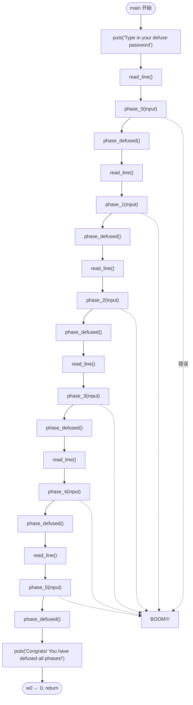

# Lab0：拆炸弹 — ARM 汇编逆向工程

## 1 实验概述

### 1.1 实验背景

本实验受 CSAPP（Computer Systems: A Programmer's Perspective）课程中经典的拆炸弹实验启发。CSAPP 原版实验针对 x86/x86-64 汇编，而本实验将其改造为 **ARM64（AArch64）架构**，旨在：

1. 熟悉 ARM 汇编语言及其指令集
2. 掌握 QEMU 用户态模拟器的使用
3. 熟练运用 GDB 进行跨架构调试
4. 为后续基于 ARM64 的树莓派内核实验做好铺垫

### 1.2 实验目标

提供一个二进制炸弹程序 `bomb` 及其部分源码 `bomb.c`，该程序包含 6 个 phase（phase_0 ~ phase_5）。每个 phase 从标准输入读取一行作为密码，输入错误则炸弹"爆炸"（程序异常退出）。**任务是通过逆向分析，推断出每个 phase 的正确密码**。

### 1.3 评分与提交

- 需在 `student-number.txt` 中填写学号
- 提交 `ans.txt`（包含所有 phase 的密码）和 `student-number.txt`
- 评分命令：`make grade`
- 提交命令：`make submit`

---

## 2 环境与工具链

### 2.1 开发环境

| 组件 | 说明 |
|------|------|
| 操作系统 | Linux（推荐），Docker 环境 |
| 架构模拟 | QEMU + `qemu-aarch64`（用户态模拟） |
| 交叉调试 | `gdb-multiarch` |
| 构建工具 | `make` |

### 2.2 Makefile 目标

| 命令 | 功能 |
|------|------|
| `make bomb` | 根据 `student-number.txt` 生成个性化炸弹 |
| `make qemu` | 使用 QEMU 运行炸弹程序（用户态模拟） |
| `make qemu-gdb` | 启动带 GDB Server 的 QEMU（监听等待连接） |
| `make gdb` | 启动 GDB 客户端连接 QEMU 的 GDB Server |

### 2.3 输入重定向

为避免每次重复输入已破解 phase 的密码，可使用文件重定向：

```bash
make qemu < ans.txt
```

---


## 3 AArch64 汇编基础

### 3.1 寄存器体系

AArch64 是 ARMv8 ISA 的 64 位执行状态，拥有 31 个通用寄存器 x0-x31：

| 寄存器 | 别名 | 用途约定 |
|--------|------|----------|
| `x0-x7` | — | 参数传递、`x0` 作返回值 |
| `x8` | — | 间接结果寄存器 |
| `x9-x15` | — | 临时寄存器（调用者保存） |
| `x16-x17` | — | IP0、IP1（过程内临时） |
| `x18` | — | 平台寄存器 |
| `x19-x28` | — | 被调用者保存 |
| `x29` | `fp` | 栈帧指针 |
| `x30` | `lr` | 链接寄存器（返回地址） |
| `x31` | `sp` | 栈指针 / `xzr` 零寄存器 |

**注意**：`w0-w31` 是对应 `x0-x31` 的 32 位形式。在 ARM64 中，对 `w` 寄存器的操作会将高位清零。

### 3.2 常用指令速查

```
// 数据处理
mov x0, #42       // 加载立即数
add x0, x1, x2    // x0 = x1 + x2
sub x0, x1, #1    // x0 = x1 - 1

// 内存访问
ldr x0, [x1]      // 从 x1 指向的地址加载 8 字节到 x0
str x0, [x1]      // 将 x0 存储到 x1 指向的地址
ldrb w0, [x1]     // 加载 1 字节（零扩展）
stur x0, [x1, #4] // 存储到 x1+4 偏移（非对齐）

// 分支与跳转
b   label         // 无条件跳转
bl  func          // 跳转并链接（存返回地址到 lr）
cbz x0, label     // x0==0 时跳转
cbnz x0, label    // x0≠0 时跳转

// 比较与条件
cmp x0, x1        // 比较，更新 NZCV 标志
b.eq label        // 相等则跳转
b.ne label        // 不等则跳转
b.lt label        // 有符号小于则跳转
b.gt label        // 有符号大于则跳转

// 系统
svc #0            // 触发系统调用（在 EL0 中使用）
```

### 3.3 寻址模式

```asm
// 基址寻址
ldr x0, [x1]           // x1 指向的地址

// 基址 + 偏移
ldr x0, [x1, #8]       // x1 + 8
ldr x0, [x1, x2]       // x1 + x2（寄存器偏移）


// 前变址
ldr x0, [x1, #8]!      // 先 x1+=8，再加载

// 后变址
ldr x0, [x1], #8       // 先加载，再 x1+=8

// 字面量寻址
adrp x0, symbol        // 页地址加载
add  x0, x0, :lo12:symbol  // 页内偏移
```

### 3.4 ARM64 调用约定深度解析

#### 参数传递规则

| 参数数量 | 传递方式 |
|----------|----------|
| 1–8 个 | `x0`–`x7` 依次传递 |
| 超过 8 个 | 从第 9 个参数开始压栈（从右向左入栈） |

```c
// 示例：func(a, b, c, d, e, f, g, h, i, j)
// x0 = a, x1 = b, ..., x7 = h
// 栈上: [sp+0] = i, [sp+8] = j
```

#### 返回值传递

- **基本类型**（≤ 16 字节）：通过 `x0`（或 `x0` + `x1` 返回 __int128）传递
- **大型结构体**：调用者分配空间，将结构体指针通过 `x8`（间接结果寄存器）传递给函数，函数通过 `x8` 写入结果

```asm
// 结构体返回值示例
// struct big { int arr[8]; };
// struct big func(void);
// 编译器自动生成:
// mov x8, sp       // x8 = 存放结果的地址
// bl func          // func 通过 x8 写入结果
// ldr x0, [sp]     // 结果在栈上
```

#### 栈帧布局

AArch64 的栈帧由 `x29`（FP）和 `x30`（LR）构建：

```
高地址
┌──────────────┐  ← 调用者的 SP
│  调用者栈帧   │
├──────────────┤
│ 保存的 LR    │  ← x30（返回地址）
├──────────────┤
│ 保存的 FP    │  ← x29（指向此处）
├──────────────┤  ← 当前 SP（被调用者栈帧底部）
│  局部变量     │
│  寄存器溢出区  │
│  ...         │
└──────────────┘  ← 栈增长方向（低地址）
```

**栈帧建立与销毁**：

```asm
// 函数入口
func:
    stp x29, x30, [sp, #-16]!   // 保存 FP/LR，SP -= 16
    mov x29, sp                  // FP = SP（建立栈帧链）

    // ... 函数体 ...

    // 函数出口
    ldp x29, x30, [sp], #16     // 恢复 FP/LR，SP += 16
    ret                         // 返回，使用 LR 中的地址
```

#### 用 GDB 遍历栈帧

```gdb
(gdb) bt               # 显示完整调用栈
(gdb) frame 0          # 切换到最内层帧
(gdb) info frame       # 显示当前帧详细信息
(gdb) up               # 向上（调用者）移动
(gdb) down             # 向下（被调用者）移动
```

---

## 4 调试技术详解


### 4.1 GDB 核心命令

```bash
# 启动
make qemu-gdb    # 终端 1
make gdb          # 终端 2

# GDB 内常用命令
(gdb) disassemble          # 反汇编当前函数
(gdb) disassemble phase_0  # 反汇编指定函数
(gdb) break *0x400734      # 在指定地址下断点
(gdb) break phase_0        # 在函数入口下断点
(gdb) info registers       # 查看所有寄存器
(gdb) info registers x0    # 查看单个寄存器
(gdb) x/s 0x464778         # 以字符串格式查看内存
(gdb) x/16wx $sp           # 查看栈内存（16 个字）
(gdb) stepi                # 单步执行一条汇编指令
(gdb) continue             # 继续执行
(gdb) delete               # 删除所有断点
```

### 4.2 GDB 调试实战示例

```asm
add symbol table from file "bomb"
(y or n) y
Reading symbols from bomb ...

(gdb) break main
Breakpoint 1 at 0x4006a4

(gdb) continue
Continuing.

Breakpoint 1, 0x00000000004006a4 in main ()

(gdb) disassemble
Dump of assembler code for function main:
   0x0000000000400694 <+0>:     stp    x29, x30, [sp, #-16]!
   0x0000000000400698 <+4>:     mov    x29, sp
   0x000000000040069c <+8>:     adrp   x0, 0x464000 <free_mem+64>
   0x00000000004006a0 <+12>:    add    x0, x0, #0x778
=> 0x00000000004006a4 <+16>:    bl     0x413b20 <puts>
   0x00000000004006a8 <+20>:    bl     0x400b10 <read_line>
   0x00000000004006ac <+24>:    bl     0x400734 <phase_0>
   0x00000000004006b0 <+28>:    bl     0x400708 <phase_defused>
   0x00000000004006b4 <+32>:    bl     0x400b10 <read_line>
   0x00000000004006b8 <+36>:    bl     0x400760 <phase_1>
   ...

(gdb) info registers x0
x0   0x464778   4605816

(gdb) x/s 0x464778
0x464778: "Type in your defuse password!"
```

### 4.3 QEMU 用户态模拟原理

```mermaid
flowchart LR
    subgraph 宿主机 (x86-64)
        QEMU["qemu-aarch64<br/>（二进制翻译）"]
        GDB["gdb-multiarch<br/>（跨架构调试）"]
    end
    subgraph 模拟环境 (AArch64)
        BOMB["bomb (ARM64 二进制)"]
    end
    
    QEMU -- "gdbstub (TCP:1234)" --> GDB
    QEMU -- "翻译 ARM 指令→x86 指令" --> CPU[宿主 CPU]
    BOMB -- "执行" --> QEMU
```

QEMU 有两种模拟模式：
1. **用户态模拟**（`qemu-aarch64`）：仅模拟用户态指令，系统调用翻译为宿主机调用
2. **系统级模拟**（`qemu-system-aarch64`）：模拟完整硬件，可用于运行操作系统内核

本实验使用用户态模拟模式。

### 4.4 GDB 高级调试技巧

#### 条件断点

在特定条件满足时断下，避免重复手动 continue：

```gdb
// 当 x0 == 0 时在 phase_0 断下
(gdb) break phase_0 if x0 == 0

// 当循环变量到达特定值时断下
(gdb) break *0x400760 if x1 == 5
```

#### 自动显示（display）

每次断下时自动显示指定表达式的值，避免反复手动输入：

```gdb
// 每次停下时自动显示 x0-x3 四个寄存器
(gdb) display/4gx x0
(gdb) display/s $x0
(gdb) display/i $pc

// 查看已设置的 display
(gdb) info display

// 删除指定 display
(gdb) delete display 1
```

#### 逆向调试（Reverse Debugging）

QEMU 通过 `reverse-stepi` 和 `reverse-continue` 支持逆向执行，适用于错过关键断点后"倒带"：

```gdb
// 先启用逆向执行记录
(gdb) target remote :1234
(gdb) break phase_4

// 正向执行到断点
(gdb) continue

// 单步向前
(gdb) stepi

// 后悔了，往回退一条指令
(gdb) reverse-stepi

// 逆向继续执行到上一个断点
(gdb) reverse-continue
```

**注意**：逆向调试需要 QEMU 支持反向执行（`-icount shift=auto`），在 `make qemu-gdb` 中已默认启用。

#### 内存查看粒度控制

```gdb
// 以字节为单位查看
(gdb) x/32bx $x0        // 32 个十六进制字节
(gdb) x/32c $x0         // 32 个字符

// 以字（4 字节）为单位
(gdb) x/16wx $x0        // 16 个字（十六进制）
(gdb) x/16wd $x0        // 16 个字（十进制）

// 以双字（8 字节）为单位
(gdb) x/8gx $x0         // 8 个双字（十六进制）
(gdb) x/8gd $x0         // 8 个双字（十进制）

// 查看栈上内容
(gdb) x/16gx $sp        // 从栈顶查看 16 个双字
(gdb) x/4gx $fp - 32   // 查看栈帧中保存的寄存器
```

#### 系统寄存器查看

```gdb
// 查看所有通用寄存器
(gdb) info registers

// 查看系统寄存器
(gdb) info registers CurrentEL
(gdb) info registers SCTLR_EL1
(gdb) info registers TPIDR_EL1

// 查看所有寄存器（含浮点和系统寄存器）
(gdb) info all-registers
```

#### 硬件观察点（Watchpoint）

监控特定内存地址的读写访问，无需插入断点：

```gdb
// 监控地址 0x4647b8 的写入操作
(gdb) watch *0x4647b8

// 监控地址的读取操作
(gdb) rwatch *0x4647b8

// 监控地址的读写操作
(gdb) awatch *0x4647b8

// 查看所有观察点
(gdb) info watchpoints
```

---

## 5 二进制炸弹源码分析

### 5.1 主函数结构解析

从 `main` 函数的反汇编可以看出炸弹程序的整体控制流：



每个 phase 函数接受一个字符串参数（通过 `x0` 寄存器传递），分析该字符串并判断是否正确。每个 `phase_defused()` 调用之间是独立的。

### 5.2 炸弹爆炸机制

每个 phase 函数在验证失败时，会调用类似 `explode_bomb` 的函数：

```asm
0x0000000000400734 <phase_0>:
    ...
    cmp    x0, #0x0
    b.eq   .Lpass
    bl     explode_bomb       ; 验证失败时爆炸
.Lpass:
    ret
```

`explode_bomb` 函数输出 "BOOM!!!" 并以非零状态退出程序。

### 5.3 各个 Phase 的逆向分析策略

| Phase | 典型验证方式 | 分析策略 | 反汇编特征 |
|-------|-------------|----------|-----------|
| phase_0 | 字符串比较（`strcmp`） | 查看 `x0` 比较值，直接读字符串 | `adrp` + `add` 加载地址 → `bl strcmp` → `cmp x0, #0` |
| phase_1 | 数值计算比较 | 单步跟踪计算逻辑，观察比较值 | `add`/`sub`/`mul` 运算 → `cmp x0, #N` → `b.eq`/`b.ne` |
| phase_2 | 循环/数组处理 | 分析循环体，理解对输入的处理 | `str` 保存输入 → 循环头 `b`/`cbz` 判终 → `ldrb` 逐字节处理 |
| phase_3 | 分支/switch 结构 | 跟踪各分支的比较条件 | `cmp x0, #N` → 多条 `b.eq`/`b.gt` 形成跳转表 |
| phase_4 | 递归函数调用 | 分析递归终止条件和递推关系 | `stp x29, x30, [sp, #-16]!` → `bl phase_4` 自调用 → `cmp` 终止 |
| phase_5 | 字符串变换/编码 | 观察字符映射表或编码函数 | `adrp` 加载映射表 → `ldrb` 按索引查表 → `strb` 写入结果 |

#### Phase 分析实战技巧

**Phase_0：直接字符串比较**

反汇编特征：函数体内部 `adrp` + `add` 加载一个地址到 `x1`，然后调用 `strcmp`。这是最简单的 phase，查看 `x1` 指向的内容即可。

```asm
// 典型 phase_0 反汇编
adrp x0, 0x464000       // 加载页地址
add  x1, x0, #0x7b8     // x1 = 0x4647b8（密码字符串地址）
ldr  x0, [sp, #24]      // x0 = 用户输入
bl   strcmp              // strcmp(input, password)
cmp  x0, #0              // 比较结果是否为 0
b.eq .Lpass              // 相等则通过
bl   explode_bomb        // 否则爆炸
```

**Phase_1：数值计算比较**

反汇编中会出现多条算术指令。在 GDB 中单步执行，观察各指令对寄存器的修改，最终在 `cmp` 指令处查看比较的常数值。

```asm
// 典型 phase_1 反汇编
ldr  w0, [sp, #12]      // 加载输入值（可能是数字字符串转换后的结果）
add  w0, w0, #5         // 加 5
mul  w0, w0, w0         // 平方
sub  w1, w0, #7         // 减 7
// 或者更复杂的组合...
cmp  w0, #0x1a          // 最终与 0x1a（即 26）比较
b.eq .Lpass
```

**Phase_4：递归函数分析**

递归函数的关键是找到**递归终止条件**（base case）和**递推关系**（recurrence relation）：

```asm
// 典型 phase_4 反汇编结构
phase_4:
    stp  x29, x30, [sp, #-16]!  // 保存 FP/LR（递归函数标志）
    mov  x29, sp
    sub  sp, sp, #32              // 分配局部变量空间

    // 将用户输入转换为整数 n
    bl   atoi

    // **递归终止条件**
    cmp  w0, #1                  // if n <= 1
    b.le .Lbase                  // 跳转到 base case

    // **递推关系**
    sub  w0, w0, #1              // n - 1
    bl   phase_4                 // 递归调用 phase_4(n-1)

    // 对递归结果进行运算
    lsl  w0, w0, #1              // 2 * phase_4(n-1)
    add  w0, w0, #3              // 2 * phase_4(n-1) + 3

    // 恢复栈、返回
    add  sp, sp, #32
    ldp  x29, x30, [sp], #16
    ret

.Lbase:
    mov  w0, #0                  // base: return 0
    add  sp, sp, #32
    ldp  x29, x30, [sp], #16
    ret
```

分析步骤：
1. 找到 `bl phase_4` 自调用指令，确认是递归
2. 找到递归调用前的 `cmp` 和 `b.le`，确定递归终止条件（n ≤ 1）
3. 分析递归调用前后的算术指令，确定递推关系
4. 代入输入值手工计算预期结果

**Phase_5：字符串变换**

查找字符映射表的典型模式：`adrp` 加载表基址，`ldrb` 以输入字符为索引查表：

```asm
// 典型 phase_5 反汇编
adrp x2, 0x464000       // 映射表基址
add  x2, x2, #0x860     // x2 = 映射表地址

// 循环处理每个输入字符
.Lloop:
    ldrb w1, [x0], #1   // 读取一个输入字符
    cbz  w1, .Ldone     // 字符串结束？
    ldrb w1, [x2, x1]   // w1 = mapping_table[input_char]
    strb w1, [x3], #1   // 存储转换后的字符
    b    .Lloop
```

用 GDB 查看映射表内容：
```gdb
(gdb) x/64bx 0x464860   # 查看映射表前 64 字节
(gdb) x/s $x2           # 如果映射表是字符串
```

---

## 6 ELF 文件格式基础

### 6.1 什么是 ELF

ELF（Executable and Linkable Format）是 Linux 系统中可执行文件、目标文件（.o）和共享库（.so）的标准格式。ChCore 实验中的 `bomb` 文件和内核映像 `kernel8.img` 均使用 ELF 格式。

### 6.2 ELF 文件结构

```
┌─────────────────────┐
│     ELF Header      │ ← 文件头，描述文件类型、架构、入口点
├─────────────────────┤
│   Program Headers   │ ← 段头部表，描述加载到内存的段（仅可执行文件）
│   (for loader)      │
├─────────────────────┤
│  .text (代码段)      │ ← 可执行的机器指令
├─────────────────────┤
│  .rodata (只读数据)   │ ← 字符串常量、switch 跳转表等
├─────────────────────┤
│  .data (数据段)      │ ← 已初始化的全局变量
├─────────────────────┤
│  .bss (未初始化数据)  │ ← 未初始化的全局变量（在文件中不占空间）
├─────────────────────┤
│   Section Headers   │ ← 节头部表，用于链接和调试
│   (for linker)      │
└─────────────────────┘
```

### 6.3 ELF Header

ELF 头部位于文件最开头，包含：

```bash
# 查看 ELF 头部
aarch64-linux-gnu-readelf -h bomb
```

输出示例：
```
ELF Header:
  Magic:   7f 45 4c 46 02 01 01 00 00 00 00 00 00 00 00 00
  Class:                             ELF64
  Data:                              2's complement, little endian
  Entry point address:               0x400694
  Start of program headers:          64 (bytes into file)
  Start of section headers:          289200 (bytes into file)
  Number of program headers:         9
  Number of section headers:         31
```

**Magic Number** `7f 45 4c 46` 即 ASCII 码中的 `\x7fELF`，所有 ELF 文件的开头标志。

**Entry point** `0x400694` 是程序执行的起始地址（即 `main` 函数之前的启动代码入口）。

### 6.4 Program Headers（段头部）

定义操作系统加载器如何将 ELF 文件映射到内存：

```bash
# 查看程序头
aarch64-linux-gnu-readelf -l bomb

# 输出示例
Elf file type is EXEC (Executable file)
Entry point 0x400694
There are 9 program headers, starting at offset 64

Program Headers:
  Type           Offset             VirtAddr           PhysAddr
                 FileSiz            MemSiz              Flags  Align
  LOAD           0x0000000000000000 0x0000000000400000 0x0000000000400000
                 0x0000000000011638 0x0000000000011638  R E    0x10000
  LOAD           0x0000000000011638 0x0000000000411638 0x0000000000411638
                 0x00000000000030b0 0x0000000000010160  RW     0x10000
```

- **PT_LOAD**：可加载段，加载器将其从文件复制到内存
- 第一个 LOAD 段（R E）：代码 + 只读数据，映射到 `0x400000`
- 第二个 LOAD 段（RW）：数据 + BSS，映射到 `0x411638`
- `FileSiz`：文件中的大小；`MemSiz`：内存中的大小（BSS 部分 MemSiz > FileSiz）

### 6.5 静态字符串提取

使用 `objdump` 可以查看 ELF 文件中各节的内容：

```bash
# 查看 .rodata 节（包含字符串常量）
aarch64-linux-gnu-objdump -s -j .rodata bomb

# 输出示例（部分）
# 464000 48656c6c 6f2c2077 6f726c64 21000000  Hello, world!...
# 464010 70617373 776f7264 5f300000 ...        password_0...
```

```bash
# 查看符号表（函数名、全局变量地址）
aarch64-linux-gnu-nm bomb

# 过滤只显示函数名
aarch64-linux-gnu-nm bomb | grep ' T '
```

### 6.6 反汇编利器

```bash
# 反汇编整个文件
aarch64-linux-gnu-objdump -d bomb

# 反汇编特定函数
aarch64-linux-gnu-objdump -d bomb | grep -A 30 '<phase_0>'

# 混合显示源码 + 汇编（如果编译时加 -g）
aarch64-linux-gnu-objdump -S bomb
```

---

## 7 实验步骤详解

### 7.1 步骤一：生成并运行炸弹

```bash
# 1. 填写学号
echo "12345678" > student-number.txt

# 2. 生成个性化炸弹（基于学号）
make bomb

# 3. 直接运行（观察输出）
make qemu
# 输出: Type in your defuse password:
```

### 7.2 步骤二：GDB 启动与断点设置

打开两个终端：

```bash
# 终端 1：启动带调试的 QEMU
make qemu-gdb

# 终端 2：启动 GDB 连接
make gdb
```

在 GDB 中设置断点并观察：

```bash
(gdb) add symbol table from file "bomb"
(y or n) y
Reading symbols from bomb...

# 在每个 phase 入口设置断点
(gdb) break phase_0
(gdb) break phase_1
(gdb) break phase_2
(gdb) break phase_3
(gdb) break phase_4
(gdb) break phase_5

(gdb) continue
```

### 7.3 步骤三：逐个破解 Phase

#### Phase 0 破解示例

```asm
(gdb) disassemble phase_0
Dump of assembler code for function phase_0:
   0x0000000000400734 <+0>:     sub    sp, sp, #0x20
   0x0000000000400738 <+4>:     str    x0, [sp, #24]       ; 保存输入字符串
   0x000000000040073c <+8>:     adrp   x0, 0x464000
   0x0000000000400740 <+12>:    add    x1, x0, #0x7b8      ; x1 = "expected_password"
   0x0000000000400744 <+16>:    ldr    x0, [sp, #24]
   0x0000000000400748 <+20>:    bl     strcmp               ; 比较输入和预期
   0x000000000040074c <+24>:    cmp    x0, #0x0
   0x0000000000400750 <+28>:    b.eq   0x40075c             ; 相等则通过
   0x0000000000400754 <+32>:    bl     explode_bomb
   0x0000000000400758 <+36]:    b      0x400760
   0x000000000040075c <+40>:    nop
   0x0000000000400760 <+44>:    add    sp, sp, #0x20
   0x0000000000400764 <+48>:    ret

# 查看比较的字符串
(gdb) x/s 0x464000+0x7b8
0x4647b8: "password_0"
```

#### 一般破解流程

```
1. disassemble phase_N
2. 分析汇编逻辑，确定验证方式
3. 若为字符串比较：
   - 在 strcmp 调用处设断点
   - 查看 x1（第二个参数）指向的字符串
4. 若为数值计算：
   - 单步执行，观察各指令对寄存器的修改
   - 在比较指令（cmp/b.eq）前断点
   - 查看比较的值
5. 若为循环：
   - 分析循环终止条件
   - 观察每次迭代对输入的处理
6. 记录密码到 ans.txt
```

### 7.4 步骤四：验证破解结果

```bash
# 将所有密码按行写入 ans.txt
echo "password_0" > ans.txt
echo "1234" >> ans.txt
echo "secret3" >> ans.txt
echo "pass4" >> ans.txt
echo "hello5" >> ans.txt
echo "final6" >> ans.txt

# 运行验证
make qemu < ans.txt

# 预期输出：
# Type in your defuse password:
# 5 phases to go
# 4 phases to go
# 3 phases to go
# 2 phases to go
# 1 phases to go
# 0 phases to go
# Congrats! You have defused all phases!

# 评分
make grade
```

---

## 8 常用逆向技巧

### 8.1 字符串定位

```bash
# 使用 objdump 静态查看字符串表
aarch64-linux-gnu-objdump -s -j .rodata bomb

# 或动态在 GDB 中搜索
(gdb) info proc mappings
(gdb) find /b 0x400000, 0x470000, 'p', 'a', 's', 's'
```

### 8.2 跟踪函数调用

```bash
# 设置回溯追踪
(gdb) set backtrace limit 10
(gdb) bt  # 查看调用栈
```

### 8.3 观察内存变化

```bash
# 以不同格式查看内存
(gdb) x/32bx $x0    # 32 个十六进制字节
(gdb) x/8wd $x0     # 8 个字（十进制）
(gdb) x/s $x0       # 以 C 字符串形式
```

---

## 9 文件清单与提交

### 9.1 提交文件

| 文件 | 说明 |
|------|------|
| `student-number.txt` | 学号 |
| `ans.txt` | 每行一个 phase 的密码 |

### 9.2 目录结构

```
Lab0/
├── bomb            # 生成的可执行炸弹
├── bomb.c          # 源码（不含密码）
├── ans.txt         # 破解密码文件
├── student-number.txt  # 学号
├── Makefile        # 构建配置
└── README          # 实验说明
```

---

## 10 常见问题

**Q: QEMU 启动后无反应？**
A: 确保已先运行 `make bomb` 生成炸弹程序。

**Q: GDB 无法连接？**
A: 确保先启动 `make qemu-gdb`，再启动 `make gdb`，顺序不可颠倒。

**Q: 使用重定向后密码不匹配？**
A: 检查 `ans.txt` 中每行末尾是否有意外的空格或换行。

---

## 参考资源

- [ARM Architecture Reference Manual](https://documentation-service.arm.com/static/61fbe8f4fa8173727a1b734e) — ARMv8-A 体系结构参考手册
- [ARM64 指令集快速参考](https://courses.cs.washington.edu/courses/cse469/19wi/arm64.pdf)
- [AArch64 寄存器与指令集](https://developer.arm.com/architectures/instruction-sets/intrinsics)
- QEMU 用户态模拟文档：`man qemu-aarch64`
