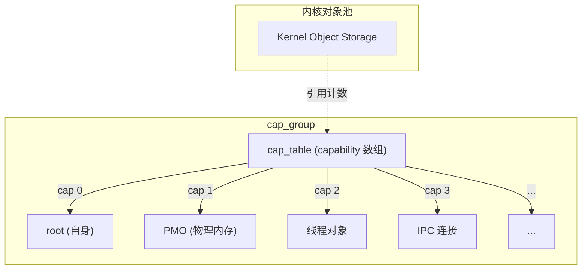
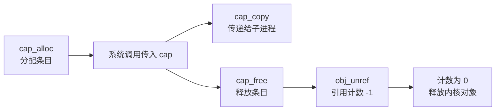
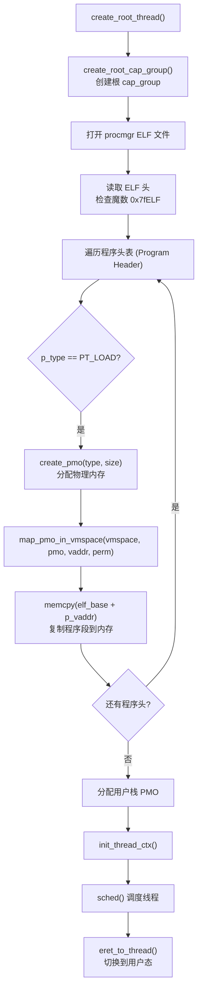
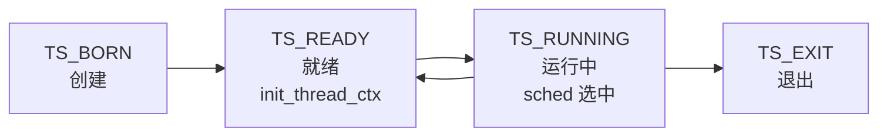
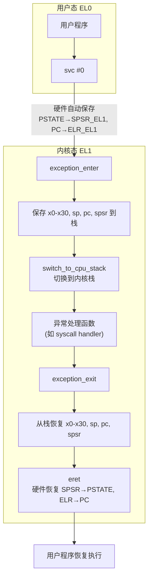
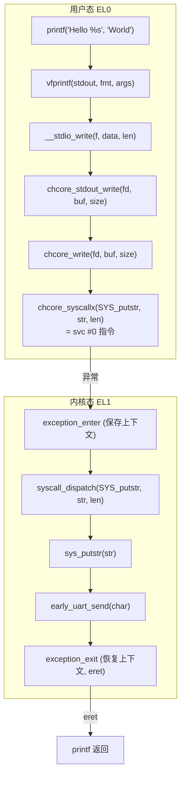

# Lab3：进程与线程管理 — Capability、异常处理与系统调用

## 1 实验概述

### 1.1 实验目标

本实验在 Lab1（内核启动）和 Lab2（内存管理）的基础上，支持用户态程序的运行：

1. **Capability 机制与进程创建**：基于 Capability 的权限模型，创建第一个用户态进程 `procmgr`
2. **线程管理与 ELF 加载**：加载用户程序 ELF 镜像，创建线程，完成内核态到用户态的切换
3. **异常处理**：配置异常向量表，处理用户态触发的中断和异常
4. **系统调用**：实现 `svc` 异常处理，支持 `printf` 等系统调用
5. **用户态程序编写**：编写并运行用户态 Hello-World 程序

### 1.2 工具链准备

从 Lab3 开始需要下载用户态 libc：

```bash
git submodule update --init --recursive
```

---

## 第一部分：Capability 机制与进程创建

## 2 Capability 权限模型

### 2.1 核心概念

ChCore 微内核使用 **Capability（权能）** 机制管理资源访问权限，而不是传统 Unix 的 UID/GID。



每个进程是一个 `cap_group`，拥有一个 capability 表（`cap_table`）。每个 capability 条目指向一个内核对象，并由 cap 条目中的权限掩码控制对该对象的访问方式。


### 2.2 cap_group 数据结构

```c
/* 文件: kernel/include/object/cap_group.h */
struct cap_group {
    struct list_head node;
    u64 cap_group_id;               // 进程 ID
    struct slot_table slot_table;   // capability 槽位表
    struct vmspace *vmspace;        // 地址空间
    struct list_head thread_list;   // 归属的线程列表
    struct sched_context *sched_ctx; // 调度上下文
};

### 2.3 Capability 深度解析

#### slot_table 槽位表结构

每个 cap_group 内部通过 `slot_table` 管理所有 capability 条目：

```c
/* 文件: kernel/include/object/slot.h */
struct slot_table {
    struct cap_group *cap_group;    // 所属 cap_group
    struct lock slots_lock;         // 并发保护锁
    struct capability *slots;       // capability 数组
    unsigned int slots_size;        // 槽位总数
};
```

每个 capability 条目包含指向内核对象的指针、类型和权限掩码：

```c
struct capability {
    u64 cap_cptr;     // 内核对象指针
    u32 cap_type;     // 对象类型（TYPE_CAP_GROUP / TYPE_THREAD / TYPE_PMO）
    u32 cap_perm;     // 权限掩码
};
```

#### cap_alloc / cap_free / cap_copy

```c
cap_t cap_alloc(struct cap_group *cap_group, void *obj)
{
    for (int i = 0; i < cap_group->slot_table.slots_size; i++) {
        if (slot_is_free(&cap_group->slot_table.slots[i])) {
            cap_group->slot_table.slots[i].cap_cptr = obj;
            cap_group->slot_table.slots[i].cap_type = get_obj_type(obj);
            cap_group->slot_table.slots[i].cap_perm = CAP_PERM_ALL;
            obj_ref(obj);
            return i;    // 返回 cap 编号
        }
    }
    return -ENOMEM;
}


void cap_free(struct cap_group *cap_group, cap_t cap)
{
    struct capability *slot = &cap_group->slot_table.slots[cap];
    void *obj = slot->cap_cptr;
    memset(slot, 0, sizeof(*slot));
    obj_unref(obj);      // 引用计数减 1，为 0 时释放对象
}

cap_t cap_copy(struct cap_group *src_group, cap_t src_cap,
                struct cap_group *dest_group)
{
    struct capability *src = &src_group->slot_table.slots[src_cap];
    return cap_alloc(dest_group, src->cap_cptr);
}
```

#### obj_get：从 cap 到内核对象

```c
static void *obj_get(struct cap_group *cap_group, cap_t cap)
{
    if (cap >= cap_group->slot_table.slots_size)
        return NULL;
    struct capability *slot = &cap_group->slot_table.slots[cap];
    return slot_is_free(slot) ? NULL : slot->cap_cptr;
}
```

#### Capability 的不可伪造性

| 特性 | Unix UID/GID | ChCore Capability |
|------|--------------|-------------------|
| 权限载体 | 进程身份（UID） | 指向对象的 cap 条目 |
| 提权方式 | setuid | 仅通过内核接口传递 cap |
| 细粒度 | 基于用户/组 | 每个对象独立权限 |
| 不可伪造性 | UID 可由用户态构造 | cap 在内核表中，用户无法伪造 |
| 传递方式 | fork 继承 | cap_copy / cap_send |

用户态程序无法直接构造 cap 编号来访问内核对象。每次系统调用进入内核后，内核通过 `obj_get` 在当前进程的 `slot_table` 中查找，不存在或类型不匹配则拒绝访问——这是微内核安全的基石。

#### Capability 生命周期



### 2.4 系统调用创建进程（练习 1）

```c
/* 创建新 cap_group 的系统调用 */
int sys_create_cap_group(struct cap_group *parent_cap_group,
                         cap_t parent_cap,
                         struct cap_group_args *args)
{
    // 1. 分配 cap_group 内核对象
    struct cap_group *new_group = obj_alloc(TYPE_CAP_GROUP, sizeof(*new_group));

    // 2. 初始化地址空间
    new_group->vmspace = create_vmspace();

    // 3. 初始化 capability 槽位表
    init_slot_table(&new_group->slot_table);

    // 4. 在父进程中为新 cap_group 创建 capability 条目
    cap_t new_cap = cap_alloc(parent_cap_group, new_group);

    // 5. 复制继承的 capability（可选）
    copy_capability(parent_cap_group, new_group, args->inherit_caps);

    return new_cap;
}
```

### 2.5 创建根进程（练习 1）

```c
/* 创建第一个根 cap_group */
struct cap_group *create_root_cap_group(void)
{
    // 1. 分配根 cap_group
    struct cap_group *root = obj_alloc(TYPE_CAP_GROUP, sizeof(*root));

    // 2. 初始化
    root->cap_group_id = 0;  // root 的 ID 为 0
    root->vmspace = create_vmspace();
    init_slot_table(&root->slot_table);

    // 3. 自身引用（cap 0 通常指向自身）
    cap_alloc(root, root);

    return root;
}
```

---

## 3 ELF 加载

### 3.1 用户程序加载流程



### 3.2 ELF 程序头解析（练习 2）

```c
/* 文件: kernel/object/thread.c */
int create_root_thread(void)
{
    struct cap_group *root = create_root_cap_group();

    // 获取 ELF 起始地址
    char *elf_start = get_root_elf_addr();
    struct elf_header *eh = (struct elf_header *)elf_start;

    // 遍历程序头
    struct elf_program_header *ph = (struct elf_program_header *)
        (elf_start + eh->e_phoff);

    for (int i = 0; i < eh->e_phnum; i++, ph++) {
        if (ph->p_type != PT_LOAD)
            continue;

        // 为程序段分配物理内存 (PMO)
        struct pmobject *pmo = create_pmo(PMO_DATA,
            ALIGN_UP(ph->p_memsz, PAGE_SIZE));

        // 映射到进程地址空间
        map_pmo_in_vmspace(root->vmspace, pmo,
            ph->p_vaddr,   // 目标虚拟地址
            get_perm_from_ph(ph));  // 权限

        // 复制程序段数据
        memcpy((void *)ph->p_vaddr,
               elf_start + ph->p_offset,
               ph->p_filesz);

        // 清零 .bss 部分
        if (ph->p_memsz > ph->p_filesz) {
            memset((void *)(ph->p_vaddr + ph->p_filesz),
                   0, ph->p_memsz - ph->p_filesz);
        }
    }

    // ... 创建线程上下文
}
```


### 3.3 create_root_thread 完整流程

在 `create_root_thread()` 中完成根线程创建的全部步骤。

#### 1. 创建根 cap_group

```c
struct cap_group *root = create_root_cap_group();
```

`create_root_cap_group()` 分配根 cap_group，ID 为 0，初始化地址空间和 slot_table，并在 cap 0 存放自身引用。

#### 2. 获取 ELF 镜像地址

```c
char *elf_start = get_root_elf_addr();
```

procmgr 的 ELF 文件在编译时被链接到内核镜像中，`get_root_elf_addr()` 返回其起始地址。

#### 3. 解析 ELF 头

```c
struct elf_header *eh = (struct elf_header *)elf_start;
```

ELF 头结构：

```c
struct elf_header {
    u8  e_ident[16];    // 魔数 0x7f + 'E' 'L' 'F'
    u16 e_type;          // 目标文件类型 (ET_EXEC = 2)
    u16 e_machine;       // 体系结构 (AArch64 = 0xb7)
    u32 e_version;       // 版本
    u64 e_entry;         // 程序入口点
    u64 e_phoff;         // 程序头表偏移（相对文件起始）
    u64 e_shoff;         // 节头表偏移
    u32 e_flags;         // 标志位
    u16 e_ehsize;        // ELF 头大小（64 字节）
    u16 e_phentsize;     // 每个程序头表项大小（56 字节）
    u16 e_phnum;         // 程序头表项数量
    u16 e_shentsize;     // 每个节头表项大小
    u16 e_shnum;         // 节头表项数量
    u16 e_shstrndx;      // 字符串表索引
};
```

#### 4. 遍历程序头表

```c
struct elf_program_header *ph = (struct elf_program_header *)
    (elf_start + eh->e_phoff);
```

程序头结构：

```c
struct elf_program_header {
    u32 p_type;    // 段类型 (PT_LOAD = 1)
    u32 p_flags;   // 段权限 (PF_R/PF_W/PF_X)
    u64 p_offset;  // 段在文件中的偏移
    u64 p_vaddr;   // 段在内存中的虚拟地址
    u64 p_paddr;   // 段在内存中的物理地址
    u64 p_filesz;  // 段在文件中的大小
    u64 p_memsz;   // 段在内存中的大小
    u64 p_align;   // 对齐要求
};
```

对每个 `p_type == PT_LOAD` 的程序头依次执行加载。

#### 5. 分配 PMO 并映射到地址空间

```c
struct pmobject *pmo = create_pmo(PMO_DATA,
    ALIGN_UP(ph->p_memsz, PAGE_SIZE));
map_pmo_in_vmspace(root->vmspace, pmo,
    ph->p_vaddr,
    get_perm_from_ph(ph));
```

`get_perm_from_ph(ph)` 从 ELF 程序头的 `p_flags` 提取内存权限：可写段映射为 `VM_READ | VM_WRITE`，可执行段映射为 `VM_READ | VM_EXEC`。

#### 6. 复制段数据并清零 BSS

```c
memcpy((void *)ph->p_vaddr,
       elf_start + ph->p_offset,
       ph->p_filesz);

if (ph->p_memsz > ph->p_filesz) {
    memset((void *)(ph->p_vaddr + ph->p_filesz),
           0, ph->p_memsz - ph->p_filesz);
}
```

对于 `.bss` 段，`p_filesz = 0` 但 `p_memsz > 0`，内核需手动将 `p_memsz` 区域清零。

#### 7. 分配用户栈

```c
struct pmobject *stack_pmo = create_pmo(PMO_DATA, STACK_SIZE);
map_pmo_in_vmspace(root->vmspace, stack_pmo,
                   USER_STACK_ADDR, VM_READ | VM_WRITE);
```

#### 8. 初始化线程上下文

```c
struct thread_ctx_args args = {
    .entry = eh->e_entry,
    .stack_base = USER_STACK_ADDR,
    .stack_size = STACK_SIZE,
};
init_thread_ctx(&thread, &args);
```

#### 9. 调度并切换到用户态

```c
sched();                   // 将线程加入调度队列
eret_to_thread(switch_context());  // 切换上下文，eret 进入用户态
```

`sched()` 将线程状态设为 `TS_READY` 并加入调度队列。`switch_context()` 选择下一个线程，切换地址空间和寄存器。`__eret_to_thread()` 通过 `exception_exit` + `eret` 返回 EL0 用户态。


### 3.4 线程上下文初始化（练习 3）

```c
/* 文件: kernel/arch/aarch64/sched/context.c */
void init_thread_ctx(struct thread *thread, struct thread_ctx_args *args)
{
    struct thread_ctx *ctx = thread->thread_ctx;

    // 清零上下文
    memset(ctx, 0, sizeof(*ctx));

    // 设置入口地址（ELF 的 entry point）
    ctx->pc = args->entry;

    // 设置栈指针
    ctx->sp = args->stack_base + args->stack_size;

    // 设置异常返回时的 PSTATE
    // 目标异常级别: EL0（用户态）
    // 屏蔽 DAIF 中断
    ctx->spsr = SPSR_EL0 | SPSR_DAIF_MASK;

    // 设置 FPU 状态为默认
    ctx->fpu_state = FPU_STATE_INACTIVE;

    // 让线程处于就绪状态
    thread->state = TS_READY;
}
```

### 3.5 线程上下文深入分析

#### thread_ctx 结构

```c
/* 文件: kernel/include/arch/aarch64/sched/context.h */
struct thread_ctx {
    u64 regs[30];    // x0–x29
    u64 lr;          // x30
    u64 sp;          // SP_EL0（用户栈指针）
    u64 pc;          // ELR_EL1（返回地址）
    u64 spsr;        // SPSR_EL1（PSTATE 保存值）
    u64 fpu_state;   // FPU 状态
};
```

| 字段 | 初始值（init_thread_ctx） | 用途 |
|------|--------------------------|------|
| `pc` | `args->entry`（ELF entry point） | `eret` 后 CPU 从此处开始执行 |
| `sp` | `args->stack_base + args->stack_size` | 用户栈指针（SP_EL0） |
| `spsr` | `SPSR_EL0 \| SPSR_DAIF_MASK` | 返回 EL0 并屏蔽 DAIF 中断 |
| `fpu_state` | `FPU_STATE_INACTIVE` | 标记 FPU 未使用 |

#### TS_READY 状态转换

`init_thread_ctx` 将 `thread->state` 设为 `TS_READY` 后，线程加入调度队列：




#### thread_ctx 与 __eret_to_thread 的连接

`thread` 结构体中包含指向 `thread_ctx` 的指针：

```c
struct thread {
    struct thread_ctx *thread_ctx;  // 线程上下文指针
    unsigned int state;             // 线程状态
    struct cap_group *cap_group;    // 所属进程
    struct vmspace *vmspace;        // 地址空间
    u64 tls;                        // 线程局部存储
};
```

`__eret_to_thread` 的入口参数 `x0` 就是 `target_thread->thread_ctx`。由于 `thread_ctx` 的内存布局与 `exception_enter` 的栈帧布局一致，`exception_exit` 可以直接从 `thread_ctx` 加载全部寄存器并执行 `eret`，跳转到用户程序入口。

#### switch_context 的调度选择

```c
struct thread *switch_context(void)
{
    struct thread *next = pick_next_thread();

    if (next == current_thread)
        return next;

    switch_vmspace_to(next->vmspace);    // 切换地址空间
    write_tpidr_el1(next->tls);          // 切换 TLS
    if (next->thread_ctx->fpu_state == FPU_STATE_ACTIVE)
        switch_fpu_context(next);        // 切换 FPU

    return next;
}
```

`switch_context` 返回后，`eret_to_thread` 调用 `__eret_to_thread(next->thread_ctx)` 完成最终的用户态切换。

---

## 第二部分：异常管理


## 4 异常向量表

### 4.1 AArch64 异常向量表结构

异常向量表（Vector Table）以 2KB（`0x800` 字节）对齐，包含 4 组 × 4 类 = 16 个条目：

| 偏移 | 异常类型 | 触发场景 |
|------|----------|----------|
| `+0x000` | EL1t Sync | EL1 同步异常（数据中止、指令中止） |
| `+0x080` | EL1t IRQ | EL1 IRQ 中断 |
| `+0x100` | EL1t FIQ | EL1 FIQ 中断 |
| `+0x180` | EL1t SError | EL1 系统错误 |
| `+0x200` | EL1h Sync | EL1 使用 SP_EL1 时的同步异常 |
| `+0x280` | EL1h IRQ | |
| `+0x300` | EL1h FIQ | |
| `+0x380` | EL1h SError | |
| **`+0x400`** | **EL0 Sync (64-bit)** | **用户态系统调用 `svc`（本实验核心）** |
| `+0x480` | EL0 IRQ (64-bit) | 用户态 IRQ |
| `+0x500` | EL0 FIQ (64-bit) | 用户态 FIQ |
| `+0x580` | EL0 SError (64-bit) | 用户态系统错误 |
| `+0x600` | EL0 Sync (32-bit) | AArch32 兼容模式 |
| ... | ... | |

### 4.2 配置异常向量表（练习 4-5）

```asm
/* 文件: kernel/arch/aarch64/irq/irq_entry.S */

/* 设置异常向量表基址 */
BEGIN_FUNC(setup_exception_vector)
    adr x0, exception_vector_table  // 加载向量表地址
    msr vbar_el1, x0                // 写入 VBAR_EL1
    isb
    ret
END_FUNC(setup_exception_vector)

/* 异常向量表 */
.align 11  // 2KB 对齐
exception_vector_table:
    /* EL1t 异常 */
    .align 7; b el1t_sync           // +0x000
    .align 7; b el1t_irq            // +0x080
    .align 7; b el1t_fiq            // +0x100
    .align 7; b el1t_serror         // +0x180

    /* EL1h 异常 */
    .align 7; b el1h_sync           // +0x200
    .align 7; b el1h_irq            // +0x280
    .align 7; b el1h_fiq            // +0x300
    .align 7; b el1h_serror         // +0x380

    /* EL0 64-bit 异常（关键！） */
    .align 7; b el0_sync            // +0x400  ← svc 指令进入这里
    .align 7; b el0_irq             // +0x480
    .align 7; b el0_fiq             // +0x500
    .align 7; b el0_serror          // +0x580

    /* EL0 32-bit 异常 */
    .align 7; b el0_sync_32         // +0x600
    ...
```

### 4.3 异常处理深入分析

#### VBAR_EL1 寄存器

ARMv8-A 使用 `VBAR_EL1` 存储异常向量表基址，要求 2KB 对齐（低 11 位为 0），因为每个条目占 128 字节、共 16 个条目：

```asm
adr x0, exception_vector_table
msr vbar_el1, x0
isb    /* 指令同步屏障 */
```

#### 4 组 × 4 类的 16 条目布局

ARMv8 按两个维度划分异常：

| 组 | 说明 |
|----|------|
| **EL1t** | 异常在 EL1 触发，使用 SP_EL0（临时栈指针） |
| **EL1h** | 异常在 EL1 触发，使用 SP_EL1（当前异常级专用栈指针） |
| **EL0 64-bit** | 异常来自 64 位用户态 EL0 |
| **EL0 32-bit** | 异常来自 32 位兼容模式的用户态 EL0 |

EL1t vs EL1h 的本质区别在于使用哪个栈指针：

| 模式 | 使用的 SP | 典型场景 |
|------|-----------|----------|
| EL1t | SP_EL0 | 异常触发前内核正在用 SP_EL0 作栈（一般不使用） |
| EL1h | SP_EL1 | 异常触发前内核正在用 SP_EL1（ChCore 的默认路径） |

ChCore 在 `init_c` 中执行 `msr spsel, #1` 选择 SP_EL1，因此内核态自身的异常走 EL1h 路径，EL1t 条目仅作占位。

每组内部又分为 4 类异常：

| 类别 | 触发场景 |
|------|----------|
| **Sync** | 同步异常：指令直接触发（page fault、`svc`、`brk` 等） |
| **IRQ** | 普通中断（外设中断） |
| **FIQ** | 快速中断 |
| **SError** | 系统错误（总线错误、ECC 错误等） |

#### EL0 Sync (+0x400) 处理流程

用户态执行 `svc #0` 时，硬件自动完成：

1. PSTATE → **SPSR_EL1**
2. 返回地址（`svc` 的下一条指令）→ **ELR_EL1**
3. 根据异常类型跳转到向量表对应条目
4. 异常级别切换到 EL1

`svc #0` 是同步异常、来源 EL0（64-bit），跳转到 `+0x400` 的 `el0_sync`：

```asm
el0_sync:
    exception_enter                     /* 保存上下文 */
    mrs x8, esr_el1                     /* 读取异常原因 */
    lsr x24, x8, #ESR_EL1_EC_SHIFT     /* 提取异常类编码 */
    cmp x24, #ESR_EL1_EC_SVC64         /* 是否为 SVC (0x15) */
    b.eq handle_syscall                 /* 是 → 系统调用分发 */
```

#### ESR_EL1 异常类编码

| EC 值 | 异常类 | 说明 |
|-------|--------|------|
| `0x15` (21) | SVC (AArch64) | **系统调用**（本实验核心） |
| `0x20` | Instruction Abort | 指令取指异常（缺页） |
| `0x24` | Data Abort | 数据访问异常（缺页、权限错误） |
| `0x11` | SVC (AArch32) | 32 位兼容模式的系统调用 |

---

## 第三部分：系统调用


## 5 异常进入与退出

### 5.1 上下文保存与恢复（练习 6）



### 5.2 `exception_enter` 实现

```asm
/* 文件: kernel/arch/aarch64/irq/irq_entry.S */
.macro exception_enter

    /* 分配上下文存储空间 */
    sub sp, sp, #ARCH_EXEC_CONT_SIZE

    /* 保存通用寄存器 x0-x29 */
    stp x0, x1, [sp, #16 * 0]
    stp x2, x3, [sp, #16 * 1]
    stp x4, x5, [sp, #16 * 2]
    stp x6, x7, [sp, #16 * 3]
    stp x8, x9, [sp, #16 * 4]
    stp x10, x11, [sp, #16 * 5]
    stp x12, x13, [sp, #16 * 6]
    stp x14, x15, [sp, #16 * 7]
    stp x16, x17, [sp, #16 * 8]
    stp x18, x19, [sp, #16 * 9]
    stp x20, x21, [sp, #16 * 10]
    stp x22, x23, [sp, #16 * 11]
    stp x24, x25, [sp, #16 * 12]
    stp x26, x27, [sp, #16 * 13]
    stp x28, x29, [sp, #16 * 14]

    /* 保存 lr 和 SP_EL0 */
    mrs x8, sp_el0          // 用户栈指针
    stp x30, x8, [sp, #16 * 15]

    /* 保存 ELR_EL1 (返回地址) 和 SPSR_EL1 */
    mrs x8, elr_el1
    mrs x9, spsr_el1
    stp x8, x9, [sp, #16 * 16]

.endm
```

### 5.3 `exception_exit` 实现

```asm
.macro exception_exit

    /* 恢复 ELR_EL1 和 SPSR_EL1 */
    ldp x8, x9, [sp, #16 * 16]
    msr elr_el1, x8
    msr spsr_el1, x9

    /* 恢复 lr 和 SP_EL0 */
    ldp x30, x8, [sp, #16 * 15]
    msr sp_el0, x8

    /* 恢复通用寄存器 x28-x0 */
    ldp x28, x29, [sp, #16 * 14]
    ldp x26, x27, [sp, #16 * 13]
    ldp x24, x25, [sp, #16 * 12]
    ldp x22, x23, [sp, #16 * 11]
    ldp x20, x21, [sp, #16 * 10]
    ldp x18, x19, [sp, #16 * 9]
    ldp x16, x17, [sp, #16 * 8]
    ldp x14, x15, [sp, #16 * 7]
    ldp x12, x13, [sp, #16 * 6]
    ldp x10, x11, [sp, #16 * 5]
    ldp x8, x9, [sp, #16 * 4]
    ldp x6, x7, [sp, #16 * 3]
    ldp x4, x5, [sp, #16 * 2]
    ldp x2, x3, [sp, #16 * 1]
    ldp x0, x1, [sp, #16 * 0]

    /* 释放上下文存储空间 */
    add sp, sp, #ARCH_EXEC_CONT_SIZE

    eret  // 返回用户态

.endm

/* 从内核态切换到用户态线程 */
BEGIN_FUNC(__eret_to_thread)
    /* x0 = target_thread->thread_ctx */
    mov sp, x0           // 使用 thread_ctx 作为栈
    exception_exit        // 通过 eret 返回用户态
END_FUNC(__eret_to_thread)
```

### 5.4 内核栈切换

```asm
.macro switch_to_cpu_stack

    /* 从 tpidr_el1 获取当前核心的 per_cpu_info */
    mrs x9, tpidr_el1
    /* per_cpu_info 结构体中有 cpu_stack 字段 */
    /* 切换到内核栈 */
    ldr x9, [x9, #PER_CPU_CPU_STACK]
    mov sp, x9

.endm
```


### 5.5 系统调用分发

```asm
/* EL0 同步异常处理入口 */
el0_sync:
    exception_enter

    /* 读取 ESR_EL1 获取异常类 */
    mrs x8, esr_el1
    lsr x24, x8, #ESR_EL1_EC_SHIFT  // 异常类编码

    /* 判断是否为 SVC（系统调用） */
    cmp x24, #ESR_EL1_EC_SVC64
    b.eq handle_syscall

    /* 其他异常类型处理... */
    b exception_exit

handle_syscall:
    /* 读取系统调用号（x8）和参数（x0-x6） */
    mov x0, x8           // 系统调用号
    // x1-x6 已经包含参数
    bl syscall_dispatch  // 调用系统调用处理器
    // 返回值在 x0

    b exception_exit
```

### 5.6 系统调用处理函数

```c
/* 文件: kernel/arch/aarch64/irq/syscall.c */
void syscall_dispatch(u64 syscall_num, u64 arg0, u64 arg1,
                       u64 arg2, u64 arg3, u64 arg4, u64 arg5)
{
    switch (syscall_num) {
    case SYS_putstr:
        /* 字符串输出系统调用 */
        sys_putstr((char *)arg0);
        break;
    case SYS_create_cap_group:
        sys_create_cap_group(current_cap_group(), arg0, (void *)arg1);
        break;
    case SYS_thread_exit:
        sys_thread_exit();
        break;
    // ... 其他系统调用
    default:
        /* 未知系统调用 */
        break;
    }
}
```


### 5.7 系统调用分发实现细节

#### 系统调用号与参数传递约定

| 寄存器 | 用途 |
|--------|------|
| `x8` | 系统调用号（如 `SYS_putstr`、`SYS_create_cap_group`） |
| `x0`–`x5` | 参数 1–6 |
| `x0` | 返回值 |

在 `el0_sync` 中，`handle_syscall` 分支将系统调用号从 x8 移到 x0 作为第一个参数，然后调用 C 处理器：

```asm
handle_syscall:
    mov x0, x8           /* 系统调用号作为第 1 参数 */
    bl syscall_dispatch  /* syscall_dispatch(num, arg0...arg5) */
    str x0, [sp, #16 * 0]  /* 将返回值写回栈帧中的 x0 保存位 */
    b exception_exit
```

#### 系统调用号定义

```c
/* 文件: kernel/include/uapi/syscall_num.h */
#define SYS_putstr             0
#define SYS_getc               1
#define SYS_create_cap_group  64
#define SYS_create_thread     65
#define SYS_thread_exit       66
```

#### sys_putstr 逐字符输出

```c
void sys_putstr(char *str)
{
    while (*str)
        early_uart_send(*str++);
}
```

`early_uart_send` 操作 PL011 UART 寄存器：

```c
#define UART_BASE     0x9000000
#define UART_DR       0x000
#define UART_FR       0x018
#define UART_FR_TXFF  (1 << 5)

void early_uart_send(char c)
{
    while (*(volatile u32 *)(UART_BASE + UART_FR) & UART_FR_TXFF);
    *(volatile u32 *)(UART_BASE + UART_DR) = c;
}
```


### 5.8 上下文保存/恢复深度展开

#### 异常栈帧布局

`exception_enter` 保存的上下文在栈上的完整布局：

| 栈偏移 | 内容 | 说明 |
|--------|------|------|
| `sp + 16 * 0` | x0, x1 | 通用寄存器 |
| `sp + 16 * 1` | x2, x3 | |
| ... | ... | |
| `sp + 16 * 14` | x28, x29 | |
| `sp + 16 * 15` | x30, SP_EL0 | 链接寄存器 + 用户栈指针 |
| `sp + 16 * 16` | ELR_EL1, SPSR_EL1 | 返回地址 + PSTATE 保存值 |

总计 34 个 64 位寄存器，共 `ARCH_EXEC_CONT_SIZE` 字节（272 字节）。

#### exception_enter 逐段分析

```asm
.macro exception_enter
    sub sp, sp, #ARCH_EXEC_CONT_SIZE   /* 1. 分配栈帧 */

    stp x0, x1, [sp, #16 * 0]         /* 2. 保存 x0–x29 */
    ...
    stp x28, x29, [sp, #16 * 14]

    mrs x8, sp_el0                     /* 3. 读取用户栈指针 */
    stp x30, x8, [sp, #16 * 15]       /* 保存 LR 和 SP_EL0 */

    mrs x8, elr_el1                    /* 4. svc 的下一条指令 */
    mrs x9, spsr_el1                   /*    异常发生时的 PSTATE */
    stp x8, x9, [sp, #16 * 16]        /* 保存 ELR_EL1 和 SPSR_EL1 */
.endm
```

**关键点**：
- `SP_EL0` 是用户栈指针，需要保存以便在返回时恢复
- `ELR_EL1` 保存 `svc` 的下一条指令地址，是异常返回到用户态的执行点
- `SPSR_EL1` 保存异常发生时的 PSTATE，`eret` 时硬件自动恢复

#### exception_exit 逐段分析

```asm
.macro exception_exit
    ldp x8, x9, [sp, #16 * 16]        /* 1. 恢复 ELR_EL1, SPSR_EL1 */
    msr elr_el1, x8
    msr spsr_el1, x9

    ldp x30, x8, [sp, #16 * 15]       /* 2. 恢复 LR 和 SP_EL0 */
    msr sp_el0, x8

    ldp x28, x29, [sp, #16 * 14]      /* 3. 恢复 x28–x0（逆序） */
    ...
    ldp x0, x1, [sp, #16 * 0]

    add sp, sp, #ARCH_EXEC_CONT_SIZE   /* 4. 释放栈帧 */
    eret                                /* 5. 返回用户态 */
.endm
```

**恢复顺序**与保存顺序完全相反。系统寄存器（ELR_EL1、SPSR_EL1、SP_EL0）必须先于通用寄存器恢复，因为 `eret` 执行时硬件立即使用它们。

#### switch_to_cpu_stack 的 per-CPU 机制

```asm
.macro switch_to_cpu_stack
    mrs x9, tpidr_el1        /* 当前 CPU 的 per_cpu_info */
    ldr x9, [x9, #PER_CPU_CPU_STACK]  /* 该 CPU 的内核栈顶 */
    mov sp, x9               /* 切换到内核栈 */
.endm
```

`tpidr_el1` 在系统初始化时被设置为每个 CPU 的 `per_cpu_info`：

```c
struct per_cpu_info {
    u64 cpu_stack;               // 内核栈顶
    struct thread *thread;       // 当前运行的线程
    struct cap_group *cap_group; // 当前进程
};

void init_per_cpu_info(int cpuid)
{
    struct per_cpu_info *info = &per_cpu_info[cpuid];
    info->cpu_stack = (u64)percpu_kernel_stack[cpuid] + STACK_SIZE;
    asm volatile("msr tpidr_el1, %0" : : "r"(info));
}
```

`switch_to_cpu_stack` 将 SP 从用户栈切换到内核专用栈，防止嵌套异常时栈溢出。


#### __eret_to_thread 完整时序

```asm
/* x0 = target_thread->thread_ctx */
BEGIN_FUNC(__eret_to_thread)
    mov sp, x0           /* sp 指向 thread_ctx 起始地址 */
    exception_exit       /* 从 thread_ctx 恢复所有寄存器并 eret */
END_FUNC(__eret_to_thread)
```

由于 `thread_ctx` 的内存布局与 `exception_enter` 保存的栈帧布局完全一致，`exception_exit` 可以直接从 `thread_ctx` 加载恢复数据：

```
thread_ctx 内存布局:
+0x000: x0, x1     ← ldp x0, x1, [sp, #16 * 0]
+0x010: x2, x3
...
+0x0E0: x28, x29
+0x0F0: x30, SP_EL0
+0x100: ELR_EL1, SPSR_EL1  ← msr elr_el1, x8; msr spsr_el1, x9
```

`init_thread_ctx` 预先填充了 `pc`（写入 ELR_EL1 位置）、`sp`（写入 SP_EL0 位置）和 `spsr`（写入 SPSR_EL1 位置）。`exception_exit` + `eret` 后 CPU 直接跳转到用户程序入口，完成内核态到用户态的首次切换。

---

## 6 `printf` 系统调用链路追踪（练习 7-8）

### 6.1 完整调用链



### 6.2 用户在 libc 中的实现（练习 8）

```c
/* 文件: user/chcore-libc/libchcore/porting/overrides/src/chcore-port/syscall_dispatcher.c */
ssize_t chcore_write(int fd, const void *buf, size_t count)
{
    /* 调用系统调用输出字符串 */
    return chcore_syscallx(SYS_putstr, (u64)buf, count);
}
```

### 6.3 libc Init 与文件描述符

```c
/* stdout 文件描述符的设置 */
struct __stdout_write_pid {
    FILE *f;
    pid_t pid;
};

/* 用户态 syscall 封装 */
static __always_inline long chcore_syscallx(long number, ...)
{
    /* 使用 ARM64 SVC 指令进入内核 */
    register u64 x0 asm("x0") = number;
    // ... 设置其他参数
    asm volatile("svc #0" : "=r"(x0) : "r"(x0) : "memory");
    return x0;
}
```

---

## 7 实验步骤

### 7.1 构建与运行

```bash
cd Lab3

# 初始化子模块（需先拉取 libc）
git submodule update --init --recursive

# 编译
make

# 运行
make qemu

# 预期输出 ChCore shell
```

### 7.2 评分

```bash
# 部分评分
make grade

# Part 1 (cap_group + 线程管理): 40 分
# Part 2 (异常处理): ~60 分
# Part 3 (系统调用): 80 分
# Part 4 (用户程序): 100 分
```

### 7.3 调试

```bash
# 使用 GDB 追踪第一次切换到用户态
(gdb) break create_root_thread
(gdb) break sched
(gdb) break __eret_to_thread

# 监控系统调用
(gdb) break el0_sync
(gdb) break handle_syscall
```

---

## 8 思考题解析

### 思考题 4：内核初始化到用户态切换的调用关系

```
main()
  → create_root_thread()
    → create_root_cap_group()
    → load_elf(procmgr)   → create_pmo → map_pmo_in_vmspace
    → init_thread_ctx()
  → sched()               → 选择第一个线程
  → eret_to_thread(switch_context())
    → switch_context()     → 切换 vmspace/FPU/TLS
    → __eret_to_thread()   → exception_exit → eret
```

### Capability vs Unix 权限模型

ChCore 的 Capability 模型与 Unix 的权限模型有本质区别：
- **Unix**：进程以 UID/GID 决定权限，使用 `setuid` 提权
- **Capability**：每个内核对象都需要专门的 cap 条目才能访问，cap 不可伪造，更细粒度

---

## 参考资源

- ChCore 源码：`kernel/object/cap_group.c`、`kernel/object/thread.c`
- ChCore 源码：`kernel/arch/aarch64/irq/irq_entry.S`
- ARMv8-A 异常处理：`Arm Architecture Reference Manual` D1.10
- ELF 格式参考：`man 5 elf`
