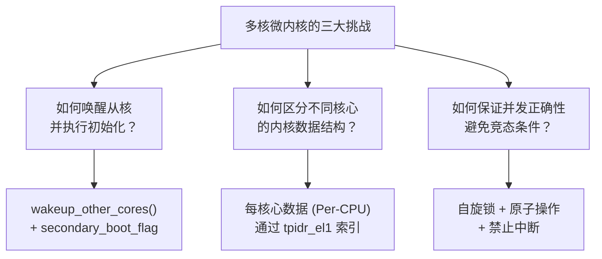
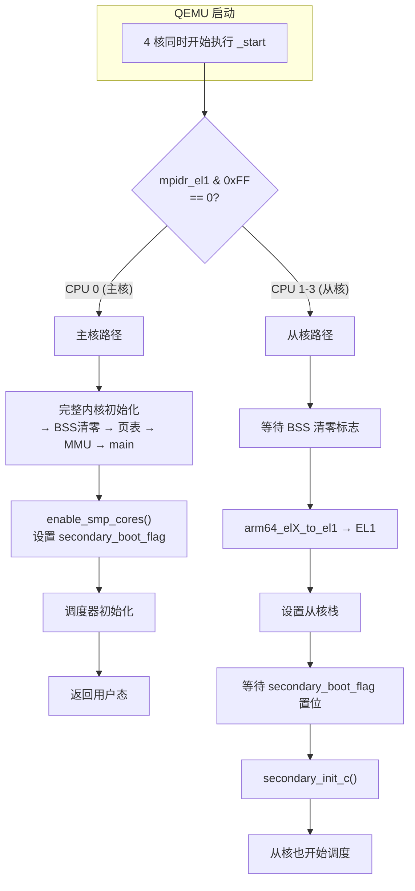
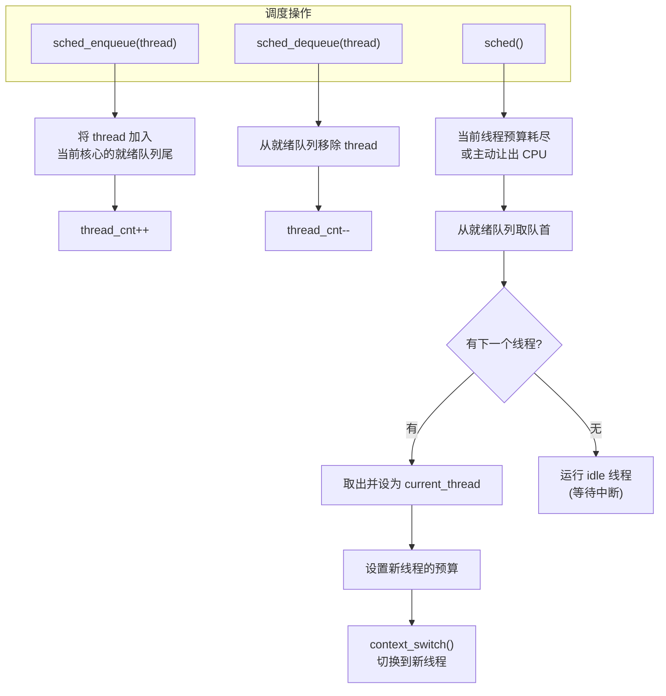
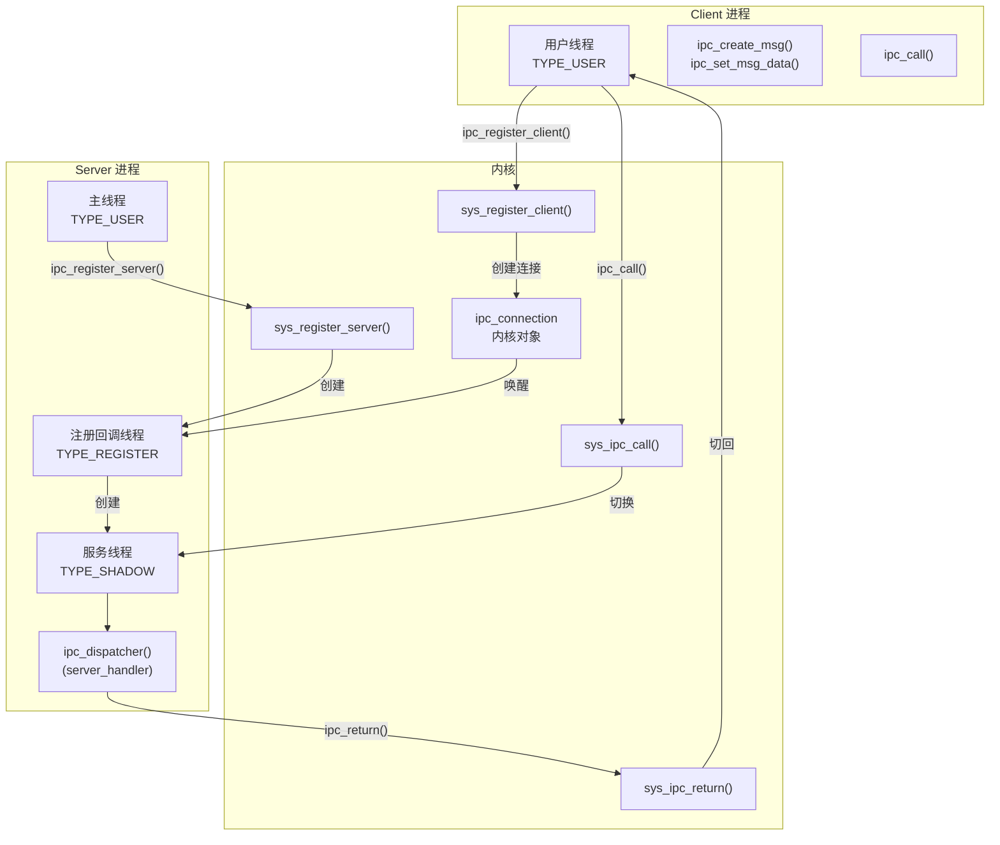
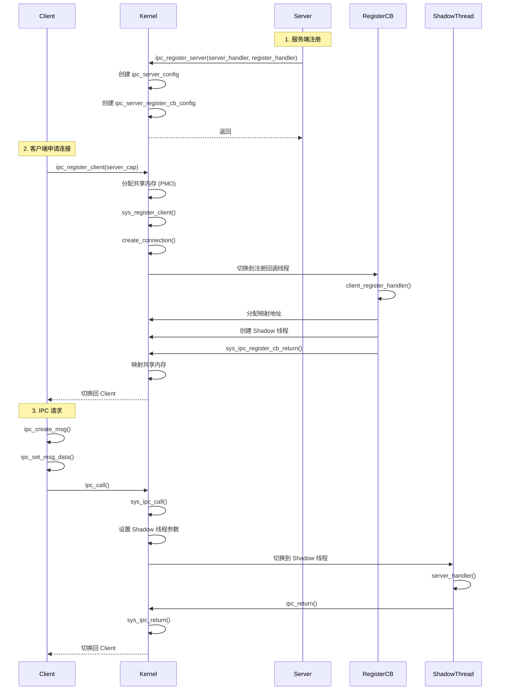

# Lab4：多核调度与 IPC — SMP、Round-Robin 与 Capability 权限 IPC

## 1 实验概述


### 1.1 实验目标

本实验是 ChCore 微内核的核心模块，包含四个部分：

1. **多核启动**：唤醒树莓派的 4 个 CPU 核心并行工作
2. **多核调度**：实现 Round-Robin 调度算法，支持多核并行调度
3. **进程间通信（IPC）**：实现基于 Capability 权限管控的 IPC 机制
4. **IPC 性能优化**：针对实机运行场景的 IPC 调优

### 1.2 关键挑战



---

## 第一部分：多核启动

## 2 SMP 启动流程

### 2.1 主核与从核



### 2.2 真机多核启动

树莓派真机与 QEMU 的启动方式不同：

```c
/* 文件: kernel/arch/aarch64/boot/raspi3/init/init_c.c */
void wakeup_other_cores(void)
{
    /* 树莓派真机：需要将启动地址写入固定位置 */
    /* 每个从核读取固定地址后跳转 */

    // 核心 1 的启动地址写入 0xd8
    // 核心 2 的启动地址写入 0xe0
    // 核心 3 的启动地址写入 0xe8
    volatile u64 *addr;
    u64 secondary_start = (u64)_start;

    addr = (u64 *)0xd8;  // 树莓派固件约定的地址
    *addr = secondary_start;
    dsb();  // 数据同步屏障

    // 发送 SEV 事件唤醒从核
    asm volatile("sev");
}
```

### 2.3 Per-CPU 数据结构

```c
/* 文件: kernel/include/arch/aarch64/arch/machine/smp.h */
struct per_cpu_info {
    u64 cpu_id;                 // 核心 ID
    char *cpu_stack;            // 核心的内核栈
    struct thread *current_thread;  // 当前运行的线程
    struct sched_context *sched_ctx; // 调度上下文
    // ... 其他 per-CPU 字段
};

/* 获取当前核心的 per_cpu_info */
static inline struct per_cpu_info *get_per_cpu_info(void)
{
    u64 cpu_id;
    /* 从 tpidr_el1 获取核心 ID */
    asm volatile("mrs %0, tpidr_el1" : "=r"(cpu_id));
    return &per_cpu_info_array[cpu_id];
}
```

---

## 第二部分：多核调度

## 3 Round-Robin 调度器

### 3.1 调度数据结构

```c
/* 每个 CPU 核心独立的调度上下文 */
struct sched_context {
    struct list_head ready_queue;   // 就绪队列
    int thread_cnt;                 // 队列中线程数
    struct thread *current_thread;  // 当前线程
    u64 time_slice;                 // 时间片（tick 数）
};

/* 线程调度相关字段 */
struct thread {
    // ... 其他字段
    struct list_head sched_node;    // 调度链表节点
    struct sched_context *sched_ctx; // 归属的调度上下文
    u64 budget;                     // 剩余时间片
};
```

### 3.2 调度器操作（练习 3-4）



### 3.3 调度实现

```c
/* 将线程加入就绪队列 */
void sched_enqueue(struct thread *thread)
{
    struct sched_context *ctx = get_per_cpu_info()->sched_ctx;

    // 线程状态设为就绪
    thread->state = TS_READY;

    // 加入队列尾部（Round-Robin）
    list_add_tail(&thread->sched_node, &ctx->ready_queue);
    ctx->thread_cnt++;
}

/* 将线程移出就绪队列 */
void sched_dequeue(struct thread *thread)
{
    struct sched_context *ctx = thread->sched_ctx;

    // 从队列移除
    list_del(&thread->sched_node);
    ctx->thread_cnt--;

    thread->state = TS_EXIT;
}

/* 调度主函数：选择下一个执行的线程 */
struct thread *sched(void)
{
    struct sched_context *ctx = get_per_cpu_info()->sched_ctx;
    struct thread *next;

    // 如果就绪队列为空，运行 idle 线程
    if (list_empty(&ctx->ready_queue))
        return ctx->idle_thread;

    // Round-Robin：取队首线程
    next = list_entry(ctx->ready_queue.next,
                      struct thread, sched_node);

    // 从就绪队列移除
    list_del(&next->sched_node);
    ctx->thread_cnt--;

    // 设置当前线程
    ctx->current_thread = next;
    next->state = TS_RUNNING;

    // 分配时间片预算
    next->budget = ctx->time_slice;

    return next;
}
```

### 3.4 上下文切换

```c
/* 切换线程上下文（包括地址空间、FPU 等） */
struct thread_ctx *switch_context(struct thread *from,
                                   struct thread *to)
{
    // 切换地址空间
    if (from->vmspace != to->vmspace) {
        switch_vmspace(to->vmspace);
    }

    // 切换 TLS（线程局部存储）
    msr tpidr_el0, to->tls_base;

    // 切换 FPU 状态
    switch_fpu_context(from, to);

    // 更新 per_cpu_info
    get_per_cpu_info()->current_thread = to;

    // 返回目标线程的上下文
    return to->thread_ctx;
}
```

---

## 第三部分：IPC（进程间通信）


## 4 微内核 IPC 架构

### 4.1 客户端-服务器模型

ChCore 的 IPC 采用客户端-服务器模型（类似 L4 微内核），而非传统的 send/recv 接口：



### 4.2 三类线程详解

| 线程类型 | 枚举值 | 创建者 | 用途 | 调度方式 |
|----------|--------|--------|------|----------|
| `TYPE_USER` | 0 | 普通 | 执行用户代码 | 独立调度上下文 |
| `TYPE_REGISTER` | 1 | 内核 | 处理 Client 的连接请求 | 继承 Client 调度上下文 |
| `TYPE_SHADOW` | 2 | `TYPE_REGISTER` | 处理 IPC 请求 | 继承 Client 调度上下文 |

**关键设计**：`TYPE_REGISTER` 和 `TYPE_SHADOW` 线程不拥有自己的调度上下文（Scheduling Context）。它们借用发起请求的 Client 线程的时间片来执行。这意味着：
- 它们不会被调度器主动调度
- 只有在 Client 发起 IPC 请求时才会被唤醒执行
- Server 端的处理时间计入 Client 的时间片预算

### 4.3 IPC 连接创建流程（完整时序）



### 4.4 内核 IPC 对象（练习 7）

```c
/* 文件: kernel/include/ipc/connection.h */
struct ipc_connection {
    struct list_head node;

    /* Server 端信息 */
    struct cap_group *server_cap_group;    // Server 进程
    struct thread *shadow_thread;           // 服务线程
    u64 shm_vaddr_server;                   // 共享内存 (Server 端地址)

    /* Client 端信息 */
    struct cap_group *client_cap_group;    // Client 进程
    u64 shm_vaddr_client;                   // 共享内存 (Client 端地址)

    /* 共享内存 */
    struct pmobject *shm_pmo;               // 共享内存 PMO
    u64 shm_size;                           // 共享内存大小

    /* 连接状态 */
    int state;                              // 连接状态
};

/* Server 配置 */
struct ipc_server_config {
    struct thread *register_cb_thread;    // 注册回调线程
    u64 server_handler;                     // 服务处理函数入口
    u64 client_register_handler;            // 注册回调函数入口
};

/* 注册回调配置 */
struct ipc_server_register_cb_config {
    u64 entry;           // 注册回调入口地址
    u64 stack;           // 用户态栈地址
    u64 arg;             // 参数
};
```

### 4.5 IPC 服务器注册完整流程

用户态 Server 调用 `ipc_register_server` 开始注册过程：

```c
/* user/chcore-libc/ipc.c */
int ipc_register_server(ipc_server_handler server_handler,
                        ipc_register_handler register_handler)
{
    return ipc_register_server_with_destructor(
        server_handler, register_handler, NULL, NULL);
}
```

`ipc_register_server_with_destructor` 执行两个关键步骤：

**步骤一：创建注册回调线程**

```c
/* user/chcore-libc/ipc.c */
int ipc_register_server_with_destructor(
    ipc_server_handler server_handler,
    ipc_register_handler register_handler,
    ipc_destructor_handler destructor_handler,
    void (*trigger)(void))
{
    struct ipc_server_register_cb_config *cb_config;
    struct thread_args args;
    pthread_t cb_thread;

    /* 1. 创建注册回调线程（被动等待的 TYPE_REGISTER 线程） */
    args.entry = (void *)ipc_register_cb_routine;
    args.stack = (void *)malloc(IPC_DEFAULT_STACK_SIZE) + IPC_DEFAULT_STACK_SIZE;
    chcore_pthread_create_register_cb(&cb_thread, &args,
                                       THREAD_TYPE_REGISTER);

    /* 2. 调用系统调用通知内核 */
    return usys_register_server((vaddr_t)server_handler,
                                (vaddr_t)register_handler,
                                (vaddr_t)register_cb_routine,
                                (vaddr_t)args.stack - IPC_DEFAULT_STACK_SIZE);
}
```

**步骤二：系统调用进入内核**

```c
/* kernel/ipc/connection.c */
int register_server(struct ipc_server_config *config,
                    struct ipc_server_register_cb_config *cb_config,
                    struct thread *register_cb_thread)
{
    /* 验证 register_cb_thread 类型为 TYPE_REGISTER */
    if (register_cb_thread->thread_type != TYPE_REGISTER)
        return -EINVAL;

    /* 为 Server 主线程分配并初始化 ipc_server_config */
    config->register_cb_thread = register_cb_thread;
    config->declared_ipc_routine_entry = server_handler;
    current_thread->general_ipc_config = config;

    /* 为 register_cb_thread 分配并初始化 ipc_server_register_cb_config */
    cb_config->register_cb_entry = register_cb_entry;
    cb_config->register_cb_stack = register_cb_stack;
    lock_init(&cb_config->register_lock);
    register_cb_thread->general_ipc_config = cb_config;

    /* 保存 PC、SP，用于后续 Client 连接时线程迁移 */
    register_cb_thread->thread_ctx->pc = register_cb_entry;
    register_cb_thread->thread_ctx->sp = register_cb_stack;

    /* ARM 架构内存屏障，确保前面写入对其他核可见 */
    dsb();
    isb();

    return 0;
}
```

关键数据结构（与 4.4 节的简化版不同，这里是内核实际使用的完整定义）：

```c
/* 内核 IPC Server 配置 */
struct ipc_server_config {
    struct thread *register_cb_thread;           // 注册回调线程
    unsigned long declared_ipc_routine_entry;    // 服务处理函数入口
};

/* 注册回调线程配置 */
struct ipc_server_register_cb_config {
    struct lock register_lock;                   // 注册锁（串行化连接请求）
    vaddr_t register_cb_entry;                   // 注册回调入口地址
    vaddr_t register_cb_stack;                   // 注册回调栈
    cap_t conn_cap_in_client;                    // 连接 Cap 在 Client 中的编号
};
```

---

### 4.6 IPC 客户端注册（连接建立）

客户端通过 `ipc_register_client` 发起连接请求：

```c
/* user/chcore-libc/ipc.c */
int ipc_register_client(cap_t server_cap)
{
    struct ipc_msg *msg;
    int conn_cap;

    /* 1. 分配共享内存 */
    msg = malloc(sizeof(*msg) + IPC_PER_SHM_SIZE);
    msg->data_ptr = (void *)((unsigned long)msg + sizeof(*msg));

    /* 2. 创建共享内存 PMO */
    cap_t shm_cap = usys_create_pmo(IPC_PER_SHM_SIZE, PMO_DATA);

    /* 3. 系统调用注册客户端 */
    conn_cap = usys_register_client(server_cap, shm_cap,
                                     msg->data_ptr);
    if (conn_cap < 0) {
        free(msg);
        return conn_cap;
    }

    msg->conn_cap = conn_cap;
    return msg;
}
```

内核 `sys_register_client` 的完整实现：

```c
/* kernel/ipc/connection.c */
int sys_register_client(struct cap_group *client_cap_group,
                        cap_t server_cap, cap_t shm_cap,
                        vaddr_t shm_vaddr_client)
{
    struct cap_group *server_cap_group;
    struct ipc_server_config *server_config;
    struct thread *register_cb_thread;
    struct ipc_connection *conn;
    struct pmobject *shm_pmo;

    /* 1. 通过 Capability 获取 Server 进程 */
    server_cap_group = get_cap_group_by_cap(server_cap);
    if (!server_cap_group)
        return -ECAPBILITY;

    /* 2. 获取注册回调线程 */
    server_config = server_cap_group->main_thread->general_ipc_config;
    register_cb_thread = server_config->register_cb_thread;

    /* 3. 获取注册锁（try_lock，ChCore 不支持 mutex 阻塞） */
    struct ipc_server_register_cb_config *cb_config =
        register_cb_thread->general_ipc_config;
    if (!lock_try_lock(&cb_config->register_lock))
        return -EBUSY;

    /* 4. 从用户空间拷贝共享内存配置 */
    shm_pmo = get_pmo_by_cap(shm_cap);

    /* 5. 映射共享内存到当前 Client 进程地址空间 */
    map_pmo_in_cap_group(client_cap_group, shm_pmo,
                         shm_vaddr_client, VM_READ | VM_WRITE);

    /* 6. 创建 IPC 连接 */
    conn = create_connection(client_cap_group, server_cap_group,
                             shm_pmo, shm_vaddr_client);

    /* 7. 设置注册回调线程的 PC、SP 和参数 */
    register_cb_thread->thread_ctx->pc = cb_config->register_cb_entry;
    register_cb_thread->thread_ctx->sp = cb_config->register_cb_stack;
    register_cb_thread->thread_ctx->x0 = (unsigned long)conn;
    register_cb_thread->thread_ctx->x1 = (unsigned long)cb_config;

    /* 8. 转移调度上下文（Client 将自己的时间片借给注册回调线程） */
    transfer_sched_ctx_to(current_thread(), register_cb_thread);

    /* 9. 切换到注册回调线程执行 */
    sched_to_thread(register_cb_thread);

    /* 10. 从注册回调线程返回后，继续执行 */
    return conn->conn_cap_in_client;
}
```

`create_connection` 函数初始化 `ipc_connection` 的全部字段：

```c
/* kernel/ipc/connection.c */
static struct ipc_connection *create_connection(
    struct cap_group *client_cap_group,
    struct cap_group *server_cap_group,
    struct pmobject *shm_pmo,
    vaddr_t shm_vaddr_client)
{
    struct ipc_connection *conn = obj_alloc(TYPE_IPC_CONNECTION,
                                            sizeof(*conn));
    if (!conn)
        return NULL;

    conn->client_cap_group = client_cap_group;
    conn->server_cap_group = server_cap_group;
    conn->shm_pmo = shm_pmo;
    conn->shm_size = IPC_PER_SHM_SIZE;
    conn->shm_vaddr_client = shm_vaddr_client;
    conn->shm_vaddr_server = 0;    // Server 端地址暂未映射
    conn->shadow_thread = NULL;     // Shadow 线程暂未创建
    conn->state = CONN_INIT;        // 初始状态
    conn->server_handler_thread = NULL;
    conn->conn_cap_in_client = 0;

    /* 初始化连接锁 */
    lock_init(&conn->conn_lock);

    /* 将连接加入 Server 的连接列表 */
    list_add(&conn->node, &server_cap_group->ipc_connection_list);

    return conn;
}
```

---

### 4.7 注册回调处理函数

当 Client 调用 `sys_register_client` 后，内核切换到 Server 的注册回调线程执行 `register_cb` 函数：

```c
/* user/chcore-libc/ipc.c */
static void register_cb(struct ipc_msg *msg,
                        void *register_handler)
{
    /* 1. 分配 Server 端共享内存虚拟地址 */
    unsigned long shm_vaddr = alloc_vaddr(IPC_PER_SHM_SIZE);

    /* 2. 创建 Shadow 线程 */
    pthread_t shadow_thread;
    struct thread_args args;
    args.entry = ipc_handler;  // server_handler 的封装
    args.stack = malloc(IPC_DEFAULT_STACK_SIZE) + IPC_DEFAULT_STACK_SIZE;
    chcore_pthread_create_shadow(&shadow_thread, &args);

    /* 3. 保存连接信息，返回内核 */
    msg->shadow_thread = shadow_thread;
    msg->shm_vaddr_server = shm_vaddr;

    ipc_register_cb_return(msg);
}
```

`ipc_register_cb_return` 调用 `usys_ipc_register_cb_return` 触发系统调用：

```c
/* kernel/ipc/connection.c */
int sys_ipc_register_cb_return(struct ipc_connection *conn,
                               struct thread *shadow_thread,
                               vaddr_t shm_vaddr_server,
                               struct ipc_server_register_cb_config *cb_config)
{
    /* 1. 映射共享内存到 Server 地址空间 */
    map_pmo_in_cap_group(conn->server_cap_group,
                         conn->shm_pmo,
                         shm_vaddr_server,
                         VM_READ | VM_WRITE);
    conn->shm_vaddr_server = shm_vaddr_server;

    /* 2. 初始化 Shadow 线程的 IPC 配置 */
    struct ipc_server_handler_config *handler_config;
    handler_config = obj_alloc(TYPE_IPC_SERVER_HANDLER_CONFIG,
                                sizeof(*handler_config));
    handler_config->conn = conn;
    handler_config->server_handler =
        ((struct ipc_server_config *)
            conn->server_cap_group->main_thread->general_ipc_config)
            ->declared_ipc_routine_entry;
    shadow_thread->general_ipc_config = handler_config;

    /* 3. 记录 Shadow 线程到连接对象 */
    conn->shadow_thread = shadow_thread;
    conn->server_handler_thread = shadow_thread;

    /* 4. 设置连接状态为有效 */
    conn->state = CONN_VALID;

    /* 5. 将连接 Capability 注册回 Client */
    conn->conn_cap_in_client = cap_copy(current_cap_group(),
                                        conn->client_cap_group,
                                        conn->obj_id);

    /* 6. 解锁注册锁 */
    lock_unlock(&cb_config->register_lock);

    /* 7. 切换回 Client 线程，返回 conn_cap */
    sched_to_thread(conn->client_thread);
    current_thread->thread_ctx->x0 = conn->conn_cap_in_client;

    return 0;
}
```

至此，完整的 IPC 连接建立完成。Client 获得了 `conn_cap`，可以通过它发起 IPC 调用。

---

### 4.8 IPC 系统调用的内核实现

```c
/* 注册为 IPC Server */
int sys_register_server(struct cap_group *cap_group,
                        u64 server_handler,
                        u64 client_register_handler)
{
    // 1. 分配 IPC server 配置
    struct ipc_server_config *config =
        obj_alloc(TYPE_IPC_SERVER_CONFIG, sizeof(*config));

    // 2. 创建注册回调线程（TYPE_REGISTER）
    struct thread *cb_thread = create_thread(
        cap_group, THREAD_TYPE_REGISTER);
    cb_thread->entry = client_register_handler;

    config->register_cb_thread = cb_thread;
    config->server_handler = server_handler;
    config->client_register_handler = client_register_handler;

    // 3. 将配置关联到主线程
    current_thread()->general_ipc_config = config;

    return 0;
}

/* Client 申请建立连接 */
int sys_register_client(struct cap_group *client_cap_group,
                        cap_t server_cap)
{
    // 1. 根据 server_cap 找到服务器
    struct cap_group *server = get_cap_object(server_cap);

    // 2. 分配共享内存
    struct pmobject *shm = create_pmo(PMO_SHM, IPC_SHM_SIZE);

    // 3. 创建 IPC 连接内核对象
    struct ipc_connection *conn =
        obj_alloc(TYPE_IPC_CONNECTION, sizeof(*conn));
    conn->server_cap_group = server;
    conn->client_cap_group = current_cap_group();
    conn->shm_pmo = shm;
    conn->shm_size = IPC_SHM_SIZE;

    // 4. 映射到 Client 地址空间
    conn->shm_vaddr_client = alloc_vaddr(client_cap_group->vmspace,
                                          IPC_SHM_SIZE);
    map_pmo_in_vmspace(client_cap_group->vmspace,
                        shm, conn->shm_vaddr_client, VM_READ | VM_WRITE);

    // 5. 切换到注册回调线程
    struct ipc_server_config *srv_config =
        server->main_thread->general_ipc_config;
    switch_to_thread(srv_config->register_cb_thread, conn);

    return conn->client_id;
}

/* IPC 调用 */
int sys_ipc_call(struct ipc_connection *conn,
                 u64 arg0, u64 arg1, u64 arg2,
                 u64 arg3, u64 arg4, u64 arg5)
{
    struct thread *shadow = conn->shadow_thread;

    // 1. 保存 Client 线程状态
    save_thread_state(current_thread());
    current_thread()->state = TS_WAITING;  // Client 等待

    // 2. 设置 Shadow 线程的参数
    shadow->thread_ctx->pc = shadow->entry;
    shadow->thread_ctx->x0 = arg0;
    shadow->thread_ctx->x1 = arg1;
    // ...

    // 3. Shadow 线程继承 Client 的调度预算
    shadow->budget = current_thread()->budget;

    // 4. 切换到 Shadow 线程
    switch_to_thread(shadow, NULL);

    return 0;
}

/* IPC 返回 */
int sys_ipc_return(struct thread *client_thread, u64 ret)
{
    // 1. 恢复 Client 线程
    client_thread->state = TS_READY;

    // 2. 设置返回值
    client_thread->thread_ctx->x0 = ret;

    // 3. 切换到 Client 线程
    switch_to_thread(client_thread, NULL);

    return 0;
}
```

---

### 4.9 IPC Call 完整流程

Client 准备好数据后，调用 `ipc_call` 发起 IPC 请求：

```c
/* user/chcore-libc/ipc.c */
int ipc_call(struct ipc_msg *msg, u64 arg0, u64 arg1,
             u64 arg2, u64 arg3, u64 arg4, u64 arg5)
{
    return usys_ipc_call(msg->conn_cap, arg0, arg1, arg2,
                         arg3, arg4, arg5);
}
```

内核 `sys_ipc_call` 的完整实现：

```c
/* kernel/ipc/connection.c */
int sys_ipc_call(struct cap_group *cap_group,
                 cap_t conn_cap, u64 arg0, u64 arg1,
                 u64 arg2, u64 arg3, u64 arg4, u64 arg5)
{
    struct ipc_connection *conn;
    struct thread *shadow;

    /* 1. 通过 Capability 获取连接对象 */
    conn = get_ipc_connection_by_cap(conn_cap);
    if (!conn)
        return -ECAPBILITY;

    /* 2. 检查连接状态 */
    if (conn->state != CONN_VALID)
        return -ECONNSTATE;

    /* 3. 获取 Shadow 线程 */
    shadow = conn->shadow_thread;
    if (!shadow)
        return -ENOTHREAD;

    /* 4. 尝试锁连接（串行化访问） */
    if (!lock_try_lock(&conn->conn_lock))
        return -EBUSY;

    /* 5. 调用 ipc_thread_migrate_to_server */
    ipc_thread_migrate_to_server(current_thread(), shadow,
                                  arg0, arg1, arg2,
                                  arg3, arg4, arg5);

    /* 注意：此处不会立即返回，Client 线程已被挂起 */
    return 0;
}
```

`ipc_thread_migrate_to_server` 是核心线程迁移函数：

```c
/* kernel/ipc/connection.c */
static void ipc_thread_migrate_to_server(struct thread *client,
                                          struct thread *shadow,
                                          u64 arg0, u64 arg1,
                                          u64 arg2, u64 arg3,
                                          u64 arg4, u64 arg5)
{
    /* 1. 保存 Client 线程状态 */
    client->state = TS_WAITING;

    /* 2. 设置 Shadow 线程的 PC 和参数 */
    shadow->thread_ctx->pc = shadow->entry;
    shadow->thread_ctx->x0 = arg0;
    shadow->thread_ctx->x1 = arg1;
    shadow->thread_ctx->x2 = arg2;
    shadow->thread_ctx->x3 = arg3;
    shadow->thread_ctx->x4 = arg4;
    shadow->thread_ctx->x5 = arg5;
    shadow->thread_ctx->sp = shadow->stack;

    /* 3. 转移调度预算（Client 将时间片借给 Shadow） */
    shadow->budget = client->budget;
    client->budget = 0;

    /* 4. 保存 Client 引用，IPC return 时使用 */
    shadow->general_ipc_config->client_thread = client;

    /* 5. 切换到 Shadow 线程执行 */
    sched_to_thread(shadow);
}
```

Shadow 线程被切换后，开始执行 `server_handler`（即 `ipc_dispatcher`）：

```c
/* user/chcore-libc/ipc.c */
void ipc_dispatcher(struct thread *shadow)
{
    struct ipc_server_handler_config *config =
        shadow->general_ipc_config;

    /* 调用用户注册的 server_handler */
    config->server_handler(config->conn,
                           shadow->thread_ctx->x0,
                           shadow->thread_ctx->x1,
                           shadow->thread_ctx->x2,
                           shadow->thread_ctx->x3,
                           shadow->thread_ctx->x4,
                           shadow->thread_ctx->x5);

    /* 处理完成后返回 */
    ipc_return(config->conn, 0);
}
```

---

### 4.10 IPC Return 流程

Server 处理完请求后，调用 `ipc_return` 返回结果给 Client：

```c
/* user/chcore-libc/ipc.c */
int ipc_return(struct ipc_msg *msg, u64 ret)
{
    return usys_ipc_return(msg->conn_cap, ret);
}
```

内核 `sys_ipc_return` 的实现：

```c
/* kernel/ipc/connection.c */
int sys_ipc_return(struct cap_group *cap_group,
                   cap_t conn_cap, u64 ret)
{
    struct ipc_connection *conn;
    struct thread *client_thread;

    /* 1. 获取连接对象 */
    conn = get_ipc_connection_by_cap(conn_cap);
    if (!conn)
        return -ECAPBILITY;

    /* 2. 获取之前保存的 Client 线程 */
    client_thread = conn->shadow_thread->general_ipc_config->client_thread;
    if (!client_thread)
        return -ECLIENT;

    /* 3. 恢复 Client 线程状态 */
    client_thread->state = TS_READY;

    /* 4. 设置返回值（ARM64 约定 x0 为返回值寄存器） */
    client_thread->thread_ctx->x0 = ret;

    /* 5. 解锁连接 */
    lock_unlock(&conn->conn_lock);

    /* 6. 切换回 Client 线程 */
    sched_to_thread(client_thread);

    return 0;
}
```

---

### 4.11 IPC 消息创建与数据写入

在发起 `ipc_call` 之前，Client 需要准备消息数据：

```c
/* user/chcore-libc/ipc.c */

/* 创建 IPC 消息 */
struct ipc_msg *ipc_create_msg(struct ipc_msg *msg, unsigned long size)
{
    if (!msg)
        return NULL;

    /* 消息体指针指向共享内存中的数据区域 */
    msg->data_ptr = (void *)((unsigned long)msg + sizeof(struct ipc_msg));
    msg->data_len = size;

    return msg;
}

/* 将用户数据拷贝到共享内存中的指定偏移 */
int ipc_set_msg_data(struct ipc_msg *msg, void *data,
                     unsigned long offset, unsigned long len)
{
    if (offset + len > IPC_PER_SHM_SIZE)
        return -EINVAL;

    /* 直接拷贝到共享内存（Server 可直接读取） */
    memcpy((void *)((unsigned long)msg->data_ptr + offset),
           data, len);
    return 0;
}

/* 从共享内存读取 Server 返回的数据 */
int ipc_get_msg_data(struct ipc_msg *msg, void *data,
                     unsigned long offset, unsigned long len)
{
    if (offset + len > IPC_PER_SHM_SIZE)
        return -EINVAL;

    memcpy(data, (void *)((unsigned long)msg->data_ptr + offset),
           len);
    return 0;
}
```

**关键设计**：`ipc_msg` 结构体本身和 `data_ptr` 指向的数据区域都在同一块**共享内存**中。Client 写入 `data_ptr` 指向的缓冲区后，Server 端的 Shadow 线程可以直接读取同一物理内存，无需内核进行数据拷贝。这是 ChCore IPC 高性能的核心原因之一。

使用示例：

```c
/* Client 发起 IPC 请求的典型模式 */
struct ipc_msg *msg = ipc_register_client(server_cap);
if (IS_ERR(msg))
    return PTR_ERR(msg);

/* 准备请求数据 */
char request[] = "Hello Server!";
ipc_set_msg_data(msg, request, 0, sizeof(request));

/* 发起 IPC 调用 */
int ret = ipc_call(msg, IPC_REQ_ECHO, 0, 0, 0, 0, 0);

/* 读取 Server 返回数据 */
char response[64];
ipc_get_msg_data(msg, response, 0, sizeof(response));
```

---

### 4.12 完整 IPC 流程总览

下面用 ASCII 序列图总结完整的 IPC 流程：

```
Client                     Kernel                    Server (RegisterCB)    Shadow
  |                          |                          |                    |
  |  1. 服务器注册           |                          |                    |
  |--ipc_register_server---->|                          |                    |
  |                          |--register_server()------>|                    |
  |                          |--创建 register_cb_thread |                    |
  |<-------------------------|                          |                    |
  |                          |                          |                    |
  |  2. 客户端连接           |                          |                    |
  |--ipc_register_client---->|                          |                    |
  |                          |--sys_register_client()   |                    |
  |                          |--create_connection()     |                    |
  |                          |--sched_to_thread(rcb)---->|                    |
  |                          |                          |--register_cb()     |
  |                          |                          |--alloc_shm_vaddr   |
  |                          |                          |--create_shadow()-->|
  |                          |                          |                    |
  |                          |<--sys_ipc_register_cb_ret|                    |
  |                          |--map_shm_to_server       |                    |
  |                          |--sched_to_client         |                    |
  |<--return conn_cap--------|                          |                    |
  |                          |                          |                    |
  |  3. IPC 请求             |                          |                    |
  |--ipc_create_msg()        |                          |                    |
  |--ipc_set_msg_data()      |                          |                    |
  |                          |                          |                    |
  |--ipc_call()-------------->|                          |                    |
  |                          |--sys_ipc_call()          |                    |
  |                          |--lock_conn               |                    |
  |                          |--ipc_thread_migrate()    |                    |
  |                          |--save_client_state       |                    |
  |                          |--set_shadow_args         |                    |
  |                          |--transfer_budget         |                    |
  |                          |--sched_to_thread(shr)--------------------->|
  |                          |                          |                    |
  |                          |                          |                    |--server_handler()
  |                          |                          |                    |--ipc_dispatcher()
  |                          |                          |                    |
  |                          |<--ipc_return()-------------------------------|
  |                          |--restore_client         |                    |
  |                          |--set_ret_value(x0)       |                    |
  |                          |--sched_to_client         |                    |
  |<--return result----------|                          |                    |
```

**关键设计要点总结**：

| 特性 | 说明 |
|------|------|
| **零拷贝通信** | Client 和 Server 通过共享内存传递数据，内核不参与数据拷贝 |
| **借用调度** | TYPE_REGISTER 和 TYPE_SHADOW 线程不拥有时间片，借用 Client 的预算执行 |
| **协程语义** | IPC 调用类似协程 yield，Client 挂起 -> Server 执行 -> Client 恢复 |
| **串行化访问** | 通过 try_lock 确保同一连接同时只有一个 IPC 请求在处理 |
| **Capability 安全** | 所有 IPC 对象（连接、共享内存）通过 Capability 访问，防止越权 |

---

## 5 实验步骤

### 5.1 构建与运行

```bash
cd Lab4

make
make qemu

# 测试 IPC
test_ipc.bin
# 预期输出: "[TEST] Test IPC finished!"
```

### 5.2 评分

```bash
make grade

# Part 1 (多核启动): 思考题，无代码分
# Part 2 (多核调度): ~30 分
# Part 3 (IPC): ~70 分
# Part 4 (性能优化): 挑战题
```

### 5.3 调试 IPC

由于 IPC 涉及多个进程的线程切换，调试较复杂。可以使用打印调试：

```c
// 在所有 IPC 相关路径插入 printk
printk("[IPC] sys_ipc_call: conn=%lx, arg0=%lx\n", conn, arg0);
```

---

## 6 思考题解析

### 思考题 1：主核选择与从核阻塞

`_start` 开头通过 `mpidr_el1` 区分主从核。`secondary_boot_flag` 是一个数组，每个从核对应一个元素。主核在 `enable_smp_cores()` 中将其置为 1，从而唤醒从核。`secondary_boot_flag` 在内核中是一个**虚拟地址**，在启用 MMU 时需要在页表中正确映射这个变量所在的物理页。

### IPC vs 传统系统调用

传统操作系统（如 Linux）中，系统调用是同步的：用户态通过 `svc` 进入内核执行操作，完成后返回。而 IPC 调用涉及两个不同的进程：Client 进入内核后，内核切换到 Server 的 Shadow 线程执行，Server 处理完后又切换回 Client。这具有类似 **协程切换** 的语义，在微内核中相比传统的消息传递方式大幅减少了数据拷贝和上下文切换开销。

---

## 参考资源

- ChCore 源码：`kernel/arch/aarch64/machine/smp.c`、`kernel/sched/sched.c`
- ChCore 源码：`kernel/ipc/connection.c`、`user/chcore-libc/.../ipc.c`
- 《操作系统：原理与实现》第 6 章（调度）和第 8 章（IPC）
- Arm Architecture Reference Manual: GIC 系统寄存器
- [Round-Robin Scheduling](https://en.wikipedia.org/wiki/Round-robin_scheduling)
