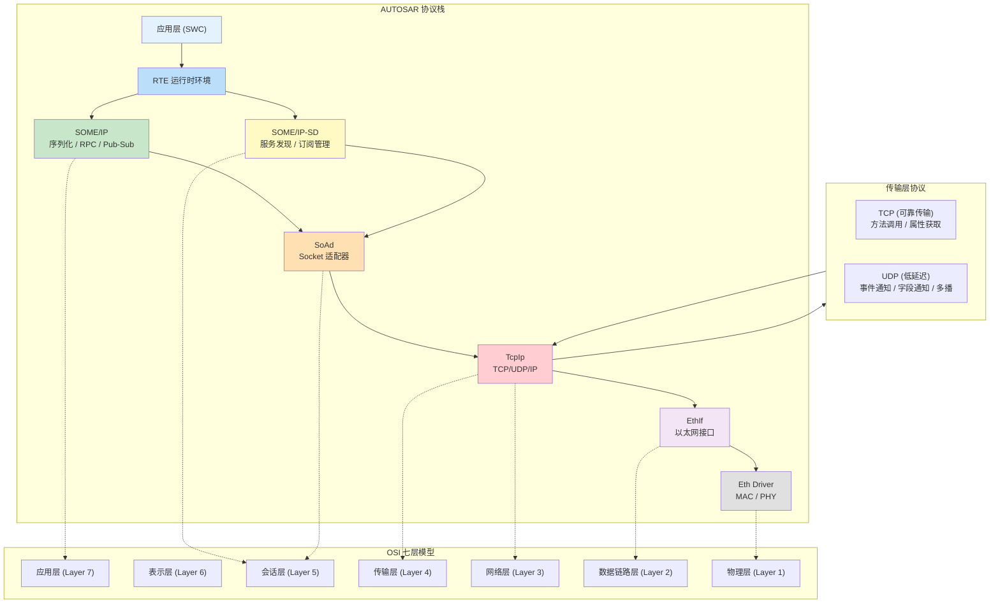
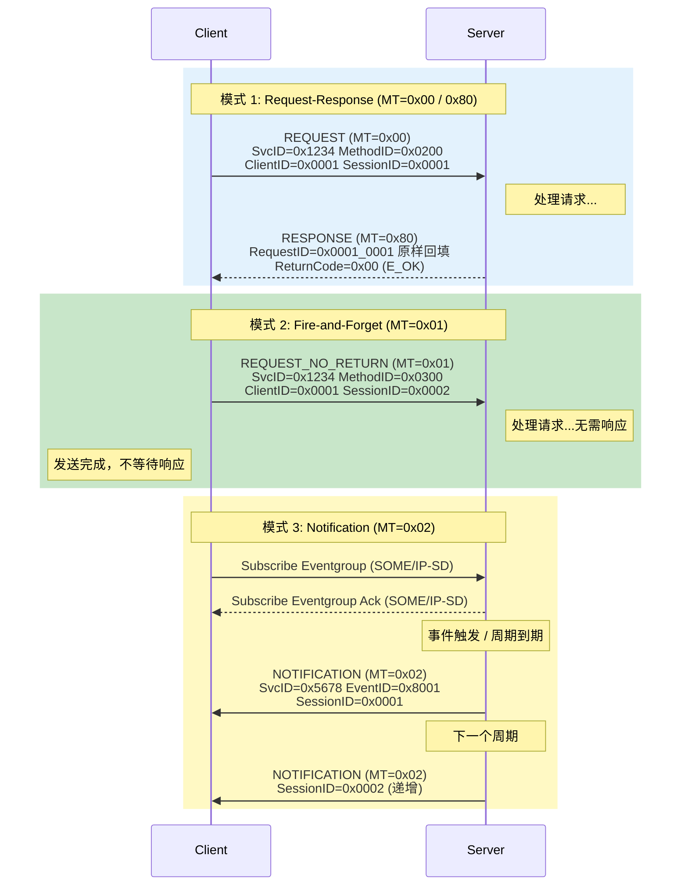
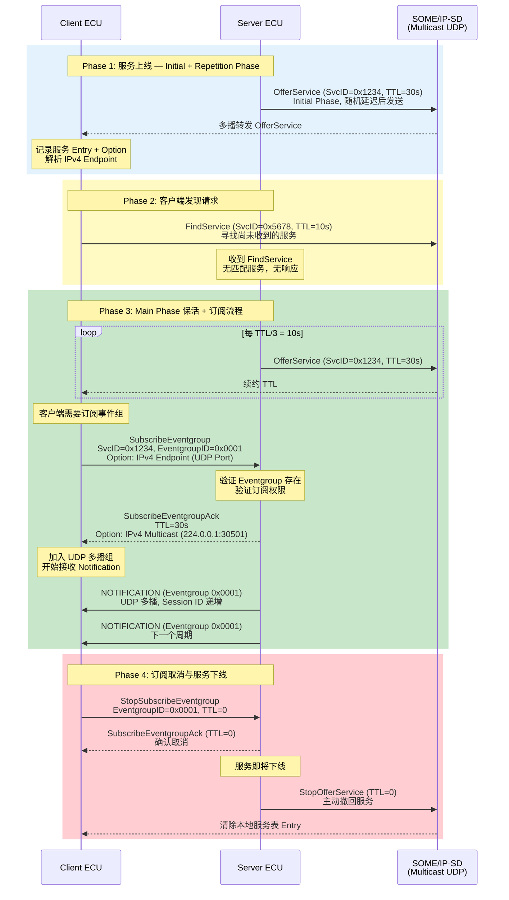
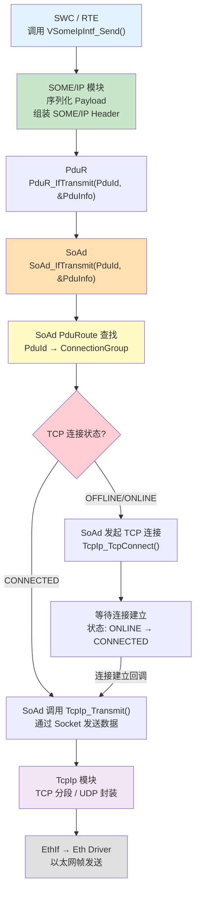
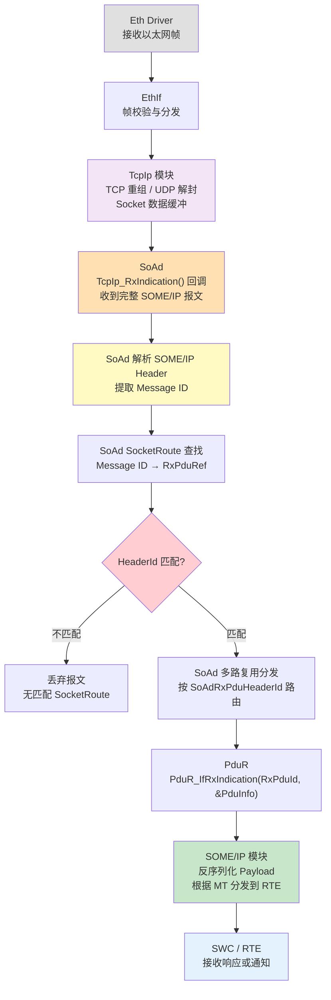
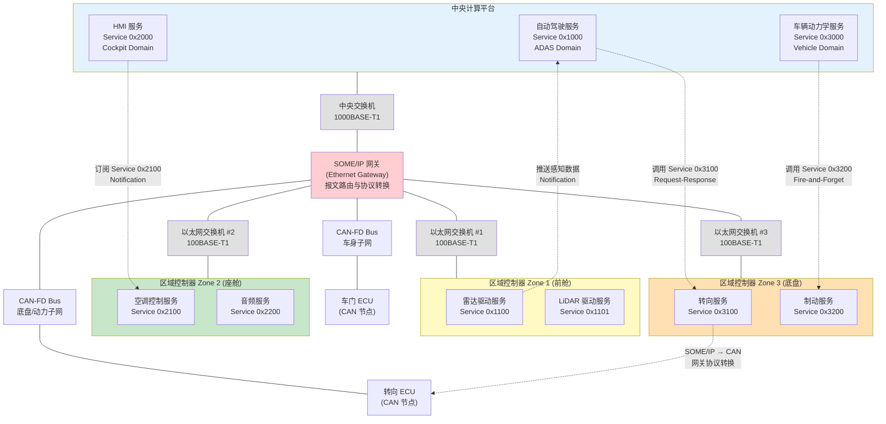

## 1. 车载以太网与 SOME/IP 概述

### 1.1 从面向信号到面向服务：车载网络架构的范式迁移

传统车载网络以 CAN、LIN、FlexRay 为骨干，采用**面向信号（Signal-Oriented）**的通信模型。其核心特征是：信号以广播方式在总线上周期性发送，接收方通过信号名称或 CAN ID 订阅感兴趣的数据，发送方无需知道接收方的存在。这种模型在 ECU 数量有限、功能耦合度低的分布式架构中运作良好——一个车门控制器只需把"车门开闭状态"信号丢到 CAN 总线上，仪表盘自会取用。

然而，当 L3+ 自动驾驶、智能座舱、V2X 等应用涌入车内，面向信号模型的三大结构性缺陷暴露无遗：

| 维度 | 面向信号（CAN/LIN） | 面向服务（SOME/IP） |
|------|---------------------|---------------------|
| 通信模型 | 广播式，所有节点共享总线 | 点对点 / 多播 / 广播可配置 |
| 耦合方式 | 信号名 + 周期硬编码于 ARXML | 服务接口动态发现，运行时绑定 |
| 带宽上限 | CAN FD 最大 ~8 Mbps | 车载以太网 100 Mbps ~ 10 Gbps |
| 数据组织 | 扁平信号，无结构化封装 | 方法/属性/事件，面向对象抽象 |
| 可扩展性 | 新信号 = 重新矩阵编排 = 全网刷写 | 新服务 = 接口版本升级 = 增量部署 |
| 诊断交互 | UDS over CAN，请求-响应无结构化 | 方法调用，支持复杂参数与返回值 |

自动驾驶域控制器每秒产生数百兆的传感器数据——高分辨率摄像头（8 MP × 30 fps ≈ 960 MB/s 原始流量）、激光雷达点云、4D 毫米波雷达数据——这些远超 CAN 总线的能力边界。与此同时，**域控制器集中化**与**中央计算+区域控制器（Zonal）**架构的演进，要求 ECU 之间从"共享信号"转向"调用服务"：高级驾驶辅助域不再被动接收轮速信号，而是主动调用底盘域的"车辆动力学服务"获取结构化的动力学状态。

这正是 **SOA（Service-Oriented Architecture）** 进入车载领域的根本驱动力：将车载软件从"信号矩阵编排"提升为"服务接口契约"。

### 1.2 SOME/IP：车载 SOA 通信的基石

**SOME/IP**（Scalable service-Oriented MiddlewarE over IP）是 AUTOSAR 联盟定义的**车载以太网中间件协议**，规范编号为 AUTOSAR FO/RTE/SOMEIP。其标准定义如下：

> SOME/IP 是一种面向服务的、可扩展的中间件协议，运行于 IP 协议之上，为车载应用提供远程过程调用（RPC）和发布/订阅（Pub/Sub）通信机制。

关键理解点：

- **中间件（Middleware）**：SOME/IP 既不是应用层协议（如 HTTP），也不是传输层协议（如 TCP/UDP），它位于应用层与传输层之间，向下屏蔽 TCP/UDP 的 socket 细节，向上提供面向服务的 RPC 和事件通知抽象。应用开发者调用 `someip_send_request(service_id, method_id, payload)` 即可，无需关心底层连接管理。
- **可扩展（Scalable）**：SOME/IP 的序列化格式支持从 8 位整数到嵌套结构体、动态长度数组的全谱系数据类型，服务接口可通过版本号（Major/Minor Version）实现向前兼容的演进。
- **面向服务（Service-Oriented）**：通信的基本单位不是信号，而是**服务（Service）**。每个服务由唯一的 Service ID 标识，提供方法（Method）、属性（Property/Attribute）和事件（Event）三种接口元素。消费者通过 SOME/IP-SD 动态发现服务提供者，建立通信绑定。

### 1.3 协议栈架构：OSI、AUTOSAR 与 SOME/IP 的垂直映射

要理解 SOME/IP 在整个车载通信体系中的位置，必须建立 OSI 七层模型、AUTOSAR 分层架构与具体模块实现的三维映射：



各模块职责解析：

**SOME/IP**（对应 OSI 第 6-7 层）负责应用数据的序列化/反序列化、RPC 请求-响应的报文编解码、事件通知的过滤与分发。它定义了报文头（Header）和负载（Payload）的二进制格式——16 位 Service ID + 16 位 Method ID + 32 位 Length + 可选的 Session ID / Protocol Version / Interface Version / Message Type / Return Code。

**SOME/IP-SD**（对应 OSI 第 5 层会话管理）是 SOME/IP 的伴生协议，负责服务的动态发现与生命周期管理。它通过多播 UDP 报文（默认目的端口 30490）在服务提供者（Offer Service）和服务消费者（Find Service）之间建立匹配，并管理事件组的订阅（Subscribe Eventgroup / Stop Subscribe Eventgroup）。SOME/IP-SD 是车载 SOA 从"静态配置"走向"动态绑定"的关键使能模块。

**SoAd**（Socket Adapter，对应 OSI 第 5 层）是 AUTOSAR BSW 中连接 SOME/IP 与 TcpIp 模块的胶水层。它将 SOME/IP 的抽象通信需求（"向 Service 0x1234 的 Method 0x8100 发送请求"）映射为具体的 socket 操作（"打开 TCP 连接到 192.168.0.10:30500，发送数据"）。SoAd 管理 socket 的打开/关闭、连接状态机、以及报文路由（SoAd Routing Group），是 SOME/IP 从协议规范到工程落地的核心配置枢纽。

**TcpIp**（对应 OSI 第 3-4 层）提供标准的 TCP/UDP/IP 协议栈实现。SOME/IP 方法调用默认使用 TCP（可靠性优先），事件通知默认使用 UDP（延迟优先 + 多播支持）。TcpIp 模块处理 IP 地址分配（静态或 DHCPv6）、路由、分片重组等底层网络功能。

这种分层架构的设计哲学是**关注点分离**：SOME/IP 只关心"如何编码一个 RPC 调用"，SoAd 只关心"把编码后的字节通过哪个 socket 发出去"，TcpIp 只关心"TCP 连接的建立与可靠传输"。每一层都可以独立测试、独立替换、独立演进——这正是 AUTOSAR 分层架构的核心价值。

## 2. SOME/IP 报文格式深度解析

### 2.1 标准头部 16 字节全景排布

每一帧 SOME/IP 报文由**固定长度的头部（Header）**与**可变长度的负载（Payload）**两部分组成。头部严格占用 16 字节（128 比特），是 SOME/IP 协议解析的起点——接收方必须先完整读取这 16 字节，才能判断报文类型、定位负载边界、决定分发策略。

以下是 16 字节头部的字节级排布图：

```mermaid
flowchart TD
    subgraph Header["SOME/IP Header — 16 Bytes (128 Bits)"]
        direction TB
        ROW0["│<  Message ID (4 Bytes)  >│<    Length (4 Bytes)     >│"]
        ROW1["│<  Request ID (4 Bytes)   >│<  Protocol V │ IF V │ MT │ RC │"]
        ROW2["│  Service ID │ Method/Event ID  │   Length = 8 + Payload Size   │"]
        ROW3["│  Client ID  │  Session ID      │  PV=0x01 │ IV │ MT │ RC │"]
    end

    BYTE_MAP["Byte  0   1   2   3   4   5   6   7   8   9  10  11  12  13  14  15\n" +
             "     ├───┼───┼───┼───┼───┼───┼───┼───┼───┼───┼───┼───┼───┼───┼───┤\n" +
             "     │   Service ID   │  Method/Event  │         Length          │\n" +
             "     ├───┼───┼───┼───┼───┼───┼───┼───┼───┼───┼───┼───┼───┼───┼───┤\n" +
             "     │   Client ID    │  Session ID     │ PV  │ IV  │ MT  │ RC  │\n" +
             "     ├───┼───┼───┼───┼───┼───┼───┼───┼───┼───┼───┼───┼───┼───┼───┤"]

    Header --> BYTE_MAP

    style Header fill:#e8f5e9
    style BYTE_MAP fill:#fff9c4
```

上图中各行的精确字段定义如下表：

### 2.2 头部字段逐比特拆解

| 字段 | 字节偏移 | 长度 | 比特位 | 说明 |
|------|---------|------|--------|------|
| **Message ID** | Byte 0-3 | 32 bit | [31:0] | 报文标识，唯一确定报文所属的服务与方法/事件 |
| ├ Service ID | Byte 0-1 | 16 bit | [31:16] | 服务标识符，由 OEM 在系统设计中分配 |
| ├ Method/Event ID | Byte 2-3 | 16 bit | [15:0] | 方法 ID（0x0000-0x7FFF）或事件 ID（0x8000-0xFFFF） |
| **Length** | Byte 4-7 | 32 bit | [31:0] | 从 Byte 8 到报文末尾的总字节数 = 8 + Payload 长度 |
| **Request ID** | Byte 8-11 | 32 bit | [31:0] | 请求标识，用于匹配请求与响应 |
| ├ Client ID | Byte 8-9 | 16 bit | [31:16] | 客户端标识符，区分同一 ECU 上的不同客户端实例 |
| ├ Session ID | Byte 10-11 | 16 bit | [15:0] | 会话标识符，同一客户端的请求递增计数器 |
| **Protocol Version** | Byte 12 | 8 bit | [31:24] | SOME/IP 协议版本，当前规范固定为 0x01 |
| **Interface Version** | Byte 13 | 8 bit | [23:16] | 服务接口的主版本号（Major Version） |
| **Message Type** | Byte 14 | 8 bit | [15:8] | 报文类型，标识请求/响应/通知等 |
| **Return Code** | Byte 15 | 8 bit | [7:0] | 返回码，标识请求的处理结果 |

关键设计细节：

**Length 字段的计算**：Length 的值是从 Byte 8（Request ID 的起始）开始计算到报文末尾的字节数。因此对于无负载的报文，Length = 8（仅覆盖 Request ID + Protocol Version + Interface Version + Message Type + Return Code）。对于携带 N 字节 Payload 的报文，Length = 8 + N。这意味着**仅读取 Length 字段无法直接得到 Payload 长度**，必须用 Length - 8 间接计算——这是初学者常犯的解析错误。

**Method ID 与 Event ID 的分界线**：0x8000 是关键分界。Method ID 取值范围 0x0000-0x7FFF，标识服务提供的方法（Method）；Event ID 取值范围 0x8000-0xFFFF，标识服务的事件（Event）或字段通知（Field Notification）。接收方通过 Message ID 的 Bit 15 即可判断：0 = Method 调用，1 = Event/Field 通知。这种设计使得方法与事件共享同一 32 位 Message ID 空间而无歧义。

### 2.3 Request ID：多客户端隔离与会话追踪

Request ID 由 Client ID（16 bit）和 Session ID（16 bit）拼接而成，是 SOME/IP 实现 RPC 请求-响应匹配的核心机制。

**Client ID（客户端标识）**：在同一个 ECU 内，可能有多个软件组件（SWC）同时作为客户端调用同一个服务。Client ID 用于区分这些不同的客户端实例。例如，ADAS 域控制器上的"感知 SWC"和"规划 SWC"可能同时调用底盘域的"车辆动力学服务"，它们需要不同的 Client ID 以便服务端正确路由响应。Client ID 通常在 AUTOSAR 配置中由系统集成者在 `SoAd` 模块的 `SoAdSocketConnection` 中静态分配。

**Session ID（会话标识）**：同一个客户端可能连续发起多次请求，Session ID 为每次请求分配一个递增的序列号，使得请求与响应能精确配对。协议规定：

- 对于**请求报文**：Session ID 由客户端生成，每次新请求递增 1（溢出后回绕至 0x01，0x00 保留）
- 对于**响应报文**：服务端必须将请求中的 Session ID **原样回填**，客户端据此匹配
- 对于**通知报文**（Event/Field Notification）：Session ID 同样递增，每次发送事件通知递增 1
- 对于**SOME/IP-SD 报文**：Session ID 按特定规则管理（见第 5 章）

一个具体的报文匹配示例：

```
客户端发送请求：
  Request ID = 0x0001_0003   （Client ID = 0x0001, Session ID = 0x0003）
  Message ID = 0x1234_0200   （Service 0x1234, Method 0x0200）

服务端返回响应：
  Request ID = 0x0001_0003   （必须原样回填！）
  Message ID = 0x1234_0200
  Return Code = 0x00         （E_OK）

如果此时另一个客户端也调用同一方法：
  Request ID = 0x0002_0001   （Client ID = 0x0002, Session ID = 0x0001）
  → 服务端通过 Client ID 区分两个客户端的响应
```

这种设计确保了：即使在同一个 TCP 连接上复用多个客户端的请求，响应报文也能无歧义地路由到正确的客户端和正确的请求上下文。

### 2.4 Message Type：报文类型全谱系

Message Type 字段标识报文在 RPC 交互中的角色，取值范围及含义如下：

| 值 | 名称 | 方向 | 说明 |
|----|------|------|------|
| 0x00 | REQUEST | Client → Server | 请求报文，期望得到响应 |
| 0x01 | REQUEST_NO_RETURN | Client → Server | 请求报文，**不需要响应**（即 Fire-and-Forget） |
| 0x02 | NOTIFICATION | Server → Client | 事件/字段通知报文，不期望响应 |
| 0x80 | RESPONSE | Server → Client | 响应报文，对应 REQUEST 的成功响应 |
| 0x81 | ERROR | Server → Client | 错误响应报文，对应 REQUEST 的失败响应 |

从比特位可以观察到：**Bit 7 是方向标志位**——0x0x 表示从客户端发往服务端，0x8x 表示从服务端发往客户端。这不是巧合，而是协议设计者有意为之——只需一次位运算 `(mt & 0x80) == 0` 即可判断报文方向，简化解析逻辑。

几个关键的工程细节：

**REQUEST_NO_RETURN（0x01）**：也称为 Fire-and-Forget，适用于调用方不关心执行结果的场景，如"触发一次传感器校准"。由于不需要等待响应，调用方不会因服务端响应延迟而被阻塞，但也因此无法得知操作是否成功。在 AUTOSAR 配置中，SoAd 的 `SoAdSocketConnection` 需要显式标记该方法的 `SoAdTxRpcFlag = NO_RETURN`。

**NOTIFICATION（0x02）**：仅用于 Event 和 Field Notification（字段 Getter 响应除外）。通知报文不需要 Client ID 来标识来源，但其 Session ID 仍需按每次发送递增，以便接收方检测丢包或乱序（尤其在 UDP 传输时）。

**ERROR（0x81）与 RESPONSE（0x80）的互斥性**：对于同一个 REQUEST，服务端**只能返回 RESPONSE 或 ERROR 之一**，不允许先返回 RESPONSE 再返回 ERROR。这是协议层面的约束，违反此约束将导致客户端行为未定义。

### 2.5 Return Code：错误码体系

Return Code 字段仅在响应报文（Message Type = 0x80 或 0x81）中有意义，用于标识请求的处理结果。请求报文和通知报文中该字段必须置为 0x00。

| 值 | 名称 | 含义 |
|----|------|------|
| 0x00 | E_OK | 请求成功处理 |
| 0x01 | E_NOT_OK | 未指定的通用错误 |
| 0x02 | E_UNKNOWN_SERVICE | 请求的 Service ID 不存在 |
| 0x03 | E_UNKNOWN_METHOD | 请求的 Method ID 在该服务中不存在 |
| 0x04 | E_NOT_READY | 服务暂不可用（如初始化未完成） |
| 0x05 | E_NOT_REACHABLE | 服务端不可达（网络层故障） |
| 0x06 | E_TIMEOUT | 请求超时 |
| 0x07 | E_WRONG_PROTOCOL_VERSION | 协议版本不匹配 |
| 0x08 | E_WRONG_INTERFACE_VERSION | 接口版本不匹配 |
| 0x09 | E_MALFORMED_MESSAGE | 报文格式错误（如 Length 字段与实际负载不一致） |
| 0x0A | E_WRONG_MESSAGE_TYPE | Message Type 值不在合法范围内 |

其中，**E_UNKNOWN_SERVICE（0x02）** 和 **E_UNKNOWN_METHOD（0x03）** 是服务端在收到无法识别的请求时必须返回的标准错误码。这两个错误码在系统集成的早期调试阶段极为常见——通常是因为服务端与客户端的 Service ID / Method ID 定义不一致，或者服务端尚未完成服务注册就开始接收请求。

**E_WRONG_INTERFACE_VERSION（0x08）** 在服务版本升级场景中尤其重要。当服务端从 v1.0 升级到 v2.0（Major Version 变更），而客户端仍以 v1.0 的 Interface Version 发起请求时，服务端应返回此错误码而非静默处理。这保证了**接口版本不兼容时的快速失败（Fail-Fast）**策略，避免了因版本语义差异导致的隐蔽性数据解析错误。

### 2.6 完整报文实例

以下是一帧真实的 SOME/IP 请求报文，展示头部与负载的完整结构：

```
Offset  00 01 02 03 04 05 06 07 08 09 0A 0B 0C 0D 0E 0F 10 11 12 13
       ┌──┬──┬──┬──┬──┬──┬──┬──┬──┬──┬──┬──┬──┬──┬──┬──┬──┬──┬──┬──┐
       │12│34│02│00│00│00│0C│00│00│01│00│03│01│01│00│00│DE│AD│BE│EF│
       └──┴──┴──┴──┴──┴──┴──┴──┴──┴──┴──┴──┴──┴──┴──┴──┴──┴──┴──┴──┘
        │Service ID│Method ID │  Length  │Client ID │Session ID│PV│IV│MT│RC│  Payload
        │  0x1234   │ 0x0200  │  0x0C    │  0x0001  │  0x0003  │01│01│00│00│ 0xDEADBEEF

字段解析：
  Message ID    = 0x12340200 → Service 0x1234, Method 0x0200
  Length        = 0x0000000C → 12 字节（8 字节剩余头部 + 4 字节 Payload）
  Request ID    = 0x00010003 → Client 0x0001, Session 0x0003
  Protocol Ver  = 0x01       → SOME/IP 协议版本 1
  Interface Ver = 0x01       → 服务接口主版本 1
  Message Type  = 0x00       → REQUEST
  Return Code   = 0x00       → E_OK（请求报文中固定为 0x00）
  Payload       = 0xDEADBEEF → 4 字节应用数据
```

此报文通过 TCP 传输时，以太网帧的完整开销为：以太网头（14B）+ IP 头（20B）+ TCP 头（20B）+ SOME/IP 头（16B）+ Payload（4B）= **74 字节**。可以看到，对于小负载的 RPC 调用，协议栈开销占比较大——这也是 SOME/IP 设计中序列化紧凑性的重要考量（详见第 4 章）。

## 3. SOME/IP 通信模式

SOME/IP 提供三种核心通信模式，分别对应分布式系统中 RPC 调用的三种经典交互范式。理解每种模式的报文流向、Message Type 映射和传输层选择，是正确设计服务接口的基础。

### 3.1 三种通信模式总览

| 维度 | Request-Response | Fire-and-Forget | Notification |
|------|------------------|-----------------|--------------|
| 交互方向 | Client → Server → Client | Client → Server（单向） | Server → Client（推送） |
| Message Type | REQUEST(0x00) + RESPONSE(0x80) | REQUEST_NO_RETURN(0x01) | NOTIFICATION(0x02) |
| 是否需要响应 | 是，必须等待 | 否，发后即忘 | 否，纯推送 |
| Return Code | 响应中携带结果/错误码 | 不适用 | 不适用（固定 0x00） |
| 典型传输层 | TCP（可靠性优先） | TCP 或 UDP | UDP（低延迟 + 多播） |
| Session ID 行为 | 请求递增，响应原样回填 | 请求递增，无响应回填 | 每次发送递增 |
| 典型场景 | 读取传感器数据、执行诊断命令 | 触发校准、下发配置 | 周期性状态推送、告警事件 |

### 3.2 Request-Response：可靠的远程过程调用

Request-Response 是 SOME/IP 最基础的通信模式，实现了严格的一问一答式 RPC。客户端发出 REQUEST（Message Type = 0x00）后必须阻塞或异步等待，直到收到服务端返回的 RESPONSE（Message Type = 0x80）或 ERROR（Message Type = 0x81）。

**传输层选择**：Request-Response 默认使用 **TCP**。原因有三：第一，TCP 保证报文的可靠投递与按序到达，客户端不会因丢包而误判服务端无响应；第二，TCP 提供流控与拥塞控制，当服务端处理能力不足时自动反压，避免因请求洪泛导致服务端崩溃；第三，对于大 Payload 的 RPC 调用（如传输一张校准表），TCP 的流式传输避免了 IP 分片带来的重组开销与丢包放大效应。

在 AUTOSAR 配置中，Request-Response 模式对应 SoAd 的 `SoAdSocketConnection` 中 `SoAdTxRpcFlag = WITH_RETURN`。SoAd 模块在发送 REQUEST 后会启动一个定时器（`SoAdTxTimeout`），若在超时时间内未收到 RESPONSE，则向 RTE 报告 `E_TIMEOUT`。

**超时与重传策略**：SOME/IP 协议本身不定义重传机制——这完全由底层 TCP 处理。客户端侧的超时检测由 SoAd 实现，典型超时值为 2-5 秒（OEM 可配置）。当超时发生时，客户端 RTE 向上层 SWC 返回 `E_TIMEOUT` 错误码，上层可据此决定是否重试。值得注意的是，**应用层不应自行实现重传逻辑**，否则会与 TCP 的重传机制冲突，导致网络负载倍增。

### 3.3 Fire-and-Forget：单向触发

Fire-and-Forget 模式使用 REQUEST_NO_RETURN（Message Type = 0x01），客户端发出请求后不等待任何响应，服务端收到后也不返回任何确认。这是一种"发了就不管"的语义。

**传输层选择**：Fire-and-Forget 可以使用 **TCP 或 UDP**。选择依据是语义强度：

- 使用 **TCP** 时：虽然客户端不等待应用层响应，但 TCP 的 ACK 机制保证了报文至少到达了服务端的 TCP 缓冲区。适用于"配置下发"等需要确保到达但不关心处理结果的场景。
- 使用 **UDP** 时：报文一旦发出即无法确认是否到达，甚至可能因 UDP 缓冲区满而被内核丢弃。适用于"高频状态更新"等允许少量丢失的场景（如每 10ms 发送一次的轮速信号，丢一帧影响有限）。

在 AUTOSAR 配置中，Fire-and-Forget 对应 `SoAdTxRpcFlag = NO_RETURN`。SoAd 发送完成后立即返回 `E_OK`，不启动超时定时器。

**工程陷阱**：Fire-and-Forget 最大的风险是**静默失败**——如果服务端尚未启动或方法 ID 配置错误，客户端将完全无感知。因此，在系统设计时应遵循一条经验法则：**仅对幂等操作使用 Fire-and-Forget**。如果操作不可幂等（如"执行一次 ECU 重启"），应使用 Request-Response 以确认操作被接受。

### 3.4 Notification：服务端主动推送

Notification 模式使用 NOTIFICATION（Message Type = 0x02），由服务端主动向已订阅的客户端推送事件或字段变更通知。这是 SOME/IP 实现 Pub/Sub 语义的核心机制。

**传输层选择**：Notification 默认使用 **UDP**，原因有三：第一，UDP 支持多播（Multicast），一个事件通知可以同时送达多个订阅者，避免在 TCP 下为每个订阅者维护独立连接和发送副本；第二，UDP 无连接建立与流控开销，推送延迟更低；第三，事件通知通常是周期性的（如每 20ms 推送一次车辆速度），丢一帧不影响整体功能，下一个周期会自动补上。

对于**不可丢失的 Notification**（如安全相关的告警事件），可以通过 AUTOSAR 配置将其映射到 TCP 传输，但需要权衡：TCP 的重传与流控会引入不确定性延迟，且失去了多播能力。

**订阅机制**：Notification 不是"谁想收就能收"的——客户端必须通过 SOME/IP-SD 的 Subscribe Eventgroup 机制显式订阅事件组，服务端确认订阅后才向该客户端推送通知。这保证了只有真正需要数据的 ECU 才会收到报文，避免网络带宽浪费。订阅的完整流程将在第 5 章详述。

### 3.5 时序图：三种模式的交互流程

以下时序图完整展示了三种通信模式在 Client 与 Server 之间的动态交互：



时序图中的关键细节：

**Request-Response 段**：Request ID 的回填是核心——客户端通过 `0x0001_0001` 这个唯一标识将响应与请求精确配对。即使网络中存在多个并发请求（如 Client ID=0x0002 的另一个请求穿插其中），也不会混淆。

**Fire-and-Forget 段**：单向箭头 `->>` 表示报文仅从客户端流向服务端，没有回程。Session ID 仍然递增（从 0x0001 到 0x0002），因为即使不需要匹配响应，Session ID 也可用于日志追踪和调试。

**Notification 段**：推送之前必须经过 SOME/IP-SD 的订阅握手——客户端先发送 Subscribe Eventgroup，服务端返回 Ack 确认后才开始推送。每次通知的 Session ID 递增，客户端可据此检测丢包（若 UDP 传输下收到 SessionID=0x0003 但跳过了 0x0002，说明丢了一帧）。

### 3.6 传输层选择决策矩阵

在实际的 AUTOSAR 系统集成中，三种模式到 TCP/UDP 的映射并非总是默认配置。下表给出了系统设计者的决策框架：

| 决策因素 | 倾向 TCP | 倾向 UDP |
|----------|---------|---------|
| 数据可靠性 | 方法返回值必须到达 | 周期性数据，丢一帧可接受 |
| 延迟敏感性 | 可容忍毫秒级连接开销 | 要求亚毫秒级推送延迟 |
| 接收者数量 | 单一服务端 | 多个订阅者（需多播） |
| Payload 大小 | 大 Payload（>1400B，避免分片） | 小 Payload（≤1400B，单帧 UDP） |
| 网络负载 | 连接数受限，流控自调节 | 大量客户端，避免连接维护开销 |

以自动驾驶域控制器为例：调用底盘域的"执行转向请求"方法必须使用 Request-Response over TCP——因为转向指令是否被执行直接关系安全；而轮速传感器数据以 50Hz 周期推送，适合 Notification over UDP 多播——多个域控制器（ADAS、ESC、ADS）同时订阅，丢一帧影响有限。

**模式选择的本质是语义匹配**：通信模式不是技术偏好，而是业务语义的精确表达——需要确认的操作用 Request-Response，触发即忘的操作用 Fire-and-Forget，持续推送的数据用 Notification。选择了错误的模式，等于在架构层面埋下了可靠性或性能的隐患。

## 4. SOME/IP 序列化机制

### 4.1 为什么不能直接传输内存结构体？

**序列化（Serialization）**是将内存中的数据结构转换为线路上传输的字节流的过程；**反序列化（Deserialization）**是其逆过程。车载网络不能直接 `memcpy` 结构体内存并发送，原因至少有三：

**第一，字节序（Endianness）不一致。** SOME/IP 规范强制要求所有报文使用**大端序（Big-Endian / Network Byte Order）**传输。而车载 ECU 的处理器架构各异——ARM Cortex-A 系列通常是小端序（Little-Endian），ARM Cortex-R/M 可配置，Infineon TriCore 默认小端序。若一个 Little-Endian ECU 直接将内存中的 `uint32_t value = 0x01020304` 发出，线路上的字节序为 `04 03 02 01`，对端 Big-Endian 解析器将读作 `0x04030201`——数据完全错乱。

**第二，内存对齐与填充（Padding）不可移植。** C 编译器会按对齐规则在结构体成员之间插入填充字节。以如下结构体为例：

```c
struct WheelData {
    uint8_t  position;   // 1 byte
                    // 编译器插入 3 字节 padding
    float    speed;      // 4 bytes (offset = 4)
    uint32_t timestamp;  // 4 bytes (offset = 8)
};  // sizeof = 12 bytes (含 padding)
```

不同编译器、不同对齐设置（`-fpack-struct`、`#pragma pack`）会产生不同的 padding 策略。若直接传输内存映像，接收方必须与发送方使用完全相同的编译器和编译选项——这在由多家 Tier-1 供应商提供 ECU 的车载系统中是不可行的。

**第三，动态长度数据的指针无法跨进程传输。** 结构体中的指针（如 `char *name`、`uint8_t *data`）指向发送方的虚拟地址空间，对接收方毫无意义。序列化必须将指针指向的数据**内联展开**到字节流中，并通过长度指示器（Length Indicator）标记边界。

SOME/IP 的序列化规则正是为解决上述三个问题而设计的：统一字节序、无对齐依赖的紧凑编码、动态数据内联化。

### 4.2 基本数据类型的序列化

SOME/IP 对基本数据类型的序列化规则极为简洁：**大端序、无对齐填充、紧凑排列**。

| 数据类型 | 长度（字节） | 序列化规则 | 示例值 | 序列化字节流 |
|----------|-------------|-----------|--------|-------------|
| `boolean` | 1 | 值 0x00 = false, 0x01 = true | `true` | `01` |
| `uint8` | 1 | 无符号整数，直接传输 | `0xAB` | `AB` |
| `uint16` | 2 | Big-Endian 高字节在前 | `0x1234` | `12 34` |
| `uint32` | 4 | Big-Endian | `0xDEADBEEF` | `DE AD BE EF` |
| `int32` | 4 | 二进制补码，Big-Endian | `-1` | `FF FF FF FF` |
| `float32` | 4 | IEEE 754 单精度，Big-Endian | `3.14f` | `40 48 F5 C3` |
| `float64` | 8 | IEEE 754 双精度，Big-Endian | `3.14159265358979` | `40 09 21 FB 54 44 2D 18` |
| `uint64` | 8 | Big-Endian | `0x0102030405060708` | `01 02 03 04 05 06 07 08` |

**float32 编码验证**：以 `3.14f` 为例，IEEE 754 单精度编码为：符号位 0，指数 `10000000`（偏移 127，实际指数 1），尾数 `10010001111010111000011`，32 位二进制 `0x4048F5C3`，Big-Endian 序列化为 `40 48 F5 C3`。

关键规则：**基本类型之间没有对齐填充**。例如一个 `uint8` 紧跟一个 `uint32`，序列化时 `uint32` 紧挨 `uint8` 的下一字节开始，无需像 C 结构体那样插入 3 字节 padding。这使得 SOME/IP 序列化比原始内存映像更紧凑，但要求序列化/反序列化代码必须逐字段按偏移量精确读写。

### 4.3 复合数据类型的序列化

#### Struct（结构体）

结构体按成员声明顺序依次序列化，**无内部对齐填充**。嵌套结构体递归展开。

```
struct Position {
    float32  x;      // 4 bytes
    float32  y;      // 4 bytes
    float32  z;      // 4 bytes
};  // 序列化后 = 12 bytes，紧凑排列

struct VehiclePose {
    Position  pos;    // 12 bytes（递归展开）
    float32   heading; // 4 bytes
};  // 序列化后 = 16 bytes
```

#### Static Array（静态数组）

静态数组的长度在接口定义时固定，序列化时逐元素紧凑排列，**无需长度指示器**——因为接收方已知元素数量。

```
uint8[4]  → 4 bytes  → [E0 E1 E2 E3]
uint32[3] → 12 bytes → [V0_3bytes V1_3bytes V2_3bytes]  (每个 uint32 占 4 bytes)
```

#### Dynamic Array / String（动态数组 / 字符串）

动态数组的长度在运行时确定，**必须前置 32 位长度指示器（Length Indicator, LI）**。LI 的值等于数组数据部分的字节数（不含 LI 自身的 4 字节）。String 类型本质上是 `uint8` 动态数组，SOME/IP 规范不要求末尾的 `\0` 终止符。

```
uint8[] data = {0xDE, 0xAD, 0xBE, 0xEF}
  序列化: [00 00 00 04] [DE AD BE EF]
           └── LI=4 ──┘ └── 数据 ──┘

String name = "Hello"
  序列化: [00 00 00 05] [48 65 6C 6C 6F]
           └── LI=5 ──┘ └ H  e  l  l  o┘
```

**嵌套动态数据结构的 LI 链式计算**：当一个动态数组元素本身是包含动态字段的结构体时，每个动态字段各带一个 LI，外层数组也有 LI。这形成了嵌套的长度指示器链——外层 LI 的值等于所有元素序列化后的总字节数，而每个元素内部的动态字段各有自己的 LI。下一节的硬核实例将完整展示这一机制。

### 4.4 硬核实例：嵌套结构体 + 动态数组的完整序列化

以下是一个模拟自动驾驶感知结果上报的服务接口定义及完整序列化演练：

```c
struct BoundingBox {
    float32  xmin;      // 4 bytes
    float32  ymin;      // 4 bytes
    float32  xmax;      // 4 bytes
    float32  ymax;      // 4 bytes
};  // 固定 16 bytes

struct DetectedObject {
    uint32_t           obj_id;     // 4 bytes
    uint8_t            obj_class;  // 1 byte
    // 注意：SOME/IP 序列化无 padding，uint8 后直接接 Struct
    BoundingBox        bbox;       // 16 bytes（递归展开）
    float32            confidence; // 4 bytes
    // 动态数组：属性键值对
    // SOME/IP 中动态数组前置 4 字节 LI
    uint8_t[]          extra_data; // 4 bytes LI + N bytes data
};  // 固定部分 = 4 + 1 + 16 + 4 = 25 bytes，动态部分 = 4 + N

struct PerceptionResult {
    uint32_t           frame_id;   // 4 bytes
    uint32_t           timestamp;  // 4 bytes
    DetectedObject[]   objects;    // 4 bytes LI + Σ(25 + 4 + extra_len) bytes
};
```

假设某一帧的感知结果为：

```
frame_id    = 0x00000100
timestamp   = 0x5F6A3C20
objects[]   = 2 个 DetectedObject:

  Object 1:
    obj_id     = 0x00000001
    obj_class  = 0x03 (行人)
    bbox       = {xmin=0.1f, ymin=0.2f, xmax=0.5f, ymax=0.8f}
    confidence = 0.95f
    extra_data = {0xAA, 0xBB}  (2 bytes)

  Object 2:
    obj_id     = 0x00000002
    obj_class  = 0x01 (车辆)
    bbox       = {xmin=1.0f, ymin=0.0f, xmax=2.0f, ymax=1.5f}
    confidence = 0.88f
    extra_data = {}  (空数组, 0 bytes)
```

逐步计算序列化：

**Object 1 的序列化**（先算固定部分 + 动态部分，才能确定外层 LI）：

```
obj_id:      00 00 00 01                           (4 bytes)
obj_class:   03                                     (1 byte)
bbox.xmin:   3D CC CC CD  (0.1f → IEEE 754)       (4 bytes)
bbox.ymin:   3E 4C CC CD  (0.2f → IEEE 754)       (4 bytes)
bbox.xmax:   3F 00 00 00  (0.5f → IEEE 754)       (4 bytes)
bbox.ymax:   3F 4C CC CD  (0.8f → IEEE 754)       (4 bytes)
confidence:  3F 73 AE 14  (0.95f → IEEE 754)       (4 bytes)
extra_data LI: 00 00 00 02                         (4 bytes, LI=2)
extra_data:  AA BB                                  (2 bytes)
──────────────────────────────────────
Object 1 总计 = 4+1+16+4+4+2 = 31 bytes
```

**Object 2 的序列化**：

```
obj_id:      00 00 00 02                           (4 bytes)
obj_class:   01                                     (1 byte)
bbox.xmin:   3F 80 00 00  (1.0f → IEEE 754)       (4 bytes)
bbox.ymin:   00 00 00 00  (0.0f → IEEE 754)       (4 bytes)
bbox.xmax:   40 00 00 00  (2.0f → IEEE 754)       (4 bytes)
bbox.ymax:   3F C0 00 00  (1.5f → IEEE 754)       (4 bytes)
confidence:  3F 61 EB 85  (0.88f → IEEE 754)       (4 bytes)
extra_data LI: 00 00 00 00                         (4 bytes, LI=0)
extra_data:  (空)                                   (0 bytes)
──────────────────────────────────────
Object 2 总计 = 4+1+16+4+4+0 = 29 bytes
```

**外层 objects 数组的 LI** = Object 1 + Object 2 = 31 + 29 = 60 bytes

**完整的 PerceptionResult 序列化字节流**：

```
Offset  00 01 02 03 04 05 06 07 08 09 0A 0B 0C 0D 0E 0F
       ┌──────────┬──────────┬──────────┬──────────┐
 0x00  │ 00 00 01 00│ 5F 6A 3C 20│ 00 00 00 3C│ 00 00 00 01│
       │  frame_id  │ timestamp  │objects LI=60│  obj_id=1  │
       ├────┬───────┼──────────┼──────────┼──────────┤
 0x10  │ 03 │3D CC CC CD│ 3E 4C CC CD│ 3F 00 00 00│ 3F 4C CC CD│
       │class│ bbox.xmin │ bbox.ymin │ bbox.xmax │ bbox.ymax │
       ├────┼──────────┼──────────┬──────────┬──────────┤
 0x20  │3F 73 AE 14│ 00 00 00 02│ AA BB│ 00 00 00 02│ 01│
       │confidence │extra LI=2 │data │  obj_id=2  │cls│
       ├───────┼──────────┼──────────┼──────────┬──────────┤
 0x30  │3F 80 00 00│ 00 00 00 00│ 40 00 00 00│ 3F C0 00 00│
       │ bbox.xmin │ bbox.ymin │ bbox.xmax │ bbox.ymax │
       ├──────────┼──────────┬──────────┬──────────┤
 0x40  │3F 61 EB 85│ 00 00 00 00│
       │confidence │extra LI=0 │
       └──────────┴──────────┘

总计 = 4 + 4 + 4 + 31 + 29 = 72 bytes
```

### 4.5 长度指示器的链式校验

从上面的字节流可以清晰地看到 LI 的嵌套结构：

```
PerceptionResult
  ├── frame_id:     4 bytes (固定)
  ├── timestamp:    4 bytes (固定)
  └── objects LI:   0x0000003C = 60 bytes ─────────────────┐
       ├── Object 1 (31 bytes)                              │
       │    ├── 固定字段: 25 bytes                          │
       │    ├── extra_data LI: 0x00000002 = 2 bytes ──┐    │
       │    └── extra_data: 2 bytes                    │    │ 60
       └── Object 2 (29 bytes)                         │    │
            ├── 固定字段: 25 bytes                     │    │
            ├── extra_data LI: 0x00000000 = 0 bytes ──┘    │
            └── extra_data: 0 bytes                        │
                                                           │
                                    LI 值 = 31 + 29 ◄──────┘
```

反序列化时的校验逻辑为：读取外层 LI（60），从后续字节中消费恰好 60 字节；在消费过程中，遇到每个 Object 的 `extra_data LI` 时，再精确消费 LI 指定的字节数。若任何一层 LI 与实际剩余字节数不匹配，反序列化器应报告 `E_MALFORMED_MESSAGE`（Return Code 0x09）。

这种**链式 LI 机制**赋予 SOME/IP 序列化两个关键能力：**前向跳过（Forward Skip）**和**自描述边界（Self-Delimiting）**。当接收方不需要处理某个动态字段时，可以通过读取 LI 直接跳过该字段，无需逐字节解析内容；当报文中新增了未知版本的扩展字段时，旧版接收方同样可通过 LI 跳过，实现协议的前向兼容。这正是 SOME/IP 序列化设计"可扩展（Scalable）"这一名称的深层含义。

## 5. SOME/IP-SD 服务发现协议

### 5.1 为什么 SOA 必须有动态服务发现？

在面向信号的架构中，ECU 之间的通信关系在系统设计阶段就通过 ARXML 信号矩阵静态确定——谁发、谁收、周期多少，全部硬编码。但面向服务架构（SOA）的核心诉求是**松耦合**：服务消费者不需要在编译期硬编码服务提供者的 IP 地址和端口，而是在运行时动态查找"谁提供了我需要的服务"。

这种动态性的实际价值体现在三个场景：

**服务实例迁移**：当 ADAS 域控制器上的"感知服务"因资源不足被迁移到中央计算节点时，客户端无需修改任何配置——只要新节点广播 OfferService，客户端就会自动发现并重新绑定。

**多实例负载均衡**：同一服务可部署多个实例（如左右两侧的超声波雷达驱动服务），客户端通过 Find Service 发现所有可用实例，再按策略选择。

**启动解耦**：传统静态配置要求所有 ECU 按严格顺序启动（先启动服务端，再启动客户端），否则客户端首次调用即失败。SOME/IP-SD 允许客户端和服务端以任意顺序启动——客户端先发 Find Service，等服务端上线后自动建立绑定。

### 5.2 SOME/IP-SD 报文结构

SOME/IP-SD 报文是 SOME/IP 报文的特殊实例，其 Message ID 固定为 `0xFFFF_8100`（Service ID = 0xFFFF, Method ID = 0x8100），Protocol Version = 0x01, Interface Version = 0x01, Message Type = 0x02（NOTIFICATION）, Return Code = 0x00。

SD 报文的 Payload 由三部分组成：

```
┌────────────────────────────────────────────────┐
│  SD Header (4 Bytes)                           │
│  ├── Flags (1 Byte): Reboot Flag + Unicast Flag│
│  └── Reserved (3 Bytes)                        │
├────────────────────────────────────────────────┤
│  Entries Array                                 │
│  ├── Length of Entries Array (4 Bytes)          │
│  └── Entry 1 ... Entry N (每个 16 Bytes)        │
├────────────────────────────────────────────────┤
│  Options Array                                 │
│  ├── Length of Options Array (4 Bytes)          │
│  └── Option 1 ... Option M (变长)              │
└────────────────────────────────────────────────┘
```

### 5.3 Entry：服务发现与订阅的核心语义单元

Entry 是 SD 报文的语义核心，每个 Entry 描述一个服务发现或订阅操作。Entry 长度固定 16 字节，结构如下：

| 字段 | 长度 | 说明 |
|------|------|------|
| Type | 1 Byte | Entry 类型 |
| Index 1st Option | 1 Byte | 该 Entry 引用的第一个 Option 在 Options Array 中的索引 |
| Index 2nd Option | 1 Byte | 该 Entry 引用的第二个 Option 的索引 |
| # of Options 1 | 4 bit | 从 Index 1st Option 开始连续引用的 Option 数量 |
| # of Options 2 | 4 bit | 从 Index 2nd Option 开始连续引用的 Option 数量 |
| Service ID | 2 Bytes | 目标服务的 Service ID |
| Instance ID | 2 Bytes | 服务实例 ID（0xFFFF 表示任意实例） |
| Major Version | 4 bit | 服务接口主版本号 |
| TTL | 28 bit | 生存时间，单位秒（0 表示 Stop/Cease） |
| Minor Version | 4 Bytes | 服务接口次版本号（仅 Find/Offer Entry）或 Eventgroup ID（仅 Subscribe Entry） |

Entry 的 Type 字段定义了四种核心操作：

| Type 值 | 名称 | 方向 | 语义 |
|---------|------|------|------|
| 0x00 | FindService | Client → Server | 客户端请求发现指定服务 |
| 0x01 | OfferService | Server → Client | 服务端声明自己提供指定服务 |
| 0x02 | StopOfferService | Server → Client | 服务端撤回服务提供（TTL=0 的 OfferService 等价） |
| 0x06 | SubscribeEventgroup | Client → Server | 客户端订阅指定事件组 |
| 0x07 | StopSubscribeEventgroup | Client → Server | 客户端取消订阅（TTL=0 等价） |
| 0x09 | SubscribeEventgroupAck | Server → Client | 服务端确认订阅 |
| 0x0A | SubscribeEventgroupNack | Server → Client | 服务端拒绝订阅 |

**TTL 的生命周期语义**：TTL 是 SOME/IP-SD 实现服务生命周期管理的核心机制。每个 OfferService 和 SubscribeEventgroup Entry 都携带一个 TTL（单位秒），表示该 Entry 的有效期。在 TTL 到期之前，发送方必须重发 Entry 以续约（Refresh）；若接收方在 TTL 时间内未收到续约报文，则自动将该 Entry 从本地服务表中移除——服务被视为下线。TTL = 0 是特殊值，表示立即撤销（Stop/Cease），等效于 StopOfferService 或 StopSubscribeEventgroup。

### 5.4 Option：传输层端点与配置参数

Entry 只描述"什么服务/事件组"，**Option 则描述"怎么到达"**。一个 Entry 可以引用 1 到多个 Option，由 Entry 的 Index 和 # of Options 字段指定映射关系。

最重要的 Option 类型：

| Option ID | 名称 | 长度 | 用途 |
|-----------|------|------|------|
| 0x01 | IPv4 Endpoint | 12 Bytes | 携带 IPv4 地址 + TCP/UDP 端口号 + 协议类型（TCP=0x06, UDP=0x11） |
| 0x02 | IPv6 Endpoint | 24 Bytes | 携带 IPv6 地址 + TCP/UDP 端口号 + 协议类型 |
| 0x04 | Configuration | 变长 | 携带键值对配置参数（如多播地址、QoS 参数） |
| 0x05 | IPv4 Multicast | 12 Bytes | 携载多播 IPv4 地址，用于 Notification 的 UDP 多播 |
| 0x06 | IPv6 Multicast | 24 Bytes | 携载多播 IPv6 地址 |

**Entry 与 Option 的协作示例**：

一个 OfferService Entry（Service 0x1234, Instance 0x0001）引用两个 Option：
- Option 0: IPv4 Endpoint = `192.168.0.10:30500, TCP` → 用于方法调用的 TCP 连接
- Option 1: IPv4 Endpoint = `192.168.0.10:30501, UDP` → 用于事件通知的 UDP 通道

客户端收到此 OfferService 后，即可解析出：调用 Service 0x1234 的方法时连接 `192.168.0.10:30500`（TCP），接收该服务的事件通知时绑定 `192.168.0.10:30501`（UDP）。

**Configuration Option 的实战用途**：某些 OEM 在 Configuration Option 中携带安全策略参数（如"此服务要求 TLS"）、负载均衡权重、或自定义的协议参数。其格式为 `Key=Value` 的列表，键值均为字符串，以 `\0` 分隔和终止：

```
┌────────────────────┬───────────────┬──────────────────┐
│ Length (2 Bytes)   │ Type (1 Byte) │ Reserved (1 Byte)│
├────────────────────┴───────────────┴──────────────────┤
│ Configuration String: "key1=value1\0key2=value2\0\0"  │
└───────────────────────────────────────────────────────┘
```

### 5.5 服务发现状态机：三阶段生命周期

SOME/IP-SD 定义了严格的三阶段状态机，用于控制服务端和客户端在启动后的报文发送时序，以**最小化网络风暴**同时**保证快速发现**。

```mermaid
flowchart TD
    subgraph ServerPhase["服务端生命周期"]
        S_INIT["Initial Phase<br/>发送 1 次 OfferService<br/>Initial Delay 随机退避"]
        S_REP["Repetition Phase<br/>重复发送 OfferService<br/>指数退避间隔<br/>Repetition Max 次数上限"]
        S_MAIN["Main Phase<br/>周期性发送 OfferService<br/>间隔 = TTL × 1/3<br/>（保活续约）"]

        S_INIT -->|Initial Delay 到期| S_REP
        S_REP -->|达到 Repetition Max| S_MAIN
        S_MAIN -->|TTL 到期前发送 Refresh| S_MAIN
    end

    subgraph ClientPhase["客户端生命周期"]
        C_INIT["Initial Phase<br/>发送 1 次 FindService<br/>Initial Delay 随机退避"]
        C_REP["Repetition Phase<br/>重复发送 FindService<br/>指数退避间隔<br/>Repetition Max 次数上限"]
        C_MAIN["Main Phase<br/>静默监听<br/>不再主动发送 Find"]

        C_INIT -->|Initial Delay 到期| C_REP
        C_REP -->|达到 Repetition Max| C_MAIN
        C_MAIN -->|收到 OfferService| C_FOUND["服务已发现<br/>建立通信绑定"]
    end

    style S_INIT fill:#e1f5fe
    style S_REP fill:#fff9c4
    style S_MAIN fill:#c8e6c9
    style C_INIT fill:#e1f5fe
    style C_REP fill:#fff9c4
    style C_MAIN fill:#c8e6c9
    style C_FOUND fill:#a5d6a7
```



#### Initial Phase（初始阶段）

当 ECU 启动或服务上线时进入此阶段。**核心目标是避免所有 ECU 同时上电后广播报文导致网络风暴**。

机制：发送方在发送第一帧 SD 报文前，必须等待一个随机化的 **Initial Delay**，计算公式为：

```
Initial Delay = random(0, INITIAL_DELAY_MAX)
```

`INITIAL_DELAY_MAX` 的典型配置值为 1000 ms。随机退避确保同一时刻上电的多个 ECU 不会在同一毫秒内同时发出 SD 报文。Initial Phase 仅发送一次 SD 报文（服务端发 OfferService，客户端发 FindService），然后立即进入 Repetition Phase。

#### Repetition Phase（重复阶段）

此阶段的目的是在启动初期快速建立服务绑定。**核心机制是指数退避（Exponential Backoff）**：

```
发送间隔 = REPETITION_BASE_DELAY × 2^(n-1)

其中 n 为当前重复次数，从 1 开始
REPETITION_BASE_DELAY 典型值 = 200 ms
```

假设 `Repetition Max = 3`，则发送时序为：

| 次数 | 等待间隔 | 累计时间 |
|------|---------|---------|
| 第 1 次（Initial Phase） | 0 ~ 1000 ms（随机） | ~500 ms |
| 第 2 次（Repetition #1） | 200 ms | ~700 ms |
| 第 3 次（Repetition #2） | 400 ms | ~1100 ms |
| 第 4 次（Repetition #3） | 800 ms | ~1900 ms |

从 Initial Phase 到 Repetition Phase 结束，总耗时约 2 秒，服务端共发送 4 次 OfferService。这保证了即使第一次广播因网络拥塞丢失，后续的重复发送仍能在 2 秒内让客户端发现服务。达到 Repetition Max 后进入 Main Phase。

**为什么不用固定间隔？** 固定间隔（如每 200ms 发一次）在网络负载重时会加剧拥塞——所有 ECU 的 SD 报文以相同频率竞争带宽。指数退避让"重试间隔越来越长"，在不牺牲首包发现速度的前提下，逐步降低网络负载。

#### Main Phase（主阶段）

此阶段是服务的稳态运行期，**核心目标是保活（Keep-Alive）**。服务端周期性发送 OfferService 以续约 TTL，发送间隔通常为 `TTL / 3`：

```
OfferService 发送周期 = TTL / 3

典型配置：TTL = 30s → 发送周期 = 10s
```

除周期性发送外，Main Phase 还会在以下事件触发时立即发送 SD 报文（称为 **Triggered Offer/Find**）：

- 服务端检测到服务状态变更（如服务从不可用变为可用）
- 客户端收到 FindService 且本端有匹配的服务可提供
- 订阅状态变更（如客户端新订阅了事件组）

**TTL 到期与自动清理**：若接收方在 TTL 时间内未收到 Refresh，自动将对应 Entry 标记为过期并移除。例如 TTL=30s，接收方在最后一次收到 OfferService 后 30 秒内未收到新的 OfferService，则判定该服务下线，通知上层 RTE 服务不可用。这是 SOME/IP-SD 实现**无需心跳的故障检测**的核心机制——不需要额外的心跳协议，TTL 自身就是心跳。

### 5.6 Request Response Delay：防止 Find-Offer 风暴

当客户端发出 FindService 后，可能同时触发多个服务端回复 OfferService。如果所有匹配的服务端同时回复，会产生瞬时网络风暴。SOME/IP-SD 通过 **Request Response Delay** 机制解决：

```
Request Response Delay = random(0, REQUEST_RESPONSE_DELAY_MAX)

REQUEST_RESPONSE_DELAY_MAX 典型值 = 500 ms
```

每个收到 FindService 的服务端在回复 OfferService 前必须等待一个随机延迟。这不仅分散了回复报文的时间分布，还让先到的 OfferService 优先被客户端处理——在多数场景下，客户端只需发现一个可用实例即可。

### 5.7 完整时序：从服务上线到订阅成功的全闭环

以下时序图展示了一个完整的服务发现与事件组订阅流程：



### 5.8 关键定时器参数配置参考

| 参数 | 推荐值 | 作用 | 过大风险 | 过小风险 |
|------|--------|------|---------|---------|
| INITIAL_DELAY_MAX | 1000 ms | Initial Phase 随机退避上界 | 服务发现慢 | 多 ECU 同发冲突 |
| REPETITION_BASE_DELAY | 200 ms | Repetition Phase 退避基数 | 重复阶段拖长 | 网络负载高 |
| REPETITION_MAX | 3 | Repetition Phase 最大重复次数 | 启动慢 | 网络风暴 |
| TTL | 30 s | Entry 有效期 | 故障检测慢 | 保活报文频繁 |
| REQUEST_RESPONSE_DELAY_MAX | 500 ms | 响应 FindService 的随机延迟 | 响应慢 | 多服务端同时回复 |
| CYCLIC_OFFER_DELAY | TTL / 3 | Main Phase 保活周期 | 可能 TTL 超时 | 网络带宽浪费 |

这些参数的配置是**系统级工程权衡**：在 100 Mbps 车载以太网环境下，TTL=30s + CYCLIC_OFFER_DELAY=10s 意味着每个服务每 10 秒发送一帧约 60 字节的 SD 报文，即使网络中有 100 个服务，总带宽占用也仅为 `100 × 60 × 8 / 10 ≈ 4.8 kbps`，对 100 Mbps 链路几乎可忽略。但在 10 Mbps 的边缘场景（如车载交换机级联链路），需要适当增大 CYCLIC_OFFER_DELAY 以降低稳态带宽占用。

**Reboot Session ID 机制**：SD Header 的 Flags 字段中的 Reboot Flag（Bit 7）用于标识发送方是否经历了重启。当 ECU 重启后，Session ID 从随机值开始递增，Reboot Flag 置 1，持续到 Session ID 回绕至 0 后清零。接收方通过 Reboot Flag 检测发送方重启，可立即清除该发送方的所有旧 Entry，避免使用过期的服务信息——这是 SOME/IP-SD 对 ECU 异常重启的容错设计。

## 6. AUTOSAR SoAd 与 SOME/IP 集成实战

### 6.1 SoAd 的核心存在意义：两个世界的翻译器

AUTOSAR 的通信架构存在一个根本性的阻抗失配：**上层 BSW（SOME/IP、SOME/IP-SD、DCM 等）以 PDU（Protocol Data Unit）为通信单位，通过 `PduR`（PDU Router）路由；底层 TcpIp 模块以 Socket 为通信单位，通过 `TcpIp_Transmit()` / `TcpIp_Recv()` 等标准 POSIX-like 接口操作。**

PDU 的世界是**面向消息的**——每个 PDU 有明确的 ID（`PduIdType`）、长度和方向（Tx/Rx），路由规则在配置时静态确定，发送方只需调用 `PduR_IfTransmit(PduId, PduInfoPtr)` 即可，不必关心数据最终通过哪条物理链路到达对端。

Socket 的世界是**面向连接的**——每个 Socket 有本地/远端 IP 地址、端口号、协议类型（TCP/UDP），数据通过 `send()` / `recv()` 在已建立的连接上流动，连接的生命周期（打开、关闭、异常处理）必须被显式管理。

**SoAd（Socket Adaptor）正是这两个世界之间的翻译器。** 它的职责可以用一句话概括：

> 将上层以 PduId 标识的无连接消息，映射到底层以 Socket Connection 标识的有连接传输通道，并管理这些通道的生命周期。

没有 SoAd，SOME/IP 模块必须直接调用 TcpIp 的 Socket API——这意味着 SOME/IP 需要知道"Service 0x1234 的方法调用应该发给 192.168.0.10:30500"，这违反了 AUTOSAR 分层架构的抽象原则：中间件不应耦合具体的网络拓扑。SoAd 将网络拓扑信息封装在配置容器中，SOME/IP 只需知道 PduId，SoAd 负责将 PduId 解析为目标 Socket 连接。

### 6.2 配置实体解密：四层容器的嵌套逻辑

AUTOSAR 的 SoAd 配置模型采用经典的多层容器嵌套，从外到内依次为：`SoAdSocketConnectionGroup` → `SoAdSocketConnection` → `SoAdSocketRoute` / `SoAdPduRoute`。理解这些容器的嵌套关系是 SoAd 配置的核心难点。

#### SoAdSocketConnectionGroup：Socket 端点组

这是 SoAd 配置的**顶层容器**，定义一组共享相同本地 Socket 属性的连接。其关键配置参数：

| 参数 | 说明 | 示例值 |
|------|------|--------|
| `SoAdSocketLocalPort` | 本地 UDP/TCP 端口号 | 30500（TCP 方法调用端口） |
| `SoAdSocketProtocol` | 传输协议类型 | TCPIP_TCP / TCPIP_UDP |
| `SoAdSocketLocalIpAddressRef` | 本地 IP 地址引用 | 静态 IPv4 或 DHCPv6 分配 |
| `SoAdBswModuleId` | 关联的上层 BSW 模块 ID | SOME/IP 的 Module ID |
| `SoAdSocketConnectionGroupRef` | 连接组引用（TCP 专用） | 指向具体的远端连接集合 |

一个 ConnectionGroup 可以理解为一个"本地监听端口"。例如，服务端为 SOME/IP 方法调用开放 TCP 30500 端口，为事件通知开放 UDP 30501 端口——这是两个不同的 ConnectionGroup。

#### SoAdSocketConnection：具体连接实例

这是 ConnectionGroup 的**子容器**，定义一条具体的端到端连接。对于 TCP，每个 Connection 代表一条与远端 ECU 的 TCP 连接；对于 UDP，每个 Connection 代表一个远端端点（IP + Port）。

| 参数 | 说明 | 示例值 |
|------|------|--------|
| `SoAdSocketRemoteIpAddressRef` | 远端 IP 地址 | 192.168.0.10 |
| `SoAdSocketRemotePort` | 远端端口号 | 30500 |
| `SoAdSocketConnectionId` | 连接唯一标识 | 0x0001 |
| `SoAdSocketConnectionState` | 连接初始状态 | SOAD_SOCKET_CONNECTION_OFFLINE |

**TCP 连接的自动管理**：SoAd 为 TCP 连接实现了完整的状态机——`OFFLINE → ONLINE → CONNECTED`。当上层 SOME/IP 请求发送 PDU 时，SoAd 先检查连接状态：若为 OFFLINE 则自动发起 TCP 连接（`TcpIp_TcpConnect()`），连接建立后转为 CONNECTED 再发送数据。连接断开时，SoAd 自动重连或向上层报告错误。这种**连接管理的透明化**是 SoAd 存在的核心价值之一——SOME/IP 完全不需要感知 TCP 连接的生命周期。

**UDP 的无连接特性**：UDP ConnectionGroup 中的 Connection 更像是一个"远端地址记录"，不存在连接状态机。SoAd 收到上层 PDU 后直接通过 `TcpIp_UdpTransmit()` 发送到指定的远端地址。但 UDP Connection 同样支持多播——当 `SoAdSocketRemoteIpAddressRef` 指向一个多播地址时，SoAd 自动加入对应的多播组。

#### SoAdPduRoute：PDU 到 Socket 的发送映射

PduRoute 定义了**发送方向**的映射：哪个 PduId 的数据应该通过哪个 ConnectionGroup 发送。

| 参数 | 说明 | 示例值 |
|------|------|--------|
| `SoAdPduRouteId` | PDU 路由标识 | 0x0100 |
| `SoAdTxPduRef` | 上层 PDU 引用（PduR 侧的 PduId） | SOME/IP Tx PDU |
| `SoAdSocketConnectionGroupRef` | 目标 ConnectionGroup | TCP 30500 端口组 |
| `SoAdTxRpcFlag` | RPC 类型标记 | WITH_RETURN / NO_RETURN |
| `SoAdTxTimeout` | 发送超时时间（ms） | 5000 |

当 SOME/IP 调用 `SoAd_IfTransmit(PduId, PduInfoPtr)` 时，SoAd 通过 PduId 查找对应的 PduRoute，得到目标 ConnectionGroup，再从该 Group 中选择合适的 Connection 发送数据。对于 TCP，若当前无 CONNECTED 状态的 Connection，SoAd 会触发连接建立流程。

#### SoAdSocketRoute：Socket 到 PDU 的接收映射

SocketRoute 定义了**接收方向**的映射：从某个 ConnectionGroup 收到的数据应该路由到哪个上层 PDU。

| 参数 | 说明 | 示例值 |
|------|------|--------|
| `SoAdSocketRouteId` | Socket 路由标识 | 0x0200 |
| `SoAdRxPduRef` | 上层 PDU 引用（PduR 侧的 Rx PduId） | SOME/IP Rx PDU |
| `SoAdSocketConnectionGroupRef` | 来源 ConnectionGroup | TCP 30500 端口组 |
| `SoAdRxPduHeaderId` | 接收 PDU 的头部标识过滤 | 可选，用于多路复用 |

SocketRoute 的核心作用是**接收端多路复用**：多个 Service/Method 的报文可能通过同一个 TCP 连接到达（TCP 连接复用），SoAd 需要根据 SOME/IP Header 中的 Message ID 将报文分发到不同的上层 PDU。`SoAdRxPduHeaderId` 即用于此目的——SoAd 在收到数据后解析 SOME/IP Header 的 Message ID，与 SocketRoute 中配置的 HeaderId 匹配，匹配成功则将数据通过 `PduR_IfRxIndication()` 上送给对应的上层模块。

#### 四层容器的完整关联图

```
SoAdSocketConnectionGroup (TCP Port 30500)
  ├── SoAdSocketConnection #1 (Remote: 192.168.0.10:30500)
  │     └── 连接状态: CONNECTED
  ├── SoAdSocketConnection #2 (Remote: 192.168.0.20:30500)
  │     └── 连接状态: ONLINE (待连接)
  ├── SoAdPduRoute (Tx方向)
  │     ├── SoAdTxPduRef → SOME/IP Tx PDU (Service 0x1234)
  │     └── SoAdTxRpcFlag = WITH_RETURN
  ├── SoAdPduRoute (Tx方向)
  │     ├── SoAdTxPduRef → SOME/IP Tx PDU (Service 0x5678)
  │     └── SoAdTxRpcFlag = NO_RETURN
  └── SoAdSocketRoute (Rx方向)
        ├── SoAdRxPduRef → SOME/IP Rx PDU (Service 0x1234)
        │     SoAdRxPduHeaderId = 0x12340200
        └── SoAdRxPduRef → SOME/IP Rx PDU (Service 0x5678)
              SoAdRxPduHeaderId = 0x56788100
```

### 6.3 发送路径（Tx Flow）：从 PDU 到 Socket



发送路径的关键步骤解析：

**步骤 1 — SOME/IP 序列化**：SOME/IP 模块根据 Service ID 和 Method ID 组装 16 字节 Header，将应用数据按 SOME/IP 序列化规则编码为 Payload，拼接为完整的 SOME/IP 报文。

**步骤 2 — PduR 路由**：SOME/IP 将完整报文作为 PDU 通过 `PduR_IfTransmit()` 发送。PduR 根据 PduId 查找路由表，将 PDU 转发给 SoAd 模块。PduR 在此路径中是透明的透传——不做任何数据修改，仅负责模块间的 PDU 分发。

**步骤 3 — SoAd PduRoute 查找**：SoAd 收到 PDU 后，以 PduId 为索引查找 PduRoute 配置，确定目标 ConnectionGroup 和 RPC 类型（WITH_RETURN / NO_RETURN）。如果是 WITH_RETURN，SoAd 同时启动 TxTimeout 定时器。

**步骤 4 — TCP 连接状态检查**：这是 SoAd 与普通 PDU 路由的关键差异——SoAd 必须确保 TCP 连接处于 CONNECTED 状态才可发送。若连接尚未建立，SoAd 自动发起连接，上层 SOME/IP 无感知。连接建立后通过 `SoAd_TcpConnected()` 回调通知 SoAd，SoAd 再将缓存的 PDU 发出。

**步骤 5 — TcpIp 传输**：SoAd 调用 `TcpIp_Transmit()` 将数据写入 Socket 缓冲区。TCP 模块负责分段、重传、流控；UDP 模块负责封装 IP 头和以太网帧头。

### 6.4 接收路径（Rx Flow）：从 Socket 到 PDU



接收路径的关键步骤解析：

**步骤 1 — TcpIp 接收与缓冲**：以太网驱动收到帧后上送给 EthIf，EthIf 传递给 TcpIp。对于 TCP，TcpIp 负责分片重组、按序交付，只有完整的 TCP 数据段才会上送给 SoAd；对于 UDP，TcpIp 直接将 payload 上送。**这是 SOME/IP over TCP 相比 UDP 的重要优势之一——TCP 的重组机制保证应用层收到的永远是完整的报文流，无需自行处理分片。**

**步骤 2 — SoAd 报文解析与多路复用**：SoAd 收到数据后的首要任务是**解析 SOME/IP Header 的 Message ID**。由于多个 Service/Method 的报文可能通过同一个 TCP 连接到达，SoAd 必须根据 Message ID 将报文路由到正确的上层 PDU。这就是 SocketRoute + `SoAdRxPduHeaderId` 的核心用途——SoAd 将 Message ID 与每个 SocketRoute 的 HeaderId 逐一匹配，匹配成功则将数据路由到对应的 RxPduRef。

**步骤 3 — TCP 流的报文边界识别**：TCP 是字节流协议，不维护消息边界。SoAd 必须自行识别 SOME/IP 报文的边界——其方法是：先读取前 8 字节（Message ID + Length），从 Length 字段计算出整帧报文的总长度（Length + 8），然后等待接收恰好这么多字节后再上送给 PduR。若当前收到的数据不足以组成完整报文，SoAd 将数据暂存在内部缓冲区，等待后续数据到达后拼装完整。**这是 SoAd 配置中 `SoAdSocketTcpRxBuffer` 大小必须 ≥ 最大 SOME/IP 报文长度的根本原因。**

**步骤 4 — PduR 上送与 SOME/IP 反序列化**：SoAd 通过 `PduR_IfRxIndication()` 将完整报文上送给 PduR，PduR 路由到 SOME/IP 模块。SOME/IP 解析 Header，根据 Message Type 判断是响应还是通知，通过 Request ID 匹配到等待中的请求上下文，反序列化 Payload，最终通过 RTE 将数据传递给 SWC。

### 6.5 SoAd 配置实战：一个完整的服务端配置清单

以一个提供"车辆动力学服务"（Service ID = 0x1234）的 ECU 为例，其 SOME/IP 方法调用走 TCP，事件通知走 UDP，SoAd 配置清单如下：

**TCP ConnectionGroup（方法调用通道）**：

- `SoAdSocketLocalPort` = 30500
- `SoAdSocketProtocol` = TCPIP_TCP
- `SoAdSocketConnection` #1: Remote = 192.168.0.20:30500（ADAS 域控制器）
- `SoAdSocketConnection` #2: Remote = 192.168.0.30:30500（ESC 控制器）
- `SoAdPduRoute` #1: TxPdu = SOME/IP_Tx_0x1234_Method, RpcFlag = WITH_RETURN, Timeout = 5000ms
- `SoAdSocketRoute` #1: RxPdu = SOME/IP_Rx_0x1234_Method, HeaderId = 0x12340200
- `SoAdSocketRoute` #2: RxPdu = SOME/IP_Rx_0x1234_Method2, HeaderId = 0x12340300

**UDP ConnectionGroup（事件通知通道）**：

- `SoAdSocketLocalPort` = 30501
- `SoAdSocketProtocol` = TCPIP_UDP
- `SoAdSocketConnection` #1: Remote = 224.0.0.1:30501（多播地址）
- `SoAdPduRoute` #2: TxPdu = SOME/IP_Tx_0x1234_Event, RpcFlag = NO_RETURN
- `SoAdSocketRoute` #3: RxPdu = SOME/IP_Rx_0x1234_Subscribe, HeaderId = 0x1234_8001（Event ID）

此配置体现了 SoAd 设计的一个核心原则：**TCP 与 UDP 通道分离**。方法调用和事件通知使用不同的端口号和协议，避免在同一个 ConnectionGroup 中混合 TCP 和 UDP 逻辑。这不仅简化了配置，也使得 SoAd 的连接状态管理更加清晰——TCP ConnectionGroup 需要管理连接生命周期，UDP ConnectionGroup 则不需要。

### 6.6 常见配置陷阱

**陷阱 1：PduRoute 与 SocketRoute 不对称**。初学者常犯的错误是只配置 Tx 方向的 PduRoute 而忘记配置 Rx 方向的 SocketRoute（或反之）。结果是一端能发不能收（或能收不能发），且不会报配置错误——因为 SoAd 的 PduRoute 和 SocketRoute 是独立的配置容器，ARXML 校验器不会检查它们的对称性。排查方法：在 SoAd 的 `SoAd_IfTransmit()` 和 `SoAd_RxIndication()` 中加入调试日志，确认双向路由均已生效。

**陷阱 2：TCP Rx Buffer 过小**。SoAd 内部的 TCP 接收缓冲区 `SoAdSocketTcpRxBuffer` 必须能够容纳最大的 SOME/IP 报文。如果某方法的 Payload 最大为 4096 字节，加上 16 字节 Header，则 Rx Buffer 至少需要 4112 字节。若 Buffer 不足，SoAd 无法拼装完整报文，数据将滞留在 Buffer 中导致后续报文解析错位——这是一个**静默故障**，不会触发任何错误回调。

**陷阱 3：SoAdTxTimeout 配置过短**。TxTimeout 应大于 TCP 重传超时（通常 200ms-1s）加上服务端处理时间的总和。若 TxTimeout 配为 500ms 而服务端处理需要 800ms，客户端会频繁触发超时误报，而上层 SWC 可能误以为服务端故障而发起重试——在 TCP 已有重传机制的情况下，应用层重试会导致网络负载倍增。

## 7. SOME/IP 在车载 SOA 架构中的设计实践

### 7.1 从需求到模型：ARXML/FIBEX 服务接口设计

车载 SOA 的服务接口不是在代码中随意定义的，而是在系统设计阶段通过**形式化建模工具**（如 Vector PREEvision、EB tresos、DaVinci Configurator）完成定义，并以 AUTOSAR 标准的 ARXML 或 FIBEX 格式持久化。这种"模型先行"的工作流确保了服务契约的**单点定义、多点消费**——OEM 的系统架构师定义服务接口，多个 Tier-1 供应商基于同一份 ARXML 各自实现服务端和客户端，互操作性的基础是模型而非文档。

服务接口建模的核心实体层次为：

```
Service Interface (服务接口)
  ├── Service ID: 0x1234
  ├── Major Version: 1, Minor Version: 0
  │
  ├── Method (方法)
  │     ├── Method ID: 0x0100
  │     ├── Input Parameters: [param1: uint32, param2: float32]
  │     └── Output Parameters: [result: int32]
  │
  ├── Event (事件)
  │     ├── Event ID: 0x8001
  │     ├── Eventgroup ID: 0x0001
  │     └── Data: VehicleSpeed_t
  │
  └── Field (属性)
        ├── Field ID: 0x8200
        ├── Has Getter: true   → Method ID: 0x8200
        ├── Has Setter: true   → Method ID: 0x8201
        └── Has Notifier: true → Event ID: 0x8202, Eventgroup ID: 0x0002
```

在 PREEvision 中，建模流程为：首先在"Software Component Template"层定义 Service Interface 的方法和事件签名；然后在"System"层将 Service Interface 实例化为具体的 Service Instance，分配 Service ID、绑定到具体的 ECU 和网络端口；最后导出 ARXML，由 AUTOSAR 工具链（如 DaVinci Configurator）导入并生成 SoAd、SOME/IP 等 BSW 配置。

**FIBEX 与 ARXML 的关系**：FIBEX（Field Bus Exchange Format）是 AUTOSAR 早期阶段的服务接口描述格式，专注于通信矩阵的定义；ARXML 是 AUTOSAR Classic/Adaptive 的统一描述格式，覆盖范围更广（包括 BSW 配置、SWC 描述等）。当前主流做法是：服务接口定义用 FIBEX 或 ARXML 均可，但最终 AUTOSAR 代码生成必须基于 ARXML。Vector 工具链支持 FIBEX → ARXML 的自动转换。

### 7.2 Field：方法与事件的统一抽象

Field 是 SOME/IP 服务接口中最容易混淆的概念。理解 Field 的关键是认识到：**Field 不是一种新的通信机制，而是 Method 和 Event 的组合封装**。

一个 Field 表示服务的一个"可读、可写、可监听"的属性。它最多由三个语义部件组成：

| 部件 | 语义 | 底层映射 | Message Type | Event/Method ID |
|------|------|---------|-------------|-----------------|
| Getter | 读取属性当前值 | Request-Response 方法调用 | REQUEST(0x00) → RESPONSE(0x80) | Field ID（如 0x8200） |
| Setter | 设置属性值 | Request-Response 方法调用 | REQUEST(0x00) → RESPONSE(0x80) | Field ID + 1（如 0x8201） |
| Notifier | 属性变更时主动通知 | Event 通知 | NOTIFICATION(0x02) | Field ID + 2（如 0x8202） |

**Field 的 ID 分配规则**：SOME/IP 规范为 Field 预留了 Event ID 区间（0x8000-0xFFFF）。一个 Field 的 Getter 占据 Base ID，Setter 占据 Base ID + 1，Notifier 占据 Base ID + 2。三个 ID 连续分配，且 Base ID 的 Bit 15 = 1（即落在 Event ID 区间内）——这意味着 Getter 和 Setter 虽然在语义上是方法调用，但其 Method ID 落在 0x8000 以上的区间，与普通 Method（0x0000-0x7FFF）在 ID 空间上隔离。

以一个"车内温度"Field 为例，完整展示其报文交互：

**Getter 调用（读取当前温度）**：

```
Client → Server:
  Message ID  = 0x1234_8200   (Service 0x1234, Field Getter ID 0x8200)
  Message Type = 0x00 (REQUEST)
  Payload = (空，Getter 无输入参数)

Server → Client:
  Message ID  = 0x1234_8200
  Message Type = 0x80 (RESPONSE)
  Return Code  = 0x00 (E_OK)
  Payload = [00 00 00 19]  (uint32 = 25°C)
```

**Setter 调用（设置目标温度）**：

```
Client → Server:
  Message ID  = 0x1234_8201   (Setter ID = Getter ID + 1)
  Message Type = 0x00 (REQUEST)
  Payload = [00 00 00 1E]  (uint32 = 30°C，目标温度)

Server → Client:
  Message ID  = 0x1234_8201
  Message Type = 0x80 (RESPONSE)
  Return Code  = 0x00 (E_OK)
  Payload = [00 00 00 1E]  (返回设置后的实际值，可能与请求值不同)
```

**Notifier 推送（温度变更通知）**：

```
Server → Client (已订阅 Eventgroup):
  Message ID  = 0x1234_8202   (Notifier ID = Getter ID + 2)
  Message Type = 0x02 (NOTIFICATION)
  Payload = [00 00 00 1E]  (uint32 = 30°C)
```

**Field 与 Method/Event 的本质区别**在于语义约束：Method 是无状态的命令（"执行一次校准"），调用结果不依赖于服务端的内部状态；Event 是无状态的通知（"障碍物出现"），每次通知之间相互独立；而 Field 是**有状态的属性**——Getter 返回的是属性的当前值（依赖于内部状态），Setter 修改的是属性的状态（产生副作用），Notifier 触发于状态变更（与 Setter 有因果关系）。

这种状态依赖性在系统设计时有实际影响：**Field Notifier 必须与 Eventgroup 绑定**——客户端必须先订阅包含该 Field 的 Eventgroup，才能收到 Notifier 通知。而 Setter 调用成功后，服务端通常应触发 Notifier 通知所有已订阅的客户端——这是"设置属性 → 属性变更 → 通知变更"的语义闭环。

### 7.3 多域架构下的服务路由拓扑

现代智能汽车的电子电气架构从分布式向域集中式乃至中央计算+区域控制器演进，SOME/IP 服务不可避免地需要跨域、跨网关通信。以下拓扑图展示了一个典型的多域架构下服务路由的物理与逻辑视图：



### 7.4 跨域服务路由的核心问题

上图中的虚线展示了四条典型的跨域服务调用路径，每条路径都涉及不同的路由挑战：

**路径 1：ADAS → 底盘域的转向服务调用（Request-Response）**

自动驾驶域需要调用底盘域的"转向服务"执行转向请求。这条路径跨越中央交换机、SOME/IP 网关和 Zone 3 交换机，共三跳以太网。关键设计考量：

- **延迟预算**：转向请求的端到端延迟通常要求 < 5ms（ISO 26262 ASIL-D 安全要求）。三跳以太网的交换时延约 10-50μs/跳，TCP 协议栈处理约 100-500μs，SOME/IP 序列化/反序列化约 10-50μs——理论可行，但需要确保网关不做报文缓冲等待（即 Cut-Through 而非 Store-and-Forward 转发模式）。
- **网关路由配置**：SOME/IP 网关必须配置静态路由规则——将目的 Service ID = 0x3100 的报文转发到 Zone 3 的交换机端口。网关只解析 SOME/IP Header 的 Message ID 进行路由决策，不修改报文内容（透明转发）。

**路径 2：HMI → 座舱域的空调服务订阅（Notification）**

座舱 HMI 订阅空调服务的温度变更通知。此路径在同一域内（中央计算平台 → Zone 2），但涉及 UDP 多播。交换机必须配置 IGMP Snooping——只有 Zone 2 的端口加入了 HVAC 服务的多播组，多播报文不会泄漏到 Zone 1 和 Zone 3 的端口，避免带宽浪费。

**路径 3：Vehicle Domain → 底盘域的制动指令（Fire-and-Forget）**

车辆动力学域向制动服务发送 Fire-and-Forget 指令。选择 Fire-and-Forget 而非 Request-Response 的原因是：制动指令的发送频率高达 100Hz（每 10ms 一次），若使用 Request-Response，100Hz 的请求-响应往返会占用大量 TCP 连接带宽和 SoAd 处理资源。Fire-and-Forget over UDP 更适合高频控制指令——即使偶尔丢帧，下一个 10ms 周期会自动补上。

**路径 4：SOME/IP → CAN 的协议转换**

这是一个关键的架构桥接场景：底盘域的转向 ECU 仍然是 CAN 节点，无法直接参与 SOME/IP 通信。SOME/IP 网关在此承担**协议转换**的角色——将 SOME/IP 请求报文解析后，提取 Payload 中的转向角度值，封装为 CAN 信号发送到 CAN 总线；同时将 CAN 总线上转向 ECU 的响应信号重新封装为 SOME/IP RESPONSE 报文返回给调用方。

协议转换的代价是**语义损耗**：SOME/IP 的 Request-Response 语义是严格的一问一答，而 CAN 信号是周期性广播。网关必须实现状态机——将 CAN 信号的最新值缓存，当 SOME/IP 请求到达时立即返回缓存值（而非等待下一个 CAN 周期），以保证响应延迟满足要求。这种"CAN 信号缓存 + SOME/IP 同步查询"的模式在过渡期架构中极为常见，OEM 通常在网关中配置 **Signal-to-Service Mapping** 规则来定义这种转换关系。

### 7.5 服务版本管理：向前兼容的增量演进

在 SOA 架构中，服务接口的版本演进是不可避免的。SOME/IP 通过 Major Version + Minor Version 的双版本号机制支持向前兼容：

- **Minor Version 变更**（如 1.0 → 1.1）：新增可选的 Method/Event，不改变已有接口。旧客户端可以正常使用旧接口，新客户端可使用新增接口。Minor Version 在 SOME/IP Header 的 Interface Version 字段中携带，但**不参与运行时校验**——即即使 Minor Version 不匹配，通信仍可进行。
- **Major Version 变更**（如 1.x → 2.0）：接口发生不兼容变更（如删除 Method、修改参数类型）。Major Version 在 SOME/IP Header 的 Interface Version 字段中携带，**参与运行时校验**——服务端检查请求的 Interface Version，不匹配则返回 `E_WRONG_INTERFACE_VERSION`（0x08）。

在 ARXML 模型中，Major Version 变更通常意味着创建一个新的 Service Interface 实例（分配新的 Service ID），而非修改现有接口。这保证了新旧版本的服务可以**在同一网络中共存**——旧客户端继续使用旧 Service ID，新客户端使用新 Service ID，互不干扰。

## 8. 性能、可靠性与诊断

### 8.1 SOME/IP-TP：突破 UDP MTU 的分片传输协议

SOME/IP 的 Notification 模式默认使用 UDP 传输，而标准以太网的 MTU（Maximum Transmission Unit）为 1500 字节。扣除 IP 头（20 字节）和 UDP 头（8 字节）后，应用层单帧可用的最大载荷为 **1472 字节**。再扣除 SOME/IP Header 的 16 字节，Notification 单帧 Payload 上限仅为 **1456 字节**。

当服务端需要推送超过此限制的大块数据时——如 OTA 更新分片（数十 KB）、高精度地图差分数据（数 KB-数十 KB）、或 ADAS 感知结果的全量快照——标准 SOME/IP 的单帧模式无法承载。**SOME/IP-TP（Transport Protocol）** 正是为解决此问题而定义的分片传输机制。

SOME/IP-TP 的核心思想是：将一个逻辑上完整的大 SOME/IP 报文拆分为多个物理上的小报文（Segment），每个 Segment 作为独立的 UDP 报文发送，接收方根据 TP Header 中的重组信息将所有 Segment 还原为原始报文。

#### TP Header 结构

SOME/IP-TP 在标准 16 字节 SOME/IP Header 之后插入一个 **8 字节的 TP Header**，仅当 Message ID 的 Bit 15 = 1（即 Event/Field Notification）且 Payload 长度超过单帧限制时启用。TP Header 结构如下：

| 字段 | 长度 | 说明 |
|------|------|------|
| Offset | 32 bit (4 Bytes) | 当前 Segment 的数据在原始完整 Payload 中的偏移量，单位字节 |
| Reserved | 24 bit (3 Bytes) | 保留字段，必须置 0 |
| M-Flag (More Segments) | 8 bit (1 Byte) | 0 = 最后一个 Segment，1 = 后续还有更多 Segment |

TP Header 的 Offset 字段有一个**严格的 16 字节对齐约束**：除最后一个 Segment 外，每个 Segment 的 Offset 值必须是 16 的整数倍。这个约束是为了简化接收方的缓冲区管理——接收方可以按 16 字节的粒度对齐写入重组缓冲区，避免字节级偏移带来的内存拷贝开销。

### 8.2 硬核 TP 实例：5000 字节数据的分片全过程

假设一个感知服务需要通过 Notification 推送一帧 5000 字节的感知结果数据。配置约束如下：

- 原始 Payload 长度：5000 字节
- UDP 单帧应用层最大载荷：1456 字节（1472 - 16 字节 SOME/IP Header）
- TP 模式下每个 Segment 的 SOME/IP Header 占 16 字节 + TP Header 占 8 字节 = 24 字节
- 每个 Segment 可承载的最大 Payload = 1456 - 8 = **1448 字节**
- 16 字节对齐约束：每个非末尾 Segment 的 Payload 长度必须是 16 的倍数，因此实际每片最大为 **1440 字节**（1448 向下取整到 16 的倍数）

**分片计算**：

```
总数据量: 5000 bytes
每片最大数据: 1440 bytes (16 的倍数, ≤ 1448)

Segment 1: 1440 bytes, Offset = 0
Segment 2: 1440 bytes, Offset = 1440
Segment 3: 1440 bytes, Offset = 2880
Segment 4: 剩余 5000 - 4320 = 680 bytes, Offset = 4320 (末尾片, 无需对齐)

验证: 1440 + 1440 + 1440 + 680 = 5000 ✓
验证对齐: 0 % 16 = 0 ✓, 1440 % 16 = 0 ✓, 2880 % 16 = 0 ✓
```

**每个 Segment 的完整报文结构**：

| Segment | SOME/IP Header (16B) | TP Header (8B) | Payload (B) | Offset | M-Flag | UDP 总载荷 |
|---------|---------------------|----------------|-------------|--------|--------|-----------|
| 1 | Service ID + Event ID + Length=1456+8=1464, MT=0x02 | Offset=0, M=1 | 1440 | 0x00000000 | 0x01 | 16+8+1440=1464 |
| 2 | 同上 | Offset=1440, M=1 | 1440 | 0x000005A0 | 0x01 | 1464 |
| 3 | 同上 | Offset=2880, M=1 | 1440 | 0x00000B40 | 0x01 | 1464 |
| 4 | Length=680+24=704 | Offset=4320, M=0 | 680 | 0x000010E0 | 0x00 | 16+8+680=704 |

**Offset 十六进制值验证**：

| Segment | Offset (十进制) | Offset (十六进制) | 验证 % 16 |
|---------|----------------|-------------------|-----------|
| 1 | 0 | 0x00000000 | 0 % 16 = 0 ✓ |
| 2 | 1440 | 0x000005A0 | 1440 % 16 = 0 ✓ |
| 3 | 2880 | 0x00000B40 | 2880 % 16 = 0 ✓ |
| 4 | 4320 | 0x000010E0 | 4320 % 16 = 0 ✓ (末尾片不要求但恰好对齐) |

**Segment 1 的完整字节流（前 24 字节 Header + 部分 Payload）**：

```
Offset  00 01 02 03 04 05 06 07 08 09 0A 0B 0C 0D 0E 0F
       ┌──────────┬──────────┬──────────┬──────────┐
 0x00  │ 10 00 81 00│ 00 00 05 B8│ 00 00 00 01│ 00 01 02 00│
       │SvcID=0x1000│EventID=0x8100│ Length=1464│RequestID   │
       ├──────────┼──────────┼──────────┬──────────┤
 0x10  │ 01 01 02 00│ 00 00 00 00│ 00 00 00 01│ D0 D1 D2...│
       │PV│IV│MT│RC│ TP Offset=0│ TP M-Flag=1│ Payload... │
       └──────────┴──────────┴──────────┴──────────┘
                          ↑ TP Header (8 Bytes)
```

关键细节：

- **所有 Segment 共享相同的 Message ID 和 Request ID**，接收方据此判断它们属于同一个逻辑报文。
- **Length 字段因 Segment 而异**：前三个 Segment 的 Length = 8（TP Header）+ Payload = 8 + 1440 = 1448，加上 SOME/IP Header 自身占 8 字节（从 Request ID 开始），所以 Length = 1448 + 8 = 1456... 不对——Length 的值是从 Byte 8 到报文末尾的字节数，即 TP Header（8B）+ Segment Payload（1440B）+ Request ID 到 RC（8B）= 8 + 1440 + 8 = 1456。但更准确地说，Length = 8（Request ID + PV + IV + MT + RC）+ 8（TP Header）+ 1440（Segment Payload）= **1456**。第四个 Segment 的 Length = 8 + 8 + 680 = **696**。
- **Session ID 的规则**：TP 模式下，所有属于同一逻辑报文的 Segment 共享相同的 Session ID，不递增。只有完整的逻辑报文之间才递增 Session ID。这使得接收方能区分"同一报文的不同分片"与"不同报文的分片"。

### 8.3 TP 接收端重组机制

接收方的重组流程如下：

1. 收到第一个 Segment（Offset = 0, M = 1），分配重组缓冲区，大小由 SOME/IP Header 的 Length 字段推算或由首个 Segment 的信息确定
2. 将 Segment Payload 写入缓冲区 [Offset, Offset + Payload_Length)
3. 收到后续 Segment，验证 Offset 的 16 字节对齐（非末尾片），写入对应位置
4. 收到 M = 0 的 Segment，标记为最后一个分片
5. 验证所有 Segment 的 Payload 总长度等于预期值，若一致则重组完成，将完整报文上送给 SOME/IP 模块处理

**重组超时**：若在规定时间内未收齐所有 Segment（如某个 Segment 因 UDP 丢包而丢失），接收方必须丢弃已收到的所有 Segment 并释放缓冲区。超时值通常由 AUTOSAR 配置参数 `SomeIpTpRxTimeout` 决定，典型值为 5 秒。

**乱序处理**：由于 UDP 不保证按序到达，Segment 可能乱序到达。接收方必须按 Offset 值而非到达顺序写入缓冲区。若收到一个 Offset 值与已接收 Segment 不连续的 Segment（即中间有空洞），接收方仍应将其写入正确位置，等待后续 Segment 填充空洞——只要在超时时间内收齐即可。

### 8.4 车载诊断：SOME/IP 与 DoIP 的共存

车载以太网诊断存在两条并行路径：**DoIP（Diagnostics over IP）** 和 **SOME/IP 诊断**，它们的定位和适用场景截然不同。

| 维度 | DoIP (ISO 13400) | SOME/IP 诊断 |
|------|-------------------|-------------|
| 协议层级 | 独立的应用层协议，直接运行于 TCP | SOME/IP 服务，复用 SOME/IP 报文格式 |
| 诊断标准 | ISO 14229 UDS（Unified Diagnostic Services） | AUTOSAR DCM（Diagnostic Communication Manager）通过 SOME/IP 透传 UDS |
| 端口 | 固定 TCP 13400 | 由 SoAd 配置，通常 30500+ |
| 访问者 | 外部诊断仪（OBD 端口 / 无线诊断） | 车内 ECU 之间的远程诊断调用 |
| 安全边界 | 车外 → 车内，需严格安全管控 | 车内 → 车内，域间安全策略 |

**DoIP 的角色**是替代传统 CAN 诊断（UDS over CAN）的高速通道——诊断仪通过 DoIP 连接车内以太网，向目标 ECU 发送 UDS 请求（如 ReadDataByIdentifier、RoutineControl），响应速率比 CAN 快数十倍。DoIP 是**车外到车内**的诊断入口。

**SOME/IP 诊断的角色**是支持车内 ECU 之间的诊断交互——例如 ADAS 域控制器通过 SOME/IP 调用底盘域 ECU 的诊断方法，获取底盘 ECU 的故障码（DTC）或执行复位操作。这种场景下，UDS 请求被封装在 SOME/IP Payload 中，作为普通的 RPC 方法调用传输。

两者的共存策略是**端口隔离**：DoIP 使用专用端口 13400，SOME/IP 使用 30500+ 端口范围，交换机通过 VLAN 或 ACL 规则限制外部诊断仪只能访问 DoIP 端口，防止通过 SOME/IP 端口进行未授权访问。

### 8.5 车载以太网安全：SecOC 与 TLS/DTLS

车载以太网从封闭的车内网络走向互联互通，安全威胁随之而来——中间人攻击、报文重放、报文篡改、未授权访问。SOME/IP 报文本身不提供任何安全机制（无认证、无加密、无完整性校验），安全防护必须依赖上层或下层的补充机制。

#### SecOC（Secure Onboard Communication）

SecOC 是 AUTOSAR 定义的车载通信安全模块，工作在 PDU 层，为 SOME/IP 报文提供**认证与完整性校验**（但不提供加密）。其核心机制是：

- 在 SOME/IP Payload 末尾追加 **Authenticator（认证标签）** 和 **Freshness Value（新鲜度值）**
- Authenticator 通过 CMAC（Cipher-based MAC）算法计算，密钥由 OEM 的密钥管理系统分发
- Freshness Value 是递增计数器，防止报文重放攻击
- 接收方独立计算 Authenticator 并与报文中的值比对，不匹配则丢弃

SecOC 的优势是与 AUTOSAR BSW 深度集成，无需修改 SOME/IP 协议栈本身——SoAd 在发送 PDU 前调用 SecOC 计算 Authenticator，接收后调用 SecOC 校验。但它**不加密 Payload**，报文内容仍可被嗅探。在车内通信场景中（如 CAN/Ethernet 总线上的信号传输），认证+完整性通常已足够——攻击者无法伪造合法报文，即使能读取数据也无法篡改。

#### TLS/DTLS

对于需要**加密+认证+完整性**全谱系保护的场景（如 OTA 更新、车云通信、或跨安全域的车内通信），需要使用 TLS（TCP）或 DTLS（UDP）：

- **TLS over SOME/IP**：在 SoAd 层将 TCP 连接升级为 TLS 连接，所有 SOME/IP 报文通过加密通道传输。开销在于 TLS 握手（1-RTT）和加密计算（AES-GCM 或 ChaCha20-Poly1305），适合长连接、大流量的方法调用。
- **DTLS over SOME/IP-TP**：UDP 场景下使用 DTLS 加密。DTLS 的握手比 TLS 更复杂（需要处理丢包和重传），且每个 UDP 报文独立加密，适合事件通知场景。

**TLS/DTLS 与 SecOC 的选择决策**：

| 因素 | 倾向 SecOC | 倾向 TLS/DTLS |
|------|-----------|--------------|
| 保护需求 | 认证+完整性 | 加密+认证+完整性 |
| 性能开销 | 低（CMAC 约 5μs/帧） | 高（TLS 握手 + AES 加密约 50-200μs/帧） |
| 连接类型 | 无状态，每帧独立校验 | 有状态，需维护 TLS 会话 |
| 适用场景 | 车内 ECU 间信号传输 | OTA 更新、车云通信、跨安全域调用 |
| 密钥管理 | 对称密钥（预共享或密钥协商） | PKI 证书体系 |

实际量产项目中，常见的分层安全策略是：**车内 ECU 间通信使用 SecOC（低开销、满足认证需求），车云通信和跨安全域通信使用 TLS（全谱系保护）**。两种机制可以同时启用且互不冲突——SecOC 保护 PDU 级别的完整性，TLS 保护 Socket 级别的机密性，形成纵深防御。

## 9. 总结与展望

### 9.1 SOME/IP 的核心价值与技术债务

SOME/IP 已成为车载以太网 SOA 通信的事实标准，其核心优势毋庸置疑：面向服务的抽象将车载软件从信号矩阵的硬编码中解放出来；动态服务发现使 ECU 之间实现松耦合的运行时绑定；高带宽（100 Mbps~10 Gbps）和结构化序列化支撑了自动驾驶和智能座舱的数据洪流；而 TCP/IP 原生兼容性使得车云一体化架构成为可能——同一个服务接口，车内走 SOME/IP over Ethernet，车云走 SOME/IP over 5G/TLS，协议层零修改。

但工程实践中积累的技术债务同样不容回避：**配置复杂度**是最大的痛点——一个提供 10 个服务、30 个方法的 ECU，其 SoAd 配置容器可能超过 200 个，PduRoute/SocketRoute 的关联错误是集成阶段最耗时的调试项；**资源开销**在资源受限的 MCU 上尤为突出——一个完整的 SOME/IP + SOME/IP-SD + SoAd 协议栈至少需要 50 KB RAM 和 200 KB Flash，这对 8 位/16 位 MCU 不可承受；**实时性边界**是根本性挑战——TCP 的重传与流控引入毫秒级不确定性延迟，SOME/IP-TP 的分片重组进一步放大延迟抖动，这使得 SOME/IP 不适合 ASIL-D 级别的硬实时控制回路（< 1ms 确定性响应），这类场景仍需 CAN-FD 或 FlexRay 承担。

### 9.2 DDS 挑战者：竞争与共存

在 AUTOSAR Adaptive Platform（AP）生态中，**DDS（Data Distribution Service，OMG 标准）** 作为另一种通信中间件进入车载领域，与 SOME/IP 形成竞争与互补并存的关系。

| 维度 | SOME/IP | DDS |
|------|---------|-----|
| 通信模型 | Client-Server + Pub/Sub | 纯 Pub/Sub（DCPS 模型） |
| 服务发现 | SOME/IP-SD（OEM 自定义） | RTPS 内置发现（标准化） |
| QoS 支持 | 无原生 QoS，依赖 SoAd/TcpIp 配置 | 22 种 QoS 策略（可靠性、延迟、历史深度等） |
| 实时性 | TCP 路径延迟不确定 | UDP + QoS 策略可提供确定性延迟边界 |
| 生态成熟度 | AUTOSAR CP 深度绑定，量产经验丰富 | AUTOSAR AP 原生支持，机器人/国防领域成熟 |
| 资源占用 | 中等（~50 KB RAM） | 较高（~200 KB RAM） |

DDS 的核心优势在于**QoS 驱动的通信策略**——开发者可以为每个 Topic 独立配置可靠性级别（Best-Effort / Reliable）、历史深度（Keep-Last-N / Keep-All）、截止时间（Deadline）和存活检测（Liveliness），而无需在 SoAd 层逐一配置 Socket 参数。这种声明式的 QoS 模型更适合 AUTOSAR AP 的动态性需求。

然而，DDS 在车载领域的量产落地仍面临挑战：资源占用过高、安全机制（DDS Security）的证书管理体系与车内密钥管理基础设施尚未对齐、且缺乏 SOME/IP 在 Tier-1 供应链中的十年量产验证积累。

**竞争与共存的现实格局**是：AUTOSAR CP 生态以 SOME/IP 为主，AUTOSAR AP 生态以 DDS 为主，两者通过**SOME/IP-DDS 网关**桥接——网关一侧通过 SOME/IP 与 CP ECU 通信，另一侧通过 DDS 与 AP 进程通信，实现跨平台的服务互通。这种双轨并行的格局将在未来 5-8 年内持续，直到 AUTOSAR AP 的量产成熟度足以支撑全车 SOA 化。

### 9.3 前瞻：车载以太网的下一个十年

车载以太网的演进轨迹正在从"协议补丁"走向"架构重构"：10BASE-T1S 将以太网下沉到传感器级（替代 LIN），Multi-Gig Ethernet（2.5G/5G/10G）将支撑 L4+ 自动驾驶的数据吞吐需求，TSN（Time-Sensitive Networking）的 802.1Qbv 时间感知调度器将为车载以太网带来微秒级确定性延迟——届时 SOME/IP over TSN 可能真正解决硬实时控制回路的传输确定性难题。

而更深远的变化在于**通信范式的收敛**：当 AUTOSAR CP 与 AP 的边界逐渐模糊（AP 向下渗透到 MCU，CP 向上引入动态服务发现），SOME/IP 与 DDS 的融合将不可避免——未来的车载中间件可能不再区分"CP 的 SOME/IP"和"AP 的 DDS"，而是提供统一的**服务抽象层**，底层根据 QoS 需求自动选择最优传输策略。这不仅是技术的收敛，更是车载软件从"协议驱动"走向"语义驱动"的标志。

SOME/IP 是车载 SOA 通信的基石，但基石之上，更广阔的建筑才刚刚起笔。
