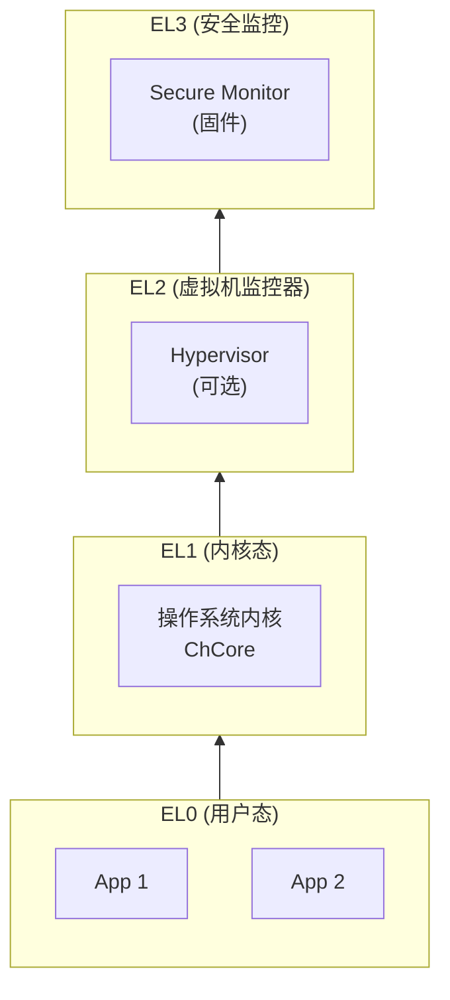
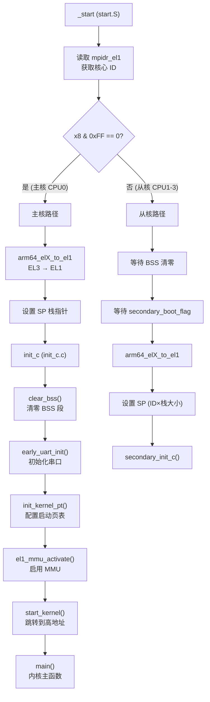
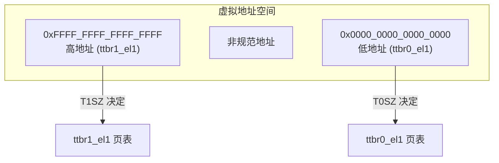
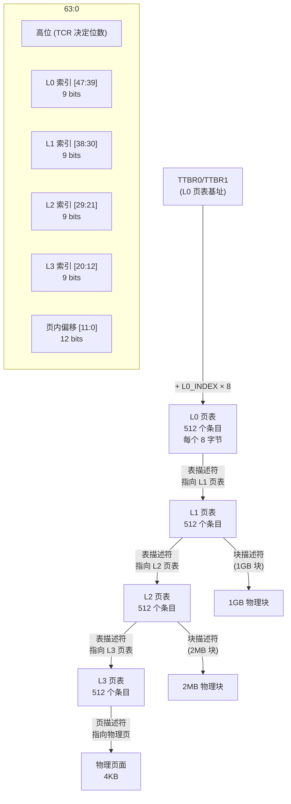
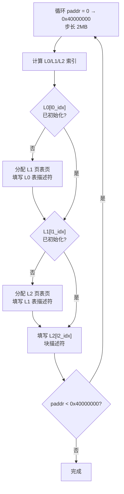

# Lab1：机器启动 — CPU 异常级别、页表与 MMU

## 1 实验概述

### 1.1 实验目标

本实验是 ChCore 操作系统系列实验的第一个内核实验，核心目标是在树莓派 3B+（Raspberry Pi 3）上启动 ChCore 微内核，具体包括：

1. **代码导读**：理解 ChCore 的构建系统和启动流程
2. **机器启动**：设置 CPU 异常级别（EL3 → EL1）、初始化串口输出
3. **页表映射**：配置 AArch64 4 级页表，启用 MMU，使内核运行在高地址

### 1.2 实验平台

| 项目 | 说明 |
|------|------|
| 目标架构 | AArch64 (ARMv8-A) |
| 硬件平台 | Raspberry Pi 3B+（或 QEMU `-M raspi3b`） |
| 内核 | ChCore 微内核（基础版本） |
| 启动地址 | `0x80000`（树莓派加载 kernel 的地址） |

### 1.3 实验成果

完成本实验后，你可以进入 ChCore shell：

```
 ______     __  __     ______     __  __     ______     __         __
/\  ___\   /\ \_\ \   /\  ___\   /\ \_\ \   /\  ___\   /\ \       /\ \
\ \ \____  \ \  __ \  \ \___  \  \ \  __ \  \ \  __\   \ \ \____  \ \ \____
 \ \_____\  \ \_\ \_\  \/\_____\  \ \_\ \_\  \ \_____\  \ \_____\  \ \_____\
  \/_____/   \/_/\/_/   \/_____/   \/_/\/_/   \/_____/   \/_____/   \/_____/

Welcome to ChCore shell!
```

---

## 2 树莓派启动过程

### 2.1 真机启动流程


### 2.2 QEMU 启动

QEMU 模拟器直接通过 `-kernel` 参数加载 ELF 格式的内核映像，跳转到 ELF 头部指定的入口地址（`_start`）：

```bash
qemu-system-aarch64 -M raspi3b \
    -kernel build/kernel.img \
    -serial null -serial stdio
```


---

## 3 AArch64 异常级别详解

### 3.1 异常级别体系

AArch64 架构定义了 4 个异常级别（Exception Level, EL），数字越大特权级越高：



| 级别 | 名称 | 典型用途 | 本实验的角色 |
|------|------|----------|-------------|
| EL3 | Secure Monitor | 安全监控器（ATF/TrustZone） | 启动时 CPU 在此级别，需降至 EL1 |
| EL2 | Hypervisor | 虚拟机监控器（KVM、Xen） | 过渡级别，可能跳过 |
| **EL1** | **操作系统内核** | **运行 OS 内核代码** | **ChCore 目标运行级别** |
| EL0 | 用户程序 | 运行用户态应用程序 | 后续实验的目标 |

**QEMU raspi3b 启动时 CPU 处于 EL3**，ChCore 需要在启动代码中通过 `eret` 指令降级到 EL1。

### 3.2 异常级别切换指令

```asm
eret               // 从高 EL 返回到低 EL
                   // 使用 elr_ELx 作为返回地址
                   // 使用 spsr_ELx 恢复 PSTATE

svc #0             // 从 EL0 触发同步异常到 EL1（系统调用）
hvc #0             // 从 EL1/EL2 触发到 EL2（虚拟机调用）
smc #0             // 从 EL1/EL2/EL3 触发到 EL3（安全监控调用）
```

**从 EL3 降到 EL1 的步骤**：
1. 设置 `elr_el3`：`eret` 后的目标指令地址
2. 设置 `spsr_el3`：eret 后的 PSTATE（含目标异常级别）
3. 执行 `eret`

### 3.3 重要系统寄存器

| 寄存器 | 全称 | 用途 |
|--------|------|------|
| `CurrentEL` | Current Exception Level | 读取当前异常级别 |
| `SCR_EL3` | Secure Configuration Register | 配置 EL3 下的安全设置 |
| `SPSR_EL3` | Saved Program Status Register | 保存 eret 后的 PSTATE |
| `ELR_EL3` | Exception Link Register | 保存 eret 后的 PC |
| `SCTLR_EL1` | System Control Register | 控制 MMU、Cache、对齐检查等 |
| `VBAR_EL1` | Vector Base Address Register | 异常向量表基地址 |
| `TPIDR_EL1` | Software Thread ID Register | 存储每 CPU 数据指针 |
| `MAIR_EL1` | Memory Attribute Indirection Register | 内存属性配置 |
| `TCR_EL1` | Translation Control Register | 地址翻译控制（页大小、地址宽度） |
| `TTBR0_EL1` | Translation Table Base Register 0 | 低地址页表基址 |
| `TTBR1_EL1` | Translation Table Base Register 1 | 高地址页表基址 |

---

## 4 启动流程源码深度分析

### 4.1 完整启动流程



### 4.2 `_start` 汇编源码解析

文件：`kernel/arch/aarch64/boot/raspi3/init/start.S`

```asm
BEGIN_FUNC(_start)
    /* ===== 1. 核心识别 ===== */
    mrs x8, mpidr_el1      // 读取多核处理器亲和性寄存器
    and x8, x8, #0xFF      // 取低 8 位作为 CPU ID
    cbz x8, primary        // x8==0 则为主核，跳转到 primary

    /* ===== 2. 从核路径 ===== */
wait_for_bss_clear:
    adr x0, clear_bss_flag // 等待主核完成 BSS 清零
    ldr x1, [x0]
    cmp x1, #0
    bne wait_for_bss_clear

    bl arm64_elX_to_el1    // 切换到 EL1

    /* 设置从核栈（每个核有独立的栈） */
    mov x1, #INIT_STACK_SIZE    // 栈大小
    mul x1, x8, x1              // ID × 栈大小
    adr x0, boot_cpu_stack
    add x0, x0, x1
    add x0, x0, #INIT_STACK_SIZE
    mov sp, x0

wait_until_smp_enabled:
    /* 等待主核设置 secondary_boot_flag */
    mov x1, #8
    mul x2, x8, x1
    ldr x1, =secondary_boot_flag
    add x1, x1, x2
    ldr x3, [x1]
    cbz x3, wait_until_smp_enabled

    mov x0, x8            // 传递核心 ID
    b secondary_init_c     // 从核开始 C 初始化

    /* ===== 3. 主核路径 ===== */
primary:
    bl arm64_elX_to_el1   // 切换到 EL1

    /* 设置主核栈 */
    adr x0, boot_cpu_stack
    add x0, x0, #INIT_STACK_SIZE
    mov sp, x0

    b init_c               // 主核开始 C 初始化

END_FUNC(_start)
```

**关键点解析**：
- `mpidr_el1`（Multiprocessor Affinity Register）的低 8 位标识 CPU 核心 ID


- `cbz`（Compare and Branch if Zero）实现条件分支
- 从核在 `_start` 处执行两次 `wait`：先等 BSS 清零，再等 `secondary_boot_flag` 置位
- 每个核有独立的启动栈空间，通过 `INIT_STACK_SIZE × CPU_ID` 计算偏移

### 4.3 `arm64_elX_to_el1` 汇编源码解析

文件：`kernel/arch/aarch64/boot/raspi3/init/tools.S`

```asm
BEGIN_FUNC(arm64_elX_to_el1)
    /* ===== 练习 1-2: 获取当前异常级别 ===== */
    /* LAB 1 TODO 1 BEGIN */
    mrs x9, CurrentEL      // 读取当前异常级别
    /* LAB 1 TODO 1 END */

    /* 判断当前 EL，跳转到对应处理 */
    cmp x9, CURRENTEL_EL1  // 已经在 EL1？
    beq .Ltarget
    cmp x9, CURRENTEL_EL2  // 在 EL2？
    beq .Lin_el2

    /* ===== 从 EL3 到 EL1 ===== */
    /* 配置 SCR_EL3：使能 NS/HCE/RW */
    mrs x9, scr_el3
    mov x10, SCR_EL3_NS | SCR_EL3_HCE | SCR_EL3_RW
    orr x9, x9, x10
    msr scr_el3, x9

    /* LAB 1 TODO 2 BEGIN */
    /* 设置 EL3 → EL1 跳转：返回地址 & PSTATE */
    adr x9, .Ltarget       // 目标地址（返回到调用者）
    msr elr_el3, x9        // ELR_EL3 = .Ltarget
    mov x9, SPSR_ELX_DAIF | SPSR_ELX_EL1H  // 屏蔽 DAIF，目标 EL1h
    msr spsr_el3, x9       // SPSR_EL3 = 目标 PSTATE
    /* LAB 1 TODO 2 END */

.Lin_el2:
    /* ===== 从 EL2 到 EL1 ===== */
    /* 设置 CNTHCTL_EL2：允许 EL1 访问 CNTVCT/CNTPCT */
    mrs x9, cnthctl_el2
    orr x9, x9, CNTHCTL_EL2_EL1PCEN | CNTHCTL_EL2_EL1PCTEN
    msr cnthctl_el2, x9

    /* 禁用 stage 2 翻译 */
    msr vttbr_el2, xzr

    /* 禁用 EL2 协处理器 trap */
    mov x9, CPTR_EL2_RES1
    msr cptr_el2, x9

    /* 允许 EL1 使用 FPU/SIMD */
    mov x9, CPACR_EL1_FPEN
    msr cpacr_el1, x9

    /* 配置 HCR_EL2：EL1 为 64 位模式 */
    mov x9, HCR_EL2_RW
    msr hcr_el2, x9

    /* 设置 EL2 → EL1 跳转 */
    adr x9, .Ltarget
    msr elr_el2, x9
    mov x9, SPSR_ELX_DAIF | SPSR_ELX_EL1H
    msr spsr_el2, x9

    isb                    // 指令同步屏障
    eret                   // 切换到 EL1

.Ltarget:
    ret                    // 返回调用者
END_FUNC(arm64_elX_to_el1)
```

**代码逻辑详解**：

```
步骤 1: 读取 CurrentEL → x9
步骤 2: 根据 x9 的值分支
  ├── EL1: 直接跳转到 .Ltarget 返回
  ├── EL2: 配置 EL2 寄存器后通过 eret 降级到 EL1
  └── EL3: 配置 SCR_EL3 → 设置 ELR_EL3/SPSR_EL3 → 落入 EL2 处理
步骤 3: .Ltarget 处 ret 返回调用者
```

**SPSR_ELX_EL1H 的位含义**：

```
      [9:8]  SP 选择: 0b11 → EL1h（使用 EL1 的栈指针）
      [7:6]  异常掩码: 00 → 未屏蔽
      [5]    保留
      [4]    FIQ 掩码: 1 → 掩码
      [3]    IRQ 掩码: 1 → 掩码
      [2]    SError 掩码: 1 → 掩码
      [1]    Debug 掩码: 1 → 掩码
      [0]    M[3:0]: 0b0101 → EL1h
```

### 4.4 `init_c` C 代码解析

文件：`kernel/arch/aarch64/boot/raspi3/init/init_c.c`

```c
void init_c(void)
{
    /* 1. 清零 BSS 段 */
    clear_bss();

    /* 2. 初始化串口（UART） */
    early_uart_init();
    early_uart_send_string("ChCore is starting...\n");

    /* 3. 配置启动页表 */
    init_kernel_pt();

    /* 4. 启用 MMU */
    el1_mmu_activate();

    /* 5. 跳转到高地址的 start_kernel */
    start_kernel();
}
```

### 4.5 串口初始化与输出

文件：`kernel/arch/aarch64/boot/raspi3/peripherals/uart.c`

树莓派 3B+ 使用 PL011 UART，寄存器映射到 MMIO 地址空间：

```c
#define UART_BASE 0x3f215000  // PL011 UART 基址（树莓派 3）

#define UART_DR    (UART_BASE + 0x000)  // 数据寄存器
#define UART_FR    (UART_BASE + 0x018)  // 标志寄存器
#define UART_IBRD  (UART_BASE + 0x024)  // 整数波特率分频
#define UART_FBRD  (UART_BASE + 0x028)  // 小数波特率分频
#define UART_LCRH  (UART_BASE + 0x02C)  // 线路控制
#define UART_CR    (UART_BASE + 0x030)  // 控制寄存器
#define UART_IMSC  (UART_BASE + 0x038)  // 中断掩码

void early_uart_init(void)
{
    /* 配置波特率、数据格式、使能 UART */
    uint32_t reg;

    // 禁用 UART
    mmio_write(UART_CR, 0x0);

    // 设置波特率 (115200)
    mmio_write(UART_IBRD, 26);    // 整数部分
    mmio_write(UART_FBRD, 3);     // 小数部分

    // 配置数据格式: 8 位数据, 1 个停止位, 无校验
    mmio_write(UART_LCRH, (1 << 4) | (1 << 5) | (3 << 5));

    // 启用 UART 和收发
    mmio_write(UART_CR, (1 << 0) | (1 << 8) | (1 << 9));

    // 屏蔽所有中断
    mmio_write(UART_IMSC, 0);
}

void early_uart_send(char c)
{
    /* 等待发送 FIFO 不满，然后写入数据 */
    while (mmio_read(UART_FR) & (1 << 5))
        ;  // 等待 TX FIFO 不满
    mmio_write(UART_DR, c);
}

void uart_send_string(char *str)
{
    /* LAB 1 TODO 3: 实现字符串输出 */
    while (*str) {
        early_uart_send(*str++);
    }
}
```

### 4.6 MMU 启用

文件：`kernel/arch/aarch64/boot/raspi3/init/tools.S`

```asm
BEGIN_FUNC(el1_mmu_activate)
    /* 加载页表基址到 TTBR0/TTBR1 */
    adrp x8, boot_ttbr0_l0
    msr ttbr0_el1, x8       // 低地址页表
    adrp x8, boot_ttbr1_l0
    msr ttbr1_el1, x8       // 高地址页表

    /* 配置 MAIR（内存属性） */
    ldr x8, =mair_el1_value
    msr mair_el1, x8

    /* 配置 TCR（翻译控制） */
    ldr x8, =tcr_el1_value
    msr tcr_el1, x8

    isb

    /* 读取 SCTLR_EL1，设置 M 位启用 MMU */
    mrs x8, sctlr_el1
    /* LAB 1 TODO 4: 启用 MMU */
    orr x8, x8, #SCTLR_EL1_M   // 设置 bit 0 启用 MMU
    msr sctlr_el1, x8

    isb
    ret
END_FUNC(el1_mmu_activate)
```

**`SCTLR_EL1` 关键位**：

```
bit 0:  M   — MMU 启用
bit 1:  A   — 对齐检查
bit 2:  C   — 数据缓存启用
bit 3:  SA  — SP 对齐检查
bit 4:  SA0 — EL0 SP 对齐检查
bit 12: I   — 指令缓存启用
bit 24: nAA — 非对齐访问禁止
```

### 4.7 启动内存布局

#### 内核映像在内存中的布局

当树莓派 BootROM 将 `kernel8.img` 加载到 `0x80000` 后，内存布局如下：

```
低地址
0x00000000 ┌─────────────────────┐
           │     未使用区域       │
0x00000800 │  ARM 中断向量表      │  ← 仅真机使用
           │     (GPU 保留)       │
0x00080000 ├─────────────────────┤  ← 树莓派加载 kernel 的起始地址
           │  .text（代码段）      │
           │  .rodata（只读数据）   │
           │  .data（已初始化数据）  │
           │  .bss（未初始化数据）   │  ← 包含 boot_ttbr0_l0, boot_ttbr1_l0,
           │                      │    clear_bss_flag, secondary_boot_flag
           │  ...................  │
           │  启动栈（向下增长）     │  ← boot_cpu_stack
           │                      │
           │  页表页（BSS 中分配）  │  ← boot_ttbr0_l0, boot_ttbr1_l0
           │                      │    L1, L2 页表
0x40000000 └─────────────────────┘
           │     外设 MMIO         │  ← UART、GPIO 等
高地址
```

#### 静态分配的页表页

ChCore 在 BSS 段中静态声明了启动所需的页表页：

```c
// kernel/arch/aarch64/boot/raspi3/init/mmu.c

// L0 页表（两级：一个给低地址恒等映射，一个给高地址内核映射）
u64 boot_ttbr0_l0[L0_ENTRIES] __attribute__((aligned(PAGE_SIZE)));
u64 boot_ttbr1_l0[L0_ENTRIES] __attribute__((aligned(PAGE_SIZE)));

// L1 页表
u64 boot_ttbr0_l1[L1_ENTRIES] __attribute__((aligned(PAGE_SIZE)));
u64 boot_ttbr1_l1[L1_ENTRIES] __attribute__((aligned(PAGE_SIZE)));

// L2 页表（高地址映射需要多个，因为 4GB / 2MB / 512 = 4 个）
u64 boot_ttbr1_l2[L2_ENTRIES * N_L2_TABLES] __attribute__((aligned(PAGE_SIZE)));
```


- `boot_ttbr0_l0`：低地址（恒等映射）L0 页表，写入 `TTBR0_EL1`
- `boot_ttbr1_l0`：高地址（内核虚拟地址）L0 页表，写入 `TTBR1_EL1`


- 这些数组位于 BSS 段，内核启动时由 `clear_bss()` 自动清零


#### `clear_bss_flag` 同步机制

```c
// init_c.c 中
volatile int clear_bss_flag = 0;

void clear_bss(void)
{
    // 清零 BSS 段
    // ...
    clear_bss_flag = 1;  // 标志位置位，通知从核
}
```

同步流程：
1. 主核在 `init_c()` 中调用 `clear_bss()` 清零 BSS 段
2. 从核在 `_start` 处循环等待 `clear_bss_flag == 1`（通过 `adr` 读取）
3. 主核清零完毕后设置 `clear_bss_flag = 1`
4. 从核检测到标志位后继续执行 `arm64_elX_to_el1`

**为何需要标志位**：BSS 段中的 `boot_ttbr0_l0`、`boot_ttbr1_l0` 等页表数组在清零前包含随机值。如果从核在主核清零前就尝试读取这些页表，会导致不可预测的翻译错误。

---

## 5 AArch64 页表详解

### 5.1 翻译控制寄存器 TCR_EL1



TCR_EL1 决定地址翻译的配置：

```c
// 典型配置：48 位虚拟地址空间
#define TCR_EL1_VALUE (                            \
    TCR_EL1_T0SZ(64 - 48) |    // 低地址: 48 位   \
    TCR_EL1_T1SZ(64 - 48) |    // 高地址: 48 位   \
    TCR_EL1_TG0_4K  |          // 粒度: 4KB       \
    TCR_EL1_TG1_4K  |          // 粒度: 4KB       \
    TCR_EL1_IPS_40BIT |        // 物理地址: 40 位  \
    TCR_EL1_ASID_16 |          // ASID: 16 位      \
    TCR_EL1_SH0_IS  |          // 可共享属性       \
    TCR_EL1_SH1_IS  |                             \
    TCR_EL1_IRGN0_WBWA |       // 写回策略         \
    TCR_EL1_RGN1_WBWA)                             \
```


### 5.2 4 级页表翻译过程



### 5.3 描述符格式

**L0/L1/L2 表描述符和块描述符**：

```
63          48 47       36|35      30|...|11|10|9|8|7|6|4,2|1|0
┌────────────┬───────────┬───────────┬───┬──┬─┬─┬─┬─┬───┬─┬─┐
│ Upper Attr │ Upper PA │ Lower PA  │nG │AF│SH│AP│ │Attr│ │1│ ← bit[0]=1 有效
│ (UXN/PXN..)│ (bits 47:36) │(bits 35:30)│   │  │  │  │  │Indx│  │ │
└────────────┴───────────┴───────────┴───┴──┴─┴─┴─┴─┴───┴─┴─┘
                                                         type bit
```

**描述符类型**（由 bit[0] 和 bit[1] 决定）：

| bit[1:0] | 类型 | 含义 |
|----------|------|------|
| `00` | Invalid | 无效（未映射） |
| `01` | Table | 指向下一级页表（仅 L0-L2） |
| `10` | Block | 块映射（1GB 在 L1，2MB 在 L2） |
| `11` | Page | 页映射（4KB 在 L3） |

**关键属性字段**：

| 字段 | 位 | 含义 |
|------|-----|------|
| `UXN` | bit[54] | EL0 不可执行 |
| `PXN` | bit[53] | EL1 不可执行 |
| `nG` | bit[11] | 非全局（TLB 加 ASID 标记） |
| `AF` | bit[10] | 访问标志（是否被访问过） |
| `SH` | bits[9:8] | 可共享性：00=非共享 10=外设 11=内部 |
| `AP[2:1]` | bits[7:6] | 数据访问权限 |
| `AttrIndx` | bits[4:2] | 内存属性索引（指向 MAIR） |

**访问权限 AP 编码**：

| AP[2:1] | EL1 访问 | EL0 访问 |
|----------|----------|----------|
| 00 | 读写 | 无权限 |
| 01 | 读写 | 读写 |
| 10 | 只读 | 无权限 |
| 11 | 只读 | 只读 |

### 5.4 ChCore 内核页表配置

文件：`kernel/arch/aarch64/boot/raspi3/init/mmu.c`


树莓派 3B+ 的物理地址空间布局：

| 物理地址范围 | 大小 | 设备 |
|-------------|------|------|
| `0x00000000`~`0x3f000000` | 1008 MB | SDRAM（物理内存） |
| `0x3f000000`~`0x40000000` | 16 MB | 共享外设（MMIO） |
| `0x40000000`~`0xffffffff` | 3 GB | 本地外设（每核独立） |

ChCore 需要将 `0x00000000`~`0x80000000` 映射到内核高地址空间 `KERNEL_VADDR + addr`，其中 `KERNEL_VADDR = 0xffffff0000000000`（实验中使用 `0xffff_ff00_0000_0000`）。

**映射方案**：

```c
// 映射 0x00000000~0x3f000000 (1008MB) → Normal Memory, 2MB 块粒度
// 映射 0x3f000000~0x40000000 (16MB)  → Device Memory, 2MB 块粒度
// 映射 0x40000000~0x80000000 (1GB)   → Device Memory, 1GB 块粒度

#define KERNEL_VADDR 0xffffff0000000000

int init_kernel_pt(void)
{
    /* LAB 1 TODO 5: 配置高地址页表 */
    vaddr_t vaddr;
    paddr_t paddr;

    // 映射 0x00000000 ~ 0x40000000 (1GB)
    // 使用 2MB 块粒度
    for (paddr = 0; paddr < 0x40000000; paddr += 0x200000) {
        vaddr = KERNEL_VADDR + paddr;

        // 计算页表索引
        int l0_idx = (vaddr >> 39) & 0x1FF;
        int l1_idx = (vaddr >> 30) & 0x1FF;
        int l2_idx = (vaddr >> 21) & 0x1FF;

        // 在 L1 表中创建表描述符，指向 L2 表
        // 在 L2 表中创建块描述符，映射 2MB

        // 判断映射类型
        unsigned attr;
        if (paddr < 0x3f000000)
            attr = NORMAL_MEMORY;      // Normal Memory
        else
            attr = DEVICE_MEMORY;      // Device Memory

        // 填写页表条目
        boot_ttbr1_l2[l2_idx] =
            (paddr & 0xFFFFFFE00000) |  // 物理地址高位
            attr |                      // 内存属性
            S2AP_READ | S2AP_WRITE |    // 读写权限
            PTE_AF | PTE_BLOCK;         // 访问标志 + 块描述符
    }

    // 映射 0x40000000 ~ 0x80000000 (1GB)
    // 使用 1GB 块粒度
    // ...
}
```

**页表页数量计算**：

```
以 2MB 粒度映射 0~4GB:
- L0: 1 个页表页 (4KB)
- L1: 1 个页表页 (4KB)
- L2: (4GB / 2MB / 512) = 4 个页表页 (16KB)
- 总计: 24KB

以 4KB 粒度映射 0~4GB:
- L0: 1 个页表页 (4KB)
- L1: 1 个页表页 (4KB)
- L2: 4 个页表页 (16KB)
- L3: (4GB / 4KB / 512) = 2048 个页表页 (8MB)
- 总计: ~8MB
```

---

## 6 练习题实现详解

### 6.1 练习 1-2：获取当前异常级别

**文件**：`kernel/arch/aarch64/boot/raspi3/init/tools.S`

**知识点**：`CurrentEL` 系统寄存器的 bit[3:2] 表示当前异常级别：

```
CurrentEL[3:2]:
  00 → EL0
  01 → EL1
  10 → EL2
  11 → EL3
```

**实现**：
```asm
mrs x9, CurrentEL    // x9 = 当前异常级别
lsr x9, x9, #2       // 右移 2 位获得数值
```

### 6.2 练习 3：设置 EL3 → EL1 跳转

**实现**：
```asm
adr x9, .Ltarget     // 目标返回地址（arm64_elX_to_el1 末尾）
msr elr_el3, x9      // 写入异常链接寄存器
mov x9, #0x3C5       // SPSR: M[3:0]=0101 (EL1h), DAIF 屏蔽
msr spsr_el3, x9     // 写入保存的状态寄存器
```

### 6.3 练习 6：UART 字符串输出

**实现**：
```c
void uart_send_string(char *str)
{
    while (*str != '\0') {
        early_uart_send(*str);
        str++;
    }
}
```

### 6.4 练习 7：启用 MMU

**实现**：
```asm
orr x8, x8, #SCTLR_EL1_M   // 设置 bit 0 启用 MMU
msr sctlr_el1, x8
```

### 6.5 练习 10：配置高地址页表

**关键计算**：
- 虚拟地址 `vaddr = KERNEL_VADDR + paddr`
- L0 索引：`(vaddr >> 39) & 0x1FF`
- L1 索引：`(vaddr >> 30) & 0x1FF`
- L2 索引：`(vaddr >> 21) & 0x1FF`
- L3 索引：`(vaddr >> 12) & 0x1FF`

**实现流程**：



---

## 7 实验步骤

### 7.1 环境准备

```bash
# 克隆仓库
git clone -c core.symlinks=true https://github.com/SJTU-IPADS/OS-Course-Lab.git
cd OS-Course-Lab

# 使用 Docker 环境（或用 Dev-Container）
docker pull ipads/oslab:latest
```

### 7.2 构建与运行

```bash
# 进入 Lab1 目录
cd Lab1

# 编译
make

# 在 QEMU 中运行
make qemu

# 使用 GDB 调试
make qemu-gdb    # 终端 1
make gdb          # 终端 2
```

### 7.3 调试技巧

```bash
# 在 GDB 中跟踪启动流程
(gdb) break _start
(gdb) break arm64_elX_to_el1
(gdb) break init_c
(gdb) break el1_mmu_activate

# 单步调试异常级别切换
(gdb) stepi    # 单步执行汇编指令
(gdb) info registers CurrentEL  # 查看当前异常级别

# 查看 MMU 启用后的翻译
(gdb) info registers ttbr0_el1  # 低地址页表基址
(gdb) info registers ttbr1_el1  # 高地址页表基址
(gdb) info registers sctlr_el1  # 系统控制（看 M 位）
```

### 7.4 评分

```bash
make grade
# 预期: 100/100
```

---

## 8 教材阅读指导

本实验与教材《操作系统：原理与实现》（上海交通大学出版社）的以下章节紧密关联。建议结合教材阅读，加深对实验原理的理解。

### 8.1 第 3 章：中断、异常与系统调用

**阅读范围**：第 3.1 节 — 第 3.4 节

**核心内容**：
- **3.1 异常与中断的分类**：同步异常（SVC、缺页）vs 异步异常（IRQ、FIQ、SError），以及 AArch64 中异常级别提升的规则
- **3.2 异常处理过程**：硬件自动保存的上下文（PSTATE、PC 到 SPSR_ELx/ELR_ELx），异常向量表的结构与 `VBAR_ELx` 配置
- **3.3 异常向量表的配置**：16 个条目（4 类异常 × 4 种来源），每个条目最多 32 条指令
- **3.4 系统调用机制**：`svc` 指令触发 EL0→EL1 切换，参数传递约定

**与 Lab1 的关联**：
- Lab1 中的 `arm64_elX_to_el1` 使用 `eret` 降级异常级别，与异常处理中的 `eret` 恢复机制相同
- 理解 `SPSR_EL3` 的设置（M 字段指定目标 EL）是理解异常级别切换的关键

### 8.2 第 4 章：内存管理

**阅读范围**：第 4.1 节 — 第 4.2 节

**核心内容**：
- **4.1 地址空间与地址翻译**：虚拟地址、物理地址、MMU 的作用，AArch64 4 级页表翻译过程
- **4.2 页表映射**：描述符格式（Table/Block/Page）、属性字段（AP、UXN/PXN、AF、SH）、MAIR 内存属性

**与 Lab1 的关联**：
- Lab1 练习 10 的 `init_kernel_pt` 函数直接对应教材 4.2 节中页表映射的实现
- 教材中关于块描述符（Block Descriptor）和页描述符（Page Descriptor）的区分，对应 Lab1 中 2MB 块映射与后续 Lab2 中 4KB 页映射的选择

### 8.3 ChCore 源码与教材的对照

| 教材概念 | ChCore 源码位置 | 功能 |
|----------|----------------|------|
| 异常级别切换 | `tools.S:arm64_elX_to_el1` | 教材 3.1 节的实现 |
| MMU 启用 | `tools.S:el1_mmu_activate` | 教材 4.1 节的实现 |
| 页表翻译 | `mmu.c:init_kernel_pt` | 教材 4.2 节的实现 |
| 内存属性 | `mmu.c:init_kernel_pt` 中的 `NORMAL_MEMORY`/`DEVICE_MEMORY` | 教材 MAIR 部分 |
| 系统寄存器 | `SCTLR_EL1`, `TCR_EL1`, `MAIR_EL1`, `TTBR0/1_EL1` | 教材各节分散涉及 |

---

## 9 拓展与思考

### 9.1 ChCore 为什么需要恒等映射（Identity Mapping）？

**问题**：在启用 MMU 之前，ChCore 为低地址（`0x00000`–`0x40000000`）也配置了页表。为什么不能只映射高地址？

**分析**：

```
启用 MMU 前（PC = 0x80000）：
  CPU 处于物理地址模式，PC 在低地址运行

启用 MMU 的瞬间（设置 SCTLR_EL1.M = 1）：
  CPU 立即开启地址翻译
  下一条指令的 PC（仍在低地址 0x80000+）需要翻译
  如果低地址没有页表 → Translation Fault → CPU 崩溃

启用 MMU 后（跳转到高地址）：
  bl start_kernel 跳转到 KERNEL_VADDR + 偏移
  PC 进入高地址范围 → TTBR1_EL1 页表开始生效
  低地址恒等映射不再使用
```

**结论**：恒等映射解决了 MMU 启用瞬间的 PC 翻译问题。从启用 MMU 到跳转到高地址之间有一个短暂的"过渡窗口"，在此期间 PC 仍在低地址，必须通过 `TTBR0_EL1` 的恒等映射来完成翻译。

### 9.2 为什么 `secondary_boot_flag` 使用虚拟地址？

**问题**：在 `start.S` 中，从核读取 `secondary_boot_flag` 时 MMU 尚未启用，应当使用物理地址。为什么源码中使用的是 `ldr x1, =secondary_boot_flag`（加载虚拟地址）？

**分析**：

```asm
// start.S 从核路径
wait_until_smp_enabled:
    mov x1, #8
    mul x2, x8, x1
    ldr x1, =secondary_boot_flag   // 这里加载的是虚拟地址？
    add x1, x1, x2
    ldr x3, [x1]
    cbz x3, wait_until_smp_enabled
```

关键点在于 `ldr x1, =secondary_boot_flag` 这条伪指令的展开：

```asm
// 汇编器将其展开为：
// 方案 A（PC 相对）：
adrp x1, secondary_boot_flag    // 页地址 = PC + 偏移
add  x1, x1, :lo12:secondary_boot_flag

// 或方案 B（字面量池）：
ldr x1, [pc, #offset]          // 从字面量池加载
// 字面量池中: .quad secondary_boot_flag
```

在 MMU 启用前，从核使用 `adr`/`adrp` 指令（PC 相对寻址）访问 `secondary_boot_flag`，此时 PC 在低地址（`0x80000` 附近），因此 `adrp` 计算出的也是低地址——**此时实际使用的是物理地址**。

而 `ldr x1, =symbol` 是 PC 相对的，在链接时根据当前 PC 计算偏移，不涉及虚拟地址转换。因此实际上**访问的是物理地址**，只是写法上使用了符号名。

**核心理解**：在 MMU 未启用时，只要使用 PC 相对寻址（`adr`/`adrp`/`b`/`bl`），所有地址访问都是物理地址。只有 MMU 启用后，通过 `TTBR0/1_EL1` 的翻译才涉及虚拟地址。

### 9.3 能否用 4KB 粒度代替 2MB 块映射？

**问题**：ChCore 启动页表使用 2MB 块粒度映射 0–4GB 物理地址空间。能否改用 4KB 页粒度？

**计算对比**：

```
2MB 块映射 0–4GB：
  L0: 1 页 （4KB）
  L1: 1 页 （4KB）
  L2: 4 页 （16KB）
  总计: 24KB

4KB 页映射 0–4GB：
  L0: 1 页 （4KB）
  L1: 1 页 （4KB）
  L2: 4 页 （16KB）
  L3: 2048 页 （8MB）
  总计: ~8MB
```

**开销分析**：
- 2MB 方案仅需 24KB 页表空间（可在 BSS 中静态分配）
- 4KB 方案需要约 8MB 页表空间（远超 BSS 段大小，需要动态分配）

**为什么 ChCore 选择 2MB 块**：
1. **启动阶段内存有限**：MMU 启用前只有少量 BSS 空间可用，无法容纳 8MB 页表
2. **启动阶段无需细粒度**：启动阶段只建立内核代码段的映射，不需要精细的页级权限控制
3. **性能优势**：2MB 块映射占用更少 TLB 条目，减少 TLB miss

**什么场景需要 4KB 粒度**：
- 用户态进程需要按页分配内存（写时拷贝、按需分页、页面置换）
- 需要细粒度权限控制（如只读代码页、不可执行数据页）
- 内存充足且碎片化严重时

ChCore 的策略：启动阶段用 **2MB 块**映射，进入内核主函数后再逐步建立 **4KB 页**映射用于用户态进程。

### 9.4 从核如何获得正确的栈指针？

每个 CPU 核心需要独立的栈空间。ChCore 在 BSS 中声明了 `boot_cpu_stack` 数组：

```c
// 启动栈：每个核心 INIT_STACK_SIZE 字节
u64 boot_cpu_stack[PLAT_CPU_NUM][INIT_STACK_SIZE >> 3]
    __attribute__((aligned(16)));
```

从核通过 `mpidr_el1` 的低 8 位（CPU ID）计算栈地址：

```asm
mov x1, #INIT_STACK_SIZE    // 栈大小（如 4096）
mul x1, x8, x1              // ID × 栈大小（偏移量）
adr x0, boot_cpu_stack      // 栈基址（低地址）
add x0, x0, x1              // 基址 + 偏移
add x0, x0, #INIT_STACK_SIZE  // 加上栈大小（指向栈顶，栈向下增长）
mov sp, x0                  // 设置栈指针
```

**注意**：每个栈空间的使用量有限（通常 4KB），如果内核的 C 函数调用栈过深（如递归），可能导致栈溢出覆盖其他核心的栈空间。

---

## 10 GIC（Generic Interrupt Controller）基础

### 10.1 GIC 概述

树莓派 3B+ 使用 ARM GIC（Generic Interrupt Controller）作为中断控制器。在 QEMU `-M raspi3b` 模拟中，GIC 被模拟为 **GICv2** 架构。

GIC 的核心组件：

```
                      ┌─────────────┐
    ┌─────┐           │             │           ┌────────┐
    │ CPU0│◄──────────┤   GIC       ├──────────►│ Timer  │
    └─────┘ IRQ/FIQ   │ Distributor │           └────────┘
                      │     +       │           ┌────────┐
    ┌─────┐           │   CPU       │           │ UART   │
    │ CPU1│◄──────────┤  Interface  ├──────────►├────────┤
    └─────┘           │             │           │ GPIO   │
                      └─────────────┘           └────────┘
```

- **Distributor**：集中管理所有中断源（使能、优先级、中断目标 CPU）
- **CPU Interface**：每个 CPU 核心一个，管理中断的抢占和应答

### 10.2 QEMU raspi3b 中的 GIC

QEMU 模拟的树莓派 3 使用 **GICv2**，通过 MMIO 寄存器访问：

```c
#define GICD_BASE   0x3f841000  // GIC Distributor 基址
#define GICC_BASE   0x3f842000  // GIC CPU Interface 基址

// Distributor 寄存器
#define GICD_CTLR   (GICD_BASE + 0x000)  // 控制器
#define GICD_ISENABLER(n) (GICD_BASE + 0x100 + (n) * 4)  // 中断使能
#define GICD_IPRIORITYR(n) (GICD_BASE + 0x400 + (n) * 4)  // 中断优先级
#define GICD_ITARGETSR(n)  (GICD_BASE + 0x800 + (n) * 4)  // 目标 CPU

// CPU Interface 寄存器
#define GICC_CTLR  (GICC_BASE + 0x000)  // 控制器
#define GICC_PMR   (GICC_BASE + 0x004)  // 优先级掩码
#define GICC_IAR   (GICC_BASE + 0x00C)  // 中断应答
#define GICC_EOIR  (GICC_BASE + 0x010)  // 中断结束
```

### 10.3 GICv2 中断类型

| 中断类型 | ID 范围 | 说明 |
|----------|---------|------|
| SGI（Software Generated Interrupt） | 0–15 | 核间中断（IPI），用于多核通信 |
| PPI（Private Peripheral Interrupt） | 16–31 | 每核私有外设中断（如本地定时器） |
| SPI（Shared Peripheral Interrupt） | 32–1019 | 共享外设中断（如 UART、GPIO） |

**树莓派 3 关键中断号**：

| 中断号 | 类型 | 设备 |
|--------|------|------|
| 16–23 | PPI | 每核 Generic Timer |
| 57 | SPI | PL011 UART |
| 79 | SPI | 迷你 UART |
| 96 | SPI | 本地定时器 |

### 10.4 定时器中断配置

ChCore 使用 ARM Generic Timer 作为系统时钟。定时器中断通过 PPI 方式发送到 GIC：

```c
// 内核/arch/aarch64/plat/raspi3/irq/gic.c

void gic_init(void)
{
    // 1. 禁用 Distributor
    mmio_write(GICD_CTLR, 0);

    // 2. 设置优先级掩码（接收所有中断）
    mmio_write(GICC_PMR, 0xFF);

    // 3. 使能特定中断（如 UART 中断号 57）
    mmio_write(GICD_ISENABLER(57 / 32), 1 << (57 % 32));

    // 4. 设置 CPU Interface
    mmio_write(GICC_CTLR, 1);

    // 5. 启用 Distributor
    mmio_write(GICD_CTLR, 1);
}
```

在 ChCore 中，定时器中断通过 `CNTP_TVAL_EL0` 和 `CNTP_CTL_EL0` 系统寄存器配置：

```c
// 设置定时器下次触发时间（基于当前计数）
void timer_init(void)
{
    // 读取当前计数
    u64 cntpct = read_cntpct_el0();

    // 设置比较值（当前计数 + 时间间隔）
    write_cntp_cval_el0(cntpct + TIMER_INTERVAL);

    // 使能定时器
    write_cntp_ctl_el0(CNTP_CTL_ENABLE);

    // 在 GIC 中使能定时器中断（PPI，中断号 16–23）
    gic_enable_interrupt(30);  // PPI 30 = Generic Timer
}
```

- `CNTPCT_EL0`：物理计数寄存器（只读）
- `CNTP_CVAL_EL0`：比较值寄存器，当 `CNTPCT >= CNTP_CVAL` 时触发中断
- `CNTP_CTL_EL0`：控制寄存器（使能、屏蔽、状态标志）

### 10.5 ICC 系统寄存器

在 GICv2 中，CPU Interface 也可以通过系统寄存器访问（当 `GIC_CPUIF` 启用时）：

```asm
// 读取中断 ID（IAR）
mrs x0, ICC_IAR1_EL1

// 结束中断（EOIR）
msr ICC_EOIR1_EL1, x0
```

优点：无需 MMIO 访问，速度更快，不依赖页表映射。

---

## 11 思考题解析

### 思考题 1：主核与从核的区分

`_start` 开头通过 `mpidr_el1` 寄存器的低 8 位判断核心 ID。CPU0 为主核进入初始化流程，其他核心通过 `cbz` 条件分支进入从核路径，循环等待 `secondary_boot_flag` 被主核置位。

### 思考题 4：启动栈的必要性

C 语言的函数调用依赖栈来保存返回地址、局部变量和寄存器。如果不设置栈指针（SP），`bl` 指令执行时无法保存返回地址（LR），`stp`/`str` 等指令也无法正确执行，会导致 CPU 触发异常甚至 triple fault。

### 思考题 5：不清零 BSS 段的影响

未初始化的全局变量和静态变量存放在 BSS 段。如果不清零，这些变量会包含随机值。当内核代码依赖这些变量的初始零值时（如指针的 NULL 检查、标志位的初始状态），会导致不可预测的行为。例如，若某个锁的初始值非零，后续加锁操作会永远自旋。

### 思考题 8：多级页表 vs 单级页表

**优势**：
- 节省内存：不需要为未映射的虚拟地址范围分配页表页
- 灵活的权限：可在不同级别设置不同的访问权限
- 按需分配：进程的页表页可以在需要时分配
- 大页支持：1GB/2MB 大页减少 TLB miss

**劣势**：
- 翻译延迟：需要多次内存访问（4 级 = 4 次内存访问）
- 实现复杂：需要处理多级索引和分配
- 内存开销：即使没有映射任何页面，也需要至少 L0~L2 三级页表

**4KB 粒度映射 0~4GB**：L0:1 + L1:1 + L2:4 + L3:2048 = 2054 个页表页 ≈ 8MB
**2MB 粒度映射 0~4GB**：L0:1 + L1:1 + L2:4 = 6 个页表页 ≈ 24KB

### 思考题 9：为什么需要低地址页表

在启用 MMU 的瞬间（`sctlr_el1` 的 M 位置 1），PC 指针仍处于低地址（0x80000 附近）。此时 CPU 需要立即对当前 PC 进行地址翻译，如果低地址没有页表映射，会立刻触发 Translation Fault。

因此，ChCore 为低地址也配置了临时的恒等映射（identity mapping），确保启用 MMU 后 CPU 能继续执行低地址处的指令，直到 `start_kernel` 跳转到高地址后才完全切换。

### 思考题 12：从核恢复执行时机

`secondary_boot_flag` 在 `main` 函数执行完时钟、调度器、锁的初始化后被设置。只让主核执行初始化是为了避免多核并发竞态——在锁机制和调度器就绪前，多核同时操作内核数据结构会导致不可预测的结果。

---

## 参考资源

- [Arm Architecture Reference Manual for A-profile](https://documentation-service.arm.com/static/61fbe8f4fa8173727a1b734e) — ARMv8-A 体系结构参考
- ChCore 论文：[ChCore: A Microkernel for System-on-Chip](https://www.usenix.org/conference/atc20/presentation/gu) (USENIX ATC 2020)
- [树莓派 3B+ BCM2836 外设手册](https://datasheets.raspberrypi.com/bcm2836/bcm2836-peripherals.pdf)
- [SCTLR_EL1 寄存器参考](https://developer.arm.com/documentation/ddi0601/2020-12/AArch64-Registers/SCTLR-EL1)
- 课程教材：《操作系统：原理与实现》第 3~4 章

