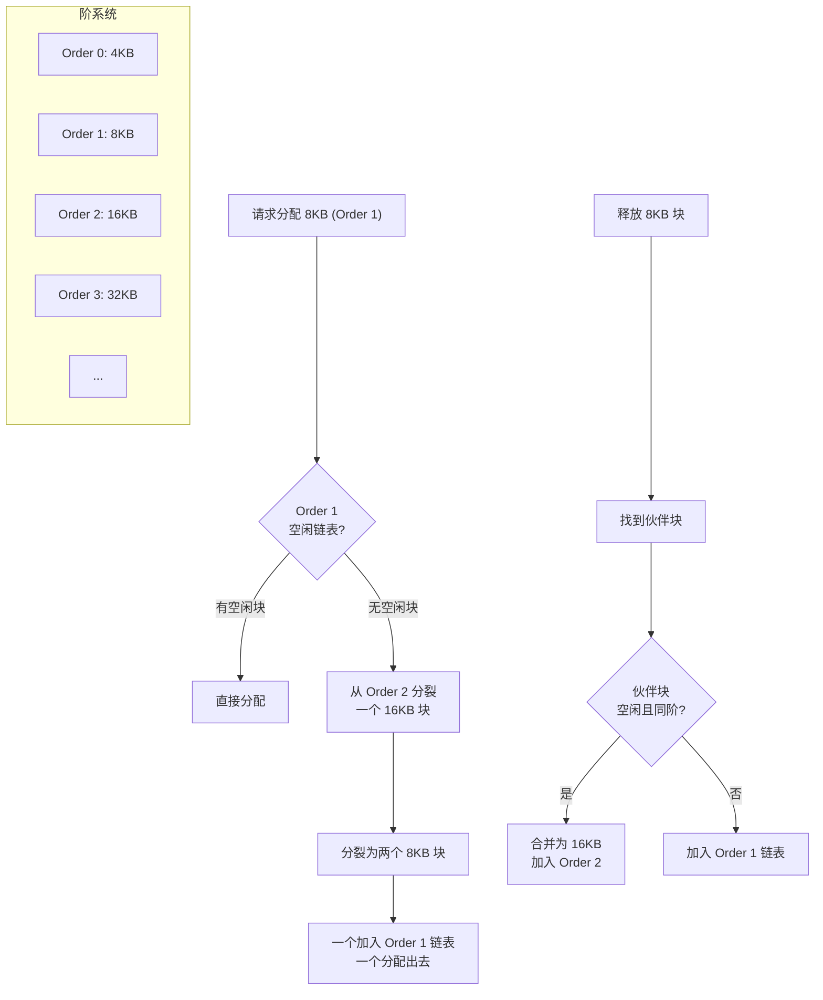
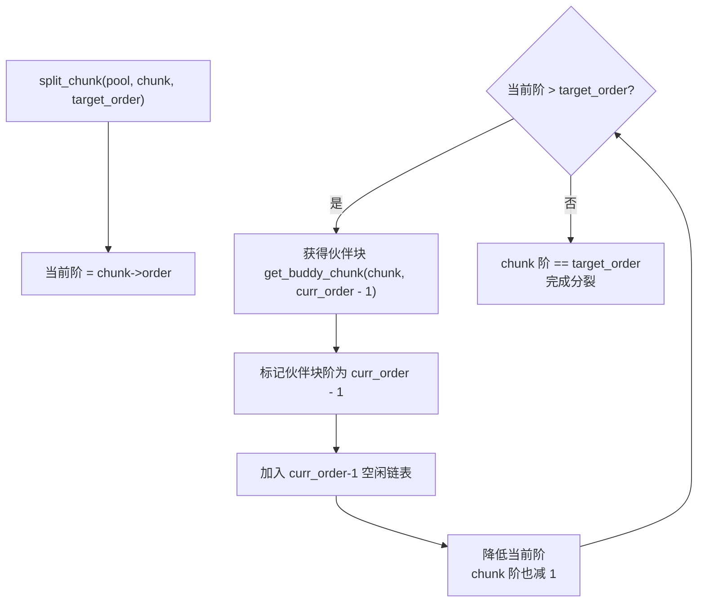
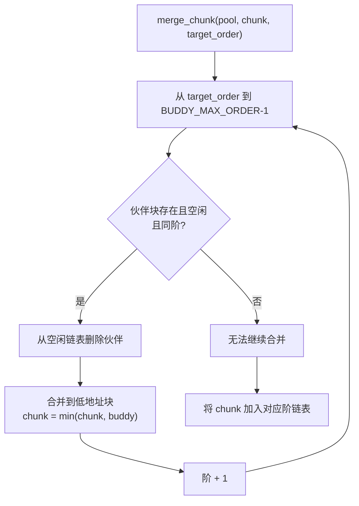
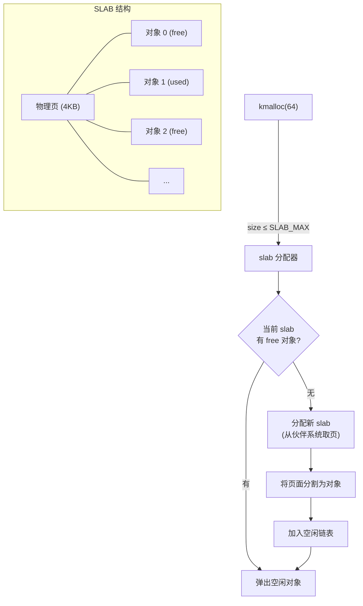
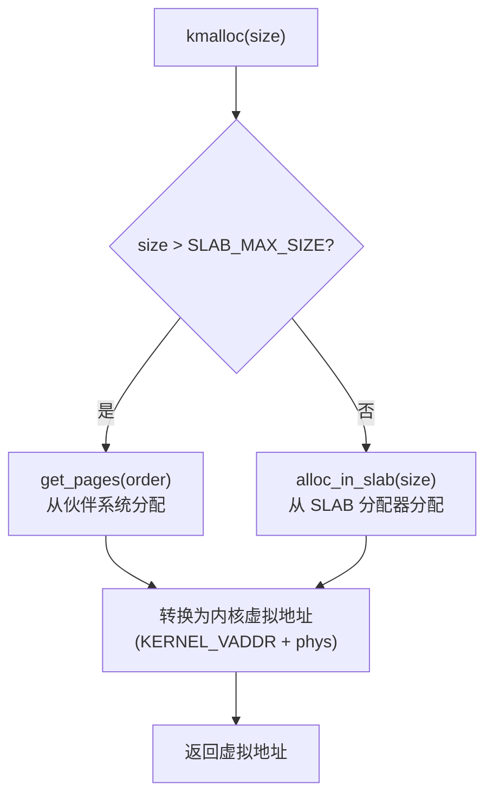
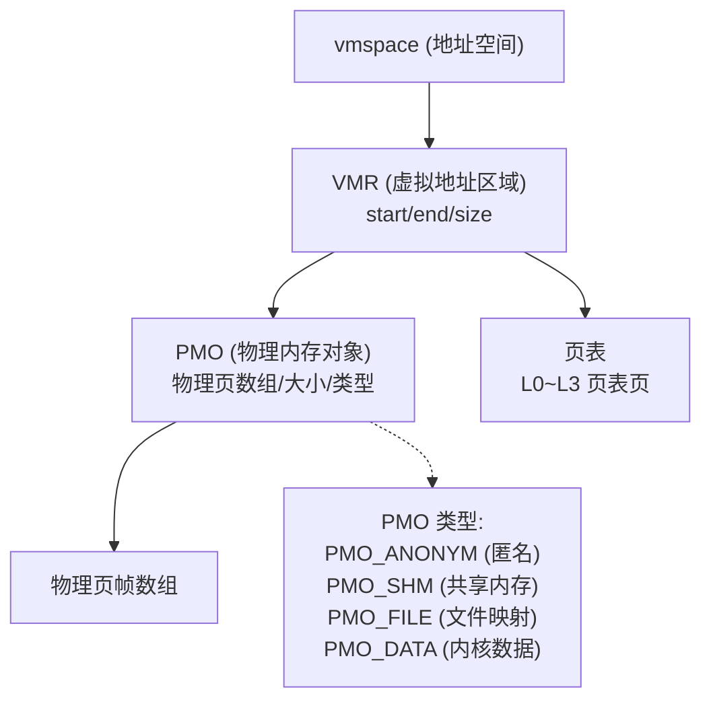
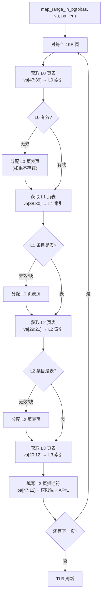
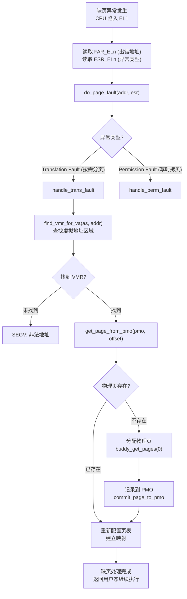
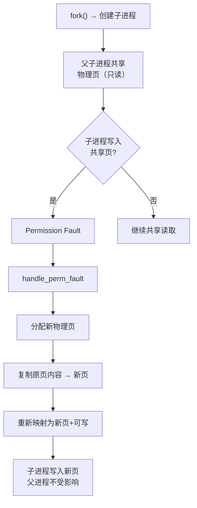

# Lab2：内存管理 — 伙伴系统、SLAB 与缺页异常

## 1 实验概述

### 1.1 实验目标

本实验是 ChCore 操作系统的内存管理模块，包含三个部分：


1. **物理内存管理**：实现伙伴系统（Buddy System）和 SLAB 分配器，提供 `kmalloc`/`kfree` 接口
2. **页表管理**：实现面向应用程序的页表分配/映射/回收
3. **缺页异常处理**：实现按需分页（Demand Paging）和写时拷贝（Copy-on-Write）

### 1.2 实验结构

```
mm_init()
  ├── parse_mem_map()        // 解析可用物理内存区域
  ├── buddy_init()            // 初始化伙伴系统
  ├── slab_init()             // 初始化 SLAB 分配器
  └── kmalloc_init()          // 初始化 kmalloc 分配器
```

---

## 第一部分：物理内存管理

## 2 伙伴系统（Buddy System）

### 2.1 原理概述

伙伴系统是一种将物理内存以 2 的幂次方大小进行管理的算法。



### 2.2 核心数据结构

文件：`kernel/mm/buddy.c`

```c
#define BUDDY_MAX_ORDER 11  // 最大阶数（2^10 × 4KB = 4MB）
#define PAGE_SIZE      4096

/* 物理内存池 */
struct phys_mem_pool {
    struct page *page_metadata;          // 物理页元信息数组
    struct list_head free_lists[BUDDY_MAX_ORDER];  // 各阶空闲链表
    u64 pool_start_addr;                 // 池起始物理地址
    u64 pool_end_addr;                   // 池结束物理地址
    u64 page_num;                        // 物理页数量
};

/* 物理块结构（嵌入在 free_lists 中） */
struct phys_chunk {
    struct list_head node;               // 链表节点
    u64 order;                           // 当前块的阶
};
```

**伙伴系统的工作方式**：

```
每个阶 n 的块大小 = 2^n × PAGE_SIZE = 2^n × 4KB

空闲链表示例：
Order 0: [4KB块] → [4KB块] → NULL          (每个 4KB)
Order 1: [8KB块] → NULL                     (每个 8KB)
Order 2: [16KB块] → [16KB块] → [16KB块] → NULL
...
Order 10: [4MB块] → NULL
```

### 2.3 伙伴关系

两个块互为伙伴的条件：
1. 同一阶大小
2. 物理地址连续
3. 低地址块地址是 `2^(order+1) × PAGE_SIZE` 对齐

```c
/* 获取某个块的伙伴地址 */
static u64 get_buddy_chunk_addr(u64 chunk_addr, int order)
{
    /* 伙伴地址 = chunk_addr XOR (1 << (order + PAGE_SHIFT)) */
    return chunk_addr ^ (1ULL << (order + PAGE_SHIFT));
}
```

### 2.4 分裂算法（练习 1）



```c
static void split_chunk(struct phys_mem_pool *pool,
                        struct phys_chunk *chunk, int target_order)
{
    for (int curr_order = chunk->order;
         curr_order > target_order;
         curr_order--) {

        // 获得同伴块（当前块的伙伴）
        struct phys_chunk *buddy = get_buddy_chunk(chunk, curr_order);

        // 设置同伴的阶并加入空闲链表
        buddy->order = curr_order - 1;
        list_add(&buddy->node,
                 &pool->free_lists[curr_order - 1]);

        // 当前块也降低阶
        chunk->order = curr_order - 1;
    }
}
```

### 2.5 合并算法（练习 1）



```c
static void merge_chunk(struct phys_mem_pool *pool,
                        struct phys_chunk *chunk, int target_order)
{
    for (int curr_order = target_order;
         curr_order < BUDDY_MAX_ORDER - 1;
         curr_order++) {

        struct phys_chunk *buddy = get_buddy_chunk(chunk, curr_order);

        // 检查伙伴块是否空闲且阶数匹配
        if (buddy->order != curr_order)
            break;

        // 从空闲链表移除伙伴
        list_del(&buddy->node);

        // 合并到低地址块
        if (buddy < chunk)
            chunk = buddy;

        chunk->order = curr_order + 1;
    }

    // 将合并后的块加入空闲链表
    list_add(&chunk->node, &pool->free_lists[chunk->order]);
}
```

### 2.6 分配与释放（练习 1）

```c
/* 分配指定阶的连续物理页 */
struct phys_chunk *buddy_get_pages(struct phys_mem_pool *pool, int order)
{
    // 从指定阶开始向上搜索空闲块
    for (int curr_order = order; curr_order < BUDDY_MAX_ORDER; curr_order++) {
        if (list_empty(&pool->free_lists[curr_order]))
            continue;

        // 取出一个空闲块
        struct phys_chunk *chunk = list_entry(
            pool->free_lists[curr_order].next,
            struct phys_chunk, node);
        list_del(&chunk->node);

        // 如果块比需要的阶大，分裂
        if (chunk->order > order)
            split_chunk(pool, chunk, order);

        return chunk;
    }
    return NULL;  // 没有可用内存
}

/* 释放连续物理页 */
void buddy_free_pages(struct phys_mem_pool *pool,
                      struct phys_chunk *chunk)
{
    int order = chunk->order;

    // 尝试合并伙伴块
    merge_chunk(pool, chunk, order);
}
```

---

## 3 SLAB 分配器

### 3.1 原理概述

SLAB 分配器用于处理小内存分配（如 `kmalloc(64)`），避免频繁调用伙伴系统带来的开销。



### 3.2 SLAB 结构与实现

```c
/* SLAB 管理结构 */
struct slab {
    struct list_head node;          // slab 链表节点
    struct list_head free_list;     // 空闲对象链表
    void *start_addr;               // slab 起始地址
    int order;                      // 占用物理页的阶
    int total_cnt;                  // 对象总数
    int free_cnt;                   // 空闲对象数
};

/* SLAB 分配器 */
struct slab_allocator {
    struct list_head slabs;         // 所有 slab 的链表（用于释放）
    struct list_head partial_slabs; // 部分空闲的 slab
    struct slab *current_slab;      // 当前分配用的 slab
    int obj_size;                   // 对象大小
    int color_off;                  // 着色偏移（缓存优化）
};
```

### 3.3 关键函数实现（练习 2）

```c
/* 选择新的当前 slab（当前 slab 满时切换） */
static void choose_new_current_slab(struct slab_allocator *alloc)
{
    // 先从 partial_slabs 查找
    if (!list_empty(&alloc->partial_slabs)) {
        alloc->current_slab = list_entry(
            alloc->partial_slabs.next,
            struct slab, node);
        return;
    }

    // 没有 partial slab，创建新 slab
    // （分配物理页并划分为对象）
    struct slab *new_slab = allocate_new_slab(alloc);
    alloc->current_slab = new_slab;
}

/* 从 SLAB 中分配对象 */
void *alloc_in_slab_impl(struct slab_allocator *alloc)
{
    struct slab *slab = alloc->current_slab;

    // 检查当前 slab 是否有空闲对象
    if (!slab || slab->free_cnt == 0)
        choose_new_current_slab(alloc);

    slab = alloc->current_slab;
    if (!slab)
        return NULL;

    // 从空闲链表取出一个对象
    struct list_head *free_obj = slab->free_list.next;
    list_del(free_obj);
    slab->free_cnt--;

    return free_obj;
}

/* 释放 SLAB 对象 */
void free_in_slab(struct slab_allocator *alloc, void *obj)
{
    // 将对象加入空闲链表
    list_add((struct list_head *)obj, &alloc->current_slab->free_list);
    alloc->current_slab->free_cnt++;

    // 如果 slab 变为全空，考虑归还给伙伴系统
    // 如果 slab 从全满变为部分空闲，移入 partial_slabs
}
```

---

## 4 kmalloc 统一接口

### 4.1 分配策略（练习 3）

```c
/* kmalloc 实现 */
void *_kmalloc(u64 size, u64 align)
{
    void *ptr;

    // 大请求直接从伙伴系统分配
    if (size > SLAB_MAX_SIZE) {
        int order = get_order(size) + PAGE_SHIFT;
        ptr = get_pages(order);
    }
    // 小请求由 SLAB 分配器处理
    else {
        ptr = alloc_in_slab(size);
    }

    // 地址对齐处理
    if (align > 0)
        ptr = align_up(ptr, align);

    return ptr;
}
```

**分配决策树**：



---

## 第二部分：页表管理

## 5 VMR 与 PMO 对象模型

### 5.1 对象关系



### 5.2 页表操作

```c
/* 映射虚拟地址范围到物理地址 */
int map_range_in_pgtbl(struct addr_space *as,
                       vaddr_t va, paddr_t pa,
                       size_t len, u64 perm)
{
    // 1. 遍历所有需要映射的页（4KB 对齐）
    // 2. 对每个页面：
    //    a. 获取或创建 L0~L3 页表页
    //    b. 填写 L3 页描述符
    //    c. 设置权限（AP/UXN/PXN 等）
    // 3. 刷新 TLB
}

/* 取消映射虚拟地址范围 */
int unmap_range_in_pgtbl(struct addr_space *as,
                         vaddr_t va, size_t len)
{
    // 1. 遍历页表
    // 2. 清除页描述符（置 0）
    // 3. 可选：释放页表页
    // 4. 刷新 TLB
}
```


**页表遍历流程**：



### 5.3 VMR 与 PMO 数据结构详解

#### `struct vmregion` 虚拟地址区域

```c
/* 文件: kernel/mm/vmregion.h */
struct vmregion {
    struct list_head            list_node;         /* VMR 链表节点 */
    struct rb_node              tree_node;         /* VMR 红黑树节点 */
    struct mapping_list_node    mapping_list_node; /* PMO 映射链表节点 */
    struct vmspace             *vmspace;           /* 所属地址空间 */
    vaddr_t                     start;             /* 起始虚拟地址 */
    size_t                      size;              /* 区域大小 */
    unsigned long               offset;            /* 在 PMO 内的偏移 */
    vmregion_perm_t             perm;              /* 访问权限 */
    struct pmobject            *pmo;               /* 关联的物理内存对象 */
    bool                        cow_private_pages; /* 是否已私有化 (COW) */
};
```

| 字段 | 说明 |
|------|------|
| `list_node` | 挂入 `vmspace->vmr_list` 双向链表，用于顺序遍历 VMR |
| `tree_node` | 挂入 `vmspace->vmr_tree` 红黑树，用于快速查找 |
| `mapping_list_node` | 挂入 `pmo->mapping_list`，记录哪些 VMR 映射到此 PMO |
| `vmspace` | 所属地址空间，多线程共享同一 `vmspace` |
| `start` / `size` | VMR 覆盖的虚拟地址范围 `[start, start+size)` |
| `offset` | 在 `pmo` 中的起始偏移，同一 PMO 的不同部分可映射到不同 VMR |
| `perm` | VMR 权限（VMR_READ / VMR_WRITE / VMR_EXEC） |
| `cow_private_pages` | 写时拷贝优化：首次写后置为 `true`，后续无需再拷贝 |

#### `struct vmspace` 地址空间

```c
/* 文件: kernel/mm/vmspace.h */
struct vmspace {
    struct lock             vmr_list_lock;
    struct list_head        vmr_list;              /* VMR 顺序链表 */
    struct lock             vmr_tree_lock;
    struct rb_root          vmr_tree;              /* VMR 红黑树 */
    pml4_table_t            pgtbl;                 /* 页表基址 */
    u16                     pcid;                  /* PCID 进程上下文标识 */
    cpuid_t                 history_cpus[CONFIG_CPU_NUM]; /* 历史运行 CPU */
    struct vmregion        *heap_boundary_vmr;     /* 堆边界 VMR */
    s64                     rss;                   /* 常驻内存页数 */
};
```

**为什么同时使用链表和红黑树？**

| 数据结构 | 用途 | 复杂度 |
|----------|------|--------|
| **链表** `vmr_list` | 创建/销毁 VMR 时顺序插入，遍历时顺序访问 | O(n) |
| **红黑树** `vmr_tree` | 缺页处理时按虚拟地址查找所属 VMR | O(log n) |

二者互补：链表提供 TLB 亲和性的顺序访问，红黑树提供 O(log n) 精确查找。`find_vmr_for_va` 在缺页路径上被频繁调用，因此使用红黑树：

```c
/* 文件: kernel/mm/vmspace.c */
struct vmregion *find_vmr_for_va(struct addr_space *as, vaddr_t va)
{
    struct rb_node *node = as->vmr_tree.rb_node;

    while (node) {
        struct vmregion *vmr = rb_entry(node, struct vmregion, tree_node);

        if (va < vmr->start) {
            node = node->rb_left;
        } else if (va >= vmr->start + vmr->size) {
            node = node->rb_right;
        } else {
            return vmr;
        }
    }
    return NULL;
}
```


#### `struct pmobject` 物理内存对象

```c
/* 文件: kernel/mm/pmo.h */
struct pmobject {
    enum pmo_type           type;               /* PMO 类型 */
    struct radix_tree_root  phys_segment;       /* 物理段基数树 */
    struct list_head        mapping_list;       /* 映射到此 PMO 的 VMR 链表 */
    struct radix_tree_root  slot;               /* 物理页 slot 基数树 */
    u64                     size;               /* PMO 覆盖大小 (字节) */
    struct radix_tree_root  pmo_pte_list;       /* PMO PTE 回写链表 */
    struct vmspace         *owner;              /* 所有者地址空间 */
    struct lock             lock;
    atomic_t                refcnt;
    bool                    is_committed;
};
```

| 类型 | 含义 | 用途示例 |
|------|------|----------|
| `PMO_ANONYM` | 匿名内存 | 进程堆、栈、BSS |
| `PMO_SHM` | 共享内存 | 进程间通信 |
| `PMO_FILE` | 文件映射 | `mmap` 文件 |
| `PMO_DATA` | 内核数据 | 内核内部使用 |

PMO 使用 **基数树 (Radix Tree)** 管理物理页 `slot`，按页偏移索引。`get_page_from_pmo(pmo, offset)` 从基数树查询物理页是否存在——若不存在则触发分配。

#### 体系结构无关的 `common_pte_t`

```c
/* 文件: kernel/mm/common_pte.h */
typedef union common_pte {
    struct {
        u64 perm    : 10;   /* AP[2:1], UXN, PXN */
        u64 sw0     : 3;    /* 软件位 (COW 标记等) */
        u64 rsrv    : 6;
        u64 pfn     : 36;   /* 物理帧号 [47:12] */
        u64 sw1     : 2;    /* 软件位 */
        u64 rsvd2   : 1;
    } __attribute__((packed));
    u64 pte;
} common_pte_t;
```

`common_pte_t` 将体系结构相关的页表描述符抽象为统一结构，使内核其他模块无需直接操作 ARM64 位域。

---

### 5.4 ARM64 页表描述符格式

ARMv8-A 使用 4 级页表（L0–L3），每级 512 条 8 字节描述符：

```c
/* 文件: kernel/arch/aarch64/mm/page_table.h */
typedef union pte {
    struct {
        u64 valid      : 1;   /* [0]   */
        u64 type       : 1;   /* [1]   0=块/页, 1=表 */
        u64 attr       : 10;  /* [11:2] */
        u64 next_table : 36;  /* [47:12] 下一级页表物理地址 */
        u64 res0       : 16;  /* [63:48] */
    } table;                   /* 表描述符 (type=1) */

    struct {
        u64 valid      : 1;   /* [0]   */
        u64 type       : 1;   /* [1]   0 */
        u64 attr       : 10;  /* [11:2] AP, AF, SH, AttrIndx */
        u64 addr       : 36;  /* [47:12] 物理地址高 36 位 */
        u64 res0       : 4;   /* [51:48] */
        u64 attr_high  : 12;  /* [63:52] XN, PXN, 等 */
    } block;                   /* 块/页描述符 (type=0) */

    u64 pte;
} pte_t;

typedef pte_t ptp_t[Lx_ENTRY_NUM];  /* 页表页 = 512 × 8 = 4KB */
```

**各级描述符粒度**：

| 级别 | 描述符类型 | 覆盖范围 | 输出大小 |
|------|-----------|----------|----------|
| L0 | 表 (必须指向 L1) | 512 × 512GB = 256TB | — |
| L1 | 表或块 (1GB) | 512 × 1GB = 512GB | 1GB 大页 |
| L2 | 表或块 (2MB) | 512 × 2MB = 1GB | 2MB 大页 |
| L3 | 页 (4KB) | 512 × 4KB = 2MB | 4KB 页 |

**虚拟地址索引计算**：

```
47              39  38            30  29            21  20            12  11         0
┌─────────────────┬─────────────────┬─────────────────┬─────────────────┬──────────────┐
│   L0 索引       │   L1 索引       │   L2 索引       │   L3 索引       │  页内偏移    │
│   bits[47:39]   │   bits[38:30]   │   bits[29:21]   │   bits[20:12]   │  bits[11:0]  │
└─────────────────┴─────────────────┴─────────────────┴─────────────────┴──────────────┘
```

**页表项权限位详解**：

```c
/* 描述符 attr 字段 (bits[11:2]) */
#define PTE_ATTR_AP_MASK    0x3C    /* bits [7:6] AP[2:1] */
#define PTE_ATTR_AP_EL1_RW  0x00    /* EL1 读写, EL0 无访问 */
#define PTE_ATTR_AP_EL1_RO  0x08    /* EL1 只读 */
#define PTE_ATTR_AP_EL2_RW  0x10    /* EL2 读写 */
#define PTE_ATTR_AP_EL0_RW  0x14    /* EL0/EL1 均可读写 */
#define PTE_ATTR_AF         0x01    /* Access Flag */
#define PTE_ATTR_SH         0x06    /* 可共享属性 */
#define PTE_ATTR_ATTR_IDX   0x1C    /* MAIR 属性索引 */

/* 描述符 attr_high 字段 (bits[63:52]) */
#define PTE_ATTR_UXN        0x1000  /* 用户不可执行 */
#define PTE_ATTR_PXN        0x2000  /* 特权不可执行 */
#define PTE_ATTR_CONTIG     0x4000  /* 连续页提示 */
#define PTE_ATTR_DBM        0x8000  /* Dirty Bit Modifier */
```

---

### 5.5 `map_range_in_pgtbl` 深度分析

`map_range_in_pgtbl_common` 是 ChCore 中最复杂的页表函数，以 4 级循环遍历 L0→L3，在需要时分配中间页表页。

```c
/* 文件: kernel/arch/aarch64/mm/pagetable.c */
int map_range_in_pgtbl_common(struct addr_space *as,
    vaddr_t va, paddr_t pa, size_t len, u64 perm, ...)
{
    struct pgtable *pgtbl = &as->pgtbl;
    int l0_idx, l1_idx, l2_idx, l3_idx;
    int total_page_cnt = len / PAGE_SIZE;
    ptp_t *l0_ptp, *l1_ptp, *l2_ptp, *l3_ptp;

    /* 提取初始索引 */
    l0_idx = GET_L0_INDEX(va);
    l1_idx = GET_L1_INDEX(va);
    l2_idx = GET_L2_INDEX(va);
    l3_idx = GET_L3_INDEX(va);

    while (total_page_cnt > 0) {
        /* --- L0: 获取或创建 --- */
        l0_ptp = get_next_ptp(pgtbl, l0_idx, 0, ...);

        for (; l0_idx < L0_ENTRY_NUM && total_page_cnt > 0; l0_idx++) {
            /* --- L1: 获取或创建 --- */
            l1_ptp = get_next_ptp(l0_ptp, l1_idx, 0, ...);

            for (; l1_idx < L1_ENTRY_NUM && total_page_cnt > 0; l1_idx++) {
                /* --- L2: 获取或创建 --- */
                l2_ptp = get_next_ptp(l1_ptp, l2_idx, 0, ...);

                for (; l2_idx < L2_ENTRY_NUM && total_page_cnt > 0; l2_idx++) {
                    /* --- L3: 获取或创建 --- */
                    l3_ptp = get_next_ptp(l2_ptp, l2_idx, 0, ...);

                    /* --- 填充 L3 页描述符 (最多 512 个) --- */
                    for (; l3_idx < L3_ENTRY_NUM && total_page_cnt > 0;
                         l3_idx++, total_page_cnt--, pa += PAGE_SIZE) {

                        l3_ptp[l3_idx] = (pte_t){
                            .l3_page.valid = 1,
                            .l3_page.type  = PAGE_DESC,
                            .l3_page.pfn   = pa >> PAGE_SHIFT,
                            .l3_page.attr  = perm,
                        };
                    }
                    l3_idx = 0;  /* 下一个 L2 条目，L3 从头开始 */
                }
                l2_idx = 0;
            }
            l1_idx = 0;
        }
    }

    dsb();           /* 数据同步屏障 */
    flush_tlb_all(); /* TLB 全部失效 */
    return 0;
}
```

**执行示例**：映射 `va=0x1000, pa=0x40000000, len=0x3000`（3 页）

| 迭代 | L0 | L1 | L2 | L3 | 动作 |
|------|-----|-----|-----|-----|------|
| 1 | 0 | 0 | 0 | 0 | 填充页 0: `l3[0] = 0x40000000` |
| 2 | 0 | 0 | 0 | 1 | 填充页 1: `l3[1] = 0x40001000` |
| 3 | 0 | 0 | 0 | 2 | 填充页 2: `l3[2] = 0x40002000` |

**执行示例**：映射 `va=0x1FE00000, len=0x3000`（跨 L2 边界）

```
L2 索引 = (0x1FE00000 >> 21) & 0x1FF = 0xFF
L3 索引 = (0x1FE00000 >> 12) & 0x1FF = 0x000

第 1 个 L3 页表 (L2[0xFF]):
  l3[0x000..0x1FF] = 512 页 (2MB) → 跨 L2 边界

第 2 个 L3 页表 (L2[0x100]):
  l3[0x000..0x001] = 剩余 2 页 → 自动处理
```

**`get_next_ptp` 核心逻辑**：

```c
static ptp_t *get_next_ptp(ptp_t *table, int index,
                            int alloc_if_null, ...)
{
    if (pte_is_valid(table[index])) {
        /* 页表已存在 → 返回下一级页表地址 */
        return phys_to_virt(pte_get_next_table(table[index]));
    }

    if (!alloc_if_null)
        return NULL;

    /* 分配新的页表页并链接到父级 */
    ptp_t *new_table = alloc_page_table();
    table[index] = (pte_t){
        .table.valid = 1,
        .table.type  = TABLE_DESC,
        .table.next_table = virt_to_phys(new_table),
    };
    return new_table;
}
```

---

### 5.6 `query_in_pgtbl` 与 `mprotect_in_pgtbl`

#### 查询页表映射

`query_in_pgtbl` 遍历 4 级页表，逐级检查块描述符，遇到大页时提前返回：

```c
/* 查询虚拟地址的物理地址和页表条目 */
int query_in_pgtbl(struct addr_space *as, vaddr_t va,
                   paddr_t *pa, pte_t **entry)
{
    ptp_t *l0, *l1, *l2, *l3;
    u64 l0_idx, l1_idx, l2_idx, l3_idx;
    struct pgtable *pgtbl = &as->pgtbl;

    l0_idx = GET_L0_INDEX(va);
    l0 = get_page_table(pgtbl, l0_idx, 0);
    if (!l0 || !pte_is_valid((*l0)[l0_idx]))
        return -ENOMAPPING;

    l1_idx = GET_L1_INDEX(va);
    l1 = get_page_table((*l0)[l0_idx], l1_idx, 0);
    if (!l1 || !pte_is_valid(l1[l1_idx]))
        return -ENOMAPPING;

    /* L1 块: 1GB 大页映射 */
    if (IS_BLOCK(l1[l1_idx])) {
        *pa = BLOCK_PADDR(l1[l1_idx]) + (va & (L1_BLOCK_SIZE - 1));
        *entry = &l1[l1_idx];
        return 0;
    }

    l2_idx = GET_L2_INDEX(va);
    l2 = get_page_table(l1[l1_idx], l2_idx, 0);
    if (!l2 || !pte_is_valid(l2[l2_idx]))
        return -ENOMAPPING;

    /* L2 块: 2MB 大页映射 */
    if (IS_BLOCK(l2[l2_idx])) {
        *pa = BLOCK_PADDR(l2[l2_idx]) + (va & (L2_BLOCK_SIZE - 1));
        *entry = &l2[l2_idx];
        return 0;
    }

    l3_idx = GET_L3_INDEX(va);
    l3 = get_page_table(l2[l2_idx], l3_idx, 0);
    if (!l3 || !IS_PAGE(l3[l3_idx]))
        return -ENOMAPPING;

    /* L3 页: 4KB */
    *pa = PAGE_PADDR(l3[l3_idx]) + (va & (PAGE_SIZE - 1));
    *entry = &l3[l3_idx];
    return 0;
}
```

**查询场景总结**：

```
查询 va=0x1000, 未映射 → return -ENOMAPPING
查询 va=0x1000, 已映射 → *pa=物理地址, *entry=指向 L3 条目, return 0
查询 va 在 L2 大页中  → 在 L2 级返回，*pa = 块地址 + 页内偏移
查询 va 在 L1 大页中  → 在 L1 级返回，*pa = 块地址 + 页内偏移
```

#### 批量权限修改

`mprotect_in_pgtbl` 修改一段虚拟地址范围的权限位，核心优化是遇到大页块时跳过整个块范围：

```c
int mprotect_in_pgtbl(struct addr_space *as,
                      vaddr_t va, size_t len, u64 perm)
{
    u64 remaining = len;

    while (remaining > 0) {
        paddr_t pa;
        pte_t *entry;
        u64 step;

        if (query_in_pgtbl(as, va, &pa, &entry) != 0) {
            /* 未映射区域: 跳到下一对齐页 */
            step = PAGE_SIZE - (va & (PAGE_SIZE - 1));
        } else {
            /* 已映射: 修改权限 */
            entry->pte = (entry->pte & ~PTE_ATTR_PERM_MASK) | perm;

            /* 计算当前条目覆盖的大小 */
            if (IS_L1_BLOCK(entry))     step = L1_BLOCK_SIZE;
            else if (IS_L2_BLOCK(entry)) step = L2_BLOCK_SIZE;
            else                         step = PAGE_SIZE;

            step = MIN(step - (va & (step - 1)), remaining);
        }

        va += step;
        remaining -= step;
    }

    dsb();
    flush_tlb_all();
    return 0;
}
```

**效率对比**：修改 1GB 连续区域

| 方式 | 遍历次数 | 页表操作 |
|------|---------|----------|
| 逐页 (4KB) | 262,144 次 | 每次查 L0→L3 |
| 大页感知 | 1 次 | 在 L1 找到块描述符，修改一次 |
| 差距 | **≈ 26 万倍** | — |

---

### 5.7 `init_kernel_pt` 内核页表初始化

内核启动时，`init_kernel_pt` 建立内核直接映射区（`0xffffff0000000000` → 物理内存）：

```c
/* 文件: kernel/arch/aarch64/mm/init_kernel_pt.c */
void init_kernel_pt(void)
{
    u64 kernel_vaddr = 0xffffff0000000000;
    u64 kernel_paddr = PHYS_ADDR_START;

    u64 l0_idx = GET_L0_INDEX(kernel_vaddr);  /* = 511 */
    u64 l1_idx = GET_L1_INDEX(kernel_vaddr);  /* = 0   */
    u64 l2_idx = GET_L2_INDEX(kernel_vaddr);  /* = 0   */

    /* 分配 L0→L1→L2 页表页 */
    ptp_t *l0_ptp = alloc_page_table();
    ptp_t *l1_ptp = alloc_page_table();
    ptp_t *l2_ptp = alloc_page_table();

    l0_ptp[l0_idx] = (pte_t){
        .table.valid = 1,
        .table.type  = TABLE_DESC,
        .table.next_table = virt_to_phys(l1_ptp),
    };

    l1_ptp[l1_idx] = (pte_t){
        .table.valid = 1,
        .table.type  = TABLE_DESC,
        .table.next_table = virt_to_phys(l2_ptp),
    };

    /* 使用 2MB 块映射内核直接映射区 */
    for (int i = 0; i < kernel_pages; i++) {
        l2_ptp[l2_idx + i] = (pte_t){
            .block.valid  = 1,
            .block.type   = BLOCK_DESC,
            .block.addr   = (kernel_paddr + i * L2_BLOCK_SIZE) >> PAGE_SHIFT,
            .block.attr   = NORMAL_MEM_ATTR | AP_EL1_RW | PTE_ATTR_AF,
            .attr_high    = PTE_ATTR_PXN,
        };
    }
}
```

**为什么 `0xffffff0000000000`？**

```
0xffffff0000000000 >> 39 = 0x1FFFFFF
0x1FFFFFF & 0x1FF = 0x1FF = 511
```

它恰好落在 48 位虚拟地址空间的最高 512GB 区域——L0 的最后一个条目（索引 511）。这使得内核占用最少的 L0 条目，为用户空间保留更多地址空间。

**MAIR 属性选择**：

| AttrIndx | 类型 | 用途 |
|----------|------|------|
| 0 | Normal (RW, 可缓存) | 内核代码/数据 |
| 1 | Device-nGnRE | MMIO (如 UART) |
| 2 | Normal-NC (非缓存) | DMA 内存 |

`attr` 字段的 `bits[4:2]` 选择 MAIR 索引。MAIR_EL1 寄存器每 8 位定义一个 AttrIndx 对应的内存类型。

**`init_kernel_pt` 完成后各级页表结构**：

```
TTBR1_EL1 ──→ L0[0..510] = 无效 (用户空间)
              L0[511] ──→ L1[0] ──→ L2[0..n] = 2MB Block
                                       ↑ 每个 Block 映射 2MB 物理内存
                                       ↑ 总映射大小 = n × 2MB
```

---

---

## 第三部分：缺页异常处理

## 6 缺页异常机制

### 6.1 缺页处理流程（练习 8-10）



### 6.2 `do_page_fault` 实现（练习 8）

```c
/* 文件: kernel/arch/aarch64/irq/pgfault.c */
void do_page_fault(u64 fault_addr, u64 esr)
{
    struct addr_space *as = get_current_addr_space();
    u64 fault_type = esr & ESR_ELX_EXCEPTION_TYPE;

    switch (fault_type) {
    case ESR_ELX_TRANSLATION_FAULT:
        /* 翻译错误：页面尚未映射 → 按需分配 */
        handle_trans_fault(as, fault_addr);
        break;
    case ESR_ELX_PERMISSION_FAULT:
        /* 权限错误：写时拷贝等 */
        handle_perm_fault(as, fault_addr);
        break;
    case ESR_ELX_ALIGNMENT_FAULT:
        /* 对齐错误 */
        handle_align_fault(as, fault_addr);
        break;
    default:
        /* 未知错误 */
        BUG("Unknown page fault type");
    }
}
```

### 6.3 按需分页处理（练习 9-10）

**VMR 查找**（练习 9）：

```c
/* 文件: kernel/mm/vmspace.c */
struct vmregion *find_vmr_for_va(struct addr_space *as, vaddr_t va)
{
    /* 使用红黑树在 vmspace 的 vmr_tree 中搜索 */
    struct rb_node *node = rb_search(&as->vmr_tree, va,
        (int (*)(void *, struct rb_node *))compare_va_vmr);

    if (!node)
        return NULL;

    return rb_entry(node, struct vmregion, rb_node);
}
```

**缺页处理核心逻辑**（练习 10）：

```c
/* 文件: kernel/mm/pgfault_handler.c */
int handle_trans_fault(struct addr_space *as, vaddr_t fault_va)
{
    // 1. 找到包含 fault_va 的 VMR
    struct vmregion *vmr = find_vmr_for_va(as, fault_va);
    if (!vmr)
        return -EFAULT;

    // 2. 计算在 PMO 中的偏移
    struct pmobject *pmo = vmr->pmo;
    u64 offset = fault_va - vmr->start + vmr->offset;

    // 3. 检查物理页是否存在
    struct page *page = get_page_from_pmo(pmo, offset);

    if (!page) {
        // 4. 不存在 → 分配新物理页
        page = buddy_get_pages(pmo->pool, 0);

        // 5. 记录到 PMO
        commit_page_to_pmo(pmo, offset, page);

        // 6. 清零新页面（安全原因）
        memset(page2addr(page), 0, PAGE_SIZE);
    }

    // 7. 建立页表映射
    map_range_in_pgtbl(as,
        ALIGN_DOWN(fault_va, PAGE_SIZE),  // 虚拟地址
        page2addr(page),                   // 物理地址
        PAGE_SIZE,
        vmr->perm);                        // 权限

    return 0;
}
```

### 6.4 写时拷贝（挑战题）



### 6.5 ARM64 异常类型分类

ARM64 异常分为同步异常和异步异常两大类：

```
异常 (Exception)
├── 同步异常 (Synchronous)
│   ├── SVC 系统调用        (EC=0x15)  用户态主动触发
│   ├── 数据中止 DABT       (EC=0x24/25) 缺页、权限、对齐
│   ├── 指令中止 IABT       (EC=0x20/21) 指令取指失败
│   ├── PC/SP 对齐错误      (EC=0x22/26)
│   └── 未定义指令          (EC=0x00)
│
├── IRQ                     (普通外设中断)
├── FIQ                     (快速中断)
└── SError                  (系统错误: 硬件错误)
```

**同步异常处理**：CPU 在异常产生指令处立即陷入，ESR_EL1 保存异常原因，FAR_EL1 保存出错地址。

**异常路由规则**：

| 发起异常时的 EL | 目标 EL | 说明 |
|-----------------|---------|------|
| EL0 (用户态) | EL1 (内核态) | 系统调用、缺页等由内核处理 |
| EL1 (内核态) | EL1 (内核自陷) | 内核自身的缺页、BUG |
| EL2/EL3 | 由 HCR/SCR 配置 | 虚拟化/安全扩展 |

**缺页相关异常类型 (DFSC)**：

```c
/* ESR_EL1 中 DFSC 位域定义异常子类型 */
#define DFSC_TRANS_L0    0b000000  /* L0 翻译错误 */
#define DFSC_TRANS_L1    0b000001  /* L1 翻译错误 */
#define DFSC_TRANS_L2    0b000010  /* L2 翻译错误 */
#define DFSC_TRANS_L3    0b000011  /* L3 翻译错误 → 最常见 */
#define DFSC_ACCESS_L1   0b000101  /* L1 访问位缺失 */
#define DFSC_ACCESS_L2   0b000110  /* L2 访问位缺失 */
#define DFSC_ACCESS_L3   0b000111  /* L3 访问位缺失 */
#define DFSC_PERM_L1     0b001101  /* L1 权限错误 */
#define DFSC_PERM_L2     0b001110  /* L2 权限错误 */
#define DFSC_PERM_L3     0b001111  /* L3 权限错误 → COW */
```

DFSC 的低 2 位指示页表层级（L0/L1/L2/L3），高 4 位指示错误类型（翻译/访问/权限）。ChCore 在 `do_page_fault` 中不区分 L0~L3，统一按翻译/权限处理。

**ESR_EL1 寄存器布局**：

```
ESR_EL1 (64-bit)
+--------+------+--------------------------+
|  EC    |  IL  |          ISS             |
| [31:26]| [25] |         [24:0]           |
+--------+------+--------------------------+

对于 DABT, ISS 格式:
  ISS[5:0]   = DFSC          (缺页子类型)
  ISS[6]     = WnR           (0=读, 1=写)
  ISS[7]     = S1PTW         (是否在页表遍历中出错)
  ISS[10:8]  = CM/EA/...
  ISS[24]    = ISV           (指示 ISS 有效)
```

---

### 6.6 `do_page_fault` 完整实现

```c
/* 文件: kernel/arch/aarch64/irq/pgfault.c */
void do_page_fault(u64 fault_addr, u64 esr)
{
    struct addr_space *as = get_current_addr_space();

    /* 从 ESR_EL1 提取关键字段 */
    u64 ec   = esr & ESR_ELX_EC_MASK;     /* Exception Class  [31:26] */
    u64 fsc  = esr & ESR_ELX_FSC_MASK;    /* Fault Status Code [5:0]  */
    u64 wnr  = esr & ESR_ELX_WNR;         /* Write-not-Read    [6]   */

    switch (ec) {
    case ESR_ELX_DABT_EL0:  /* EL0 数据中止 */
    case ESR_ELX_DABT_EL1:  /* EL1 数据中止 */
        switch (fsc) {
        case FSC_TRANSLATION_FAULT:
            /* 翻译错误：页表条目无效 → 按需分配物理页 */
            handle_trans_fault(as, fault_addr);
            return;

        case FSC_PERMISSION_FAULT:
            /* 权限错误：页表存在但权限不匹配 → COW 或非法访问 */
            handle_perm_fault(as, fault_addr, wnr);
            return;

        case FSC_ACCESS_FLAG_FAULT:
            /* 访问位缺失：ChCore 缺页时已设置 AF，不应发生 */
            BUG("Access flag fault @ 0x%lx", fault_addr);

        default:
            BUG("Unknown data abort fault (FSC=0x%lx) @ 0x%lx",
                fsc, fault_addr);
        }
        break;

    case ESR_ELX_IABT_EL0:  /* EL0 指令中止 */
    case ESR_ELX_IABT_EL1:  /* EL1 指令中止 */
        BUG("Instruction abort @ 0x%lx", fault_addr);

    default:
        BUG("Unknown exception class (EC=0x%lx)", ec);
    }
}
```

**关键寄存器操作**：

| 寄存器 | 用途 | 示例值 |
|--------|------|--------|
| `FAR_EL1` | 缺页虚拟地址 | `0x7f00a000` |
| `ESR_EL1.EC` | 异常类型 | `0x25` = DABT_EL1 |
| `ESR_EL1.DFSC` | 缺页原因 | `0b001111` = L3 权限错误 |
| `ESR_EL1.WnR` | 读/写区分 | `1` = 写操作触发 |

**权限错误处理流程**（`handle_perm_fault` 用于 COW）：

```c
void handle_perm_fault(struct addr_space *as,
                       vaddr_t fault_addr, u64 wnr)
{
    struct vmregion *vmr = find_vmr_for_va(as, fault_addr);

    if (!vmr)
        goto no_context;

    if (wnr && (vmr->perm & VMR_WRITE)) {
        /*
         * 写操作 + VMR 允许写 → COW:
         * 1. 分配新物理页
         * 2. 从原页拷贝数据
         * 3. 重新映射为可写
         * 4. vmr->cow_private_pages = true
         */
        handle_cow_fault(as, vmr, fault_addr);
        return;
    }

    /* 真正的权限错误 → 段错误 */
no_context:
    BUG("Permission fault @ 0x%lx", fault_addr);
}
```

**`no_context` 处理**：当缺页发生在 EL1（内核态）且找不到 VMR 时，说明内核自身访问了非法地址。此时调用 `BUG()` 输出错误信息并挂起系统——这是内核 bug 的重要调试手段。

---

---

## 7 实验步骤

### 7.1 构建与运行

```bash
cd Lab2

# 编译
make

# 运行（QEMU）
make qemu

# 调试
make qemu-gdb
make gdb
```

### 7.2 评分

```bash
# 部分评分（每完成一部分）
make grade

# Part 1 完成 → 30 分
# Part 2 完成 → 约 60 分
# Part 3 完成 → 100 分
```

### 7.3 代码填空位置

所有需要填空的代码以如下标记标注：

```c
/* LAB 2 TODO 1 BEGIN */
/* BLANK BEGIN */
// 需要填入的代码
/* BLANK END */
/* LAB 2 TODO 1 END */
```

各 TODO 分布：

| TODO | 文件 | 函数 | 分值 |
|------|------|------|------|
| 1 | `kernel/mm/buddy.c` | `split_chunk`, `merge_chunk`, `buddy_get_pages`, `buddy_free_pages` | ~30 |
| 2 | `kernel/mm/slab.c` | `choose_new_current_slab`, `alloc_in_slab_impl`, `free_in_slab` | ~20 |
| 3 | `kernel/mm/kmalloc.c` | `_kmalloc` | ~10 |
| 4 | `kernel/arch/aarch64/mm/pagetable.c` | `map_range_in_pgtbl`, `unmap_range_in_pgtbl` | ~20 |
| 5 | `kernel/arch/aarch64/irq/pgfault.c` | `do_page_fault` | ~5 |
| 6 | `kernel/mm/vmspace.c` | `find_vmr_for_va` | ~5 |
| 7 | `kernel/mm/pgfault_handler.c` | `handle_trans_fault` | ~10 |

---

## 8 思考题解析

### 伙伴系统与内部碎片

伙伴系统存在内部碎片问题：分配 10KB 需要 16KB 块（Order 2），浪费 6KB。SLAB 分配器通过将页面分割为固定大小的对象来缓解这一问题的细粒度版本（但对象级别的内部碎片仍然存在，只是通常远小于伙伴系统）。

### 页码元信息与物理地址的转换

ChCore 中物理页元信息数组 `page_metadata` 与物理页帧一一对应，通过下标索引。给定物理地址 `addr`，其在数组中的索引为 `(addr - pool_start_addr) / PAGE_SIZE`。这种设计使得元信息与物理页的映射转换极为高效。

### BSS 段清零的重要性

如果 `kmalloc` 在伙伴系统尚未初始化时被调用，动态内存分配不可用。所有静态分配的内核对象应在 BSS 段声明并在 `clear_bss` 后初始化为零，这是内核初始化正确性的基本保障。

---

## 参考资源

- 《操作系统：原理与实现》第 5 章（内存管理：伙伴系统、SLAB、页表）
- ChCore 源码：`kernel/mm/buddy.c`、`kernel/mm/slab.c`
- [Linux 内核 Buddy 系统文档](https://www.kernel.org/doc/gorman/html/understand/understand009.html)
- [Armv8-A 内存管理单元](https://developer.arm.com/documentation/100940/0101)

