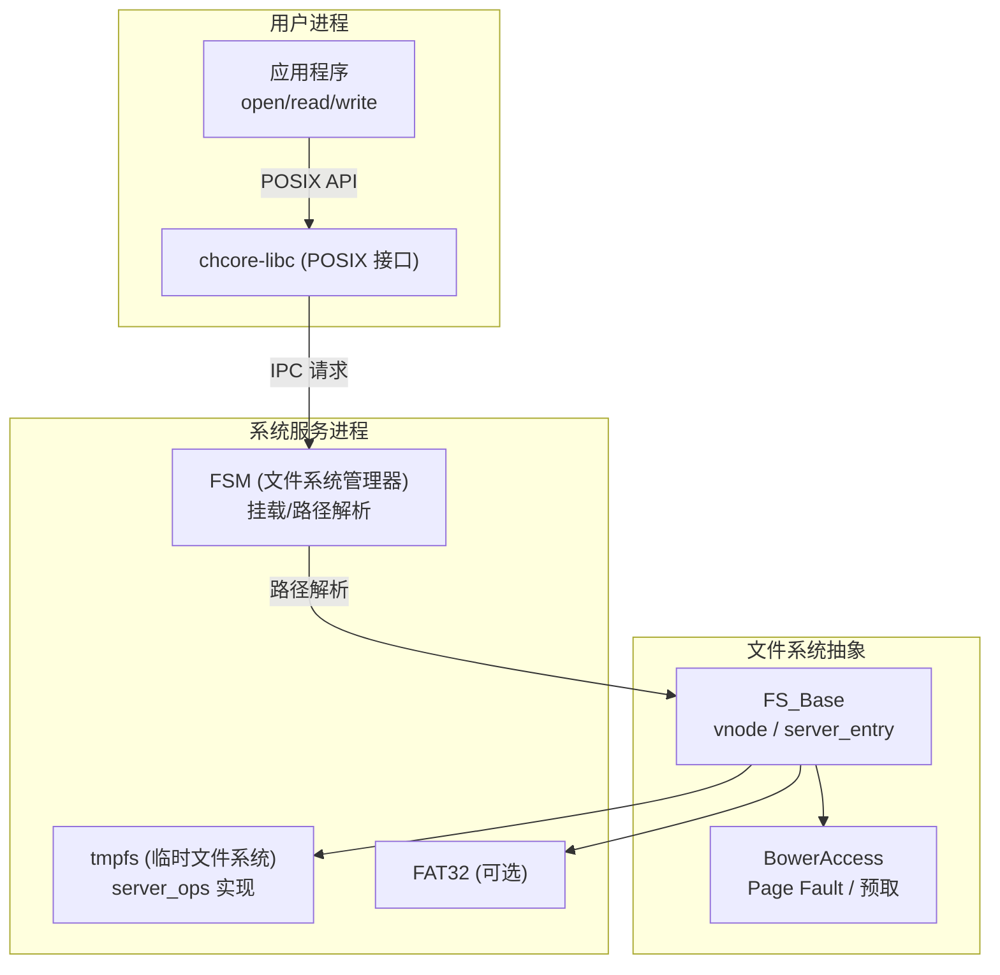
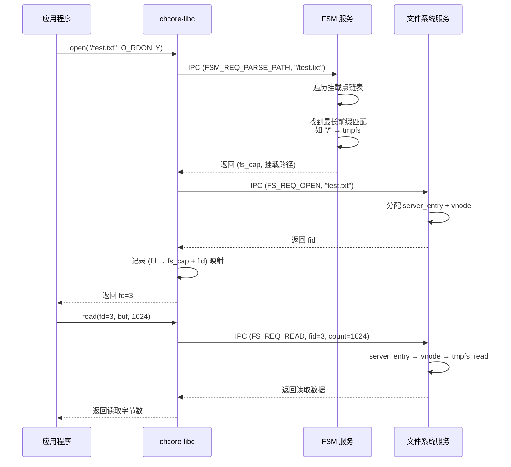
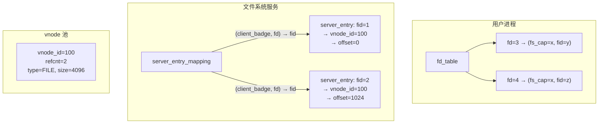
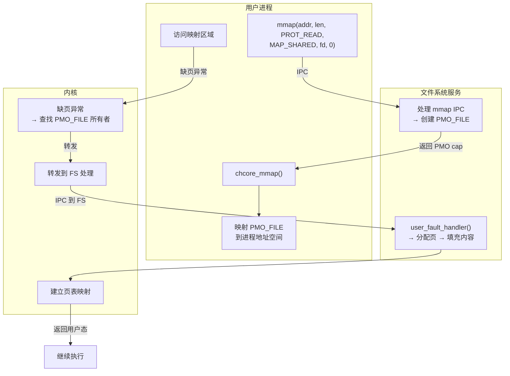
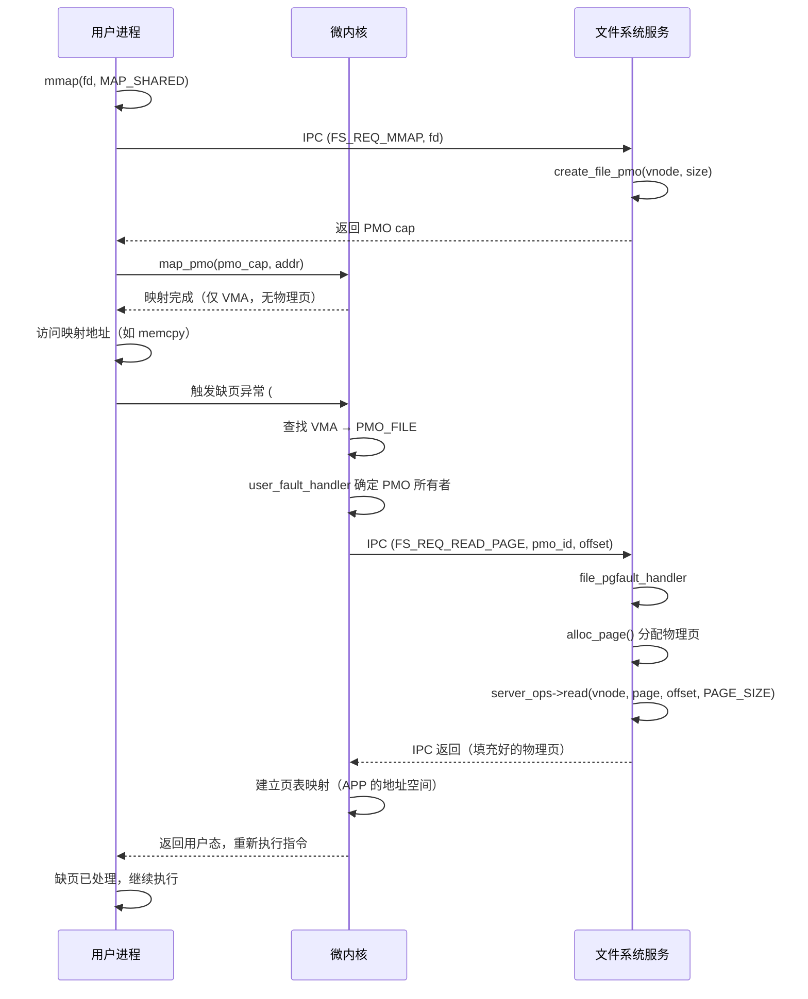
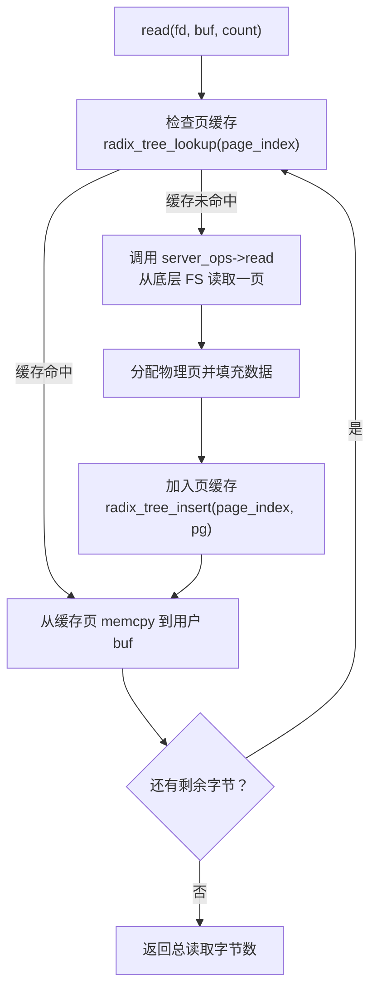

# Lab5：虚拟文件系统 — 微内核 VFS 架构

## 1 实验概述

### 1.1 实验目标

本实验关注微内核中的虚拟文件系统。与 Linux 等宏内核不同，ChCore 微内核的文件系统实现在**用户态**（作为系统服务进程运行），通过 IPC 与应用程序通信。本实验包含：

1. **POSIX 适配**：理解用户态 libc 如何将 POSIX 文件操作转换为 IPC 请求
2. **FSM（File System Manager）**：文件系统管理器，负责挂载、路径解析
3. **FS_Base（VFS 实现层）**：vnode 抽象、server_entry、文件操作实现
4. **BowerAccess**：文件缺页处理与预取优化


### 1.2 微内核 VFS 架构



---

## 2 通信架构

### 2.1 IPC 消息格式

```c
/* 文件: user/chcore-libc/libchcore/porting/overrides/include/chcore-internal/fs_defs.h */

/* IPC 请求的通用结构 */
struct fs_request {
    u64 req_type;                    // 请求类型（open/read/write...）
    u64 fd;                          // 文件描述符
    union {
        struct {
            char pathname[MAX_PATH]; // 路径
            u64 flags;               // open flags
            u64 mode;                // open mode
        } open;
        struct {
            u64 count;               // 读写长度
            u64 offset;              // 偏移
        } rw;
        struct {
            u64 whence;              // lseek whence
            s64 off;                 // lseek offset
        } lseek;
        // ...
    };
};

/* FSM 请求类型 */
enum fsm_req_type {
    FSM_REQ_UNDEFINED = 0,
    FSM_REQ_PARSE_PATH,    // 解析路径
    FSM_REQ_MOUNT,         // 挂载文件系统
    FSM_REQ_UMOUNT,        // 卸载文件系统
    FSM_REQ_SYNC,          // 同步
};
```

### 2.2 POSIX 到 IPC 的转换



### 2.3 IPC Handler 分发

文件系统服务的主循环接收 IPC 请求后，由 `fs_base_dispatch` 函数进行分发：

```c
/* IPC 请求分发：根据请求类型调用对应的处理函数 */
void fs_base_dispatch(struct ipc_msg *msg)
{
    struct fs_request *req = (struct fs_request *)msg->data;
    u64 client_badge = msg->badge;

    // 对大多数操作：先将用户 fd 转换为服务端 fid
    if (translate_fd_to_fid(msg, client_badge) < 0) {
        resp->ret = -EBADF;
        return;
    }

    switch (req->req_type) {
    case FS_REQ_OPEN:
        resp->ret = fs_wrapper_open(wrapper, client_badge, req);
        break;
    case FS_REQ_READ:
        resp->ret = __fs_wrapper_read_core(wrapper, client_badge, req);
        break;
    case FS_REQ_WRITE:
        resp->ret = __fs_wrapper_write_core(wrapper, client_badge, req);
        break;
    case FS_REQ_CLOSE:
        resp->ret = fs_wrapper_close(wrapper, client_badge, req);
        break;
    case FS_REQ_LSEEK:
        resp->ret = fs_wrapper_lseek(wrapper, client_badge, req);
        break;
    case FS_REQ_MMAP:
        resp->ret = fs_wrapper_mmap(wrapper, client_badge, req);
        break;
    case FS_REQ_MKDIR:
        resp->ret = fs_wrapper_mkdir(wrapper, client_badge, req);
        break;
    case FS_REQ_GETDENTS:
        resp->ret = fs_wrapper_getdents(wrapper, client_badge, req);
        break;
    default:
        resp->ret = -EINVAL;
        break;
    }
}
```

**fd → fid 转换机制**：`translate_fd_to_fid` 在每次 IPC 处理前执行，将用户传入的 fd（用户侧的整数索引）转换为文件系统服务内部的 fid（服务端 server_entry 索引）。对于 `FS_REQ_OPEN` 和 `FS_REQ_CLOSE` 等不依赖已打开文件描述符的操作，跳过转换。转换失败返回 `-EBADF`。

### 2.4 POSIX 调用与 IPC 对照表

| POSIX 调用 | libc 封装函数 | IPC 消息序列 | 涉及的文件系统操作 |
|-----------|--------------|-------------|-----------------|
| `open()` | `chcore_open()` | `FSM_REQ_PARSE_PATH` → `FS_REQ_OPEN` | `fsm_parse_path` → `fs_wrapper_open` → `server_ops->lookup`/`server_ops->create` |
| `read()` | `chcore_read()` | `FS_REQ_READ` | `translate_fd_to_fid` → `server_ops->read` |
| `write()` | `chcore_write()` | `FS_REQ_WRITE` | `translate_fd_to_fid` → `server_ops->write` |
| `close()` | `chcore_close()` | `FS_REQ_CLOSE` | `dec_ref_fs_vnode` → `free_entry` |
| `lseek()` | `chcore_lseek()` | `FS_REQ_LSEEK` | 修改 `entry->offset` |
| `mmap()` | `chcore_mmap()` | `FS_REQ_MMAP` | `create_file_pmo` → `map_pmo` |
| `mkdir()` | `chcore_mkdir()` | `FS_REQ_MKDIR` | `server_ops->mkdir` |

---

## 第二部分：FSM（File System Manager）

## 3 FSM 职责

### 3.1 挂载点管理

```c
/* 文件: user/system-services/system-servers/fsm/mount_info.h */
struct mount_point_info_node {
    cap_t fs_cap;                     // 文件系统服务的 capability
    char path[MAX_MOUNT_POINT_LEN + 1]; // 挂载路径
    int path_len;                      // 路径长度
    ipc_struct_t *_fs_ipc_struct;      // 与 FS 服务的 IPC 连接
    int refcnt;                        // 引用计数
    struct list_head node;             // 链表节点
};
```

FSM 维护了一个挂载信息链表，将路径前缀映射到文件系统服务：

```
挂载信息链表:
  "/"       → tmpfs (cap=2)
  "/mnt/usb" → fat32 (cap=5)
  "/proc"   → procfs (cap=8)
```

### 3.2 挂载文件系统（练习 2）

```c
/* 文件: user/system-services/system-servers/fsm/fsm.c */
int fsm_mount_fs(struct fsm_request *req)
{
    const char *path = req->mount_path;
    cap_t fs_cap = req->fs_cap;

    // 1. 检查路径是否已挂载
    if (find_mount_point(path) != NULL)
        return -EEXIST;

    // 2. 分配挂载点节点
    struct mount_point_info_node *node =
        malloc(sizeof(*node));
    strcpy(node->path, path);
    node->path_len = strlen(path);
    node->fs_cap = fs_cap;
    node->refcnt = 1;

    // 3. 建立与文件系统服务的 IPC 连接
    //    （回顾 Lab4：使用 fs_cap 创建 IPC 客户端）
    node->_fs_ipc_struct = ipc_register_client(fs_cap);

    // 4. 加入挂载链表
    list_add(&node->node, &mount_point_list);
    mount_count++;

    return 0;
}
```

### 3.3 路径解析（练习 3）

```c
/* 路径解析：找到最长前缀匹配的文件系统 */
int fsm_parse_path(struct fsm_request *req,
                   struct fsm_response *resp,
                   struct client_info *client)
{
    const char *path = req->open_path.pathname;
    struct mount_point_info_node *best_match = NULL;
    int best_len = 0;

    // 1. 遍历挂载链表，找最长匹配前缀
    struct mount_point_info_node *node;
    for_each_mount_point(node) {
        if (strncmp(path, node->path, node->path_len) == 0) {
            if (node->path_len > best_len) {
                best_match = node;
                best_len = node->path_len;
            }
        }
    }

    if (!best_match)
        return -ENOENT;

    // 2. 获取文件系统服务的 cap
    cap_t fs_cap = best_match->fs_cap;

    // 3. 返回挂载后的路径和文件系统 cap
    resp->mount_path = path + best_len;  // 去掉挂载前缀
    resp->fs_cap = fs_cap;

    // 4. 记录该 client 已获取的 FS cap
    record_client_fs_cap(client, fs_cap);

    return 0;
}
```

---

## 第三部分：FS_Base（VFS 实现层）

## 4 vnode 抽象（练习 4）

### 4.1 vnode 结构

```c
/* 文件: user/system-services/system-servers/fs_base/include/fs_vnode.h */
struct fs_vnode {
    ino_t vnode_id;                // inode 号（文件系统唯一标识）
    struct rb_node node;           // 红黑树节点（按 vnode_id 索引）
    enum fs_vnode_type type;       // 类型：FILE 或 DIRECTORY
    int refcnt;                    // 引用计数
    off_t size;                    // 文件大小/目录项数
    struct page_cache_entity_of_inode *page_cache; // 页缓存
    cap_t pmo_cap;                 // 用于 mmap 的 PMO
    void *private;                 // 文件系统私有数据（如指向 inode）
    pthread_rwlock_t rwlock;       // 读写锁
};
```

### 4.2 vnode 操作

```c
/* 分配新的 vnode */
struct fs_vnode *alloc_fs_vnode(struct list_head *pool)
{
    struct fs_vnode *vnode = malloc(sizeof(*vnode));
    if (!vnode)
        return NULL;

    vnode->vnode_id = allocate_unique_id();
    vnode->refcnt = 1;
    vnode->type = VNODE_TYPE_UNKNOWN;
    vnode->size = 0;
    vnode->page_cache = NULL;
    vnode->private = NULL;
    init_rbtree_node(&vnode->node);
    pthread_rwlock_init(&vnode->rwlock, NULL);

    return vnode;
}

/* 按 vnode_id 查找 vnode */
struct fs_vnode *get_fs_vnode_by_id(struct rb_root *root, ino_t id)
{
    struct rb_node *node = rb_search(root, id,
        compare_vnode_id);
    if (!node)
        return NULL;
    return rb_entry(node, struct fs_vnode, node);
}

/* 增加引用计数 */
void inc_ref_fs_vnode(struct fs_vnode *vnode)
{
    atomic_fetch_add(&vnode->refcnt, 1);
}

/* 减少引用计数，减到 0 时释放 */
void dec_ref_fs_vnode(struct rb_root *root,
                      struct fs_vnode *vnode)
{
    if (atomic_fetch_sub(&vnode->refcnt, 1) == 1) {
        // 引用计数减为 0，释放
        rb_erase(&vnode->node, root);
        free(vnode);
    }
}
```

## 5 server_entry（文件表项，练习 5）

### 5.1 文件描述符映射



### 5.2 server_entry 操作

```c
/* 文件: user/system-services/system-servers/fs_base/fs_wrapper.c */

/* 建立映射：(client_badge, fd) → fid */
int fs_wrapper_set_server_entry(struct fs_wrapper *wrapper,
                                u64 client_badge,
                                int fd, int fid)
{
    struct server_entry_node *node = malloc(sizeof(*node));
    node->client_badge = client_badge;
    node->fd = fd;
    node->fid = fid;
    list_add(&node->node, &server_entry_mapping);
    return 0;
}

/* 查询映射：(client_badge, fd) → fid */
int fs_wrapper_get_server_entry(u64 client_badge, int fd)
{
    struct server_entry_node *node;
    for_each_in_list(&server_entry_mapping, node, node) {
        if (node->client_badge == client_badge && node->fd == fd)
            return node->fid;
    }
    return -1;  // 未找到
}

/* 清理映射 */
void fs_wrapper_clear_server_entry(u64 client_badge)
{
    struct server_entry_node *node, *tmp;
    for_each_in_list_safe(&server_entry_mapping, node, tmp, node) {
        if (node->client_badge == client_badge) {
            list_del(&node->node);
            free(node);
        }
    }
}
```

### 5.3 IPC handler 中的转换

```c
/* 在处理每个 IPC 请求时，将 fd 转换为 fid */
static int translate_fd_to_fid(struct ipc_msg *ipc_msg,
                                u64 client_badge)
{
    struct fs_request *req = (struct fs_request *)ipc_msg->data;

    // open/close 等操作不需要转换
    if (req->req_type == FS_REQ_OPEN ||
        req->req_type == FS_REQ_CLOSE)
        return 0;

    // read/write/lseek 将 req->fd 转换为 fid
    int fid = fs_wrapper_get_server_entry(client_badge, req->fd);
    if (fid < 0)
        return -EBADF;

    req->fd = fid;
    return 0;
}
```

## 6 文件操作实现（练习 6）

### 6.1 `server_ops` 接口抽象

```c
/* 每个文件系统实现的操作接口 */
struct fs_server_ops {
    // inode 操作
    int (*lookup)(struct fs_vnode *parent, const char *name,
                  struct fs_vnode **child);
    int (*create)(struct fs_vnode *parent, const char *name,
                  struct fs_vnode **new_vnode);

    // 文件操作
    ssize_t (*read)(struct fs_vnode *vnode, void *buf,
                    off_t offset, size_t count);
    ssize_t (*write)(struct fs_vnode *vnode, const void *buf,
                     off_t offset, size_t count);

    // 目录操作
    int (*mkdir)(struct fs_vnode *parent, const char *name);
    int (*getdents)(struct fs_vnode *dir, void *buf, size_t count);
};
```

#### 6.1.1 不同文件系统的 server_ops 实现

tmpfs（内存文件系统）和 FAT32（磁盘文件系统）各自实现 `server_ops` 中的函数指针，实现多态的文件操作：

**tmpfs 实现**：所有操作在内存中进行，无需磁盘 I/O。
- `tmpfs_lookup`：遍历父目录的子节点链表，按名称字符串匹配
- `tmpfs_read`：直接从 inode 的 data 缓冲区 memcpy 数据
- `tmpfs_write`：按需扩展 inode 的 data 缓冲区，然后写入
- `tmpfs_mkdir`：创建新的目录 inode，插入父目录的 child_list

**FAT32 实现**：操作涉及磁盘块读写，通过块设备驱动访问。
- `fat_lookup`：读取目录簇，解析目录项找到目标文件的簇号
- `fat_read`：根据 FAT 链遍历数据簇，读取到缓冲区
- `fat_write`：分配空闲簇，更新 FAT 链，写入数据
- `fat_mkdir`：创建目录项，初始化 FAT 链，写入 `.` 和 `..` 条目

```c
// tmpfs 向 FS_Base 注册自己的 server_ops
struct fs_server_ops tmpfs_server_ops = {
    .lookup   = tmpfs_lookup,
    .create   = tmpfs_create,
    .read     = tmpfs_read,
    .write    = tmpfs_write,
    .mkdir    = tmpfs_mkdir,
    .getdents = tmpfs_getdents,
};
```

#### 6.1.2 tmpfs 实现详解

tmpfs 使用内存 inode（`tmpfs_inode`）管理文件和目录：

```c
/* tmpfs 的内存 inode 结构 */
struct tmpfs_inode {
    int type;                        // TYPE_FILE 或 TYPE_DIR
    char *name;                      // 文件名或目录名
    size_t size;                     // 文件大小（字节）
    void *data;                      // 文件内容缓冲区（仅文件使用）
    struct list_head child_list;     // 子目录项链表头（仅目录使用）
    struct list_head sibling;        // 兄弟节点链表，用于父目录遍历
};
```

**tmpfs_lookup**：遍历父目录的 child_list，逐一比较名称：

```c
int tmpfs_lookup(struct fs_vnode *parent, const char *name,
                 struct fs_vnode **child)
{
    struct tmpfs_inode *dir_inode = parent->private;
    struct tmpfs_inode *entry;

    for_each_in_list(&dir_inode->child_list, entry, sibling) {
        if (strcmp(entry->name, name) == 0) {
            *child = find_or_create_vnode_by_inode(entry);
            return 0;
        }
    }
    return -ENOENT;
}
```

**tmpfs_read**：直接 memcpy 内存缓冲区数据：

```c
ssize_t tmpfs_read(struct fs_vnode *vnode, void *buf,
                   off_t offset, size_t count)
{
    struct tmpfs_inode *inode = vnode->private;

    if (offset >= inode->size)
        return 0;

    size_t actual = MIN(count, inode->size - offset);
    memcpy(buf, inode->data + offset, actual);
    return actual;
}
```

**tmpfs_write**：按需扩展缓冲区后写入：

```c
ssize_t tmpfs_write(struct fs_vnode *vnode, const void *buf,
                    off_t offset, size_t count)
{
    struct tmpfs_inode *inode = vnode->private;
    size_t new_size = offset + count;

    if (new_size > inode->size) {
        size_t aligned = ALIGN_UP(new_size, PAGE_SIZE);
        inode->data = realloc(inode->data, aligned);
        memset(inode->data + inode->size, 0,
               new_size - inode->size);
        inode->size = new_size;
    }

    memcpy(inode->data + offset, buf, count);
    return count;
}
```

**tmpfs_mkdir**：创建目录 inode 并链接到父目录：

```c
int tmpfs_mkdir(struct fs_vnode *parent, const char *name)
{
    struct tmpfs_inode *parent_inode = parent->private;
    struct tmpfs_inode *new_dir = malloc(sizeof(*new_dir));

    new_dir->type = TYPE_DIR;
    new_dir->name = strdup(name);
    new_dir->size = 0;
    new_dir->data = NULL;
    init_list_head(&new_dir->child_list);

    list_add(&new_dir->sibling, &parent_inode->child_list);

    return 0;
}
```

### 6.2 Open 实现

```c
/* 文件: user/system-services/system-servers/fs_base/fs_wrapper_ops.c */
int fs_wrapper_open(struct fs_wrapper *wrapper,
                    u64 client_badge,
                    struct fs_request *req)
{
    const char *pathname = req->open.pathname;
    int flags = req->open.flags;

    // 1. 调用文件系统的 lookup 或 create
    struct fs_vnode *vnode;
    int ret = server_ops->lookup(root_vnode, pathname, &vnode);

    if (ret < 0 && (flags & O_CREAT)) {
        // 文件不存在且 O_CREAT，创建新文件
        ret = server_ops->create(parent_vnode,
                                  basename(pathname), &vnode);
    }
    if (ret < 0)
        return ret;

    // 2. 增加 vnode 引用
    inc_ref_fs_vnode(vnode);

    // 3. 分配 server_entry（文件表项）
    int fid = alloc_entry();
    struct server_entry *entry = get_entry(fid);
    entry->vnode = vnode;
    entry->offset = (flags & O_APPEND) ? vnode->size : 0;

    // 4. 建立 (client_badge, fd) → fid 映射
    fs_wrapper_set_server_entry(wrapper, client_badge,
                                 req->fd, fid);

    return 0;
}
```

### 6.3 Read/Write 实现

```c
ssize_t __fs_wrapper_read_core(struct fs_wrapper *wrapper,
                                u64 client_badge,
                                struct fs_request *req)
{
    // 1. 获取 fid（已在 translate_fd_to_fid 中完成）
    int fid = req->fd;

    // 2. 获取 server_entry
    struct server_entry *entry = get_entry(fid);
    if (!entry || !entry->vnode)
        return -EBADF;

    // 3. 调用实际文件系统 read
    ssize_t ret = server_ops->read(
        entry->vnode,
        req->rw.buf,
        entry->offset,     // 从当前偏移读
        req->rw.count);

    // 4. 更新偏移
    if (ret > 0)
        entry->offset += ret;

    return ret;
}

ssize_t __fs_wrapper_write_core(struct fs_wrapper *wrapper,
                                 u64 client_badge,
                                 struct fs_request *req)
{
    int fid = req->fd;
    struct server_entry *entry = get_entry(fid);
    if (!entry || !entry->vnode)
        return -EBADF;

    ssize_t ret = server_ops->write(
        entry->vnode,
        req->rw.buf,
        entry->offset,
        req->rw.count);

    if (ret > 0) {
        entry->offset += ret;
        // 更新 vnode 大小（如果写入位置超过文件末尾）
        if (entry->offset > entry->vnode->size)
            entry->vnode->size = entry->offset;
    }

    return ret;
}
```

### 6.4 Close 实现

```c
int fs_wrapper_close(struct fs_wrapper *wrapper,
                     u64 client_badge,
                     struct fs_request *req)
{
    int fid = req->fd;
    struct server_entry *entry = get_entry(fid);

    if (!entry)
        return -EBADF;

    // 1. 减少 vnode 引用计数
    dec_ref_fs_vnode(vnode_root, entry->vnode);

    // 2. 释放 server_entry
    free_entry(fid);

    // 3. 清理 (client_badge, fd) 映射
    fs_wrapper_clear_server_entry(client_badge);

    return 0;
}
```

### 6.5 Lseek 实现

```c
off_t fs_wrapper_lseek(struct fs_wrapper *wrapper,
                       u64 client_badge,
                       struct fs_request *req)
{
    int fid = req->fd;
    struct server_entry *entry = get_entry(fid);

    if (!entry || entry->vnode->type != VNODE_TYPE_FILE)
        return -EBADF;

    off_t new_offset;

    switch (req->lseek.whence) {
    case SEEK_SET:
        new_offset = req->lseek.off;
        break;
    case SEEK_CUR:
        new_offset = entry->offset + req->lseek.off;
        break;
    case SEEK_END:
        new_offset = entry->vnode->size + req->lseek.off;
        break;
    default:
        return -EINVAL;
    }

    if (new_offset < 0)
        return -EINVAL;

    entry->offset = new_offset;
    return new_offset;
}
```

## 7 mmap 与缺页处理

### 7.1 文件 mmap 原理



### 7.2 PMO_FILE 实现

```c
/* 创建文件映射的 PMO */
struct pmobject *create_file_pmo(struct fs_vnode *vnode,
                                  off_t size)
{
    struct pmobject *pmo = create_pmo(PMO_FILE, size);
    pmo->file_vnode = vnode;
    pmo->file_offset = 0;
    return pmo;
}

/* 缺页处理：FS 从文件读取内容到物理页 */
int file_pgfault_handler(struct thread *thread,
                         u64 fault_va,
                         struct pmobject *pmo)
{
    struct fs_vnode *vnode = pmo->file_vnode;
    u64 offset = fault_va - pmo->start + pmo->file_offset;
    u64 page_va = ALIGN_DOWN(fault_va, PAGE_SIZE);

    // 1. 分配物理页
    struct page *page = alloc_page();

    // 2. 从文件读取内容（调用 server_ops->read）
    server_ops->read(vnode, page2addr(page),
                     offset, PAGE_SIZE);

    // 3. 建立页表映射
    map_page_in_pgtbl(thread->vmspace,
                       page_va, page2addr(page),
                       VM_READ | VM_WRITE);

    return 0;
}
```

### 7.3 详细缺页处理流程

PMO_FILE 的缺页处理涉及用户进程、微内核和文件系统服务三方协作：



关键步骤分解：

1. **mmap 阶段**：用户调用 `mmap` → libc 发送 `FS_REQ_MMAP` IPC → FS 调用 `create_file_pmo(vnode, size)` 创建 `PMO_FILE` 对象（包含 vnode 引用和文件偏移）→ 返回 PMO cap → 用户进程调用 `map_pmo` 将 PMO 映射到地址空间（此阶段仅建立 VMA 元数据，不分配物理页）

2. **缺页阶段**：用户首次访问映射区域 → MMU 触发缺页异常 → 内核查找 VMA 发现其为 `PMO_FILE` 类型 → 调用 `user_fault_handler` 确定该 PMO 的所有者（即文件系统服务进程）→ 内核发送 `FS_REQ_READ_PAGE` IPC 到 FS（携带 pmo_id 和缺页偏移）

3. **填充阶段**：FS 的 `file_pgfault_handler` 分配物理页 → 调用 `server_ops->read` 从文件中读取一页数据 → 填充物理页 → 返回内核 → 内核在用户进程页表中建立虚拟地址到物理页的映射

4. **惰性加载**：只有被访问的页面才触发缺页按需加载，未访问的部分不占用物理内存。对于大文件（如数百 MB 的可执行文件或数据库文件），这一机制大幅降低了 mmap 的启动开销

```c
/* PMO_FILE 缺页处理器的完整实现 */
int file_pgfault_handler(struct thread *thread,
                         u64 fault_va,
                         struct pmobject *pmo)
{
    struct fs_vnode *vnode = pmo->file_vnode;
    u64 offset = fault_va - pmo->start + pmo->file_offset;
    u64 page_va = ALIGN_DOWN(fault_va, PAGE_SIZE);

    // 1. 分配物理页
    struct page *page = alloc_page();
    if (!page)
        return -ENOMEM;

    // 2. 从文件读取数据到物理页
    ssize_t ret = server_ops->read(vnode, page2addr(page),
                                    offset, PAGE_SIZE);
    if (ret < 0) {
        free_page(page);
        return ret;
    }

    // 3. 建立页表映射
    map_page_in_pgtbl(thread->vmspace,
                       page_va, page2addr(page),
                       VM_READ | VM_WRITE);

    return 0;
}
```

**特殊处理**：
- `MAP_PRIVATE`：缺页时做 Copy-on-Write（COW），写操作触发页复制
- `MAP_SHARED`：缺页后直接映射，写操作直接修改缓存页，脏页由后台线程写回
- 文件末尾部分页：如果缺页偏移超过文件大小，补零填充（`truncated page`）

---

## 第四部分：BowerAccess（页预取优化）

## 8 文件缺页优化

### 8.1 顺序预取

对于顺序读模式，可以提前预取多个页面：

```c
/* 文件: user/system-services/system-servers/fs_base/fs_page_fault.c */
int handle_file_page_fault(struct fs_vnode *vnode,
                           off_t fault_offset)
{
    // 基础：只分配缺页所在页面
    // 优化：预取后续页面

    // 1. 分配缺页
    allocate_page_and_fill(vnode, fault_offset);

    // 2. 预取后续页面（如 4 个页）
    for (int i = 1; i <= PREFETCH_PAGES; i++) {
        off_t prefetch_off = fault_offset + i * PAGE_SIZE;
        if (prefetch_off >= vnode->size)
            break;
        // 异步预取：在后台分配并填充
        async_prefetch(vnode, prefetch_off);
    }
}
```

### 8.2 页缓存（Page Cache）结构

BowerAccess 在 FS_Base 层维护了 per-vnode 的页缓存，避免重复从底层文件系统读取相同数据：

```c
/* 每个 vnode 关联的页缓存实体 */
struct page_cache_entity_of_inode {
    struct radix_tree_root pages;    // radix 树：page_index → struct page *
    int nrpages;                     // 当前缓存的页数
    spinlock_t lock;                 // 并发访问锁
};
```

页缓存使用 radix 树（基数树）按页索引快速查找，时间复杂度 O(log n)。radix 树相比哈希表更适合稀疏的页缓存场景（大型文件只有部分页面被访问）。



**读路径核心实现**：逐页检查缓存，逐页填充，自动聚合到用户缓冲区：

```c
ssize_t fs_wrapper_read_with_cache(struct fs_vnode *vnode,
                                   void *buf, off_t offset,
                                   size_t count)
{
    size_t done = 0;

    while (done < count) {
        off_t page_idx = (offset + done) / PAGE_SIZE;
        off_t page_off = page_idx * PAGE_SIZE;

        // 1. 查找页缓存
        struct page *pg = radix_tree_lookup(
            &vnode->page_cache->pages, page_idx);

        // 2. 缓存未命中：分配新页并读取
        if (!pg) {
            pg = alloc_pages(1);
            server_ops->read(vnode, page_address(pg),
                             page_off, PAGE_SIZE);
            radix_tree_insert(&vnode->page_cache->pages,
                              page_idx, pg);
        }

        // 3. 从缓存页拷贝到用户缓冲区（处理部分页边界）
        size_t copy_start = (offset + done) - page_off;
        size_t copy_len = MIN(PAGE_SIZE - copy_start,
                              count - done);
        memcpy(buf + done, page_address(pg) + copy_start,
               copy_len);
        done += copy_len;
    }

    return done;
}
```

**脏页跟踪与写回**：写入操作标记缓存页为脏，后台线程定期异步写回：

```c
// 标记缓存页为脏
void mark_page_dirty(struct page *pg)
{
    pg->dirty = 1;
    list_add_tail(&pg->dirty_list, &dirty_pages_head);
}

// 后台写回线程：定期刷新脏页到底层文件系统
void *flush_dirty_pages_daemon(void *arg)
{
    while (1) {
        msleep(FLUSH_INTERVAL_MS);  // 如 5000ms

        struct page *pg, *tmp;
        for_each_in_list_safe(&dirty_pages_head, pg, tmp,
                               dirty_list) {
            if (pg->dirty) {
                struct fs_vnode *vnode = pg->vnode;
                server_ops->write(vnode,
                                  page_address(pg),
                                  pg->file_offset,
                                  PAGE_SIZE);
                pg->dirty = 0;
                list_del(&pg->dirty_list);
            }
        }
    }
}
```

**缺页与预取整合**：`handle_file_page_fault` 同时处理缺页和顺序预取。缺页将当前页读入缓存，预取异步填充后续页面：

```c
int handle_file_page_fault(struct fs_vnode *vnode,
                           off_t fault_offset)
{
    off_t fault_page = ALIGN_DOWN(fault_offset, PAGE_SIZE);

    // 1. 缺页处理：分配并填充当前页（自动加入页缓存）
    allocate_page_and_fill(vnode, fault_page);

    // 2. 顺序预取：提前读取后续 N 个页面
    for (int i = 1; i <= PREFETCH_PAGES; i++) {
        off_t prefetch_off = fault_page + i * PAGE_SIZE;
        if (prefetch_off >= vnode->size)
            break;

        // 检查是否已缓存
        off_t prefetch_idx = prefetch_off / PAGE_SIZE;
        if (radix_tree_lookup(&vnode->page_cache->pages,
                              prefetch_idx))
            continue;

        // 异步预取：不阻塞当前缺页处理
        async_prefetch(vnode, prefetch_off);
    }

    return 0;
}
```

预取参数 `PREFETCH_PAGES`（通常为 4，即 16 KB）可根据访问模式动态调整。对于顺序读密集的工作负载（如文件复制、视频流），预取可大幅减少缺页次数，提升吞吐量。

---

## 9 实验步骤

### 9.1 构建与运行

```bash
cd Lab5

# 编译
make

# 运行
make qemu

# 测试文件系统
ls
# 预期输出 ChCore shell 的文件列表

# 运行文件系统测试
test_fs.bin
```

### 9.2 调试信息

可以通过替换 CMakeLists.txt 中的源文件为预编译的 `.obj` 文件来隔离问题：

```bash
# 将 Scripts/extras/lab5/cmake/ 下的文件
# 复制到 FSM 和 FS_Base 目录覆盖后重新编译
# 可切换不同部分的正确实现来定位错误
```

### 9.3 评分

```bash
make grade

# Part 1 (POSIX + FSM 挂载): 20 分
# Part 2 (FSM 路径解析): 35 分
# Part 3 (vnode + server_entry): 50 分
# Part 4 (全部文件操作): 100 分
```

---

## 10 思考题解析

### 思考题 7：ChCore VFS 实现的利弊

**优点**：
- **模块化**：每个文件系统是一个独立进程，崩溃不影响内核
- **安全性**：文件系统 bug 不会导致内核崩溃（隔离性好）
- **易扩展**：可以热加载新文件系统

**缺点**：
- **性能开销**：每次文件操作需要多次 IPC 调用（用户 → FSM → FS_Base）
- **实现复杂**：需要处理 IPC 数据传递、capability 转发
- **共享状态管理复杂**：vnode 缓存、页面缓存等需要在用户态实现

**如果让你设计微内核 VFS，你会如何实现？**

一种可能的改进：引入 **共享内存文件系统** 的概念，将文件系统元数据放在共享内存中，减少 IPC 调用次数。或者在 FS_Base 层使用批量 IPC 请求合并多个文件操作。缓存一致性协议也是一个需要权衡的设计点。

---

## 参考资源

- ChCore 源码：`user/system-services/system-servers/fsm/fsm.c`
- ChCore 源码：`user/system-services/system-servers/fs_base/`
- ChCore 源码：`user/system-services/system-servers/tmpfs/tmpfs.c`
- 《操作系统：原理与实现》第 7 章（文件系统）
- [Virtual File System (Linux)](https://www.kernel.org/doc/html/latest/filesystems/vfs.html)

